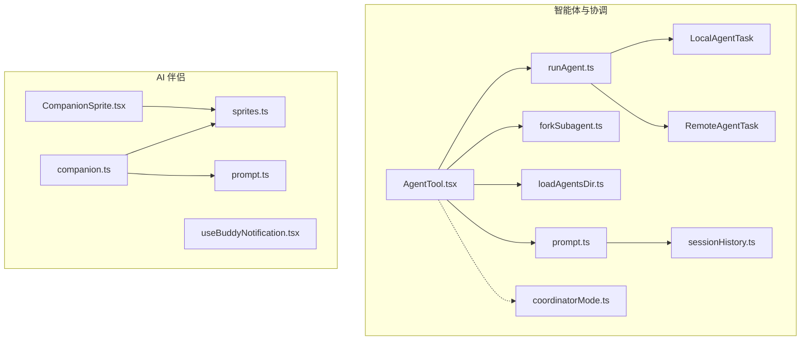
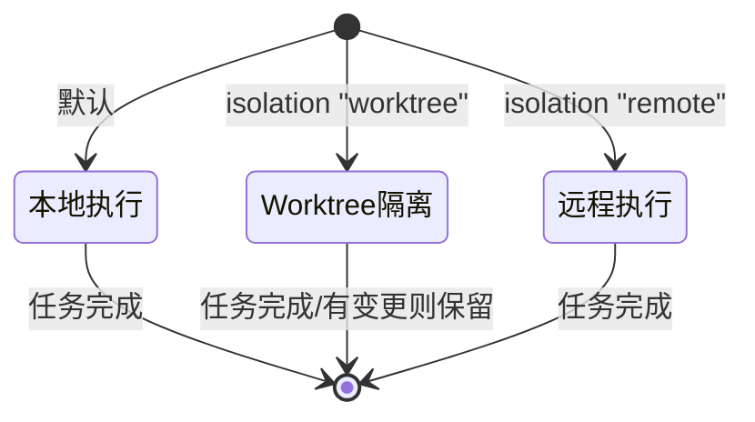
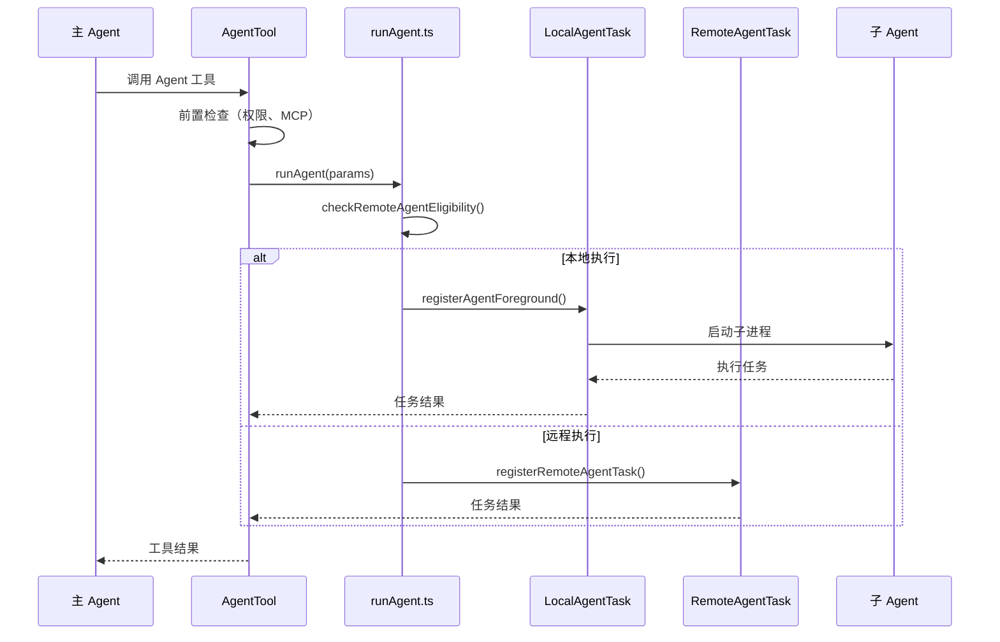

# 智能体与协调

## 概览

智能体与协调模块是 Claude Code 的核心 AI 编排引擎，负责管理 AI 代理（Agent）的生命周期、协调多智能体协作，以及提供智能体工具（Agent Tool）的执行框架。

该模块包含两大核心能力：

1. **Agent Tool**：允许主 AI 模型启动子智能体来处理复杂的多步骤任务
2. **Fork Subagent**：允许主 AI 直接"分叉"自身来处理独立工作

智能体系统支持三种运行模式：本地执行、远程 CCR 执行、Git Worktree 隔离执行。

## 子模块

| 模块 | 说明 | 文档 |
|------|------|------|
| [Agent 工具](agent-tool.md) | 子智能体启动框架 | [agent-tool.md](agent-tool.md) |
| [Fork 子智能体](fork-subagent.md) | Fork 分叉机制 | [fork-subagent.md](fork-subagent.md) |
| [会话历史](session-history.md) | Agent SDK 会话事件历史读取 | [session-history.md](session-history.md) |
| [内置智能体](built-in/_index.md) | 内置智能体概览 | [built-in/_index.md](built-in/_index.md) |
| [协调器模式](../coordinator/coordinator.md) | 多智能体协调编排 | [coordinator.md](../coordinator/coordinator.md) |
| [AI 伴侣](../buddy/_index.md) | 终端伴侣 UI 与交互 | [buddy/index.md](../buddy/_index.md) |

## 内置智能体

Claude Code 提供以下内置智能体：

| 智能体 | 类型 | 说明 |
|--------|------|------|
| [Explore Agent](built-in/explore-agent.md) | 只读 | 快速代码库探索 |
| [Plan Agent](built-in/plan-agent.md) | 只读 | 架构设计和实施规划 |
| [Verification Agent](built-in/verification-agent.md) | 只读 | 实现质量验证 |
| [Claude Code Guide](built-in/claude-code-guide-agent.md) | 只读 | Claude Code 功能指导 |
| [General Purpose](built-in/general-purpose-agent.md) | 可写 | 通用多步骤任务 |
| [Statusline Setup](built-in/statusline-setup-agent.md) | 可写 | 状态栏配置 |

## 架构位置

## 核心概念

### 智能体类型

Claude Code 支持三种来源的智能体定义：

| 来源 | 说明 | 注册方式 |
|------|------|---------|
| 内置智能体 | 内置的专用智能体（如 code-reviewer, test-runner） | [builtInAgents.js](/restored-src/src/tools/AgentTool/built-in/generalPurposeAgent.js) |
| 自定义智能体 | 用户/项目/策略定义的智能体 | 从 `.md` 文件或配置文件加载 |
| 插件智能体 | 插件提供的智能体 | 插件加载时注册 |

### 智能体运行模式

### 运行位置决策

| 条件 | 位置 | 说明 |
|------|------|------|
| `isolation: "worktree"` | 本地 Git Worktree | 隔离的 Git 仓库副本 |
| `isolation: "remote"` | 远程 CCR 环境 | Ant 构建专用，新沙箱 |
| 默认 + `checkRemoteAgentEligibility()` | 远程 CCR 环境 | 根据资格检查自动路由 |

## 智能体生命周期

## 关键设计决策

### 1. 智能体列表的缓存优化

智能体列表的动态变化（MCP 连接、插件重载、权限模式变更）会导致工具 Schema 缓存失效。通过 GrowthBook 特性开关 `tengu_agent_list_attach`，将智能体列表从工具描述内联迁移到 `agent_listing_delta` 附件消息中，减少约 10.2% 的 cache_creation token 消耗。

### 2. Fork vs 子智能体

| 特性 | Fork | 子智能体（subagent_type） |
|------|------|------------------------|
| 上下文继承 | ✅ 完整继承父对话 | ❌ 从零开始 |
| 模型选择 | 继承父模型 | 可指定不同模型 |
| 工具池 | 继承父工具池 | 可重新配置 |
| 适用场景 | 快速并行研究 | 专用角色任务 |
| 缓存效率 | 高（共享父缓存） | 低（独立缓存） |

### 3. Worktree 隔离

通过 Git Worktree 创建隔离的仓库副本，子智能体的变更不会影响主工作目录。如果子智能体没有产生任何变更，Worktree 自动清理；如果产生了变更，则保留 Worktree 并在结果中返回路径和分支信息。

## 关键类型

| 类型 | 定义位置 | 说明 |
|------|---------|------|
| `AgentDefinition` | [loadAgentsDir.ts](/restored-src/src/tools/AgentTool/loadAgentsDir.ts) | 智能体定义联合类型 |
| `BuiltInAgentDefinition` | [loadAgentsDir.ts](/restored-src/src/tools/AgentTool/loadAgentsDir.ts) | 内置智能体定义 |
| `CustomAgentDefinition` | [loadAgentsDir.ts](/restored-src/src/tools/AgentTool/loadAgentsDir.ts) | 自定义智能体定义 |
| `AgentToolCallParams` | [AgentTool.tsx](/restored-src/src/tools/AgentTool/AgentTool.tsx) | Agent 工具调用参数 |

## 源码引用

- [AgentTool.tsx](/restored-src/src/tools/AgentTool/AgentTool.tsx)
- [runAgent.ts](/restored-src/src/tools/AgentTool/runAgent.ts)
- [forkSubagent.ts](/restored-src/src/tools/AgentTool/forkSubagent.ts)
- [loadAgentsDir.ts](/restored-src/src/tools/AgentTool/loadAgentsDir.ts)
- [prompt.ts](/restored-src/src/tools/AgentTool/prompt.ts)
- [LocalAgentTask.ts](/restored-src/src/tasks/LocalAgentTask/LocalAgentTask.js)
- [RemoteAgentTask.ts](/restored-src/src/tasks/RemoteAgentTask/RemoteAgentTask.ts)

## 相关文档

- [架构总览](../architecture.md)
- [主页](../index.md)
- [Agent 工具](agent-tool.md)
- [Fork 子智能体](fork-subagent.md)

---

*Generated by [Nium-Wiki v0.0.0](https://github.com/niuma996/nium-wiki) | 2026-03-31*
