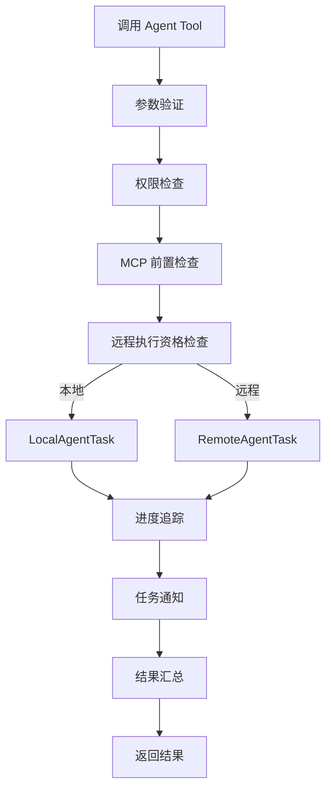

# Agent 工具

## 概览

Agent Tool 是 Claude Code 中允许主 AI 模型启动子智能体来处理复杂多步骤任务的核心工具。[AgentTool.tsx](/restored-src/src/tools/AgentTool/AgentTool.tsx) 实现了该工具的完整生命周期，包括参数验证、前置条件检查、任务注册、进度追踪和结果汇总。

## 工具定义

Agent Tool 通过 `buildTool` 工厂函数注册到工具池中，接收 Zod Schema 定义的参数结构：

```typescript
const agentToolSchema = z.object({
  name: z.string().describe('代理名称（3-5 字）'),
  description: z.string().describe('任务描述'),
  subagent_type: z.string().optional().describe('智能体类型'),
  prompt: z.string().describe('任务指令'),
  model: z.string().optional().describe('指定模型'),
  isolation: z.enum(['worktree', 'remote']).optional(),
  run_in_background: z.boolean().optional(),
  // ... 更多参数
})
```

## 核心执行流程



## 前置条件检查

### 权限模式检查

```typescript
// 检查用户是否允许该智能体类型
const denyRule = getDenyRuleForAgent(params.subagent_type)
if (denyRule) {
  return formatPreconditionError(denyRule)
}
```

### MCP 服务器前置检查

```typescript
// 检查所需 MCP 服务器是否已连接
const mcpRequirementError = filterAgentsByMcpRequirements([agentDef])
if (mcpRequirementError) {
  return formatPreconditionError(mcpRequirementError)
}
```

### 远程执行资格检查

```typescript
const { checkRemoteAgentEligibility } = await import('../../tasks/RemoteAgentTask/RemoteAgentTask.ts')
const eligibility = await checkRemoteAgentEligibility(params)
if (eligibility.eligible) {
  // 路由到远程执行
} else {
  // 回退到本地执行
}
```

## 智能体定义加载

[loadAgentsDir.ts](/restored-src/src/tools/AgentTool/loadAgentsDir.ts) 负责从多个来源加载智能体定义：

```typescript
// 1. 内置智能体（编译时确定）
const builtInAgents = getBuiltInAgents()

// 2. 用户定义的智能体（从配置加载）
// 从 ~/.claude/agents/ 目录加载 .md 文件

// 3. 项目定义的智能体（从 .claude/agents/ 加载）
// 从当前项目的 .claude/agents/ 目录加载

// 4. 插件提供的智能体
const pluginAgents = await loadPluginAgents()

// 5. 策略托管的智能体
```

### 智能体定义结构

```typescript
type BaseAgentDefinition = {
  agentType: string              // 智能体类型标识符
  whenToUse: string              // 使用场景描述
  tools?: string[]               // 允许的工具列表
  disallowedTools?: string[]     // 禁止的工具列表
  mcpServers?: AgentMcpServerSpec[]  // 所需的 MCP 服务器
  hooks?: HooksSettings          // 会话级别钩子
  model?: string                 // 指定模型
  effort?: EffortValue           // 努力程度
  permissionMode?: PermissionMode // 权限模式
  maxTurns?: number              // 最大轮次数
  memory?: AgentMemoryScope      // 持久内存范围
  isolation?: 'worktree' | 'remote'  // 隔离模式
}
```

## 进度追踪

Agent Tool 支持实时进度追踪，在后台任务运行期间定期向用户发送进度更新：

```typescript
// 自动后台模式：超过 120 秒自动后台化
const autoBackgroundMs = getAutoBackgroundMs()

// 进度阈值：2 秒后显示后台提示
const PROGRESS_THRESHOLD_MS = 2000

// 进度更新通过 agent_listing_delta 附件消息推送
enqueueAgentNotification(agentId, 'progress', summary)
```

## 结果处理

### 成功结果

```typescript
const result = {
  output_text: agentResult.text,
  output_file: agentResult.outputPath,
  agent_id: agentId,
}
```

### 错误处理

```typescript
// 前置条件失败：权限、MCP 等
if (result.type === 'precondition_error') {
  return formatPreconditionError(result.message)
}

// 任务失败
if (result.status === 'failed') {
  return { success: false, error: result.error }
}
```

## 工具提示词生成

[prompt.ts](/restored-src/src/tools/AgentTool/prompt.ts) 动态生成 Agent Tool 的系统提示词，包含：

1. **智能体列表**：所有可用智能体及其工具权限
2. **使用时机**：何时应该/不应该使用 Agent 工具
3. **编写指令的技巧**：如何撰写高质量的子智能体指令
4. **运行模式说明**：前台/后台、工作树隔离等

```typescript
export async function getPrompt(
  agentDefinitions: AgentDefinition[],
  isCoordinator?: boolean,
  allowedAgentTypes?: string[],
): Promise<string>
```

### 协调器模式

当 AI 以协调器模式运行时，Agent Tool 获得更简洁的提示词，避免重复协调器系统提示词中的使用说明。

## 背景任务管理

Agent Tool 支持后台执行模式，通过 GrowthBook 特性开关 `tengu_auto_background_agents` 控制自动后台化：

```typescript
function getAutoBackgroundMs(): number {
  if (isEnvTruthy(process.env.CLAUDE_AUTO_BACKGROUND_TASKS) ||
      getFeatureValue_CACHED_MAY_BE_STALE('tengu_auto_background_agents', false)) {
    return 120_000  // 120 秒后自动后台化
  }
  return 0  // 禁用
}
```

## 源码引用

- [AgentTool.tsx](/restored-src/src/tools/AgentTool/AgentTool.tsx)
- [loadAgentsDir.ts](/restored-src/src/tools/AgentTool/loadAgentsDir.ts)
- [prompt.ts](/restored-src/src/tools/AgentTool/prompt.ts)
- [runAgent.ts](/restored-src/src/tools/AgentTool/runAgent.ts)
- [LocalAgentTask.ts](/restored-src/src/tasks/LocalAgentTask/LocalAgentTask.js)
- [RemoteAgentTask.ts](/restored-src/src/tasks/RemoteAgentTask/RemoteAgentTask.ts)

## 相关文档

- [智能体与协调](../agent/_index.md)
- [Fork 子智能体](fork-subagent.md)

---

*Generated by [Nium-Wiki v0.0.0](https://github.com/niuma996/nium-wiki) | 2026-03-31*
