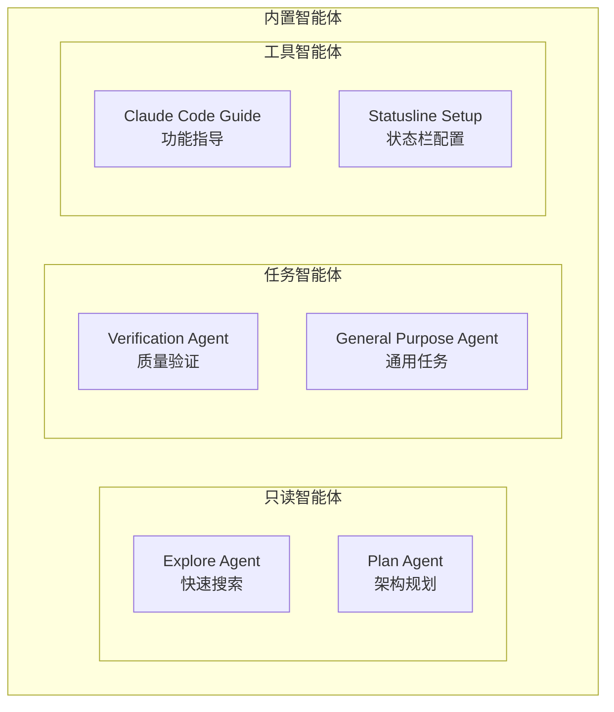
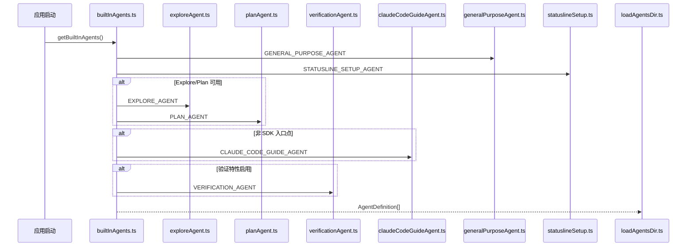

# 内置智能体（Built-in Agents）

## 概览

内置智能体是 Claude Code 预定义的专用智能体，为常见任务提供开箱即用的解决方案。它们通过 [builtInAgents.ts](/restored-src/src/tools/AgentTool/builtInAgents.ts) 统一注册和管理。

## 智能体列表

| 智能体 | 类型标识 | 模型 | 用途 |
|--------|----------|------|------|
| [Explore Agent](./explore-agent.md) | `Explore` | Haiku/inherit | 快速代码库探索 |
| [Plan Agent](./plan-agent.md) | `Plan` | inherit | 架构设计和实施规划 |
| [Verification Agent](./verification-agent.md) | `verification` | inherit | 实现质量验证 |
| [Claude Code Guide Agent](./claude-code-guide-agent.md) | `claude-code-guide` | Haiku | Claude Code 功能指导 |
| [General Purpose Agent](./general-purpose-agent.md) | `general-purpose` | default | 通用多步骤任务 |
| [Statusline Setup Agent](./statusline-setup-agent.md) | `statusline-setup` | Sonnet | 状态栏配置 |

## 架构关系

## 注册机制

## 智能体分类

### 按执行模式

| 类别 | 智能体 | 特点 |
|------|--------|------|
| 只读 | Explore, Plan | 禁止文件修改 |
| 可写 | General Purpose, Verification, Statusline Setup | 可修改文件 |
| 只读 | Claude Code Guide | 仅读取文档 |

### 按模型选择

| 模型 | 智能体 | 选择策略 |
|------|--------|----------|
| `haiku` | Explore (外部), Claude Code Guide | 快速响应 |
| `sonnet` | Statusline Setup | 适中能力 |
| `inherit` | Explore (Ant), Plan, Verification | 继承主 Agent |
| `default` | General Purpose | 系统默认 |

## 特性开关

| 智能体 | 特性开关 | 默认值 |
|--------|----------|--------|
| Explore, Plan | `BUILTIN_EXPLORE_PLAN_AGENTS` + `tengu_amber_stoat` | 启用 |
| Verification | `VERIFICATION_AGENT` + `tengu_hive_evidence` | 禁用 |
| Claude Code Guide | 仅非 SDK 入口点 | 启用 |

## 源码引用

- [builtInAgents.ts](/restored-src/src/tools/AgentTool/builtInAgents.ts)
- [loadAgentsDir.ts](/restored-src/src/tools/AgentTool/loadAgentsDir.ts)
- [exploreAgent.ts](/restored-src/src/tools/AgentTool/built-in/exploreAgent.ts)
- [planAgent.ts](/restored-src/src/tools/AgentTool/built-in/planAgent.ts)
- [verificationAgent.ts](/restored-src/src/tools/AgentTool/built-in/verificationAgent.ts)
- [claudeCodeGuideAgent.ts](/restored-src/src/tools/AgentTool/built-in/claudeCodeGuideAgent.ts)
- [generalPurposeAgent.ts](/restored-src/src/tools/AgentTool/built-in/generalPurposeAgent.ts)
- [statuslineSetup.ts](/restored-src/src/tools/AgentTool/built-in/statuslineSetup.ts)

## 相关文档

- [智能体概览](../_index.md)
- [Agent 工具](../agent-tool.md)

---

*Generated by [Nium-Wiki v0.0.0](https://github.com/niuma996/nium-wiki) | 2026-04-02*
