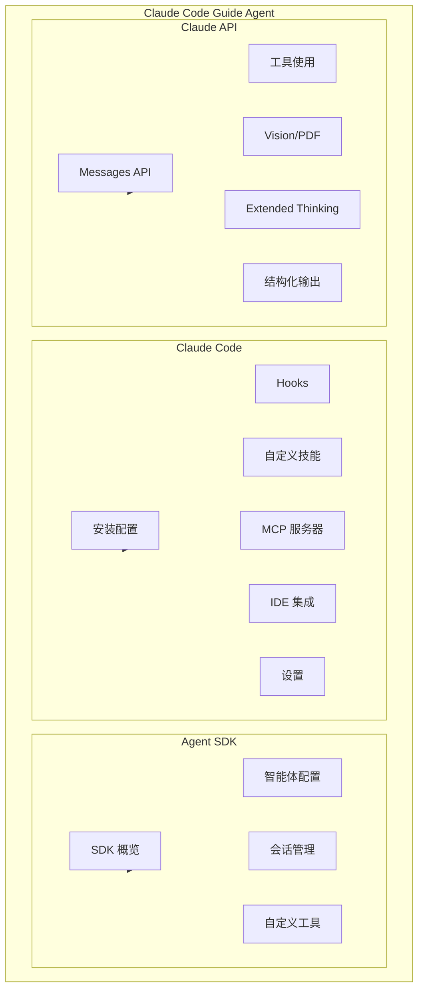
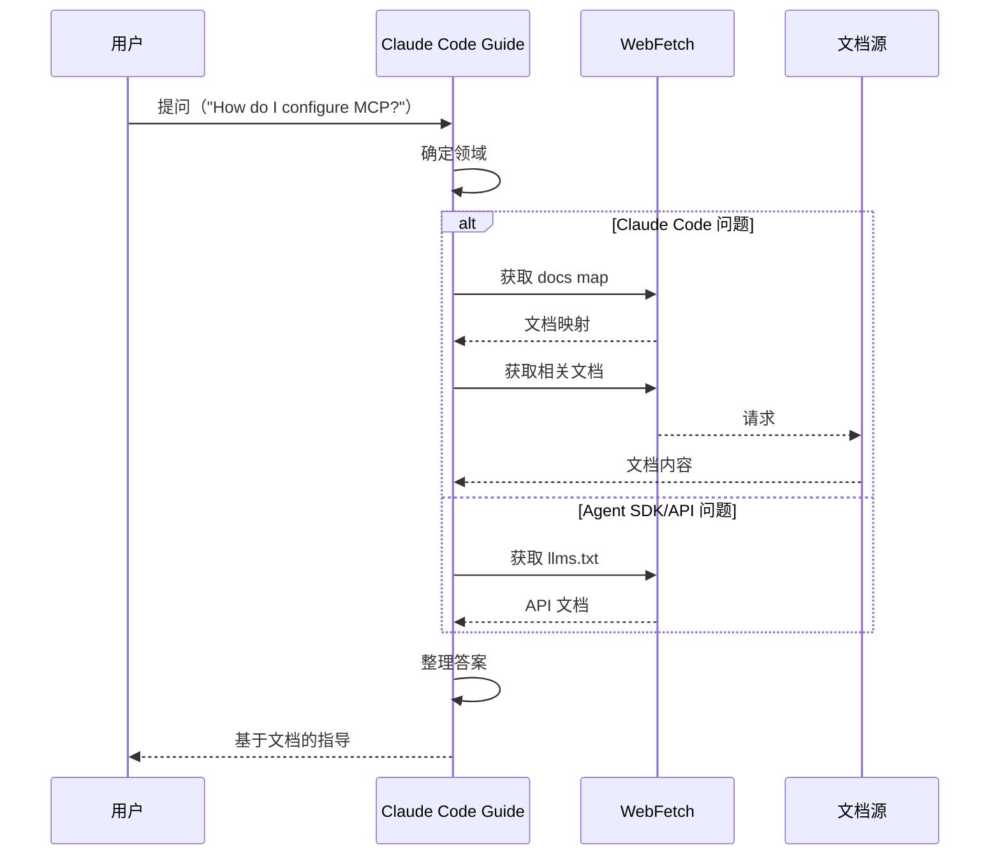

# Claude Code Guide Agent（Claude 代码指南智能体）

## 概览

Claude Code Guide Agent 是帮助用户理解和有效使用 Claude Code、Claude Agent SDK 和 Claude API 的内置智能体。它提供关于功能、配置、hooks、MCP 服务器等问题的指导。

## 核心特性

| 特性 | 说明 |
|------|------|
| **多领域专家** | 覆盖 Claude Code CLI、Agent SDK、Claude API |
| **文档驱动** | 基于官方文档提供准确指导 |
| **上下文感知** | 根据用户配置提供个性化建议 |
| **轻量级模型** | 使用 Haiku 模型实现快速响应 |

## 三大领域



## 系统提示词

```typescript
export const CLAUDE_CODE_GUIDE_AGENT: BuiltInAgentDefinition = {
  agentType: CLAUDE_CODE_GUIDE_AGENT_TYPE,
  whenToUse: `Use this agent when the user asks questions about:
    (1) Claude Code - features, hooks, slash commands, MCP servers...
    (2) Claude Agent SDK - building custom agents
    (3) Claude API - API usage, tool use, Anthropic SDK usage`,
  tools: hasEmbeddedSearchTools()
    ? [BASH_TOOL_NAME, FILE_READ_TOOL_NAME, WEB_FETCH_TOOL_NAME, WEB_SEARCH_TOOL_NAME]
    : [GLOB_TOOL_NAME, GREP_TOOL_NAME, FILE_READ_TOOL_NAME, WEB_FETCH_TOOL_NAME, WEB_SEARCH_TOOL_NAME],
  source: 'built-in',
  baseDir: 'built-in',
  model: 'haiku',
  permissionMode: 'dontAsk',  // 不询问权限
  getSystemPrompt({ toolUseContext }) {
    // 动态构建包含用户配置的上下文
  },
}
```

## 文档来源

### Claude Code 文档

| 文档 | URL | 覆盖内容 |
|------|-----|----------|
| Docs Map | `https://code.claude.com/docs/en/claude_code_docs_map.md` | CLI 工具完整文档 |

### Claude Agent SDK 文档

| 文档 | URL | 覆盖内容 |
|------|-----|----------|
| SDK Docs | `https://platform.claude.com/llms.txt` | SDK 概览、Python/TypeScript |

### Claude API 文档

| 文档 | URL | 覆盖内容 |
|------|-----|----------|
| API Docs | `https://platform.claude.com/llms.txt` | Messages API、流式传输、工具使用 |

## 响应流程



## 用户配置上下文

Claude Code Guide Agent 动态收集并使用用户的配置信息：

### 1. 自定义技能

```markdown
**Available custom skills in this project:**
- /deploy: Deploy the application
- /test: Run test suite
```

### 2. 自定义智能体

```markdown
**Available custom agents configured:**
- code-reviewer: Review code changes
- test-runner: Execute tests
```

### 3. MCP 服务器

```markdown
**Configured MCP servers:**
- slack
- github
- filesystem
```

### 4. 插件技能

```markdown
**Available plugin skills:**
- /jira: Interact with Jira
- /github: GitHub integration
```

### 5. 用户设置

```json
{
  "outputStyle": "Explanatory",
  "temperature": 0.7
}
```

## 反馈处理

根据用户类型，反馈处理方式不同：

| 用户类型 | 反馈方式 |
|----------|----------|
| 直接用户 | 引导使用 `/feedback` 命令 |
| 3P 服务用户 | 引导到适当的反馈渠道 |

```typescript
function getFeedbackGuideline(): string {
  if (isUsing3PServices()) {
    return `- When you cannot find an answer... direct to ${MACRO.ISSUES_EXPLAINER}`
  }
  return "- When you cannot find an answer... direct user to use /feedback"
}
```

## 使用场景

### 何时使用

| 问题类型 | 示例 |
|----------|------|
| Claude Code 功能 | `"Can Claude auto-save my work?"` |
| Hooks 配置 | `"How do I run a script before each command?"` |
| MCP 服务器 | `"How do I configure the GitHub MCP server?"` |
| 设置配置 | `"How do I change the output style?"` |
| Agent SDK 使用 | `"How do I build a custom agent?"` |
| API 问题 | `"How do I use tool use in the API?"` |

### 使用注意

> **IMPORTANT**: Before spawning a new agent, check if there is already a running or recently completed claude-code-guide agent that you can continue via SendMessage.

## 工具配置

| 环境 | 配置的工具 |
|------|-----------|
| 标准构建 | GlobTool, GrepTool, FileReadTool, WebFetchTool, WebSearchTool |
| Ant-native | BashTool (find/grep), FileReadTool, WebFetchTool, WebSearchTool |

## 可用性条件

Claude Code Guide Agent 仅对非 SDK 入口点可用：

```typescript
const isNonSdkEntrypoint =
  process.env.CLAUDE_CODE_ENTRYPOINT !== 'sdk-ts' &&
  process.env.CLAUDE_CODE_ENTRYPOINT !== 'sdk-py' &&
  process.env.CLAUDE_CODE_ENTRYPOINT !== 'sdk-cli'

if (isNonSdkEntrypoint) {
  agents.push(CLAUDE_CODE_GUIDE_AGENT)
}
```

| 入口点 | 可用性 |
|--------|--------|
| `sdk-ts` | ❌ 不可用 |
| `sdk-py` | ❌ 不可用 |
| `sdk-cli` | ❌ 不可用 |
| 其他 | ✅ 可用 |

## 源码引用

- [claudeCodeGuideAgent.ts](/restored-src/src/tools/AgentTool/built-in/claudeCodeGuideAgent.ts)
- [builtInAgents.ts](/restored-src/src/tools/AgentTool/builtInAgents.ts)
- [constants.ts](/restored-src/src/tools/AgentTool/constants.ts)

## 相关文档

- [智能体概览](../_index.md)
- [Agent 工具](./agent-tool.md)
- [内置智能体注册](./built-in-agents.md)

---

*Generated by [Nium-Wiki v0.0.0](https://github.com/niuma996/nium-wiki) | 2026-04-02*
