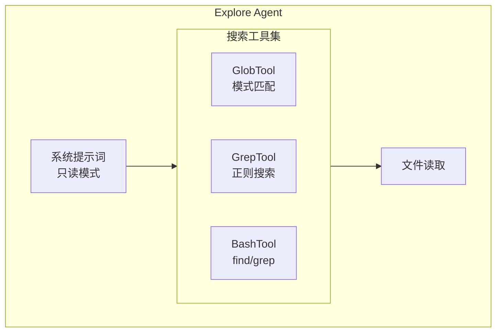
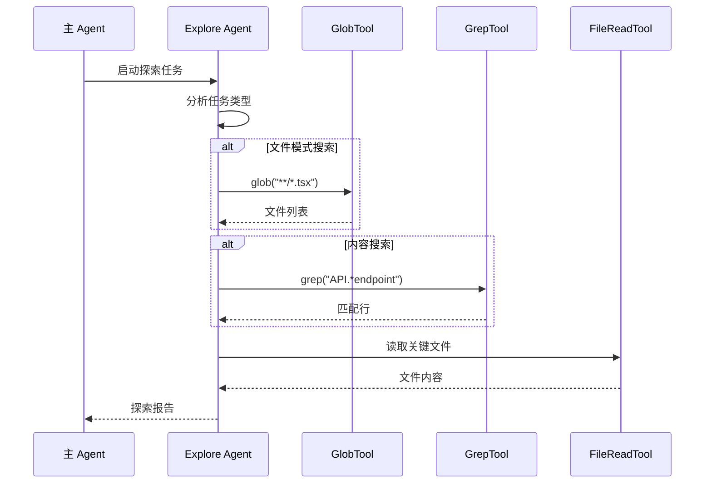

# Explore Agent（探索智能体）

## 概览

Explore Agent 是一个专门用于快速搜索和分析代码库的内置智能体。它设计用于执行只读的文件搜索和内容探索任务，能够快速定位文件、搜索代码模式、阅读和分析文件内容。

## 核心特性

| 特性 | 说明 |
|------|------|
| **只读模式** | 严格禁止任何文件修改操作 |
| **快速执行** | 设计为快速返回结果，使用并行工具调用 |
| **专业搜索** | 支持 Glob 模式匹配和正则表达式内容搜索 |
| **轻量级模型** | 对于外部用户使用 Haiku 模型以提高速度 |

## 系统提示词

```typescript
export const EXPLORE_AGENT: BuiltInAgentDefinition = {
  agentType: 'Explore',
  whenToUse: 'Fast agent specialized for exploring codebases...',
  disallowedTools: [
    AGENT_TOOL_NAME,
    EXIT_PLAN_MODE_TOOL_NAME,
    FILE_EDIT_TOOL_NAME,
    FILE_WRITE_TOOL_NAME,
    NOTEBOOK_EDIT_TOOL_NAME,
  ],
  source: 'built-in',
  baseDir: 'built-in',
  model: process.env.USER_TYPE === 'ant' ? 'inherit' : 'haiku',
  omitClaudeMd: true,
  getSystemPrompt: () => getExploreSystemPrompt(),
}
```

## 架构位置



## 禁止的工具

Explore Agent 被配置为只读模式，禁止以下工具：

| 工具类型 | 工具名称 | 禁止原因 |
|----------|----------|----------|
| 智能体 | `Agent` | 防止嵌套调用 |
| 退出计划模式 | `ExitPlanMode` | 不需要计划模式功能 |
| 文件编辑 | `Edit` | 禁止修改文件 |
| 文件写入 | `Write` | 禁止创建/写入文件 |
| Notebook 编辑 | `NotebookEdit` | 禁止编辑笔记本 |

## 使用场景

### 何时使用 Explore Agent

| 场景 | 示例 |
|------|------|
| 按模式查找文件 | `"Find all React component files"` |
| 搜索代码关键词 | `"Find API endpoint implementations"` |
| 理解代码库结构 | `"How do API endpoints work?"` |
| 快速调查问题 | `"Find where this error is thrown"` |

### 何时不使用

- 需要修改文件的任务（应使用 General Purpose Agent）
- 需要运行命令改变系统状态
- 需要访问编辑工具的操作

## 执行流程



## 搜索工具适配

Explore Agent 智能检测 Ant-native 构建环境，自动适配搜索工具：

| 环境 | Glob 工具 | Grep 工具 |
|------|-----------|-----------|
| 标准构建 | `GlobTool` | `GrepTool` |
| Ant-native | `find` via Bash | `grep` via Bash |

```typescript
function getExploreSystemPrompt(): string {
  const embedded = hasEmbeddedSearchTools()
  const globGuidance = embedded
    ? `- Use \`find\` via ${BASH_TOOL_NAME} for broad file pattern matching`
    : `- Use ${GLOB_TOOL_NAME} for broad file pattern matching`
  // ...
}
```

## 模型选择策略

| 用户类型 | 模型选择 | 原因 |
|----------|----------|------|
| Ant (内部用户) | `inherit` | 继承主 Agent 模型 |
| External (外部用户) | `haiku` | 使用快速模型提高响应速度 |

## 输出格式

Explore Agent 返回简洁的探索报告：

```markdown
## 探索结果

### 文件位置
- `/src/components/Button.tsx`
- `/src/components/Icon.tsx`

### 关键发现
1. 所有组件都继承自 `BaseComponent` 类
2. API 端点定义在 `src/api/routes.ts`
3. 错误处理统一使用 `ErrorHandler` 中间件
```

## 源码引用

- [exploreAgent.ts](/restored-src/src/tools/AgentTool/built-in/exploreAgent.ts)
- [loadAgentsDir.ts](/restored-src/src/tools/AgentTool/loadAgentsDir.ts)
- [constants.ts](/restored-src/src/tools/AgentTool/constants.ts)

## 相关文档

- [智能体概览](../_index.md)
- [Plan Agent](./plan-agent.md)
- [Agent 工具](./agent-tool.md)
- [内置智能体注册](./built-in-agents.md)

---

*Generated by [Nium-Wiki v0.0.0](https://github.com/niuma996/nium-wiki) | 2026-04-02*
