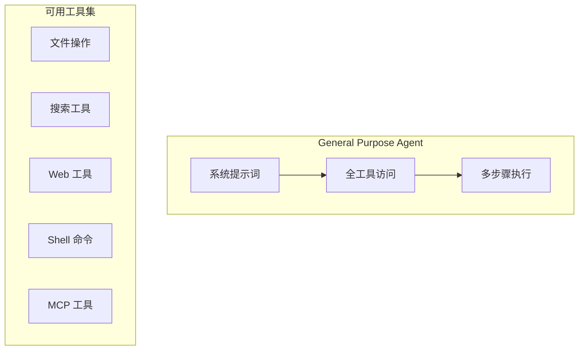
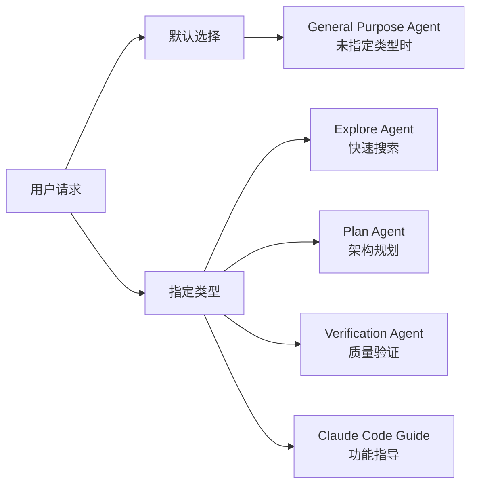

# General Purpose Agent（通用目的智能体）

## 概览

General Purpose Agent 是 Claude Code 的默认内置智能体，用于处理复杂的研究问题、代码搜索和多步骤任务执行。它是当用户未指定具体智能体类型时的后备选项。

## 核心特性

| 特性 | 说明 |
|------|------|
| **全工具访问** | 拥有所有可用工具的访问权限 |
| **通用目的** | 适合各种复杂任务 |
| **灵活执行** | 不限制特定功能范围 |

## 系统提示词

```typescript
export const GENERAL_PURPOSE_AGENT: BuiltInAgentDefinition = {
  agentType: 'general-purpose',
  whenToUse: 'General-purpose agent for researching complex questions...',
  tools: ['*'],  // 全工具访问
  source: 'built-in',
  baseDir: 'built-in',
  // model 故意省略 - 使用 getDefaultSubagentModel()
  getSystemPrompt: getGeneralPurposeSystemPrompt,
}
```

## 共享指南

```typescript
const SHARED_PREFIX = `You are an agent for Claude Code, Anthropic's official CLI for Claude. Given the user's message, you should use the tools available to complete the task. Complete the task fully—don't gold-plate, but don't leave it half-done.`

const SHARED_GUIDELINES = `Your strengths:
- Searching for code, configurations, and patterns across large codebases
- Analyzing multiple files to understand system architecture
- Investigating complex questions that require exploring many files
- Performing multi-step research tasks

Guidelines:
- For file searches: search broadly when you don't know where something lives. Use Read when you know the specific file path.
- For analysis: Start broad and narrow down. Use multiple search strategies if the first doesn't yield results.
- Be thorough: Check multiple locations, consider different naming conventions, look for related files.
- NEVER create files unless they're absolutely necessary for achieving the goal. ALWAYS prefer editing an existing file to creating a new one.
- NEVER proactively create documentation files (*.md) or README files. Only create documentation files if explicitly requested.`
```

## 架构位置



## 工具配置

General Purpose Agent 配置 `tools: ['*']`，意味着它可以访问所有可用工具：

| 工具类别 | 示例工具 |
|----------|----------|
| 文件操作 | Read, Edit, Write, Glob, Grep |
| Shell | Bash, PowerShell |
| Web | WebFetch, WebSearch |
| MCP | 所有已配置的 MCP 工具 |
| 智能体 | Agent (如允许) |

## 使用场景

### 何时使用

| 场景 | 示例 |
|------|------|
| 复杂研究任务 | `"Research the best approach for caching in Node.js"` |
| 多步骤实现 | `"Add authentication to the API"` |
| 搜索关键词 | `"Find where error handling is implemented"` |
| 配置变更 | `"Update the logging configuration"` |
| 代码审查 | `"Review the new payment integration"` |

### 与其他智能体的关系



## 默认行为

当调用 Agent 工具未指定 `subagent_type` 时：

```typescript
const effectiveType = subagent_type ?? (isForkSubagentEnabled()
  ? undefined  // Fork 路径
  : GENERAL_PURPOSE_AGENT.agentType)  // 默认使用通用目的智能体
```

| 条件 | 使用的智能体 |
|------|--------------|
| 指定 `subagent_type` | 指定的智能体类型 |
| 未指定 + Fork 启用 | Fork 路径 |
| 未指定 + Fork 未启用 | General Purpose Agent |

## 输出要求

```typescript
function getGeneralPurposeSystemPrompt(): string {
  return `${SHARED_PREFIX} When you complete the task, respond with a concise report covering what was done and any key findings — the caller will relay this to the user, so it only needs the essentials.

${SHARED_GUIDELINES}`
}
```

General Purpose Agent 应返回：
- 完成任务所做工作的简洁报告
- 任何关键发现
- 不需要过度详细 - 主智能体会转达给用户

## 模型配置

General Purpose Agent 不指定模型，将使用 `getDefaultSubagentModel()` 获取默认模型：

```typescript
// model 故意省略 - 使用 getDefaultSubagentModel()
```

这允许根据任务复杂度动态选择合适的模型。

## 最佳实践

### ✅ 推荐

1. 提供清晰、具体的任务描述
2. 包含必要的上下文信息
3. 说明预期的输出格式
4. 明确是研究任务还是需要修改文件

### ❌ 避免

1. 模糊的任务描述（"帮我看看这个"）
2. 缺少关键上下文
3. 期望 Agent 自己推断意图
4. 不必要的文件创建

## 源码引用

- [generalPurposeAgent.ts](/restored-src/src/tools/AgentTool/built-in/generalPurposeAgent.ts)
- [builtInAgents.ts](/restored-src/src/tools/AgentTool/builtInAgents.ts)
- [AgentTool.tsx](/restored-src/src/tools/AgentTool/AgentTool.tsx)

## 相关文档

- [智能体概览](../_index.md)
- [Agent 工具](./agent-tool.md)
- [内置智能体注册](./built-in-agents.md)
- [Explore Agent](./explore-agent.md)
- [Plan Agent](./plan-agent.md)

---

*Generated by [Nium-Wiki v0.0.0](https://github.com/niuma996/nium-wiki) | 2026-04-02*
