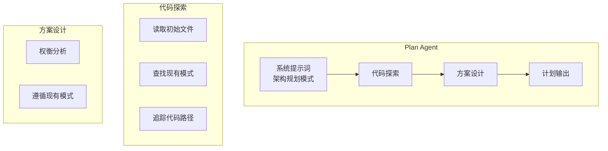
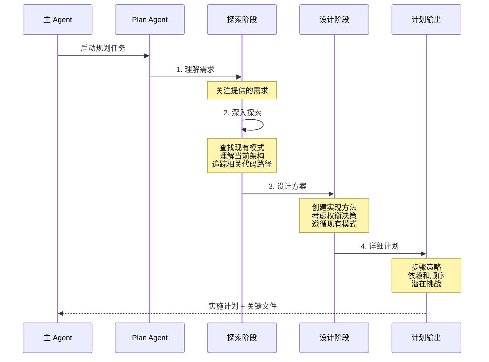

# Plan Agent（计划智能体）

## 概览

Plan Agent 是一个专门用于软件架构设计和实施规划的内置智能体。它的职责是探索代码库并设计实现方案，提供分步骤的实施策略、识别关键文件，并考虑架构权衡。

## 核心特性

| 特性 | 说明 |
|------|------|
| **只读模式** | 严格禁止任何文件修改操作 |
| **架构视角** | 从软件架构角度分析和规划 |
| **详细计划** | 提供分步骤的实施策略 |
| **关键文件识别** | 列出实现计划中最关键的文件 |

## 系统提示词

```typescript
export const PLAN_AGENT: BuiltInAgentDefinition = {
  agentType: 'Plan',
  whenToUse: 'Software architect agent for designing implementation plans...',
  disallowedTools: [
    AGENT_TOOL_NAME,
    EXIT_PLAN_MODE_TOOL_NAME,
    FILE_EDIT_TOOL_NAME,
    FILE_WRITE_TOOL_NAME,
    NOTEBOOK_EDIT_TOOL_NAME,
  ],
  source: 'built-in',
  tools: EXPLORE_AGENT.tools,  // 继承 Explore Agent 的工具集
  baseDir: 'built-in',
  model: 'inherit',  // 继承主 Agent 模型
  omitClaudeMd: true,  // 不读取 CLAUDE.md
  getSystemPrompt: () => getPlanV2SystemPrompt(),
}
```

## 架构位置



## 规划流程



## 禁止的工具

与 Explore Agent 类似，Plan Agent 也配置为只读模式：

| 工具类型 | 工具名称 | 禁止原因 |
|----------|----------|----------|
| 智能体 | `Agent` | 防止嵌套调用 |
| 退出计划模式 | `ExitPlanMode` | 不需要计划模式功能 |
| 文件编辑 | `Edit` | 禁止修改文件 |
| 文件写入 | `Write` | 禁止创建/写入文件 |
| Notebook 编辑 | `NotebookEdit` | 禁止编辑笔记本 |

## 使用场景

### 何时使用 Plan Agent

| 场景 | 示例 |
|------|------|
| 设计新功能架构 | `"Design the architecture for adding real-time notifications"` |
| 规划重构方案 | `"Plan a refactoring approach for the authentication module"` |
| 评估实施复杂度 | `"What's the best approach to implement this feature?"` |
| 识别关键依赖 | `"Which files would need to change to add this API?"` |

### 与 Explore Agent 的区别

| 方面 | Explore Agent | Plan Agent |
|------|---------------|------------|
| **主要目标** | 搜索和定位 | 设计和规划 |
| **输出类型** | 探索报告 | 实施计划 |
| **分析深度** | 快速定位 | 深入架构分析 |
| **建议内容** | 文件位置 | 实施步骤 |

## 必需输出

Plan Agent 的响应必须以以下格式结束：

```markdown
### Critical Files for Implementation
List 3-5 files most critical for implementing this plan:
- path/to/file1.ts
- path/to/file2.ts
- path/to/file3.ts
```

这个格式确保主 Agent 能够获得实施所需的关键文件信息。

## 特性开关

Plan Agent 的可用性由 GrowthBook 特性开关控制：

```typescript
export function areExplorePlanAgentsEnabled(): boolean {
  if (feature('BUILTIN_EXPLORE_PLAN_AGENTS')) {
    return getFeatureValue_CACHED_MAY_BE_STALE('tengu_amber_stoat', true)
  }
  return false
}
```

| 开关 | 说明 |
|------|------|
| `BUILTIN_EXPLORE_PLAN_AGENTS` | 主功能开关 |
| `tengu_amber_stoat` | A/B 测试开关（治疗组关闭） |

## 模型继承策略

Plan Agent 使用 `model: 'inherit'` 配置，继承主 Agent 的模型。这确保了复杂规划任务有足够的推理能力。

## 源码引用

- [planAgent.ts](/restored-src/src/tools/AgentTool/built-in/planAgent.ts)
- [exploreAgent.ts](/restored-src/src/tools/AgentTool/built-in/exploreAgent.ts)
- [builtInAgents.ts](/restored-src/src/tools/AgentTool/builtInAgents.ts)

## 相关文档

- [智能体概览](../_index.md)
- [Explore Agent](./explore-agent.md)
- [Agent 工具](./agent-tool.md)
- [内置智能体注册](./built-in-agents.md)

---

*Generated by [Nium-Wiki v0.0.0](https://github.com/niuma996/nium-wiki) | 2026-04-02*
