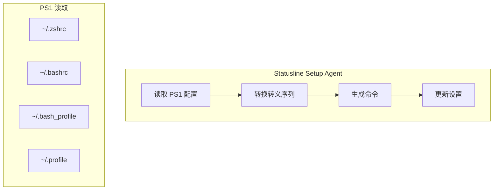
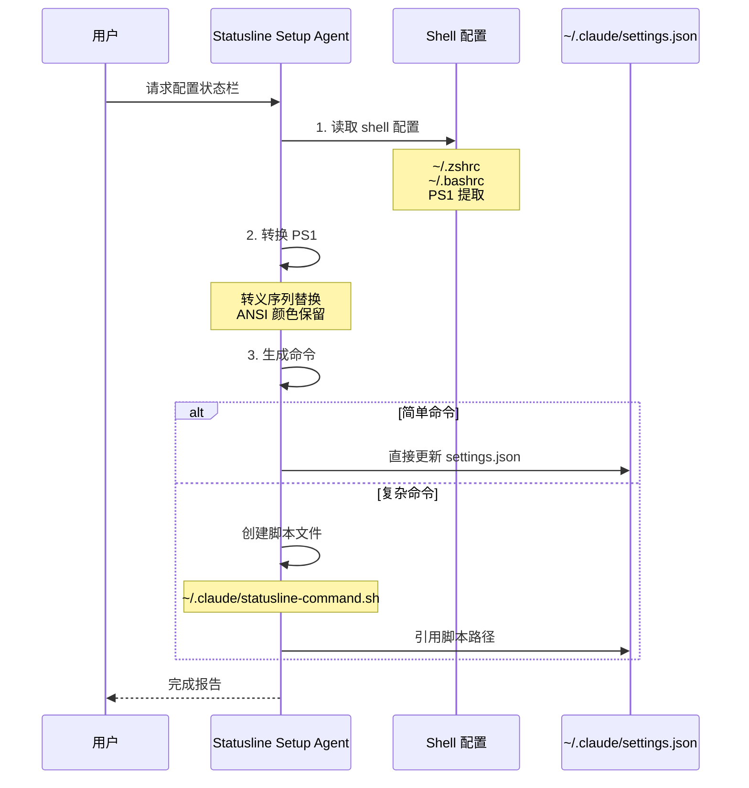

# Statusline Setup Agent（状态栏配置智能体）

## 概览

Statusline Setup Agent 是专门用于配置用户 Claude Code 状态栏的内置智能体。它的职责是帮助用户创建或更新 `statusLine` 命令，将 shell PS1 配置转换为 Claude Code 状态栏命令。

## 核心特性

| 特性 | 说明 |
|------|------|
| **PS1 转换** | 将 shell PS1 配置转换为状态栏命令 |
| **颜色保留** | 保留 ANSI 颜色代码 |
| **JSON 数据访问** | 访问会话状态信息 |
| **模型优化** | 使用 Sonnet 模型 |

## 系统提示词

```typescript
export const STATUSLINE_SETUP_AGENT: BuiltInAgentDefinition = {
  agentType: 'statusline-setup',
  whenToUse: "Use this agent to configure the user's Claude Code status line setting.",
  tools: ['Read', 'Edit'],  // 仅文件读取和编辑
  source: 'built-in',
  baseDir: 'built-in',
  model: 'sonnet',  // 使用 Sonnet 模型
  color: 'orange',  // 橙色标识
  getSystemPrompt: () => STATUSLINE_SYSTEM_PROMPT,
}
```

## 架构位置



## PS1 转义序列转换

### 支持的转义序列

| PS1 序列 | 转换结果 | 示例 |
|----------|----------|------|
| `\u` | `$(whoami)` | `$(whoami)` |
| `\h` | `$(hostname -s)` | `$(hostname -s)` |
| `\H` | `$(hostname)` | `$(hostname)` |
| `\w` | `$(pwd)` | `$(pwd)` |
| `\W` | `$(basename "$(pwd)")` | `$(basename "$(pwd)")` |
| `\$` | `$` | `$` |
| `\n` | 换行符 | `\n` |
| `\t` | `$(date +%H:%M:%S)` | `$(date +%H:%M:%S)` |
| `\d` | `$(date "+%a %b %d")` | `$(date "+%a %b %d")` |
| `\@` | `$(date +%I:%M%p)` | `$(date +%I:%M%p)` |
| `\#` | `#` | `#` |
| `\!` | `!` | `!` |

## 输入 JSON 数据结构

Statusline 命令通过 stdin 接收以下 JSON 数据：

```typescript
interface StatusLineInput {
  session_id: string           // 唯一会话 ID
  session_name?: string        // 可选：会话名称
  transcript_path: string      // 对话记录路径
  cwd: string                  // 当前工作目录
  model: {
    id: string                 // 模型 ID
    display_name: string       // 显示名称
  }
  workspace: {
    current_dir: string        // 当前目录
    project_dir: string        // 项目根目录
    added_dirs: string[]       // 通过 /add-dir 添加的目录
  }
  version: string              // Claude Code 版本
  output_style: {
    name: string               // 输出样式名称
  }
  context_window: {
    total_input_tokens: number
    total_output_tokens: number
    context_window_size: number
    current_usage: {
      input_tokens: number
      output_tokens: number
      cache_creation_input_tokens: number
      cache_read_input_tokens: number
    } | null
    used_percentage: number | null   // 预计算：已用百分比
    remaining_percentage: number | null  // 预计算：剩余百分比
  }
  rate_limits?: {              // 仅订阅者可见
    five_hour: {
      used_percentage: number
      resets_at: number
    }
    seven_day: {
      used_percentage: number
      resets_at: number
    }
  }
  vim?: {                     // 仅 vim 模式启用时
    mode: 'INSERT' | 'NORMAL'
  }
  agent?: {                   // --agent 标志启动时
    name: string
    type: string
  }
  worktree?: {                // --worktree 会话时
    name: string
    path: string
    branch: string
    original_cwd: string
    original_branch: string
  }
}
```

## 使用示例

### 基本用法

```bash
# 显示模型和当前目录
input=$(cat)
echo "$(echo "$input" | jq -r '.model.display_name') in $(echo "$input" | jq -r '.workspace.current_dir')"
```

### 上下文使用百分比

```bash
# 使用预计算字段
input=$(cat)
remaining=$(echo "$input" | jq -r '.context_window.remaining_percentage // empty')
[ -n "$remaining" ] && echo "Context: $remaining% remaining"
```

### Claude.ai 订阅限制

```bash
# 显示 5 小时限制
input=$(cat)
pct=$(echo "$input" | jq -r '.rate_limits.five_hour.used_percentage // empty')
[ -n "$pct" ] && printf "5h: %.0f%%" "$pct"
```

### 显示速率限制

```bash
# 显示 5 小时和 7 天限制
input=$(cat)
five=$(echo "$input" | jq -r '.rate_limits.five_hour.used_percentage // empty')
week=$(echo "$input" | jq -r '.rate_limits.seven_day.used_percentage // empty')
out=""
[ -n "$five" ] && out="5h:$(printf '%.0f' "$five")%"
[ -n "$week" ] && out="$out 7d:$(printf '%.0f' "$week")%"
echo "$out"
```

## 配置流程



## 颜色处理

Agent 强调保留 ANSI 颜色代码：

> When using ANSI color codes, be sure to use `printf`. Do not remove colors.

### 示例

```bash
# ❌ 错误 - 移除了颜色
PS1="${degreen}\u@\h${reset} \w$ "

# ✅ 正确 - 保留颜色
PS1="$(printf '%s' \"\$green\\\u@\h\$reset \w$ \")"
```

## 输出要求

完成配置后，Agent 必须：
1. 返回配置的摘要
2. 如果创建了脚本文件，包含文件名
3. 通知父智能体需要使用 "statusline-setup" 智能体进行进一步的状态栏更改
4. 通知用户可以要求 Claude 继续更改状态栏

## 工具限制

Statusline Setup Agent 仅允许以下工具：

| 工具 | 用途 |
|------|------|
| `Read` | 读取 shell 配置文件 |
| `Edit` | 更新 settings.json |

禁止使用：
- `Write` (应使用 Edit)
- `Bash` (不直接需要)
- `Agent` (不允许嵌套)
- 其他所有工具

## 源码引用

- [statuslineSetup.ts](/restored-src/src/tools/AgentTool/built-in/statuslineSetup.ts)
- [builtInAgents.ts](/restored-src/src/tools/AgentTool/builtInAgents.ts)
- [constants.ts](/restored-src/src/tools/AgentTool/constants.ts)

## 相关文档

- [智能体概览](../_index.md)
- [Agent 工具](./agent-tool.md)
- [内置智能体注册](./built-in-agents.md)

---

*Generated by [Nium-Wiki v0.0.0](https://github.com/niuma996/nium-wiki) | 2026-04-02*
