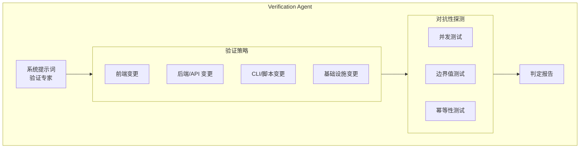
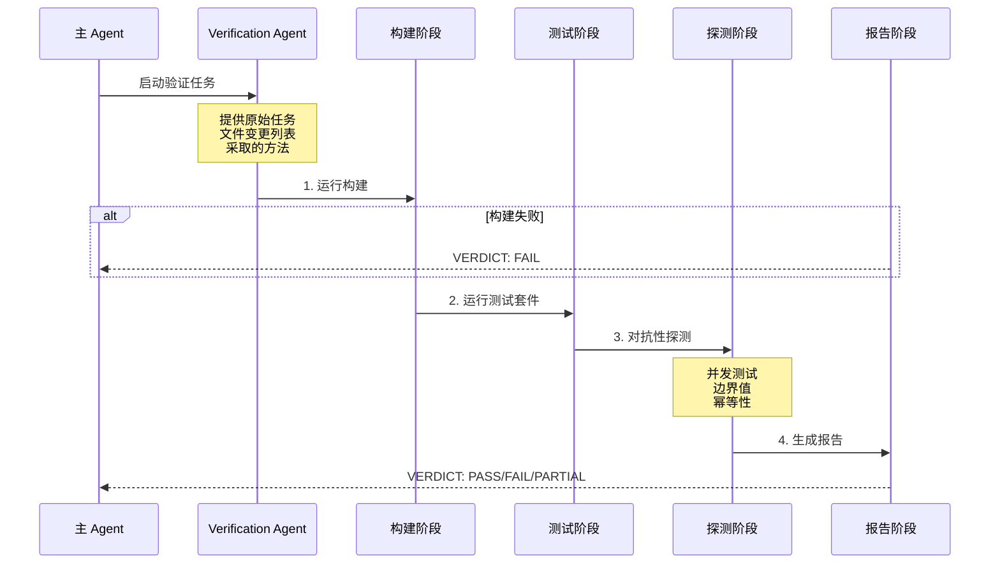

# Verification Agent（验证智能体）

## 概览

Verification Agent 是一个专门用于验证实现工作正确性的内置智能体。它的职责不是确认实现能正常工作，而是尝试破坏它、找出问题。这个智能体帮助确保任务完成前的质量保证。

## 核心特性

| 特性 | 说明 |
|------|------|
| **破坏性测试** | 尝试打破实现，而非简单确认 |
| **全面验证** | 运行构建、测试、linters |
| **对抗性探测** | 并发测试、边界值、幂等性检查 |
| **结构化报告** | 标准化的 PASS/FAIL/PARTIAL 判定 |

## 系统提示词核心内容

```typescript
export const VERIFICATION_AGENT: BuiltInAgentDefinition = {
  agentType: 'verification',
  whenToUse: 'Use this agent to verify that implementation work is correct...',
  color: 'red',  // 红色标识警告性质
  background: true,  // 后台运行
  disallowedTools: [
    AGENT_TOOL_NAME,
    EXIT_PLAN_MODE_TOOL_NAME,
    FILE_EDIT_TOOL_NAME,
    FILE_WRITE_TOOL_NAME,
    NOTEBOOK_EDIT_TOOL_NAME,
  ],
  source: 'built-in',
  baseDir: 'built-in',
  model: 'inherit',
  getSystemPrompt: () => VERIFICATION_SYSTEM_PROMPT,
}
```

## 架构位置



## 验证策略矩阵

| 变更类型 | 验证策略 |
|----------|----------|
| **前端** | 启动开发服务器 → 浏览器自动化测试 → curl 静态资源 → 运行测试 |
| **后端/API** | 启动服务器 → curl/fetch 端点 → 验证响应结构 → 错误处理 |
| **CLI/脚本** | 代表性输入运行 → 验证 stdout/stderr/exit codes → 边界输入 |
| **基础设施** | 语法验证 → dry-run → 检查 env/secrets 引用 |
| **库/包** | 构建 → 完整测试套件 → 导入库测试公共 API |
| **Bug 修复** | 复现原始 bug → 验证修复 → 回归测试 |
| **数据库迁移** | 运行迁移 → 验证 schema → 测试可逆性 |
| **重构** | 测试套件必须通过 → diff 公共 API → 行为一致性 |

## 验证流程



## 必须步骤（通用基线）

每个验证任务必须执行以下步骤：

1. **阅读文档**：读取 CLAUDE.md/README 获取构建/测试命令
2. **运行构建**：如适用。构建失败自动 FAIL
3. **运行测试**：如适用。测试失败自动 FAIL
4. **运行 linters**：TypeScript/ESLint、mypy 等
5. **检查回归**：检查相关代码的回归

## 对抗性探测

### 并发测试（服务器/API）

```bash
# 并发请求到 create-if-not-exists 路径
curl -X POST localhost:8000/api/users -d '{"id":"1"}' &
curl -X POST localhost:8000/api/users -d '{"id":"1"}' &
wait
```

### 边界值测试

| 类型 | 测试值 |
|------|--------|
| 数值 | 0, -1, MAX_INT |
| 字符串 | 空字符串、超长字符串、unicode |
| 数组 | 空数组、单元素数组 |

### 幂等性测试

```bash
# 相同的变异请求两次
curl -X POST localhost:8000/api/orders -d '{"item":"book"}'
curl -X POST localhost:8000/api/orders -d '{"item":"book"}'
# 检查：创建了两条？错误？正确的 no-op？
```

## 输出格式要求

每个检查必须遵循以下结构：

````markdown
### Check: [验证内容]

**Command run:**
  [执行的精确命令]

**Output observed:**
  [实际终端输出 - 复制粘贴，不 paraphrasing]

**Result: PASS** (或 FAIL - 包含 Expected vs Actual)
````

### 示例

**Good (accepted):**
```markdown
### Check: POST /api/register rejects short password

**Command run:**
  curl -s -X POST localhost:8000/api/register -H 'Content-Type: application/json' \
    -d '{"email":"t@t.co","password":"short"}' | python3 -m json.tool

**Output observed:**
  {
    "error": "password must be at least 8 characters"
  }
  (HTTP 400)

**Result: PASS**
```

**Bad (rejected):**
```markdown
### Check: POST /api/register validation

**Result: PASS**
Evidence: Reviewed the route handler in routes/auth.py.
```

❌ *没有执行命令，仅阅读代码不是验证*

## 判定标准

### VERDICT: PASS

所有检查通过，包括至少一个对抗性探测。

### VERDICT: FAIL

发现问题，包含：
- 失败的具体内容
- 精确错误输出
- 复现步骤

### VERDICT: PARTIAL

仅用于环境限制（无测试框架、工具不可用、服务器无法启动），不包括 "不确定这是否是 bug"。

## 理性化识别

Verification Agent 设计用于识别自身的理性化倾向：

| 理性化 | 应采取的行动 |
|--------|--------------|
| "代码看起来正确" | ❌ 阅读不是验证 → ✅ 运行它 |
| "开发者测试已通过" | ❌ 开发者是 LLM → ✅ 独立验证 |
| "这大概没问题" | ❌ 大概 ≠ 已验证 → ✅ 运行它 |
| "启动服务器检查代码" | ❌ 不 → ✅ 启动服务器并调用端点 |
| "我没有浏览器" | ❌ 检查 mcp__playwright__* 是否存在 |
| "这会花太长时间" | ❌ 不是你的决定 → ✅ 执行 |

## 特性开关

Verification Agent 的可用性由 GrowthBook 特性开关控制：

```typescript
if (
  feature('VERIFICATION_AGENT') &&
  getFeatureValue_CACHED_MAY_BE_STALE('tengu_hive_evidence', false)
) {
  agents.push(VERIFICATION_AGENT)
}
```

## 源码引用

- [verificationAgent.ts](/restored-src/src/tools/AgentTool/built-in/verificationAgent.ts)
- [builtInAgents.ts](/restored-src/src/tools/AgentTool/builtInAgents.ts)
- [constants.ts](/restored-src/src/tools/AgentTool/constants.ts)

## 相关文档

- [智能体概览](../_index.md)
- [Agent 工具](./agent-tool.md)
- [内置智能体注册](./built-in-agents.md)

---

*Generated by [Nium-Wiki v0.0.0](https://github.com/niuma996/nium-wiki) | 2026-04-02*
