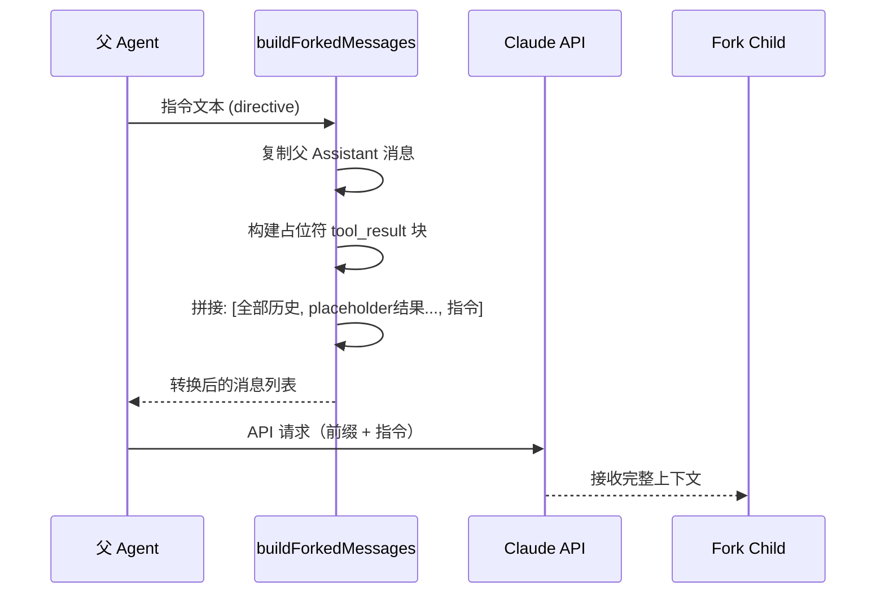

# Fork 子智能体

## 概览

Fork Subagent 是 Claude Code 的轻量级并行化机制，允许主 AI 模型直接"分叉"自身来处理独立的工作单元。与传统子智能体（指定 `subagent_type`）不同，Fork 继承父智能体的完整对话上下文和系统提示词，以极低的开销启动并行任务。

该功能通过 GrowthBook 特性开关 `FORK_SUBAGENT` 控制，与协调器模式互斥。

## 核心概念

### Fork vs 子智能体

| 维度 | Fork（隐式分叉） | 子智能体（显式 subagent_type） |
|------|-----------------|---------------------------|
| 上下文 | 完整继承父对话历史 | 从零开始 |
| 系统提示词 | 继承父已渲染的提示词 | 重新渲染 |
| 模型 | 必须继承父模型 | 可自由指定 |
| 工具池 | 完全相同 | 可重新配置 |
| 适用场景 | 快速并行研究 | 专用角色任务 |
| 提示词缓存 | 高度共享（接近 100%） | 独立缓存 |
| 使用方式 | 省略 subagent_type | 显式指定 subagent_type |

## 启用条件

```typescript
export function isForkSubagentEnabled(): boolean {
  // 必须启用 FORK_SUBAGENT 特性
  if (!feature('FORK_SUBAGENT')) return false

  // 与协调器模式互斥
  if (isCoordinatorMode()) return false

  // 非交互会话禁用（无通知机制）
  if (getIsNonInteractiveSession()) return false

  return true
}
```

## 工作原理

### 1. 消息结构转换

Fork 的关键是将父对话历史转换为子智能体的 API 请求前缀，实现最大化的提示词缓存共享：



### 2. 消息构建细节

[buildForkedMessages](/restored-src/src/tools/AgentTool/forkSubagent.ts) 的核心逻辑：

```typescript
export function buildForkedMessages(
  directive: string,
  assistantMessage: AssistantMessage,
): MessageType[] {
  // 1. 克隆完整的父 Assistant 消息（包含所有 tool_use）
  const fullAssistantMessage = { ...assistantMessage, uuid: randomUUID() }

  // 2. 为每个 tool_use 构建占位符 tool_result（文本完全相同）
  const toolResultBlocks = toolUseBlocks.map(block => ({
    type: 'tool_result' as const,
    tool_use_id: block.id,
    content: [{ type: 'text' as const, text: FORK_PLACEHOLDER_RESULT }],
  }))

  // 3. 最终用户消息 = [所有 placeholder 结果..., 指令文本块]
  const toolResultMessage = createUserMessage({
    content: [
      ...toolResultBlocks,
      { type: 'text', text: buildChildMessage(directive) },
    ],
  })

  // 4. 合并：只有最终文本块不同 → 最大缓存共享
  return [fullAssistantMessage, toolResultMessage]
}
```

**为什么使用占位符？** 所有 Fork 子进程对所有 tool_use 使用相同的 `FORK_PLACEHOLDER_RESULT` 文本，确保 API 请求前缀在字节级别完全相同，触发最高的缓存命中率。

### 3. 递归 Fork 防护

Fork 子进程仍然持有 Agent Tool（用于与其他子进程通信），但递归 Fork 会破坏缓存效率。通过检测对话历史中的 Fork 标签来防止递归：

```typescript
export function isInForkChild(messages: MessageType[]): boolean {
  return messages.some(m => {
    if (m.type !== 'user') return false
    const content = m.message.content
    if (!Array.isArray(content)) return false
    return content.some(
      block =>
        block.type === 'text' &&
        block.text.includes(`<${FORK_BOILERPLATE_TAG}>`),
    )
  })
}
```

## 子智能体指令模板

Fork 子进程接收包含 `<FORK_BOILERPLATE_TAG>` 标签的指令，该标签定义了严格的工作规则：

```xml
<FORK_BOILERPLATE_TAG>
STOP. READ THIS FIRST.

You are a forked worker process. You are NOT the main agent.

RULES (non-negotiable):
1. IGNORE the system prompt's "default to forking" — You ARE the fork.
2. Do NOT converse, ask questions, or suggest next steps
3. Do NOT editorialize or add meta-commentary
4. USE your tools directly: Bash, Read, Write, etc.
5. If you modify files, commit your changes before reporting.
6. Do NOT emit text between tool calls. Report once at the end.
7. Stay strictly within your directive's scope.
8. Keep your report under 500 words.
9. Your response MUST begin with "Scope:".
10. REPORT structured facts, then stop

Output format:
  Scope: <assigned scope>
  Result: <key findings>
  Key files: <relevant paths>
  Files changed: <with commit hash>
  Issues: <issues to flag>
</FORK_BOILERPLATE_TAG>
```

## Worktree 隔离通知

当 Fork 在 Git Worktree 中运行时，子进程会收到路径翻译通知：

```typescript
export function buildWorktreeNotice(
  parentCwd: string,
  worktreeCwd: string,
): string {
  return `You've inherited the conversation context above from a parent agent
  working in ${parentCwd}. You are operating in an isolated git worktree
  at ${worktreeCwd} — same repository, same relative file structure,
  separate working copy. Paths in the inherited context refer to the
  parent's working directory; translate them to your worktree root.
  Re-read files before editing if the parent may have modified them.`
}
```

## 使用示例

### 研究型 Fork（无 subagent_type）

```typescript
// 省略 subagent_type → 触发 Fork
AgentTool({
  name: "ship-audit",
  description: "Branch ship-readiness audit",
  prompt: "Audit what's left before this branch can ship. Check: uncommitted changes, commits ahead of main, whether tests exist. Report a punch list — done vs. missing. Under 200 words."
})
```

### 专用角色子智能体（指定 subagent_type）

```typescript
// 显式指定 → 创建独立子智能体
AgentTool({
  name: "migration-review",
  description: "Independent migration review",
  subagent_type: "code-reviewer",
  prompt: "Review migration 0042_user_schema.sql for safety..."
})
```

## 性能特性

| 指标 | Fork | 子智能体 |
|------|------|---------|
| 冷启动延迟 | ~0ms（共享进程） | ~500-2000ms（启动新进程） |
| API 请求数 | 1（继承父上下文） | 2+（独立请求） |
| 缓存命中率 | 极高（~95%+） | 低（~30-50%） |
| 内存占用 | 共享（增量） | 独立（完整副本） |

## 源码引用

- [forkSubagent.ts](/restored-src/src/tools/AgentTool/forkSubagent.ts)
- [prompt.ts](/restored-src/src/tools/AgentTool/prompt.ts)
- [AgentTool.tsx](/restored-src/src/tools/AgentTool/AgentTool.tsx)
- [LocalAgentTask.ts](/restored-src/src/tasks/LocalAgentTask/LocalAgentTask.js)

## 相关文档

- [智能体与协调](../agent/_index.md)
- [Agent 工具](agent-tool.md)

---

*Generated by [Nium-Wiki v0.0.0](https://github.com/niuma996/nium-wiki) | 2026-03-31*
