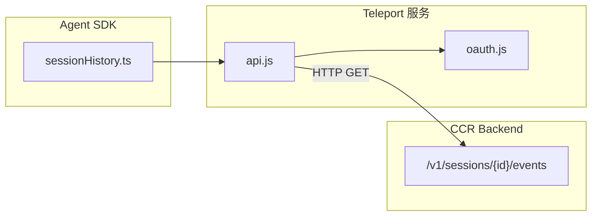
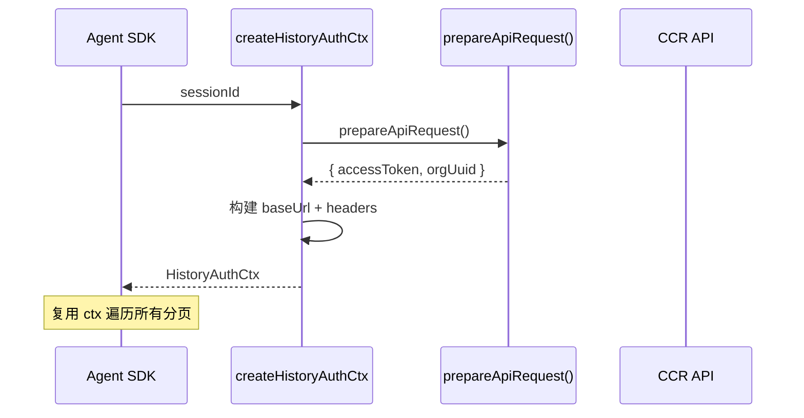

# 会话历史 (Session History)

## 概览

`assistant/sessionHistory.ts` 是 Claude Code Agent SDK 的会话历史模块，负责通过 CCR（Cloud Code Runtime）会话事件 API 获取分页的对话/事件历史。该模块是 SDK 端的消费者侧实现，调用后端 API 回放先前的对话轮次，使 Agent SDK 能够访问当前会话的完整历史上下文。

核心能力：通过光标式（CURSOR-based）分页机制，以从新到旧的顺序遍历会话事件流。

## 架构位置



## API 概览

| 函数 | 说明 | 返回类型 |
|------|------|---------|
| `createHistoryAuthCtx(sessionId)` | 准备认证上下文（OAuth token + org UUID） | `Promise<HistoryAuthCtx>` |
| `fetchLatestEvents(ctx, limit?)` | 获取最新的 N 条事件（从最新向前） | `Promise<HistoryPage \| null>` |
| `fetchOlderEvents(ctx, beforeId, limit?)` | 获取光标 `beforeId` 之前的 N 条事件 | `Promise<HistoryPage \| null>` |

## 数据类型

### `HistoryPage`

```typescript
export type HistoryPage = {
  events: SDKMessage[]      // 页内按时间正序排列
  firstId: string | null   // 最旧事件 ID → 作为 next page 的 before_id
  hasMore: boolean         // true = 还有更早的事件
}
```

### `HistoryAuthCtx`

```typescript
export type HistoryAuthCtx = {
  baseUrl: string                              // "${BASE_API_URL}/v1/sessions/${sessionId}/events"
  headers: Record<string, string>             // Authorization, anthropic-beta, x-org-uuid
}
```

### 常量

```typescript
export const HISTORY_PAGE_SIZE = 100  // 每页默认事件数量
```

## 核心流程

### 认证上下文初始化



```typescript
// 一次性准备认证上下文，所有分页请求复用
export async function createHistoryAuthCtx(sessionId: string): Promise<HistoryAuthCtx> {
  const { accessToken, orgUuid } = await prepareApiRequest()
  return {
    baseUrl: `${BASE_API_URL}/v1/sessions/${sessionId}/events`,
    headers: {
      'Authorization': `Bearer ${accessToken}`,
      'anthropic-beta': 'ccr-byoc-2025-07-29',
      'x-org-uuid': orgUuid,
    },
  }
}
```

### 分页获取

```typescript
// 获取最新事件（从最新向前 LIMIT 条）
export async function fetchLatestEvents(
  ctx: HistoryAuthCtx,
  limit = HISTORY_PAGE_SIZE,
): Promise<HistoryPage | null> {
  return fetchPage(ctx, { limit, anchor_to_latest: true })
}

// 获取光标之前的事件（用于加载更早的页）
export async function fetchOlderEvents(
  ctx: HistoryAuthCtx,
  beforeId: string,
  limit = HISTORY_PAGE_SIZE,
): Promise<HistoryPage | null> {
  return fetchPage(ctx, { limit, before_id: beforeId })
}
```

**API 请求格式：**
```typescript
// GET ${baseUrl}?limit=100&anchor_to_latest=true
// GET ${baseUrl}?limit=100&before_id=${beforeId}
```

**API 响应归一化：**
```typescript
// API 返回: { data: [...], first_id: "...", has_more: true }
// 归一化为 HistoryPage
```

## 设计决策

### 失败静默策略

任何网络或 HTTP 错误均返回 `null` 而非抛出异常：

```typescript
// validateStatus: () => true → 将所有状态码视为非错误
// 错误由调用方通过 result === null 判断
```

这种设计使调用方可以优雅处理历史不可用的场景（如网络中断），而不必在调用路径上传播异常。

### 光标式双向分页

API 仅支持下翻（向前获取更旧事件），通过 `first_id` 字段实现游标前进：

```
[最新] ──► [第2页] ──► [第3页] ──► ... ──► [最旧]
           firstId_1    firstId_2              firstId_n=null (hasMore=false)
```

不支持向后（获取更新事件）翻页，这是 CCR API 的设计约束。

### Beta Header

所有请求携带 `anthropic-beta: ccr-byoc-2025-07-29` 头，标识使用的是 CCR BYOC 版本的会话事件 API。

## 使用示例

### 完整分页遍历

```typescript
import {
  createHistoryAuthCtx,
  fetchLatestEvents,
  fetchOlderEvents,
  HISTORY_PAGE_SIZE,
} from './assistant/sessionHistory'

async function dumpFullHistory(sessionId: string): Promise<void> {
  // 1. 准备认证上下文（一次性）
  const ctx = await createHistoryAuthCtx(sessionId)

  // 2. 获取最新页
  let page = await fetchLatestEvents(ctx)
  if (!page) {
    console.log('无法获取历史记录')
    return
  }

  // 3. 追加到收集器
  const allEvents: SDKMessage[] = [...page.events]

  // 4. 循环向前翻页
  while (page.hasMore) {
    page = await fetchOlderEvents(ctx, page.firstId!)
    if (!page) break
    allEvents.push(...page.events)
  }

  console.log(`共获取 ${allEvents.length} 条事件`)
  return allEvents
}
```

### 简单获取最近 50 条

```typescript
const ctx = await createHistoryAuthCtx(sessionId)
const latest = await fetchLatestEvents(ctx, 50)
// latest.events = 最近 50 条（按时间正序）
```

## 源码引用

- [sessionHistory.ts](/src/assistant/sessionHistory.ts)

## 相关文档

- [智能体与协调](../agent/_index.md)
- [Agent 工具](../agent/agent-tool.md)
- [Fork 子智能体](../agent/fork-subagent.md)

---

*Generated by [Nium-Wiki v0.0.0](https://github.com/niuma996/nium-wiki) | 2026-04-01*
