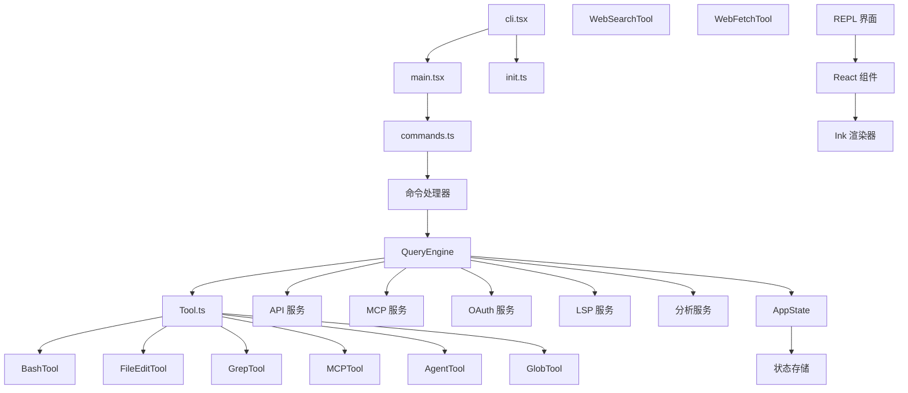
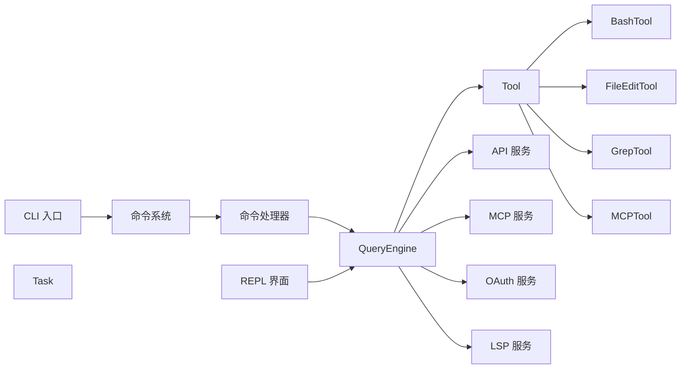
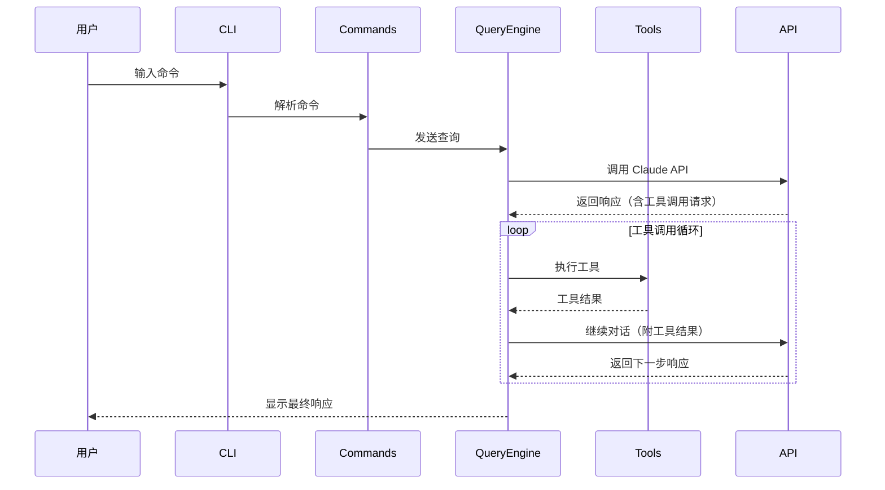
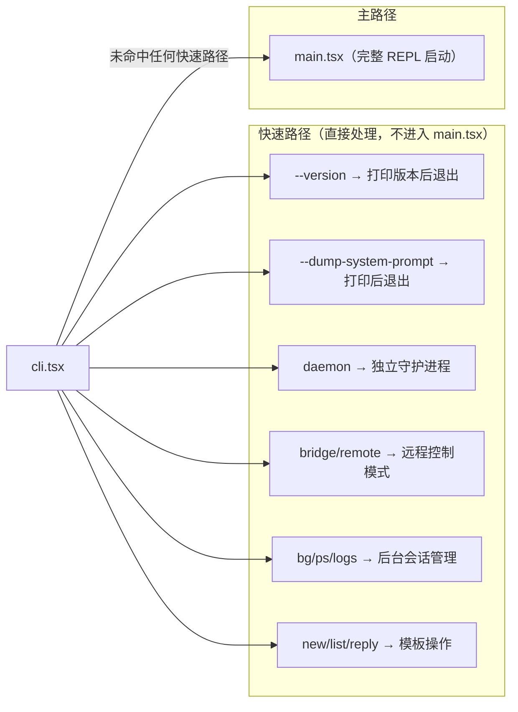

# 系统架构

## 执行摘要

Claude Code 是一个模块化的命令行工具，采用分层架构设计。整个系统分为 CLI 入口层、命令系统、核心引擎、服务层和用户界面五个主要层次。

CLI 入口层负责处理命令行参数和快速路径优化，通过动态导入策略实现零模块加载的版本检查等功能。命令系统管理 80+ 斜杠命令，采用延迟加载机制确保性能。核心引擎以 QueryEngine 为核心，协调 AI 模型调用和工具执行（Task.ts 仅为类型定义文件，非协调器）。服务层提供 API、MCP、OAuth、LSP 等基础设施服务。用户界面层使用 Ink（类 React 的终端 UI 库）渲染交互式界面。

架构设计遵循以下原则：延迟加载以优化启动性能、条件编译以支持内部构建和外部发布的差异化、功能标志驱动的特性开关。

## 系统架构图



**源码引用**
- [cli.tsx](/restored-src/src/entrypoints/cli.tsx) - CLI 快速路径
- [main.tsx](/restored-src/src/main.tsx) - 主入口

## 技术栈

| 技术 | 版本/角色 | 用途 | 选择理由 |
|------|----------|------|----------|
| TypeScript | 源码语言 | 类型安全、IDE 支持 | 提供编译时类型检查和更好的代码组织 |
| Node.js | >=18.0.0 | 运行时环境 | 跨平台支持、成熟的生态系统 |
| Ink | UI 渲染 | 终端 UI 组件 | 类 React API、零依赖、轻量级 |
| Bun | 构建工具 | 打包和开发 | 快速启动、内置 TypeScript 支持 |
| OpenTelemetry | 遥测 | 指标、日志、追踪 | 标准化遥测、供应商无关 |
| Model Context Protocol | 插件协议 | MCP 工具集成 | 标准化 AI 工具接口 |

## 模块依赖图



**图源码**
- [commands.ts](/restored-src/src/commands.ts) - 命令系统

## 详细模块描述

### CLI 入口层

CLI 入口层是应用启动的第一层，负责处理命令行参数和快速路径优化。

- **职责**: 参数解析、快速路径检测（版本检查等零导入路径）、启动性能分析、特殊标志处理
- **关键接口**: `main()` 函数，动态导入策略，`feature()` 条件编译
- **依赖**: 无（快速路径零依赖）
- **特性**: 支持 daemon、bridge mode、background sessions、templates 等多种启动模式

[Source: cli.tsx](/restored-src/src/entrypoints/cli.tsx#L1) - CLI 快速路径实现
[Source: main.tsx](/restored-src/src/main.tsx#L1) - 主入口点
[Source: init.ts](/restored-src/src/entrypoints/init.ts#L1) - 初始化逻辑

**快速路径示例**
- `--version` 检查: [cli.tsx 快速路径处理](/restored-src/src/entrypoints/cli.tsx)
- daemon 模式: [cli.tsx daemon 支持](/restored-src/src/entrypoints/cli.tsx)
- bridge mode: [cli.tsx bridge 模式](/restored-src/src/entrypoints/cli.tsx)

### 命令系统

命令系统管理所有可用的斜杠命令，包括内置命令、插件命令和技能。

- **职责**: 命令注册、命令查找、命令可用性检查、动态命令加载
- **关键接口**: `getCommands()`, `findCommand()`, `Command` 类型
- **依赖**: 核心引擎、服务层
- **命令示例**: /help, /commit, /review, /config, /plan, /memory 等 80+ 命令

[Source: commands.ts](/restored-src/src/commands.ts#L1) - 命令系统核心实现
[Source: commands/](/restored-src/src/commands/) - 命令实现目录

**命令实现示例**
- [/help 命令](/restored-src/src/commands/help/) - 帮助系统
- [/config 命令](/restored-src/src/commands/config/) - 配置管理
- [/commit 命令](/restored-src/src/commands/commit/) - 提交功能
- [/review 命令](/restored-src/src/commands/review/) - 代码审查
- [/plan 命令](/restored-src/src/commands/plan/) - 计划功能
- [/memory 命令](/restored-src/src/commands/memory/) - 记忆管理

### 核心引擎

核心引擎协调 AI 模型调用、任务管理和工具执行。

- **职责**: QueryEngine 处理查询流程（含 API 调用、工具执行、权限检查）、Task 定义任务类型与状态、Tool 执行具体操作
- **关键接口**: `QueryEngine.submitMessage()`, 工具的 `call()` 方法
- **依赖**: 命令系统、服务层

**QueryEngine** ([1177 行](/restored-src/src/QueryEngine.ts)) - 查询引擎的核心实现，管理整个查询生命周期和会话状态。每个 `submitMessage()` 调用启动一个新的对话轮次，状态（消息、文件缓存、使用量等）在轮次间持久化。
- [类定义 L184](/restored-src/src/QueryEngine.ts#L184)
- [submitMessage 方法 L209](/restored-src/src/QueryEngine.ts#L209)
- [配置类型 L130-L173](/restored-src/src/QueryEngine.ts#L130-L173)

**Task** ([125 行](/restored-src/src/Task.ts)) - 任务类型定义和状态管理，支持多种任务类型：local_bash、local_agent、remote_agent、in_process_teammate、local_workflow、monitor_mcp、dream。
- [TaskType 定义 L6-L13](/restored-src/src/Task.ts#L6-L13)
- [TaskStatus 定义 L15-L20](/restored-src/src/Task.ts#L15-L20)
- [generateTaskId 函数 L98](/restored-src/src/Task.ts#L98)

**Tool** ([792 行](/restored-src/src/Tool.ts)) - 工具的抽象基类，定义了工具的接口规范，包括 `call()`、`description()`、`prompt()` 等方法。
- [Tool 基类定义](/restored-src/src/Tool.ts)
- [工具注册表](/restored-src/src/Tool.ts)

[Source: QueryEngine.ts](/restored-src/src/QueryEngine.ts#L184) - 查询引擎核心
[Source: Task.ts](/restored-src/src/Task.ts#L1) - 任务系统
[Source: Tool.ts](/restored-src/src/Tool.ts#L1) - 工具基类

### 工具系统

工具系统为 AI 代理提供执行能力，包括文件系统操作、终端命令、搜索等。

- **职责**: 工具注册、工具执行、工具结果处理
- **关键工具**:
  - BashTool: 执行 shell 命令
  - FileEditTool: 编辑文件
  - GrepTool: 代码搜索
  - GlobTool: 文件模式匹配
  - MCPTool: MCP 协议工具
  - AgentTool: 子代理创建
  - WebSearchTool: 网络搜索
  - WebFetchTool: 网页抓取

[Source: tools/BashTool/](/restored-src/src/tools/BashTool/) - Bash 执行工具
[Source: tools/FileEditTool/](/restored-src/src/tools/FileEditTool/) - 文件编辑工具
[Source: tools/GrepTool/](/restored-src/src/tools/GrepTool/) - 代码搜索工具
[Source: tools/GlobTool/](/restored-src/src/tools/GlobTool/) - 文件模式匹配工具
[Source: tools/MCPTool/](/restored-src/src/tools/MCPTool/) - MCP 协议工具
[Source: tools/AgentTool/](/restored-src/src/tools/AgentTool/) - 子代理创建工具

**工具注册**
- [Tool 基类](/restored-src/src/Tool.ts)
- [tools.ts 工具注册](/restored-src/src/tools.ts)

### 服务层

服务层提供基础设施功能，包括 API 通信、MCP 协议、OAuth 认证等。

- **职责**: API 调用封装、MCP 客户端管理、OAuth 流程处理、LSP 支持、分析服务
- **关键接口**: `claude.ts` API 客户端、`client.ts` MCP 客户端
- **依赖**: 状态管理

**API 服务**
- [claude.ts](/restored-src/src/services/api/claude.ts) - API 调用封装
- [client.ts](/restored-src/src/services/api/client.ts) - API 客户端
- [errors.ts](/restored-src/src/services/api/errors.ts) - 错误处理

**MCP 服务**
- [client.ts](/restored-src/src/services/mcp/client.ts) - MCP 客户端
- [auth.ts](/restored-src/src/services/mcp/auth.ts) - MCP 认证
- [config.ts](/restored-src/src/services/mcp/config.ts) - MCP 配置

**OAuth 服务**
- [client.ts](/restored-src/src/services/oauth/client.ts) - OAuth 客户端
- [crypto.ts](/restored-src/src/services/oauth/crypto.ts) - 加密工具

**其他服务**
- [LSP 服务](/restored-src/src/services/lsp/) - 语言服务器协议支持
- [分析服务](/restored-src/src/services/analytics/) - 使用量分析
- [Voice 服务](/restored-src/src/services/voice.ts) - 语音服务

[Source: services/api/claude.ts](/restored-src/src/services/api/claude.ts) - API 服务
[Source: services/mcp/client.ts](/restored-src/src/services/mcp/client.ts) - MCP 客户端

### 用户界面层

用户界面层使用 Ink 渲染交互式终端 UI。

- **职责**: REPL 界面渲染、组件化 UI、用户输入处理
- **关键接口**: `REPL` 组件、Ink 组件库
- **依赖**: 核心引擎、状态管理

**REPL 界面**
- [screens/REPL.tsx](/restored-src/src/screens/REPL.tsx) - REPL 主组件
- [screens/Doctor.tsx](/restored-src/src/screens/Doctor.tsx) - Doctor 检查界面

**Ink 渲染引擎**
- [ink/](/restored-src/src/ink/) - Ink 核心库
- [ink/renderer.ts](/restored-src/src/ink/renderer.ts) - 渲染器
- [ink/components/](/restored-src/src/ink/components/) - Ink 组件

**React 组件**
- [components/](/restored-src/src/components/) - React 组件库
- [components/Message.tsx](/restored-src/src/components/Message.tsx) - 消息组件
- [components/Messages.tsx](/restored-src/src/components/Messages.tsx) - 消息列表

**状态管理**
- [state/AppState.tsx](/restored-src/src/state/AppState.tsx) - 应用状态
- [state/store.ts](/restored-src/src/state/store.ts) - 状态存储

[Source: screens/REPL.tsx](/restored-src/src/screens/REPL.tsx) - REPL 界面
[Source: ink/](/restored-src/src/ink/) - Ink 渲染引擎

## 数据流图



## 目录结构

```
restored-src/src/
├── main.tsx                    # CLI 主入口
├── QueryEngine.ts              # 查询引擎（1177 行）
├── Task.ts                     # 任务管理（125 行）
├── Tool.ts                     # 工具基类（792 行）
├── commands.ts                 # 命令注册
├── query.ts                    # 查询循环
│
├── entrypoints/                # 入口点
│   ├── cli.tsx               # CLI 快速路径
│   ├── init.ts               # 初始化逻辑
│   └── mcp.ts                # MCP 入口
│
├── commands/                   # 命令实现（80+ 个命令）
│   ├── help/                 # /help 命令
│   ├── config/               # /config 命令
│   ├── commit/               # /commit 命令
│   ├── review/               # /review 命令
│   ├── plan/                 # /plan 命令
│   ├── memory/               # /memory 命令
│   └── ...
│
├── tools/                      # 工具实现
│   ├── BashTool/             # Bash 执行工具
│   ├── FileEditTool/         # 文件编辑工具
│   ├── GrepTool/             # 搜索工具
│   ├── GlobTool/             # 文件匹配工具
│   ├── MCPTool/              # MCP 工具
│   ├── AgentTool/            # 子代理工具
│   ├── WebSearchTool/        # 网络搜索工具
│   ├── WebFetchTool/         # 网页抓取工具
│   └── ...
│
├── services/                   # 服务层
│   ├── api/                  # API 服务
│   ├── mcp/                  # MCP 客户端
│   ├── oauth/                # OAuth 认证
│   ├── lsp/                  # LSP 支持
│   ├── analytics/            # 分析服务
│   └── ...
│
├── components/                 # React 组件
├── hooks/                     # React Hooks
├── context/                   # React Context
├── state/                     # 状态管理
├── constants/                 # 常量定义
├── types/                     # 类型定义
├── utils/                     # 工具函数
├── query/                     # 查询配置
├── memdir/                    # 内存目录
├── screens/                   # 屏幕组件
├── bridge/                    # 桥接模式
├── ink/                       # Ink 渲染引擎
└── ...
```

## 设计模式与原则

| 模式/原则 | 应用场景 | 理由 |
|-----------|---------|------|
| 延迟加载 | 快速路径、特性模块 | 优化启动性能，减少不必要的模块加载 |
| 条件编译 | 内部/外部构建差异 | 通过 `feature()` 函数实现构建时特性开关 |
| 命令模式 | 斜杠命令系统 | 统一命令接口，支持动态注册和扩展 |
| 观察者模式 | 状态变更通知 | React Context 和事件系统的基础 |
| 工厂模式 | 工具创建 | 统一工具实例化逻辑 |
| 单例模式 | 全局配置、状态存储 | 确保全局唯一实例 |
| 策略模式 | 工具执行策略 | 允许运行时选择不同的执行策略 |
| 装饰器模式 | Hook 系统 | 为组件和函数添加可组合的行为 |

## 快速路径优化

Claude Code 使用多种快速路径优化启动性能：



## 相关文档

- [主页](index.md)
- [快速开始](getting-started.md)
- [文档地图](doc-map.md)
- [核心模块](core/_index.md)
- [查询引擎](core/query.md)

---

*Generated by [Nium-Wiki v0.0.0](https://github.com/niuma996/nium-wiki) | 2026-05-15*
