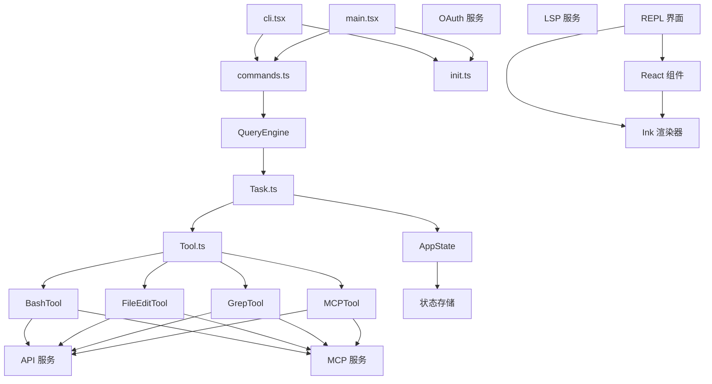
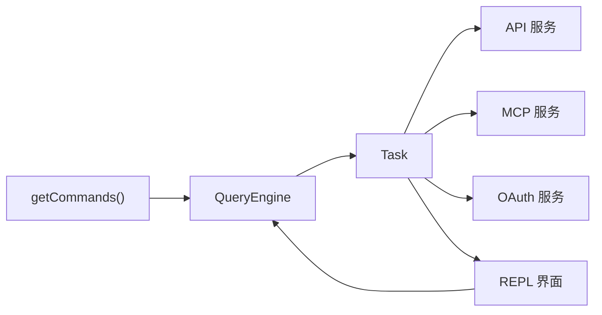
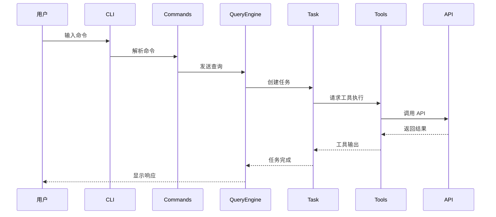

# 系统架构

## 执行摘要

Claude Code 是一个模块化的命令行工具，采用分层架构设计。整个系统分为 CLI 入口层、命令系统、核心引擎、服务层和用户界面五个主要层次。

CLI 入口层负责处理命令行参数和快速路径优化，通过动态导入策略实现零模块加载的版本检查等功能。命令系统管理 80+ 斜杠命令，采用延迟加载机制确保性能。核心引擎包括 QueryEngine 和 Task 系统，协调 AI 模型调用和工具执行。服务层提供 API、MCP、OAuth 等基础设施服务。用户界面层使用 Ink（类 React 的终端 UI 库）渲染交互式界面。

架构设计遵循以下原则：延迟加载以优化启动性能、条件编译以支持内部构建和外部发布的差异化、功能标志驱动的特性开关。

## 系统架构图



**源码引用**
- [cli.tsx](/restored-src/src/entrypoints/cli.tsx)
- [main.tsx](/restored-src/src/main.tsx)

## 技术栈

| 技术 | 版本/角色 | 用途 | 选择理由 |
|------|----------|------|----------|
| TypeScript | 源码语言 | 类型安全、IDE 支持 | 提供编译时类型检查和更好的代码组织 |
| Node.js | >=18.0.0 | 运行时环境 | 跨平台支持、成熟的生态系统 |
| Ink | UI 渲染 | 终端 UI 组件 | 类 React API、零依赖、轻量级 |
| Bun | 构建工具 | 打包和开发 | 快速启动、内置 TypeScript 支持 |
| OpenTelemetry | 遥测 | 指标、日志、追踪 | 标准化遥测、供应商无关 |
| Model Context Protocol | 插件协议 | MCP 工具集成 | 标准化 AI 工具接口 |

## 模块依赖图



**图源码**
- [commands.ts](/restored-src/src/commands.ts)

## 详细模块描述

### CLI 入口层

CLI 入口层是应用启动的第一层，负责处理命令行参数和快速路径优化。

- **职责**: 参数解析、快速路径检测（版本检查等零导入路径）、启动性能分析
- **关键接口**: `main()` 函数，动态导入策略
- **依赖**: 无（快速路径零依赖）

### 命令系统

命令系统管理所有可用的斜杠命令，包括内置命令、插件命令和技能。

- **职责**: 命令注册、命令查找、命令可用性检查、动态命令加载
- **关键接口**: `getCommands()`, `findCommand()`, `Command` 类型
- **依赖**: 核心引擎、服务层

### 核心引擎

核心引擎协调 AI 模型调用、任务管理和工具执行。

- **职责**: QueryEngine 处理查询流程、Task 管理任务状态、Tool 执行具体操作
- **关键接口**: `QueryEngine.query()`, `Task.run()`, 工具的 `call()` 方法
- **依赖**: 命令系统、服务层

### 服务层

服务层提供基础设施功能，包括 API 通信、MCP 协议、OAuth 认证等。

- **职责**: API 调用封装、MCP 客户端管理、OAuth 流程处理、LSP 支持
- **关键接口**: `claude.ts` API 客户端、`client.ts` MCP 客户端
- **依赖**: 状态管理

### 用户界面层

用户界面层使用 Ink 渲染交互式终端 UI。

- **职责**: REPL 界面渲染、组件化 UI、用户输入处理
- **关键接口**: `REPL` 组件、Ink 组件库
- **依赖**: 核心引擎、状态管理

## 数据流图



## 目录结构

```
restored-src/
├── src/
│   ├── main.tsx              # CLI 主入口
│   ├── entrypoints/          # 入口点（CLI、Init、MCP）
│   │   ├── cli.tsx          # CLI 快速路径
│   │   ├── init.ts          # 初始化逻辑
│   │   └── mcp.ts           # MCP 入口
│   ├── commands/             # 命令实现（80+ 个命令）
│   │   ├── help/            # /help 命令
│   │   ├── config/          # /config 命令
│   │   ├── commit/          # /commit 命令
│   │   ├── review/          # /review 命令
│   │   └── ...
│   ├── tools/                # 工具实现
│   │   ├── BashTool/        # Bash 执行工具
│   │   ├── FileEditTool/    # 文件编辑工具
│   │   ├── GrepTool/        # 搜索工具
│   │   ├── MCPTool/         # MCP 工具
│   │   └── ...
│   ├── services/             # 服务层
│   │   ├── api/             # API 服务
│   │   ├── mcp/             # MCP 客户端
│   │   ├── oauth/           # OAuth 认证
│   │   ├── lsp/             # LSP 支持
│   │   └── ...
│   ├── components/           # React 组件
│   ├── ink/                 # Ink 渲染引擎
│   ├── hooks/               # React Hooks
│   ├── context/             # React Context
│   ├── state/               # 状态管理
│   ├── constants/           # 常量定义
│   ├── types/               # 类型定义
│   ├── utils/               # 工具函数
│   └── query/               # 查询引擎
```

## 设计模式与原则

| 模式/原则 | 应用场景 | 理由 |
|-----------|---------|------|
| 延迟加载 | 快速路径、特性模块 | 优化启动性能，减少不必要的模块加载 |
| 条件编译 | 内部/外部构建差异 | 通过 `feature()` 函数实现构建时特性开关 |
| 命令模式 | 斜杠命令系统 | 统一命令接口，支持动态注册和扩展 |
| 观察者模式 | 状态变更通知 | React Context 和事件系统的基础 |
| 工厂模式 | 工具创建 | 统一工具实例化逻辑 |
| 单例模式 | 全局配置、状态存储 | 确保全局唯一实例 |

## 相关文档

- [主页](index.md)
- [快速开始](getting-started.md)
- [文档地图](doc-map.md)

---

*Generated by [Nium-Wiki v0.0.0](https://github.com/niuma996/nium-wiki) | 2026-03-31*
