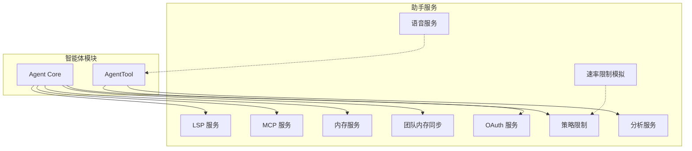
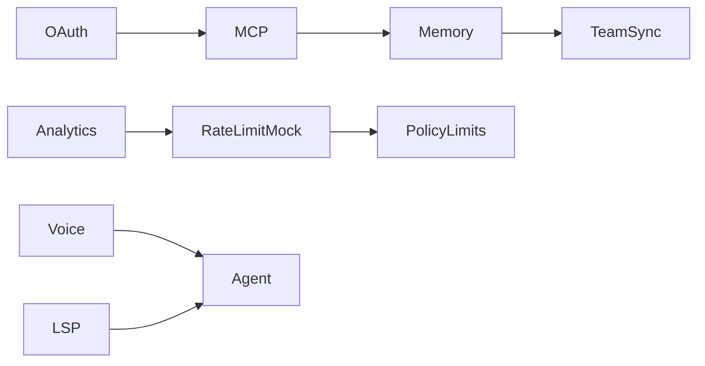
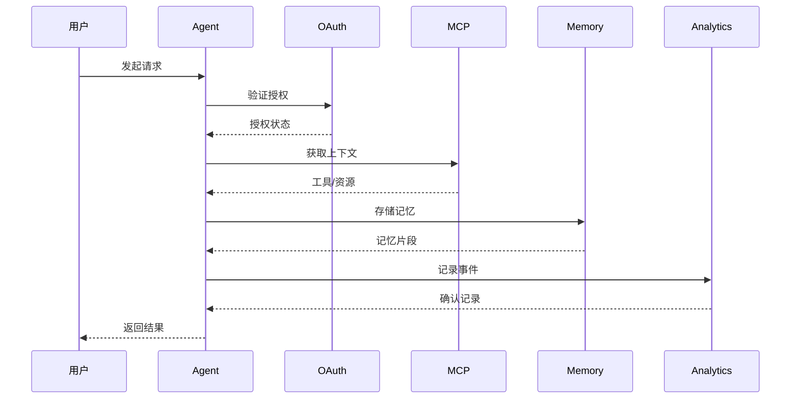

# 助手服务

## 概览

助手服务模块是 Claude Code 的核心辅助能力集合，提供与外部系统集成、数据处理、权限控制等关键功能。该模块包含多个独立服务，协同工作以支持智能体的完整生命周期和用户交互体验。

## 子模块

| 模块 | 说明 | 文档 |
|------|------|------|
| [LSP 服务](lsp.md) | Language Server Protocol 语言服务器协议集成 | [lsp.md](lsp.md) |
| [MCP 服务](mcp.md) | Model Context Protocol 模型上下文协议客户端 | [mcp.md](mcp.md) |
| [OAuth 服务](oauth.md) | OAuth 2.0 认证授权管理 | [oauth.md](oauth.md) |
| [分析服务](analytics.md) | 使用分析和遥测数据收集 | [analytics.md](analytics.md) |
| [内存服务](memory.md) | 持久化记忆存储与管理 | [memory.md](memory.md) |
| [团队内存同步](team-memory-sync.md) | 多用户团队记忆同步 | [team-memory-sync.md](team-memory-sync.md) |
| [语音服务](voice.md) | 语音录制与麦克风访问 | [voice.md](voice.md) |
| [策略限制](policy-limits.md) | 使用策略与速率限制管理 | [policy-limits.md](policy-limits.md) |
| [速率限制模拟](rate-limit-mocking.md) | 测试用速率限制模拟 | [rate-limit-mocking.md](rate-limit-mocking.md) |

## 架构位置

## 核心概念

### 服务依赖关系

### 数据流概览

## 关键设计决策

### 1. 服务隔离架构

每个服务模块独立运行，通过明确定义的接口进行通信。这种设计允许：
- 按需加载/卸载服务
- 独立测试和调试
- 灵活的扩展和定制

### 2. 认证与授权分离

OAuth 服务专门处理第三方认证，而策略限制由 policyLimits 独立管理，实现关注点分离。

### 3. 内存分层存储

- **会话内存**：当前对话上下文
- **持久内存**：长期记忆存储
- **团队内存**：跨用户共享知识

## 源码引用

- [services/lsp/](/restored-src/src/services/lsp/)
- [services/mcp/](/restored-src/src/services/mcp/)
- [services/oauth/](/restored-src/src/services/oauth/)
- [services/analytics/](/restored-src/src/services/analytics/)
- [memdir/](/restored-src/src/memdir/)
- [services/teamMemorySync/](/restored-src/src/services/teamMemorySync/)
- [services/voice.ts](/restored-src/src/services/voice.ts)
- [services/policyLimits/](/restored-src/src/services/policyLimits/)
- [services/rateLimitMocking.ts](/restored-src/src/services/rateLimitMocking.ts)

## 相关文档

- [智能体与协调](../agent/_index.md)
- [架构总览](../architecture.md)
- [主页](../index.md)

---

*Generated by [Nium-Wiki v0.0.0](https://github.com/niuma996/nium-wiki) | 2026-04-02*
