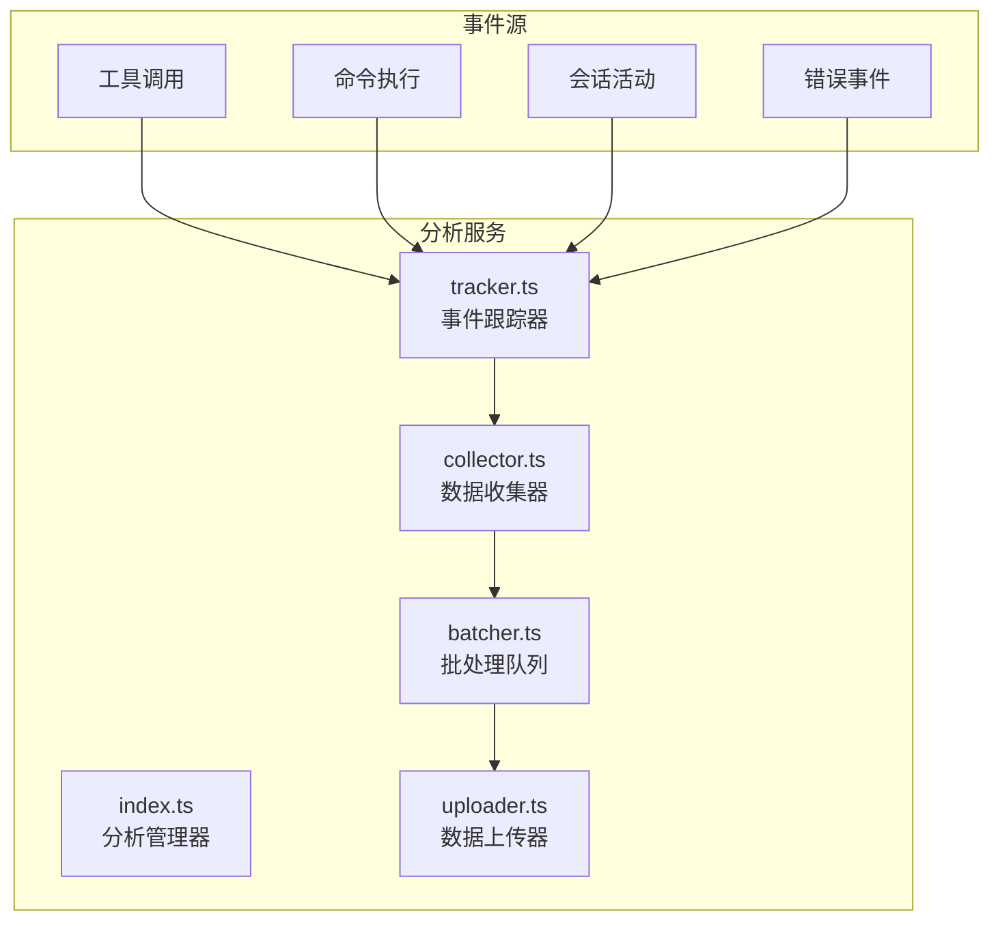
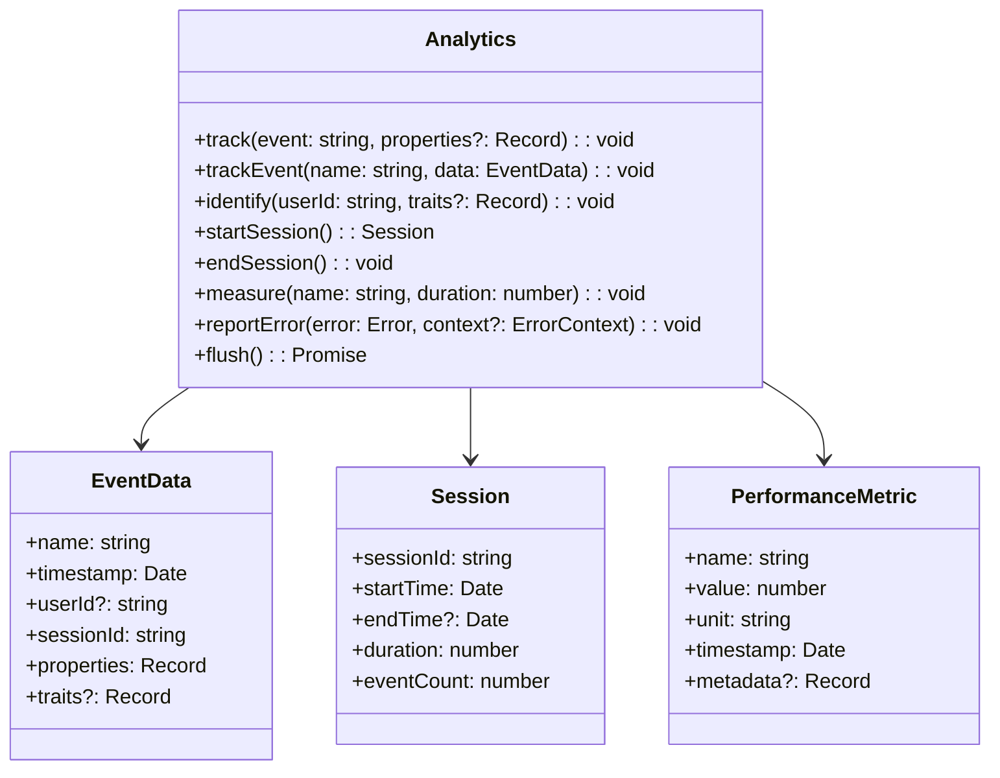
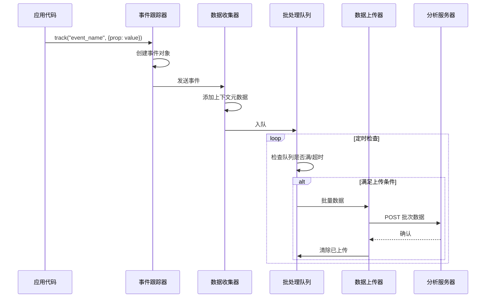
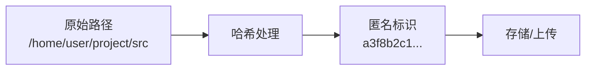

# 分析服务

## 概览

分析服务（Analytics）是 Claude Code 的使用分析和遥测数据收集模块。该服务负责收集、聚合和上报匿名使用数据，帮助团队了解用户行为模式、产品使用情况，并据此优化产品体验。

分析服务严格遵循隐私保护原则：
- 仅收集匿名化数据，不包含个人身份信息
- 用户可选择退出数据收集
- 所有数据加密传输
- 符合 GDPR、CCPA 等隐私法规要求

## 架构位置



## 核心功能

| 功能 | 说明 | 相关 API |
|------|------|---------|
| 事件跟踪 | 记录用户操作和系统事件 | `track`, `trackEvent` |
| 会话分析 | 跟踪会话生命周期和活动 | `startSession`, `endSession` |
| 性能监控 | 收集性能指标和基准数据 | `measure`, `mark` |
| 错误报告 | 收集和处理错误遥测 | `reportError`, `reportException` |
| 批量上传 | 高效批量上传遥测数据 | `flush`, `upload` |

## 文件结构

```
services/analytics/
├── index.ts           # 分析服务入口
├── tracker.ts         # 事件跟踪核心
├── collector.ts       # 数据收集器
├── batcher.ts         # 批处理队列
└── uploader.ts        # 数据上传器
```

### 职责说明

| 文件 | 职责 |
|------|------|
| index.ts | 提供统一的分析接口，管理跟踪器生命周期 |
| tracker.ts | 定义事件类型，注册事件处理器 |
| collector.ts | 收集原始事件数据，进行初步处理 |
| batcher.ts | 缓存事件批次，控制上传频率 |
| uploader.ts | 管理数据上传，处理重试和错误恢复 |

## 核心类型



## 数据流



## API 摘要

### Analytics

| 方法 | 说明 | 参数 |
|------|------|------|
| `track` | 跟踪通用事件 | `event`, `properties?` |
| `trackEvent` | 跟踪带详细数据的事件 | `name`, `data` |
| `identify` | 设置用户标识和属性 | `userId`, `traits?` |
| `startSession` | 开始新会话 | - |
| `endSession` | 结束当前会话 | - |
| `measure` | 记录性能指标 | `name`, `duration` |
| `mark` | 记录性能标记点 | `name`, `timestamp?` |
| `reportError` | 报告错误 | `error`, `context?` |
| `flush` | 立即上传待处理数据 | - |

### 预定义事件类型

```typescript
enum AnalyticsEvent {
  // 会话事件
  SESSION_START = 'session_start',
  SESSION_END = 'session_end',
  SESSION_RESUME = 'session_resume',

  // 工具事件
  TOOL_INVOKED = 'tool_invoked',
  TOOL_COMPLETED = 'tool_completed',
  TOOL_FAILED = 'tool_failed',

  // 命令事件
  COMMAND_EXECUTED = 'command_executed',
  COMMAND_COMPLETED = 'command_completed',
  COMMAND_FAILED = 'command_failed',

  // Agent 事件
  AGENT_STARTED = 'agent_started',
  AGENT_COMPLETED = 'agent_completed',
  AGENT_FAILED = 'agent_failed',

  // 错误事件
  ERROR_OCCURRED = 'error_occurred',
  EXCEPTION_THROWN = 'exception_thrown'
}
```

### EventData

```typescript
interface EventData {
  name: string                           // 事件名称
  timestamp: Date                        // 事件时间戳
  userId?: string                        // 用户标识（匿名ID）
  sessionId: string                      // 会话标识
  properties: Record<string, any>       // 事件属性
  traits?: Record<string, any>           // 用户属性
  context?: EventContext                // 上下文信息
}

interface EventContext {
  platform: string                       // 平台（darwin、linux、win32）
  version: string                        // 应用版本
  locale: string                         // 地区设置
  environment: 'development' | 'production'
}
```

## 使用示例

### 基本事件跟踪

```typescript
import { analytics } from './services/analytics/index'

// 跟踪工具调用
analytics.track('tool_invoked', {
  tool_name: 'Read',
  file_path: '/path/to/file.ts',
  success: true
})

// 跟踪命令执行
analytics.trackEvent('command_executed', {
  name: 'command_executed',
  properties: {
    command: 'npm install',
    exit_code: 0,
    duration_ms: 5000
  }
})
```

### 性能测量

```typescript
// 开始测量
analytics.mark('operation_start')

// 执行操作
await performOperation()

// 结束测量并记录
analytics.measure('operation_duration', Date.now() - startTime)
```

### 错误报告

```typescript
try {
  await riskyOperation()
} catch (error) {
  analytics.reportError(error, {
    operation: 'riskyOperation',
    context: {
      file: '/path/to/file.ts',
      line: 42
    }
  })
}
```

### 会话管理

```typescript
// 应用启动时
const session = analytics.startSession()

// 应用退出时
analytics.endSession()

// 手动刷新数据
await analytics.flush()
```

## 收集的数据类型

| 类别 | 数据类型 | 说明 |
|------|---------|------|
| 会话信息 | 会话ID、开始/结束时间、持续时长 | 了解用户使用时长 |
| 工具使用 | 工具名称、调用频率、成功率 | 优化常用功能 |
| 命令执行 | 命令类型、参数、执行结果 | 理解用户工作流 |
| 性能指标 | 响应时间、加载时间、操作延迟 | 性能优化依据 |
| 错误报告 | 错误类型、堆栈跟踪、环境信息 | 问题诊断 |
| 匿名ID | 随机生成的设备标识符 | 用户行为关联（不含PII） |

## 隐私保护措施

### 不收集的数据

- 用户名、邮箱、手机号等个人信息
- 文件内容、代码内容
- API 密钥、令牌、密码
- 项目名称、仓库路径（除非匿名化处理）

### 匿名化处理



### 数据安全

| 措施 | 说明 |
|------|------|
| 传输加密 | 所有数据使用 HTTPS/TLS 1.3 传输 |
| 存储加密 | 服务器端数据加密存储 |
| 访问控制 | 严格的数据访问权限管理 |
| 数据保留 | 按法规要求设置保留期限 |

## 最佳实践

### 推荐模式

| 场景 | 推荐做法 |
|------|---------|
| 事件命名 | 使用点分隔的命名：`feature.action` |
| 属性值 | 使用预定义的枚举值，便于聚合 |
| 批量操作 | 使用 `trackEvent` 批量记录相似事件 |
| 错误处理 | 异步跟踪不阻塞主业务流程 |

### 避免事项

| 做法 | 问题 |
|------|------|
| 跟踪敏感信息 | 违反隐私政策 |
| 同步阻塞上传 | 影响应用性能 |
| 过度跟踪 | 数据噪音，分析困难 |

## 设计决策

### 1. 批处理上传

为减少网络请求，事件先缓存到本地，达到阈值后再批量上传。

### 2. 离线支持

网络不可用时，事件本地缓存，恢复连接后自动上传。

### 3. 采样机制

高流量场景下，对部分事件类型进行采样，减少数据量。

## 源码引用

- [services/analytics/index.ts](/restored-src/src/services/analytics/index.ts)
- [services/analytics/tracker.ts](/restored-src/src/services/analytics/tracker.ts)
- [services/analytics/collector.ts](/restored-src/src/services/analytics/collector.ts)
- [services/analytics/batcher.ts](/restored-src/src/services/analytics/batcher.ts)
- [services/analytics/uploader.ts](/restored-src/src/services/analytics/uploader.ts)

## 相关文档

- [助手服务索引](_index.md)
- [Agent 工具](../agent/agent-tool.md) - 工具调用
- [速率限制模拟](rate-limit-mocking.md) - 内部测试工具
- [主页](../index.md)

---

*Generated by [Nium-Wiki v0.0.0](https://github.com/niuma996/nium-wiki) | 2026-04-02*
