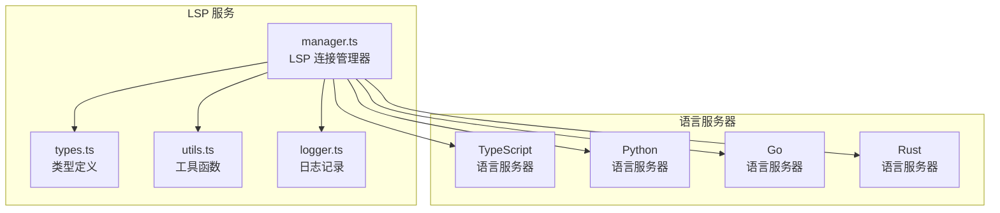
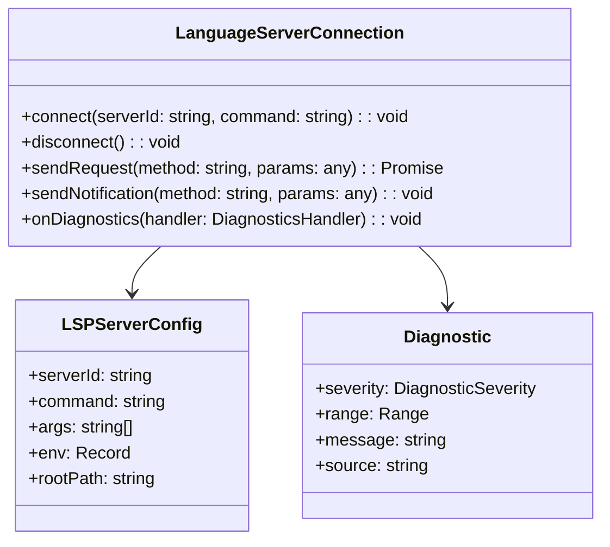
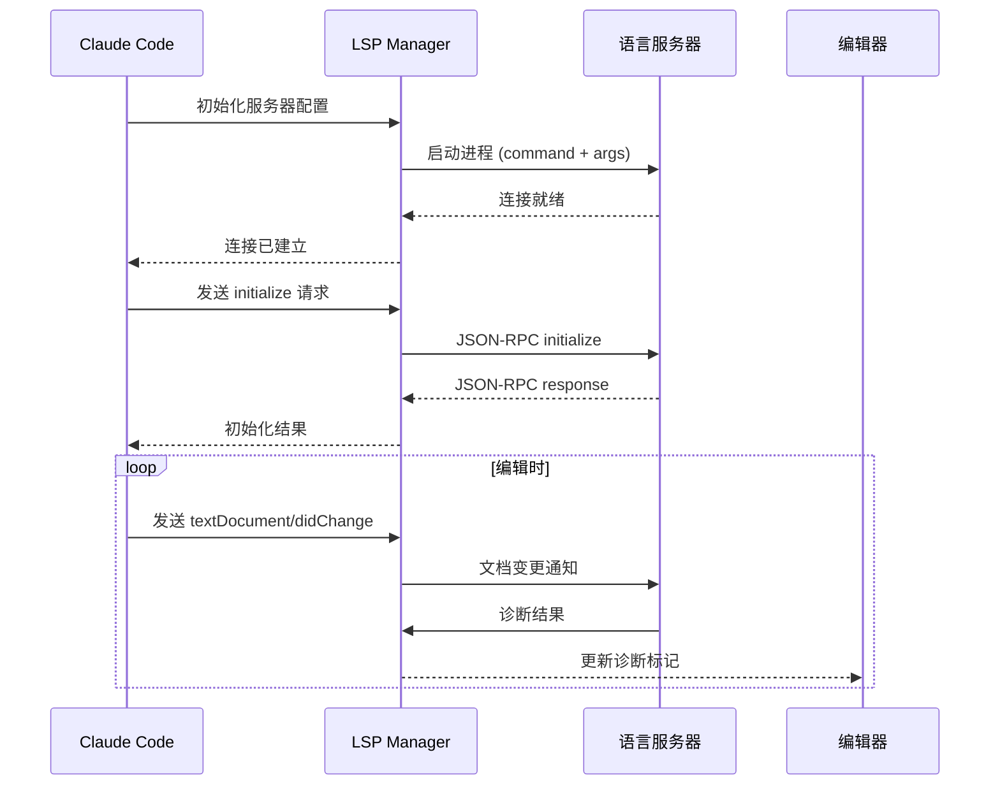

# LSP 服务

## 概览

LSP（Language Server Protocol）服务是 Claude Code 与外部 Language Server 通信的核心模块。LSP 是一种 JSON-RPC 协议，用于在编辑器/IDE 和语言服务器之间提供语言智能功能，如代码补全、跳转到定义、查找引用、悬停文档等。

该服务通过标准化的协议接口，使 Claude Code 能够与任何遵循 LSP 规范的语言服务器集成，从而提供多语言支持。

## 架构位置



## 核心功能

| 功能 | 说明 | 相关 API |
|------|------|---------|
| 连接管理 | 与语言服务器建立和维护连接 | `LanguageServerConnection` |
| 请求处理 | 发送和接收 LSP 请求/响应 | `sendRequest`, `sendNotification` |
| 诊断集成 | 接收并处理代码诊断信息 | `onDiagnostics` |
| 进度报告 | 支持长时间操作的进度通知 | `onProgress` |
| 工作区符号 | 搜索工作区中的符号 | `workspaceSymbol` |

## 文件结构

```
services/lsp/
├── manager.ts      # LSP 连接管理器核心实现
├── types.ts        # LSP 协议类型定义
├── utils.ts        # 辅助工具函数
└── logger.ts       # 日志记录器
```

### 职责说明

| 文件 | 职责 |
|------|------|
| manager.ts | 管理语言服务器的生命周期，处理连接、请求、响应和诊断 |
| types.ts | 定义 LSP 协议中的所有类型，包括请求参数、响应结果、通知载荷 |
| utils.ts | 提供连接工厂、配置解析、错误处理等辅助功能 |
| logger.ts | 统一管理 LSP 相关的日志输出，便于调试和问题排查 |

## 核心类型



## 工作流程



## API 摘要

### LanguageServerConnection

| 方法 | 说明 | 参数 |
|------|------|------|
| `connect` | 建立与语言服务器的连接 | `serverId`, `command`, `args` |
| `disconnect` | 断开连接并清理资源 | - |
| `sendRequest` | 发送双向请求并等待响应 | `method`, `params` |
| `sendNotification` | 发送单向通知 | `method`, `params` |
| `onDiagnostics` | 注册诊断处理器 | `handler` |

### 配置选项

```typescript
interface LSPServerConfig {
  serverId: string      // 服务器唯一标识符
  command: string      // 启动命令路径
  args?: string[]      // 命令行参数
  env?: Record<string, string>  // 环境变量
  rootPath?: string    // 工作区根路径
}
```

## 使用示例

### 基本连接

```typescript
import { LanguageServerConnection } from './services/lsp/manager'

const connection = new LanguageServerConnection()

// 连接到 TypeScript 语言服务器
await connection.connect('typescript', 'typescript-language-server', [
  '--stdio'
])

// 发送初始化请求
const result = await connection.sendRequest('initialize', {
  processId: process.pid,
  rootUri: 'file:///path/to/project',
  capabilities: {}
})

// 发送 initialized 通知
connection.sendNotification('initialized', {})
```

### 诊断处理

```typescript
// 注册诊断处理器
connection.onDiagnostics((params: PublishDiagnosticsParams) => {
  const { uri, diagnostics } = params
  console.log(`Diagnostics for ${uri}:`, diagnostics)
})
```

### 符号搜索

```typescript
// 搜索工作区符号
const symbols = await connection.sendRequest('workspace/symbol', {
  query: 'searchTerm'
})

symbols.forEach(symbol => {
  console.log(`${symbol.name} at ${symbol.location.uri}`)
})
```

## 最佳实践

### 推荐模式

| 场景 | 推荐做法 |
|------|---------|
| 服务器启动 | 使用 `lazyConnect` 延迟连接，避免启动时阻塞 |
| 错误处理 | 实现重连逻辑，服务器崩溃时自动重启 |
| 资源清理 | 显式调用 `disconnect()` 释放进程资源 |
| 日志记录 | 启用详细日志便于调试 LSP 通信问题 |

### 避免事项

| 做法 | 问题 | 替代方案 |
|------|------|---------|
| 同步等待长时间操作 | 阻塞事件循环 | 使用进度报告 API |
| 未处理服务器崩溃 | 连接泄漏 | 实现 `onServerExit` 回调 |
| 频繁重新连接 | 性能开销 | 维护长连接复用 |

## 设计决策

### 1. 标准协议优先

采用官方的 LSP 规范而非自定义协议，确保与现有生态系统（如 VS Code 扩展）兼容。

### 2. 连接池管理

支持多语言服务器并发运行，通过唯一 `serverId` 区分不同服务器实例。

### 3. 诊断流式处理

使用流式方式接收诊断更新，支持实时显示代码问题而不等待完整分析。

## 源码引用

- [services/lsp/manager.ts](/restored-src/src/services/lsp/manager.ts)
- [services/lsp/types.ts](/restored-src/src/services/lsp/types.ts)
- [services/lsp/utils.ts](/restored-src/src/services/lsp/utils.ts)
- [services/lsp/logger.ts](/restored-src/src/services/lsp/logger.ts)

## 相关文档

- [助手服务索引](_index.md)
- [MCP 服务](mcp.md) - 另一个协议集成模块
- [主页](../index.md)

---

*Generated by [Nium-Wiki v0.0.0](https://github.com/niuma996/nium-wiki) | 2026-04-02*
