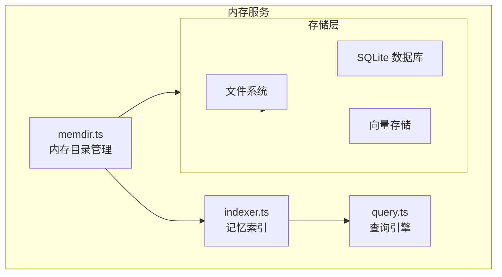
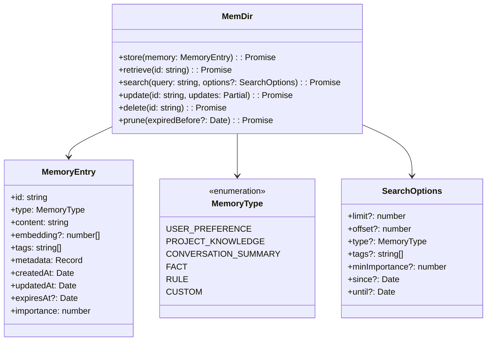
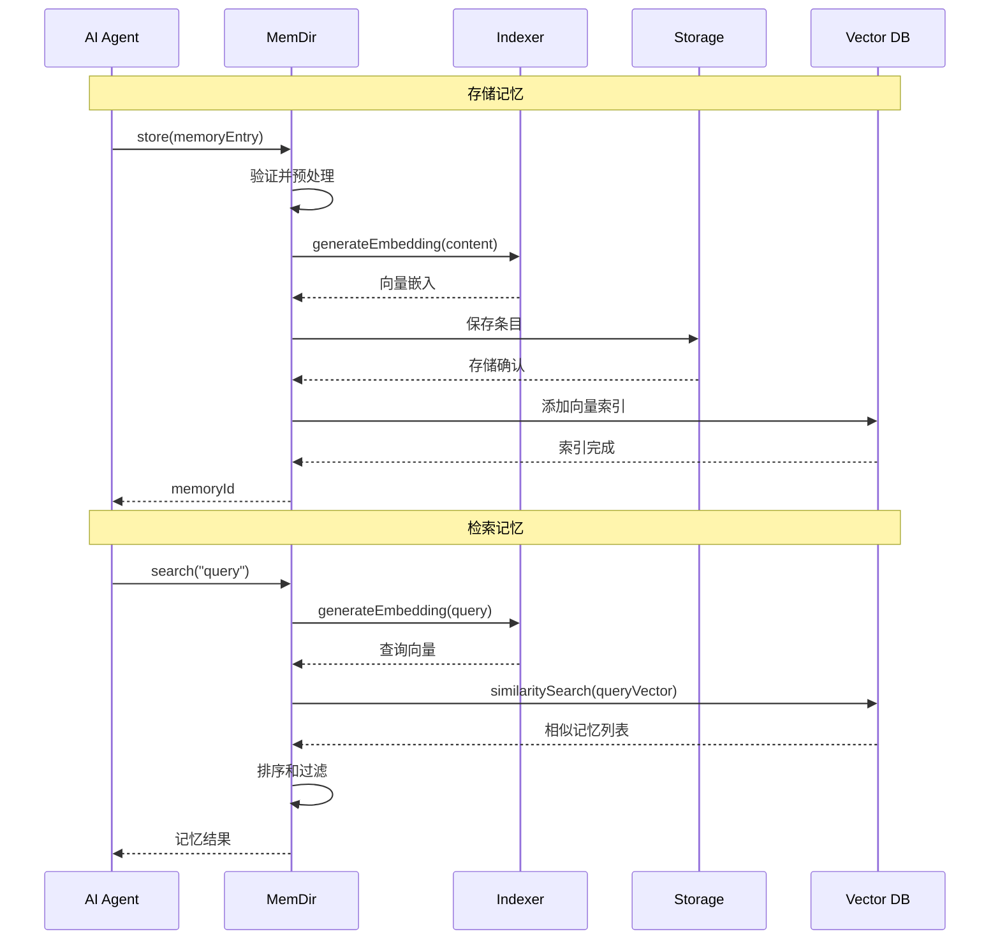
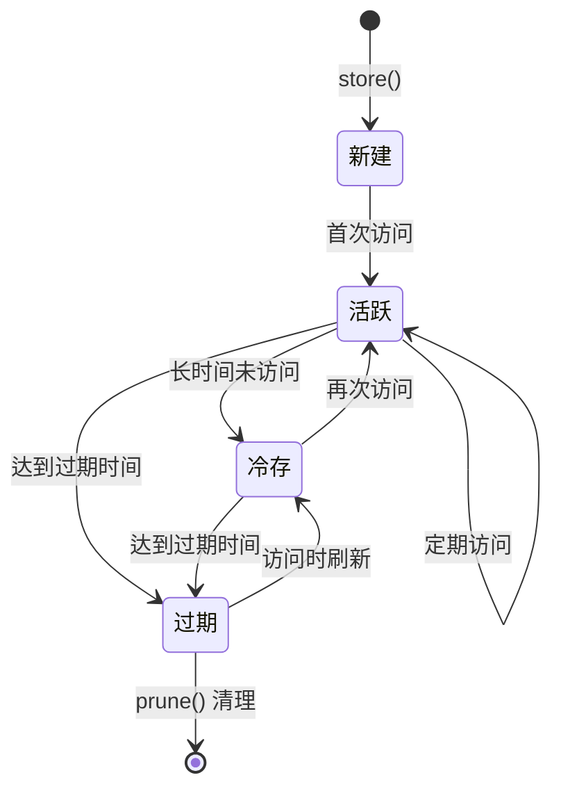
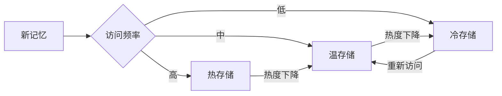

# 内存服务

## 概览

内存服务（Memory Service）是 Claude Code 的持久化记忆存储模块，负责管理 AI 的长期记忆和上下文信息。该服务使 Claude Code 能够跨会话保留重要信息、学习用户偏好、记住项目特定知识，从而提供更加个性化和智能的交互体验。

内存服务采用层次化的存储架构：
- **工作内存**：当前会话的短期上下文
- **持久内存**：跨会话的长期记忆
- **项目内存**：特定项目的专属知识库

## 架构位置



## 核心功能

| 功能 | 说明 | 相关 API |
|------|------|---------|
| 记忆存储 | 保存和检索记忆条目 | `store`, `retrieve` |
| 语义搜索 | 基于向量相似度的记忆检索 | `search`, `similar` |
| 记忆分类 | 按类型/标签组织记忆 | `categorize`, `tag` |
| 自动遗忘 | 过期记忆自动清理 | `expire`, `prune` |
| 增量更新 | 记忆片段的增量修改 | `update`, `patch` |

## 文件结构

```
memdir/
├── memdir.ts        # 内存目录核心实现
├── storage.ts       # 持久化存储适配器
├── indexer.ts       # 记忆索引构建
└── query.ts         # 查询和检索引擎
```

### 职责说明

| 文件 | 职责 |
|------|------|
| memdir.ts | 提供统一记忆接口，管理记忆生命周期 |
| storage.ts | 抽象底层存储，支持文件和数据库混合存储 |
| indexer.ts | 构建记忆向量索引，支持语义搜索 |
| query.ts | 实现记忆检索、过滤和排序逻辑 |

## 核心类型



## 记忆存储流程



## API 摘要

### MemDir

| 方法 | 说明 | 返回类型 |
|------|------|---------|
| `store` | 存储新记忆 | `Promise<string>` (返回记忆ID) |
| `retrieve` | 按ID检索记忆 | `Promise<MemoryEntry>` |
| `search` | 语义搜索记忆 | `Promise<MemoryEntry[]>` |
| `update` | 更新记忆内容 | `Promise<void>` |
| `delete` | 删除记忆 | `Promise<void>` |
| `prune` | 清理过期记忆 | `Promise<number>` (删除数量) |
| `list` | 列出记忆（支持分页） | `Promise<MemoryList>` |

### MemoryEntry

```typescript
interface MemoryEntry {
  id: string                      // 唯一标识符
  type: MemoryType                // 记忆类型
  content: string                 // 记忆内容
  embedding?: number[]            // 向量嵌入（自动生成）
  tags: string[]                  // 标签
  metadata: Record<string, any>   // 元数据
  createdAt: Date                 // 创建时间
  updatedAt: Date                 // 更新时间
  expiresAt?: Date                // 过期时间（可选）
  importance: number              // 重要性评分 (0-10)
  accessCount: number             // 访问次数
  lastAccessedAt?: Date           // 最后访问时间
}
```

### MemoryType

```typescript
enum MemoryType {
  USER_PREFERENCE = 'user_preference',       // 用户偏好设置
  PROJECT_KNOWLEDGE = 'project_knowledge',   // 项目特定知识
  CONVERSATION_SUMMARY = 'conversation_summary', // 对话摘要
  FACT = 'fact',                             // 事实性知识
  RULE = 'rule',                             // 规则/约束
  CUSTOM = 'custom'                          // 自定义类型
}
```

## 使用示例

### 基本存储和检索

```typescript
import { memdir } from './memdir/memdir'

// 存储用户偏好
const prefId = await memdir.store({
  type: MemoryType.USER_PREFERENCE,
  content: '用户喜欢使用 TypeScript，默认使用 2 空格缩进',
  tags: ['preferences', 'typescript'],
  importance: 8
})

// 检索记忆
const preference = await memdir.retrieve(prefId)
console.log(preference.content)
```

### 语义搜索

```typescript
// 搜索相关记忆
const results = await memdir.search(
  '用户对于代码格式有什么偏好？',
  {
    limit: 5,
    type: MemoryType.USER_PREFERENCE,
    minImportance: 5
  }
)

results.forEach(memory => {
  console.log(`[${memory.importance}] ${memory.content}`)
})
```

### 记忆更新和清理

```typescript
// 更新记忆
await memdir.update(prefId, {
  content: '用户现在更喜欢 4 空格缩进',
  importance: 9
})

// 清理过期记忆
const deletedCount = await memdir.prune(new Date())
console.log(`Deleted ${deletedCount} expired memories`)
```

### 项目知识库

```typescript
// 存储项目特定知识
await memdir.store({
  type: MemoryType.PROJECT_KNOWLEDGE,
  content: '本项目使用 pnpm 作为包管理器，Monorepo 结构',
  tags: ['project', 'monorepo', 'package-manager'],
  metadata: {
    projectId: 'my-project',
    language: 'TypeScript'
  },
  importance: 10
})
```

## 记忆生命周期



## 存储策略

### 分层存储

| 层级 | 存储位置 | 容量 | 访问速度 |
|------|---------|------|---------|
| 热存储 | 内存/Redis | ~100 条 | < 1ms |
| 温存储 | SQLite | ~10,000 条 | < 10ms |
| 冷存储 | 文件系统 | 无限制 | < 100ms |

### 自动分层



## 最佳实践

### 推荐模式

| 场景 | 推荐做法 |
|------|---------|
| 记忆组织 | 使用标签和类型分类，便于检索 |
| 重要性评分 | 根据记忆价值设置 0-10 分 |
| 过期策略 | 设置合理的过期时间，定期清理 |
| 搜索优化 | 使用精确的类型和标签过滤 |

### 避免事项

| 做法 | 问题 | 替代方案 |
|------|------|---------|
| 存储敏感信息 | 安全风险 | 使用加密存储或避免存储 |
| 冗余记忆 | 存储浪费 | 使用更新而非重复创建 |
| 无限增长 | 性能下降 | 设置自动过期和清理策略 |

## 向量搜索实现

### 嵌入生成

```typescript
// 使用 OpenAI 或本地模型生成嵌入
async function generateEmbedding(text: string): Promise<number[]> {
  const response = await openai.embeddings.create({
    model: 'text-embedding-ada-002',
    input: text
  })
  return response.data[0].embedding
}
```

### 相似度计算

```typescript
// 余弦相似度计算
function cosineSimilarity(a: number[], b: number[]): number {
  const dotProduct = a.reduce((sum, val, i) => sum + val * b[i], 0)
  const magnitudeA = Math.sqrt(a.reduce((sum, val) => sum + val * val, 0))
  const magnitudeB = Math.sqrt(b.reduce((sum, val) => sum + val * val, 0))
  return dotProduct / (magnitudeA * magnitudeB)
}
```

## 设计决策

### 1. 向量 + 关键词混合搜索

结合向量相似度和 BM25 关键词匹配，提供更准确的搜索结果。

### 2. 自动重要性衰减

长时间未访问的记忆自动降低重要性评分，便于清理低价值数据。

### 3. 增量嵌入更新

只对变化的内容重新生成嵌入，节省计算资源。

## 源码引用

- [memdir/memdir.ts](/restored-src/src/memdir/memdir.ts)
- [memdir/storage.ts](/restored-src/src/memdir/storage.ts)
- [memdir/indexer.ts](/restored-src/src/memdir/indexer.ts)
- [memdir/query.ts](/restored-src/src/memdir/query.ts)

## 相关文档

- [助手服务索引](_index.md)
- [团队内存同步](team-memory-sync.md) - 多用户记忆共享
- [Agent 工具](../agent/agent-tool.md) - 智能体工具调用
- [主页](../index.md)

---

*Generated by [Nium-Wiki v0.0.0](https://github.com/niuma996/nium-wiki) | 2026-04-02*
