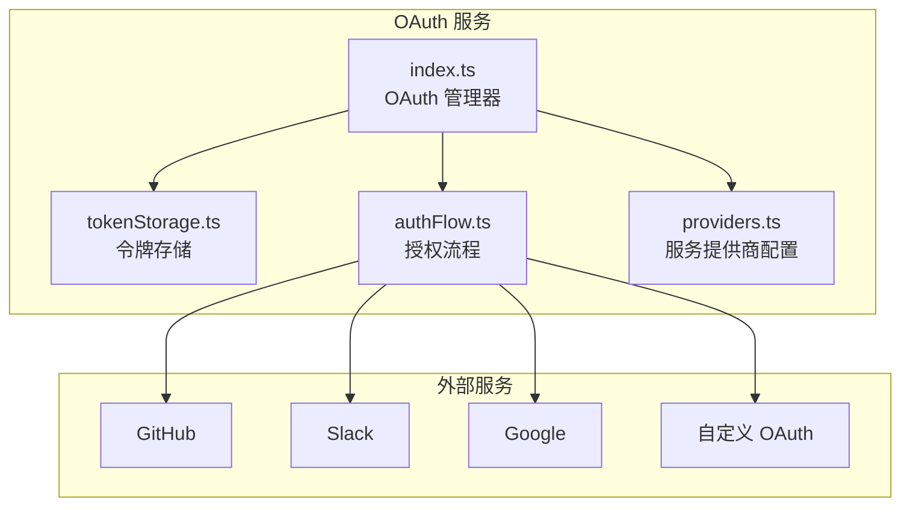
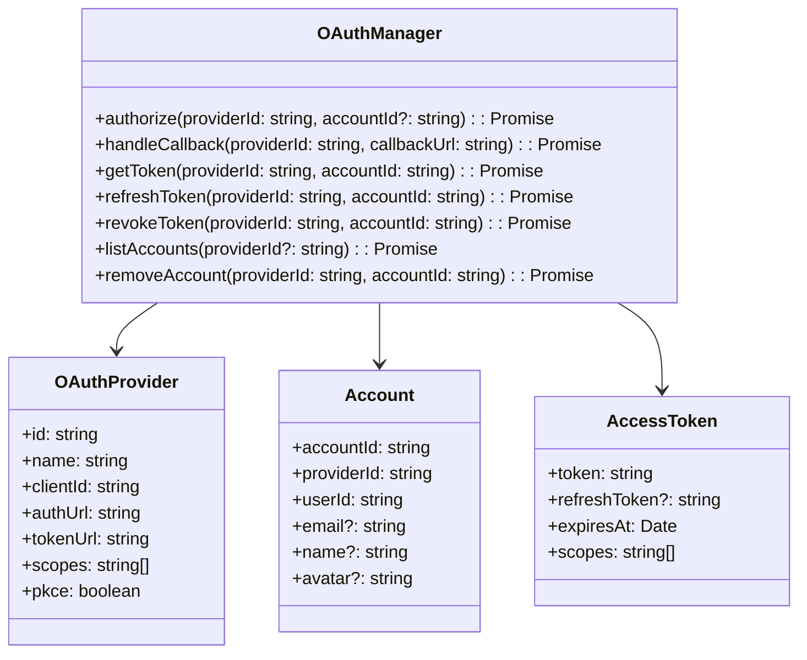
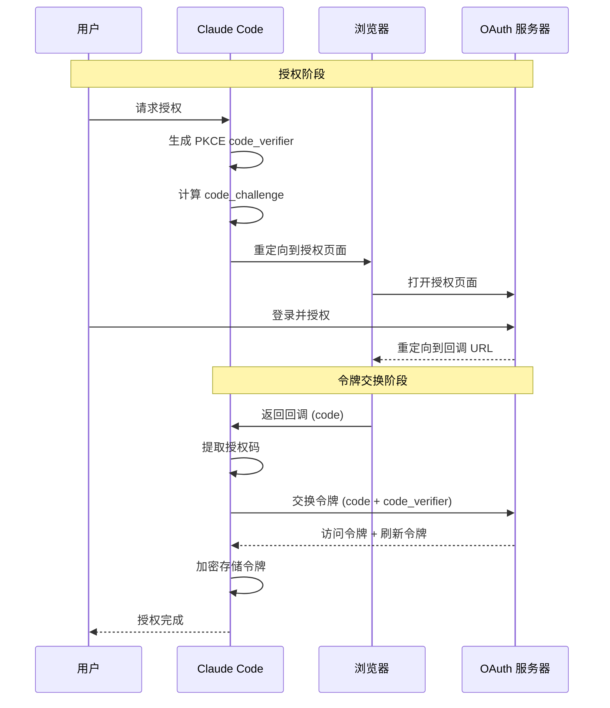

# OAuth 服务

## 概览

OAuth 服务是 Claude Code 的身份认证与授权管理模块，负责处理第三方服务的 OAuth 2.0 认证流程。该服务支持多种 OAuth 2.0 授权模式，使 Claude Code 能够安全地访问用户授权的外部服务（如 GitHub、Slack、Google 等）。

服务设计遵循 OAuth 2.0 规范最佳实践，包括令牌安全存储、自动刷新、撤销处理等安全机制。

## 架构位置



## 核心功能

| 功能 | 说明 | 相关 API |
|------|------|---------|
| 授权码流程 | 实现标准 OAuth 2.0 授权码模式 | `authorize`, `handleCallback` |
| 令牌管理 | 安全存储和自动刷新访问令牌 | `getToken`, `refreshToken`, `revokeToken` |
| 服务提供商 | 预置常见服务提供商配置 | `registerProvider`, `getProvider` |
| PKCE 支持 | 支持 PKCE 扩展增强安全性 | `generateCodeVerifier`, `generateCodeChallenge` |
| 多账户 | 支持同一服务提供商的多个账户 | `addAccount`, `removeAccount` |

## 文件结构

```
services/oauth/
├── index.ts           # OAuth 管理器入口
├── tokenStorage.ts    # 安全令牌存储
├── authFlow.ts        # 授权流程处理
└── providers.ts       # OAuth 服务提供商配置
```

### 职责说明

| 文件 | 职责 |
|------|------|
| index.ts | 提供统一的 OAuth 接口，管理所有提供商和账户 |
| tokenStorage.ts | 加密存储令牌，处理令牌生命周期 |
| authFlow.ts | 实现授权码获取、回调处理、令牌交换等流程 |
| providers.ts | 定义支持的 OAuth 服务提供商配置 |

## 核心类型



## OAuth 授权流程



## API 摘要

### OAuthManager

| 方法 | 说明 | 返回类型 |
|------|------|---------|
| `authorize` | 发起授权流程 | `Promise<AuthorizationResult>` |
| `handleCallback` | 处理 OAuth 回调 | `Promise<Account>` |
| `getToken` | 获取有效访问令牌 | `Promise<AccessToken>` |
| `refreshToken` | 刷新过期令牌 | `Promise<AccessToken>` |
| `revokeToken` | 撤销授权 | `Promise<void>` |
| `listAccounts` | 列出已授权账户 | `Promise<Account[]>` |
| `removeAccount` | 移除账户授权 | `Promise<void>` |

### OAuthProvider 配置

```typescript
interface OAuthProviderConfig {
  id: string              // 提供商唯一标识
  name: string            // 显示名称
  clientId: string        // OAuth 应用客户端 ID
  clientSecret?: string  // 客户端密钥（用于后端流程）
  authUrl: string         // 授权端点 URL
  tokenUrl: string        // 令牌端点 URL
  redirectUri: string     // 回调 URI
  scopes: string[]        // 请求权限范围
  pkce: boolean           // 是否启用 PKCE
  revocationUrl?: string  // 撤销端点 URL（可选）
}
```

### AccessToken

```typescript
interface AccessToken {
  token: string           // 访问令牌
  refreshToken?: string   // 刷新令牌（可选）
  expiresAt: Date         // 过期时间
  scopes: string[]        // 已授权范围
  tokenType: string       // 令牌类型（通常为 Bearer）
}
```

## 使用示例

### 初始化与配置

```typescript
import { OAuthManager } from './services/oauth/index'
import { GitHubProvider, SlackProvider } from './services/oauth/providers'

const oauthManager = new OAuthManager()

// 注册服务提供商
oauthManager.registerProvider(GitHubProvider)
oauthManager.registerProvider(SlackProvider)
```

### 用户授权流程

```typescript
// 发起授权
const result = await oauthManager.authorize('github', {
  scopes: ['repo', 'user:email']
})

if (result.type === 'redirect') {
  // 打开浏览器进行授权
  console.log('Open URL:', result.authUrl)
}

// 获取令牌
const token = await oauthManager.getToken('github', accountId)
console.log('Access token:', token.token)
```

### 处理回调

```typescript
// 在 OAuth 回调页面调用
app.get('/oauth/callback', async (req, res) => {
  const { code, state } = req.query

  try {
    const account = await oauthManager.handleCallback('github', {
      code: code as string,
      state: state as string
    })

    console.log('Authorized account:', account.email)
    res.send('Authorization successful!')
  } catch (error) {
    console.error('Authorization failed:', error)
    res.status(400).send('Authorization failed')
  }
})
```

### 令牌刷新

```typescript
// 令牌自动刷新（内部处理）
// 或手动刷新
const newToken = await oauthManager.refreshToken('github', accountId)
console.log('New token expires at:', newToken.expiresAt)
```

## 最佳实践

### 推荐模式

| 场景 | 推荐做法 |
|------|---------|
| 令牌存储 | 始终使用加密存储，不在内存中长期保留 |
| PKCE | 始终启用 PKCE 扩展，防止授权码拦截攻击 |
| 令牌刷新 | 实现自动刷新，避免令牌过期中断用户操作 |
| 错误处理 | 妥善处理用户拒绝授权、撤销授权等场景 |

### 避免事项

| 做法 | 问题 | 替代方案 |
|------|------|---------|
| 明文存储令牌 | 安全风险 | 使用系统密钥链或加密存储 |
| 硬编码客户端密钥 | 难以管理 | 使用环境变量或密钥管理服务 |
| 忽略令牌过期 | 用户操作中断 | 实现自动刷新机制 |

## 安全机制

### PKCE 流程

```mermaid
flowchart LR
    A[生成随机<br/>code_verifier] --> B[SHA256 哈希]
    B --> C[Base64 URL 编码<br/>code_challenge]
    C --> D[授权请求<br/>包含 code_challenge]
    D --> E[令牌请求<br/>包含 code_verifier]
    E --> F{验证<br/>hash(code_verifier)<br/>== code_challenge}
    F -->|通过| G[返回令牌]
    F -->|失败| H[拒绝请求]
```

### 令牌安全存储

- 使用操作系统密钥链（Keychain、Credential Manager）
- 加密存储refresh token
- 访问令牌设置合理过期时间
- 支持令牌撤销和账户登出

## 设计决策

### 1. PKCE 强制启用

为所有 OAuth 流程启用 PKCE 扩展，即使客户端密钥已知也能防止授权码拦截攻击。

### 2. 自动令牌管理

令牌存储模块自动处理过期检测和刷新，对上层应用透明。

### 3. 多账户支持

使用 `accountId` 隔离同一提供商的多个账户，方便用户管理多个身份。

## 源码引用

- [services/oauth/index.ts](/restored-src/src/services/oauth/index.ts)
- [services/oauth/tokenStorage.ts](/restored-src/src/services/oauth/tokenStorage.ts)
- [services/oauth/authFlow.ts](/restored-src/src/services/oauth/authFlow.ts)
- [services/oauth/providers.ts](/restored-src/src/services/oauth/providers.ts)

## 相关文档

- [助手服务索引](_index.md)
- [MCP 服务](mcp.md) - MCP 工具调用
- [主页](../index.md)

---

*Generated by [Nium-Wiki v0.0.0](https://github.com/niuma996/nium-wiki) | 2026-04-02*
