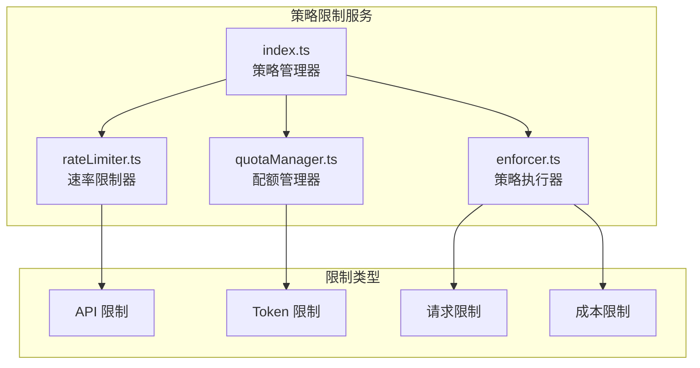
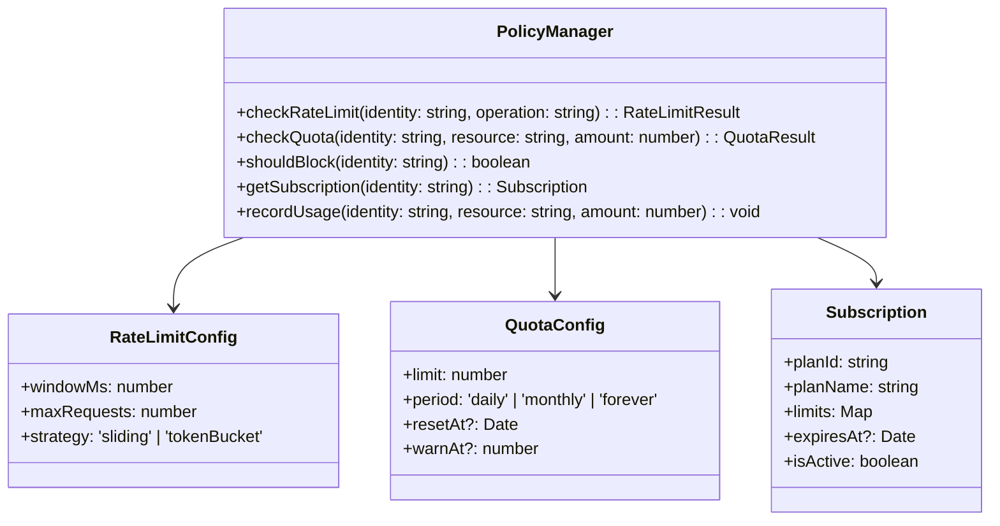
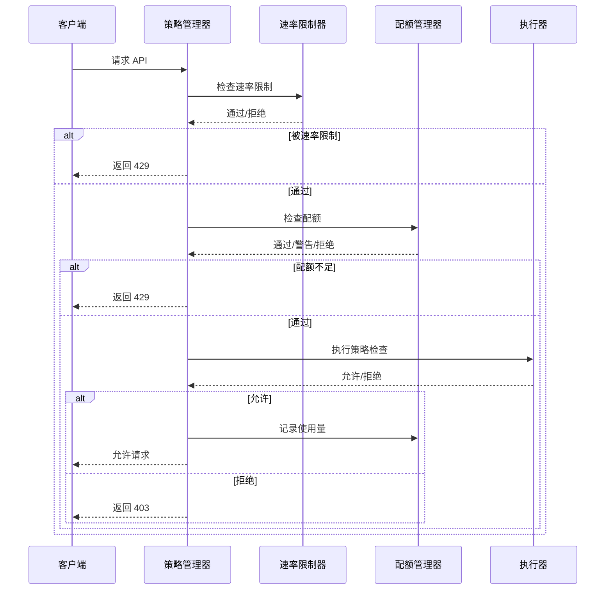
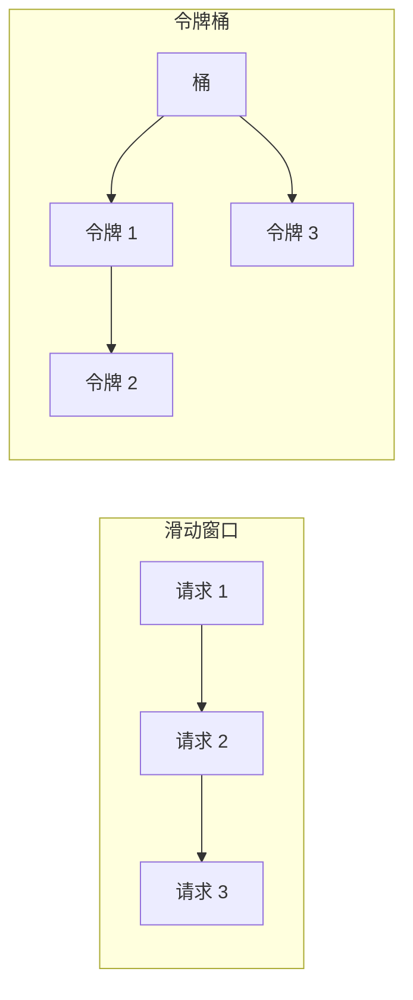

# 策略限制

## 概览

策略限制（Policy Limits）服务是 Claude Code 的使用策略和速率限制管理模块。该服务负责：
- 强制执行 API 使用配额和限制
- 管理用户订阅级别和权限
- 实施速率限制防止滥用
- 跟踪使用量和预算

服务设计遵循可扩展原则，支持多种限制类型和自定义策略配置。

## 架构位置



## 核心功能

| 功能 | 说明 | 相关 API |
|------|------|---------|
| 速率限制 | 限制 API 请求频率 | `checkRateLimit`, `getRateLimitStatus` |
| 配额管理 | 跟踪和管理使用配额 | `checkQuota`, `getQuotaStatus` |
| 订阅管理 | 管理用户订阅级别 | `getSubscription`, `upgradePlan` |
| 策略执行 | 强制执行使用限制 | `enforce`, `shouldBlock` |
| 预算控制 | 防止超出预算 | `checkBudget`, `getBudgetStatus` |

## 文件结构

```
services/policyLimits/
├── index.ts           # 策略管理器入口
├── rateLimiter.ts     # 速率限制器
├── quotaManager.ts    # 配额管理器
└── enforcer.ts        # 策略执行器
```

### 职责说明

| 文件 | 职责 |
|------|------|
| index.ts | 提供统一的策略接口，协调各子模块 |
| rateLimiter.ts | 实现滑动窗口和令牌桶算法 |
| quotaManager.ts | 管理 API 配额和用量跟踪 |
| enforcer.ts | 执行限制决策，处理拒绝逻辑 |

## 核心类型



## 限制流程



## 限制类型

### 速率限制算法



| 算法 | 说明 | 适用场景 |
|------|------|---------|
| 滑动窗口 | 固定时间窗口内的请求计数 | 平滑限流 |
| 令牌桶 | 以恒定速率补充令牌 | 突发流量 |
| 固定窗口 | 简单计数 | 粗粒度限制 |

### 配额类型

| 类型 | 说明 | 示例 |
|------|------|------|
| API 调用 | 每日/每月 API 调用次数 | 1000 次/天 |
| Token 使用 | Token 消耗限额 | 100,000 tokens/月 |
| 并发连接 | 同时进行的请求数 | 最多 5 个并发 |
| 成本限额 | 消费金额上限 | $100/月 |

## API 摘要

### PolicyManager

| 方法 | 说明 | 返回类型 |
|------|------|---------|
| `checkRateLimit` | 检查速率限制 | `RateLimitResult` |
| `checkQuota` | 检查配额 | `QuotaResult` |
| `shouldBlock` | 检查是否应阻止请求 | `boolean` |
| `getSubscription` | 获取订阅信息 | `Subscription` |
| `recordUsage` | 记录使用量 | `void` |
| `getRateLimitStatus` | 获取速率限制状态 | `RateLimitStatus` |
| `getQuotaStatus` | 获取配额状态 | `QuotaStatus` |

### RateLimitResult

```typescript
interface RateLimitResult {
  allowed: boolean                // 是否允许
  remaining: number               // 剩余请求数
  limit: number                   // 限制数
  resetAt: Date                   // 重置时间
  retryAfter?: number            // 距离下次可用的秒数
}
```

### QuotaResult

```typescript
interface QuotaResult {
  allowed: boolean                // 是否允许
  used: number                    // 已使用量
  limit: number                  // 限制量
  remaining: number              // 剩余量
  period: 'daily' | 'monthly' | 'forever'
  resetAt?: Date                 // 重置时间
  isWarning: boolean             // 是否接近限额
}
```

### Subscription

```typescript
interface Subscription {
  planId: string                  // 订阅计划 ID
  planName: string                // 计划名称
  tier: 'free' | 'pro' | 'team' | 'enterprise'
  limits: {
    requestsPerDay: number
    requestsPerMonth: number
    tokensPerMonth: number
    maxConcurrent: number
  }
  expiresAt?: Date               // 过期时间
  isActive: boolean              // 是否激活
  features: string[]             // 功能列表
}
```

## 使用示例

### 速率限制检查

```typescript
import { policyManager } from './services/policyLimits/index'

// 检查速率限制
const rateLimitResult = policyManager.checkRateLimit(userId, 'api_call')

if (!rateLimitResult.allowed) {
  console.log(`Rate limited. Retry after ${rateLimitResult.retryAfter}s`)
  throw new RateLimitError(rateLimitResult.retryAfter)
}

console.log(`Remaining requests: ${rateLimitResult.remaining}`)
```

### 配额检查

```typescript
// 检查 API 调用配额
const quotaResult = policyManager.checkQuota(userId, 'api_requests', 1)

if (!quotaResult.allowed) {
  console.log(`Quota exceeded. Limit: ${quotaResult.limit}`)
  throw new QuotaExceededError()
}

if (quotaResult.isWarning) {
  console.log(`Warning: ${quotaResult.remaining} requests remaining`)
}

// 记录使用
policyManager.recordUsage(userId, 'api_requests', 1)
```

### 获取订阅信息

```typescript
// 获取用户订阅
const subscription = policyManager.getSubscription(userId)

console.log(`Plan: ${subscription.planName}`)
console.log(`Daily limit: ${subscription.limits.requestsPerDay}`)
console.log(`Monthly tokens: ${subscription.limits.tokensPerMonth}`)

if (!subscription.isActive) {
  console.log('Subscription expired or inactive')
}
```

### 完整检查流程

```typescript
async function handleApiRequest(userId: string, tokens: number) {
  // 1. 检查速率限制
  const rateLimit = policyManager.checkRateLimit(userId, 'api_call')
  if (!rateLimit.allowed) {
    throw new RateLimitError(rateLimit.retryAfter)
  }

  // 2. 检查 Token 配额
  const tokenQuota = policyManager.checkQuota(userId, 'tokens', tokens)
  if (!tokenQuota.allowed) {
    throw new QuotaExceededError('Token quota exceeded')
  }

  // 3. 检查是否应阻止
  if (policyManager.shouldBlock(userId)) {
    throw new ForbiddenError('Account blocked')
  }

  // 4. 执行请求
  const result = await executeApiCall()

  // 5. 记录使用
  policyManager.recordUsage(userId, 'api_requests', 1)
  policyManager.recordUsage(userId, 'tokens', tokens)

  return result
}
```

## 订阅计划示例

```typescript
const subscriptionPlans = {
  free: {
    requestsPerDay: 100,
    requestsPerMonth: 1000,
    tokensPerMonth: 100000,
    maxConcurrent: 1,
    features: ['basic-chat', 'code-completion']
  },
  pro: {
    requestsPerDay: 1000,
    requestsPerMonth: 50000,
    tokensPerMonth: 1000000,
    maxConcurrent: 5,
    features: ['basic-chat', 'code-completion', 'agent', 'voice']
  },
  team: {
    requestsPerDay: 10000,
    requestsPerMonth: 500000,
    tokensPerMonth: 10000000,
    maxConcurrent: 20,
    features: ['basic-chat', 'code-completion', 'agent', 'voice', 'team-sync']
  },
  enterprise: {
    requestsPerDay: Infinity,
    requestsPerMonth: Infinity,
    tokensPerMonth: Infinity,
    maxConcurrent: Infinity,
    features: ['all', 'custom-policies', 'sso', 'audit-logs']
  }
}
```

## 限制配置示例

```typescript
const rateLimitConfig: RateLimitConfig = {
  // 滑动窗口策略
  strategy: 'sliding',
  windowMs: 60 * 1000,  // 1 分钟窗口
  maxRequests: 60,       // 每分钟最多 60 请求

  // 或令牌桶策略
  strategy: 'tokenBucket',
  bucketSize: 100,       // 桶容量
  refillRate: 1         // 每秒补充 1 个令牌
}

const quotaConfig: QuotaConfig = {
  limit: 1000,
  period: 'daily',
  resetAt: getEndOfDay(),
  warnAt: 0.8            // 80% 时发出警告
}
```

## 最佳实践

### 推荐模式

| 场景 | 推荐做法 |
|------|---------|
| 限流算法 | 使用滑动窗口获得更平滑的限制 |
| 配额设计 | 设置合理的警告阈值提前通知用户 |
| 成本控制 | 设置硬性预算限制防止意外超支 |
| 错误处理 | 返回清晰的错误信息和重试时间 |

### 避免事项

| 做法 | 问题 | 替代方案 |
|------|------|---------|
| 固定窗口限流 | 窗口边界突发流量 | 使用滑动窗口 |
| 无警告阈值 | 用户无预警被限流 | 设置 80% 警告 |
| 硬删除配额 | 误判导致服务中断 | 使用软限制 + 延迟执行 |

## 设计决策

### 1. 分层限制

采用分层限制策略：速率限制 → 配额检查 → 预算控制 → 执行决策。

### 2. 实时跟踪

使用内存缓存实时跟踪使用量，减少数据库查询压力。

### 3. 可扩展策略

策略配置支持动态更新，无需重启服务。

## 源码引用

- [services/policyLimits/index.ts](/restored-src/src/services/policyLimits/index.ts)
- [services/policyLimits/rateLimiter.ts](/restored-src/src/services/policyLimits/rateLimiter.ts)
- [services/policyLimits/quotaManager.ts](/restored-src/src/services/policyLimits/quotaManager.ts)
- [services/policyLimits/enforcer.ts](/restored-src/src/services/policyLimits/enforcer.ts)

## 相关文档

- [助手服务索引](_index.md)
- [速率限制模拟](rate-limit-mocking.md) - 测试用限制模拟
- [分析服务](analytics.md) - 使用量跟踪
- [主页](../index.md)

---

*Generated by [Nium-Wiki v0.0.0](https://github.com/niuma996/nium-wiki) | 2026-04-02*
