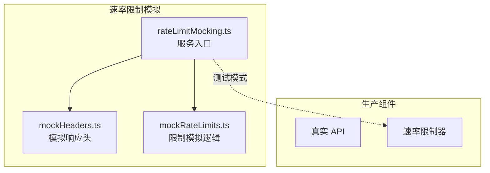
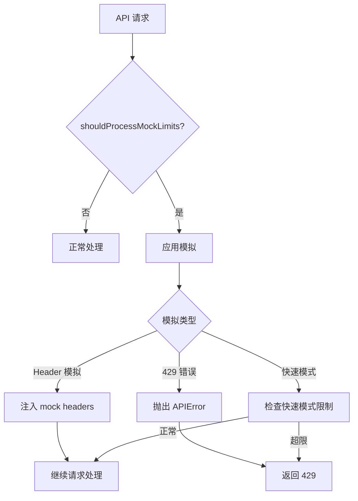
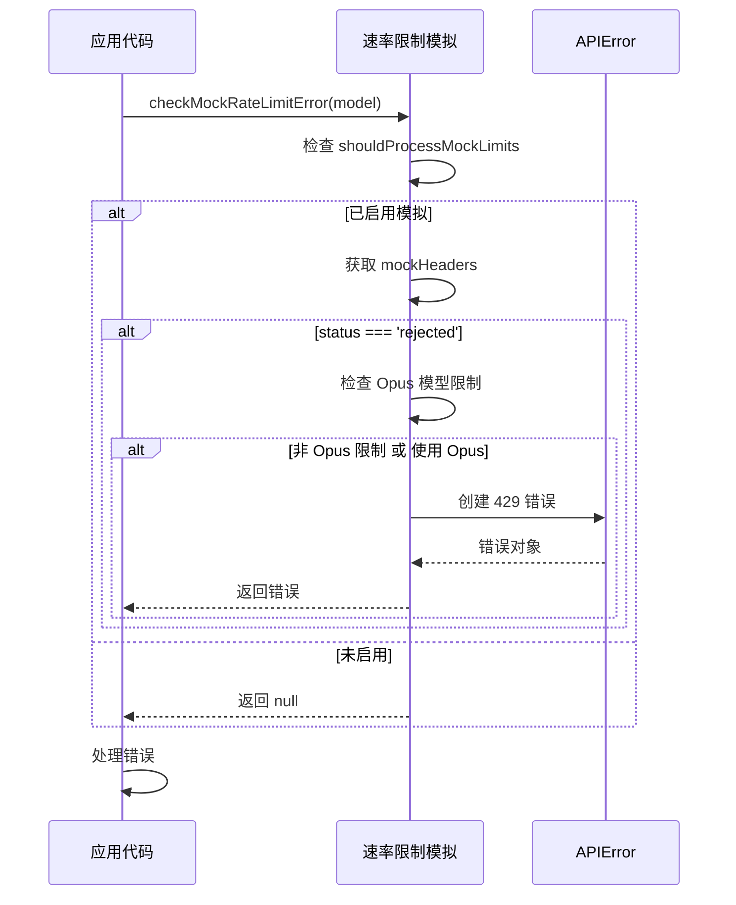
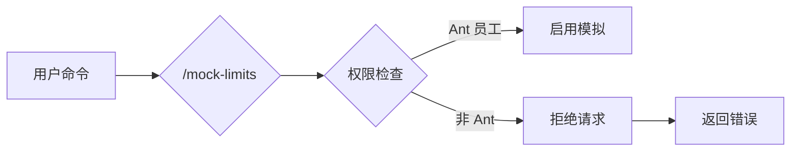

# 速率限制模拟

## 概览

速率限制模拟（Rate Limit Mocking）服务是 Claude Code 的测试和开发工具，用于模拟 API 速率限制行为。该服务使开发者和测试人员能够：
- 测试速率限制场景的代码路径
- 验证速率限制错误处理逻辑
- 模拟不同订阅级别的限制
- 测试快速模式下的速率限制

**⚠️ 安全限制**：该服务仅供 Ant 内部员工使用，通过 `/mock-limits` 命令激活。

## 架构位置



## 核心功能

| 功能 | 说明 | 相关 API |
|------|------|---------|
| 模拟头注入 | 在响应中注入模拟速率限制头 | `processRateLimitHeaders` |
| 429 错误模拟 | 生成模拟的 429 错误 | `checkMockRateLimitError` |
| 快速模式限制 | 模拟快速模式下的速率限制 | `checkMockFastModeRateLimit` |
| 状态查询 | 查询模拟状态 | `shouldProcessMockLimits` |

## 文件结构

```
services/
├── rateLimitMocking.ts      # 服务入口（门面）
├── mockRateLimits.ts        # 限制模拟逻辑
└── mockHeaders.ts           # 模拟响应头处理
```

### 职责说明

| 文件 | 职责 |
|------|------|
| rateLimitMocking.ts | 提供统一的接口，隔离模拟逻辑 |
| mockRateLimits.ts | 实现各种速率限制场景的模拟 |
| mockHeaders.ts | 处理模拟响应头的生成和应用 |

## 工作原理



## 模拟模式

### 1. Header 注入模式

在响应头中注入模拟的速率限制信息：

```typescript
interface MockHeaders {
  'anthropic-ratelimit-unified-status': 'rejected' | 'accepted'
  'anthropic-ratelimit-unified-overage-status'?: 'rejected' | 'accepted'
  'anthropic-ratelimit-unified-representative-claim'?: string
  'anthropic-ratelimit-unified-reset'?: string
  'anthropic-ratelimit-unified-remaining'?: string
}
```

### 2. 429 错误模拟

当模拟状态为 `rejected` 时，生成 429 错误：

```typescript
const error = new APIError(
  429,
  { error: { type: 'rate_limit_error', message: headerlessMessage } },
  headerlessMessage,
  new Headers()
)
```

### 3. 快速模式限制

模拟快速模式（Fast Mode）下的速率限制：

```typescript
interface FastModeHeaders {
  'anthropic-ratelimit-fast-mode-status': 'rejected' | 'accepted'
  'anthropic-ratelimit-fast-mode-reset': string
  'anthropic-ratelimit-fast-mode-remaining': string
}
```

## API 摘要

### RateLimitFacade

| 方法 | 说明 | 返回类型 |
|------|------|---------|
| `processRateLimitHeaders` | 处理响应头，应用模拟 | `Headers` |
| `shouldProcessRateLimits` | 检查是否应处理限制 | `boolean` |
| `checkMockRateLimitError` | 检查是否应抛出 429 | `APIError \| null` |
| `isMockRateLimitError` | 检查是否为模拟的 429 | `boolean` |
| `shouldProcessMockLimits` | 检查模拟状态 | `boolean` |

### MockRateLimits

| 方法 | 说明 | 返回类型 |
|------|------|---------|
| `applyMockHeaders` | 应用模拟头 | `Headers` |
| `getMockHeaders` | 获取当前模拟头 | `MockHeaders \| null` |
| `isMockFastModeRateLimitScenario` | 检查快速模式场景 | `boolean` |
| `checkMockFastModeRateLimit` | 检查快速模式限制 | `FastModeHeaders \| null` |

## 使用示例

### 基本使用

```typescript
import {
  processRateLimitHeaders,
  shouldProcessRateLimits,
  checkMockRateLimitError
} from './services/rateLimitMocking'

// 处理响应头
function handleResponse(response: Response) {
  const headers = processRateLimitHeaders(response.headers)
  // headers 现在包含模拟的速率限制信息
}

// 检查是否应抛出 429
function checkLimit(currentModel: string, isFastModeActive?: boolean) {
  const error = checkMockRateLimitError(currentModel, isFastModeActive)
  if (error) {
    throw error  // 抛出模拟的 429 错误
  }
}
```

### 与速率限制器集成

```typescript
import { shouldProcessRateLimits } from './services/rateLimitMocking'
import { checkAndEnforceRateLimit } from './services/policyLimits'

async function makeApiRequest(isSubscriber: boolean) {
  // 检查是否应处理速率限制
  // 生产环境：仅订阅用户
  // 测试环境：订阅用户或启用了 /mock-limits
  const shouldProcess = shouldProcessRateLimits(isSubscriber)

  if (shouldProcess) {
    await checkAndEnforceRateLimit(userId)
  }

  return await actualApiCall()
}
```

### Opus 模型限制

```typescript
// 特殊处理 Opus 模型的速率限制
const error = checkMockRateLimitError('claude-opus-4-20240229', false)

if (error) {
  console.log('Opus 模型被限流')
  // 可能需要切换到 Sonnet 模型
}
```

## 模拟头配置

### 典型模拟头

```typescript
// 模拟被拒绝的请求
const mockHeaders = {
  'anthropic-ratelimit-unified-status': 'rejected',
  'anthropic-ratelimit-unified-representative-claim': 'seven_day_opus',
  'anthropic-ratelimit-unified-reset': '2024-01-01T00:00:00Z',
  'anthropic-ratelimit-unified-remaining': '0'
}

// 模拟超限情况
const overageHeaders = {
  ...mockHeaders,
  'anthropic-ratelimit-unified-overage-status': 'rejected'
}
```

### 快速模式头

```typescript
const fastModeHeaders = {
  'anthropic-ratelimit-fast-mode-status': 'rejected',
  'anthropic-ratelimit-fast-mode-reset': '2024-01-01T00:01:00Z',
  'anthropic-ratelimit-fast-mode-remaining': '0'
}
```

## 错误处理

### 模拟 429 错误



### 错误信息

```typescript
// 无头信息时的 429 消息
const headerlessMessage = getMockHeaderless429Message()
// 可能返回: "Rate limit exceeded. Please wait and retry."

// 错误属性
interface APIError {
  status: 429
  error: {
    type: 'rate_limit_error'
    message: string
  }
  headers: Headers  // 包含模拟头的副本
}
```

## 安全机制

### 访问控制



### 激活条件

| 条件 | 说明 |
|------|------|
| Ant 员工 | 通过内部身份验证 |
| 显式激活 | 使用 `/mock-limits` 命令 |
| 会话级别 | 仅在当前会话生效 |

## 最佳实践

### 推荐模式

| 场景 | 推荐做法 |
|------|---------|
| 测试覆盖 | 为速率限制场景编写测试用例 |
| 错误处理 | 确保 429 错误被正确处理和重试 |
| 快速模式 | 测试快速模式的边界情况 |

### 避免事项

| 做法 | 问题 | 替代方案 |
|------|------|---------|
| 暴露给外部用户 | 安全风险 | 严格内部访问控制 |
| 硬编码模拟数据 | 缺乏灵活性 | 使用配置动态设置 |
| 忽视 Opus 限制 | 测试不完整 | 添加 Opus 模型测试 |

## 设计决策

### 1. 隔离生产代码

模拟逻辑完全隔离在单独模块，不影响生产代码路径。

### 2. Header 透明处理

模拟头以透明方式注入，上层代码无需感知。

### 3. Opus 模型特殊处理

Opus 模型的速率限制只影响 Opus 请求，不影响其他模型。

## 源码引用

- [services/rateLimitMocking.ts](/restored-src/src/services/rateLimitMocking.ts)
- [services/mockRateLimits.ts](/restored-src/src/services/mockRateLimits.ts)
- [services/mockHeaders.ts](/restored-src/src/services/mockHeaders.ts)

## 相关文档

- [助手服务索引](_index.md)
- [策略限制](policy-limits.md) - 真实速率限制实现
- [分析服务](analytics.md) - 使用量跟踪
- [主页](../index.md)

---

*Generated by [Nium-Wiki v0.0.0](https://github.com/niuma996/nium-wiki) | 2026-04-02*
