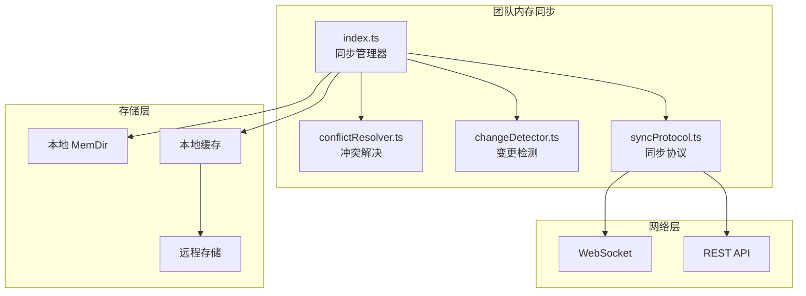
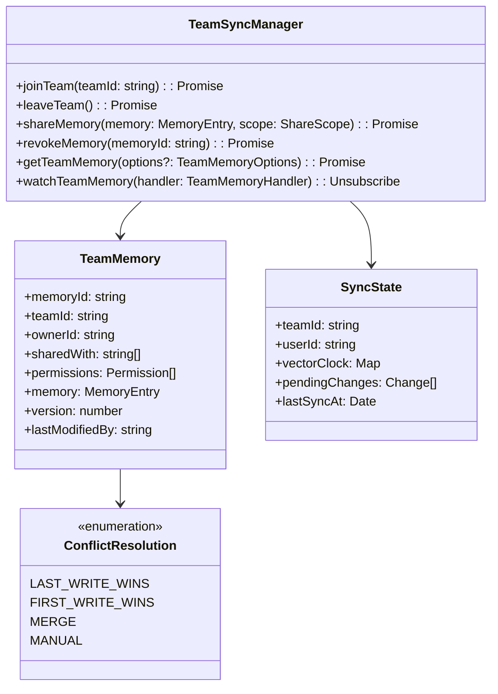
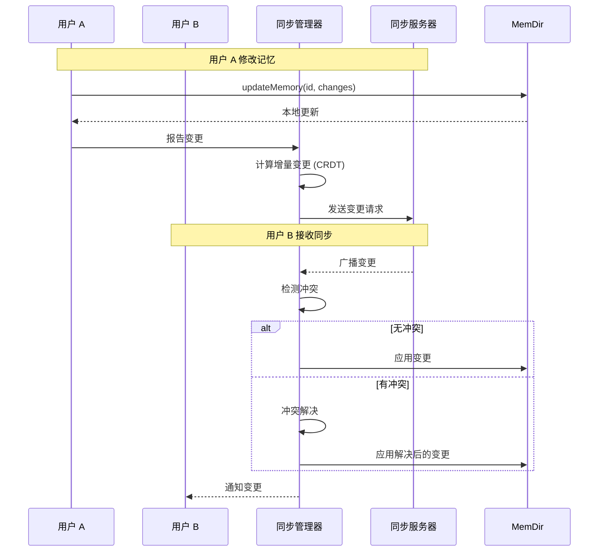
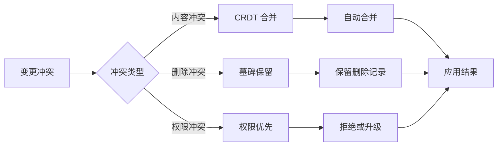
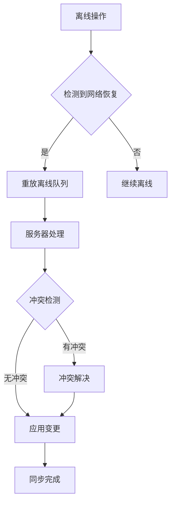

# 团队内存同步

## 概览

团队内存同步（Team Memory Sync）服务是 Claude Code 的多用户协作记忆模块，负责在团队成员之间同步和共享记忆。该服务使团队可以：
- 共享项目知识和最佳实践
- 跨用户保持上下文一致性
- 实现团队级别的学习和发展
- 支持实时协作场景

服务基于事件驱动的同步机制，支持增量更新和冲突解决，确保团队记忆的一致性和可用性。

## 架构位置



## 核心功能

| 功能 | 说明 | 相关 API |
|------|------|---------|
| 实时同步 | 跨用户的实时记忆同步 | `sync`, `watch` |
| 冲突解决 | 自动处理多用户编辑冲突 | `resolve`, `merge` |
| 权限管理 | 控制记忆的可见性和修改权限 | `grant`, `revoke` |
| 版本追踪 | 记录记忆变更历史 | `history`, `diff` |
| 离线支持 | 网络中断时的本地操作缓存 | `queueOffline`, `replay` |

## 文件结构

```
services/teamMemorySync/
├── index.ts              # 同步管理器入口
├── conflictResolver.ts   # 冲突解决策略
├── changeDetector.ts     # 变更检测算法
└── syncProtocol.ts       # 同步协议实现
```

### 职责说明

| 文件 | 职责 |
|------|------|
| index.ts | 管理团队同步生命周期，处理连接和协调 |
| conflictResolver.ts | 实现冲突检测和解决算法（CRDT/OT） |
| changeDetector.ts | 计算增量变更，使用 CRDT 数据结构 |
| syncProtocol.ts | 实现同步协议，处理消息序列化和路由 |

## 核心类型



## 同步流程



## 冲突解决策略



## API 摘要

### TeamSyncManager

| 方法 | 说明 | 返回类型 |
|------|------|---------|
| `joinTeam` | 加入团队同步会话 | `Promise<void>` |
| `leaveTeam` | 离开团队同步会话 | `Promise<void>` |
| `shareMemory` | 共享记忆给团队成员 | `Promise<void>` |
| `revokeMemory` | 撤销记忆共享 | `Promise<void>` |
| `getTeamMemory` | 获取团队共享记忆 | `Promise<TeamMemory[]>` |
| `watchTeamMemory` | 监听团队记忆变更 | `Unsubscribe` |
| `getSyncStatus` | 获取同步状态 | `SyncStatus` |

### ShareScope

```typescript
enum ShareScope {
  PRIVATE = 'private',           // 仅自己可见
  TEAM = 'team',                 // 团队所有成员可见
  SPECIFIC_USERS = 'specific',   // 指定用户可见
  PUBLIC = 'public'               // 所有用户可见
}

interface ShareOptions {
  scope: ShareScope
  users?: string[]               // 当 scope 为 SPECIFIC_USERS 时
  permissions?: Permission[]      // 授予的权限
  expiresAt?: Date               // 共享过期时间
}
```

### SyncState

```typescript
interface SyncState {
  teamId: string
  userId: string
  vectorClock: Map<string, number>  // 向量时钟
  pendingChanges: PendingChange[]
  syncedVersions: Map<string, number>
  lastSyncAt: Date
  connectionStatus: 'connected' | 'disconnected' | 'reconnecting'
}
```

## 使用示例

### 加入团队

```typescript
import { teamSync } from './services/teamMemorySync/index'

// 加入团队同步会话
await teamSync.joinTeam('team-123')

// 监听团队记忆变更
const unsubscribe = teamSync.watchTeamMemory((event) => {
  console.log(`Memory ${event.memoryId} was ${event.type}`)
  if (event.type === 'updated') {
    console.log('New content:', event.memory.content)
  }
})
```

### 共享记忆

```typescript
// 共享记忆给团队
await teamSync.shareMemory(memoryId, {
  scope: ShareScope.TEAM,
  permissions: [Permission.READ, Permission.EDIT],
  expiresAt: new Date(Date.now() + 7 * 24 * 60 * 60 * 1000) // 7 天后过期
})

// 共享给特定用户
await teamSync.shareMemory(memoryId, {
  scope: ShareScope.SPECIFIC_USERS,
  users: ['user-456', 'user-789'],
  permissions: [Permission.READ]
})
```

### 获取团队记忆

```typescript
// 获取团队所有共享记忆
const teamMemories = await teamSync.getTeamMemory()

// 按过滤器获取
const myContributions = await teamSync.getTeamMemory({
  ownerId: 'my-user-id',
  since: new Date('2024-01-01')
})
```

### 权限管理

```typescript
// 撤销共享
await teamSync.revokeMemory(memoryId)

// 查看同步状态
const status = teamSync.getSyncStatus()
console.log(`Connected: ${status.connectionStatus}`)
console.log(`Pending changes: ${status.pendingChanges.length}`)
```

## CRDT 实现

### 向量时钟

```typescript
class VectorClock {
  private clock: Map<string, number> = new Map()

  increment(nodeId: string): void {
    const current = this.clock.get(nodeId) || 0
    this.clock.set(nodeId, current + 1)
  }

  merge(other: VectorClock): void {
    for (const [node, time] of other.clock) {
      this.clock.set(node, Math.max(this.clock.get(node) || 0, time))
    }
  }

  happensBefore(other: VectorClock): boolean {
    let atLeastOneLess = false
    for (const [node, time] of this.clock) {
      if ((other.clock.get(node) || 0) < time) {
        return false
      }
      if ((other.clock.get(node) || 0) > time) {
        atLeastOneLess = true
      }
    }
    return atLeastOneLess
  }
}
```

### 墓碑机制

```typescript
interface Tombstone {
  id: string
  deletedAt: Date
  deletedBy: string
  // 保留足够信息用于冲突解决
}

// 删除时创建墓碑而非真正删除
function softDelete(entry: MemoryEntry, userId: string): Tombstone {
  return {
    id: entry.id,
    deletedAt: new Date(),
    deletedBy: userId
  }
}
```

## 离线支持



### 离线队列

```typescript
interface OfflineQueue {
  operations: Operation[]
  add(op: Operation): void
  replay(): Promise<void>
  clear(): void
  getPending(): Operation[]
}
```

## 权限模型

| 权限 | 说明 |
|------|------|
| READ | 读取记忆内容 |
| EDIT | 修改记忆内容 |
| DELETE | 删除记忆 |
| SHARE | 分享给其他用户 |
| REVOKE | 撤销分享 |
| ADMIN | 管理所有权限 |

## 最佳实践

### 推荐模式

| 场景 | 推荐做法 |
|------|---------|
| 共享粒度 | 避免过度共享，按需共享最小必要信息 |
| 冲突处理 | 优先使用自动合并，减少人工干预 |
| 离线操作 | 记录操作意图，便于恢复和同步 |
| 权限控制 | 遵循最小权限原则 |

### 避免事项

| 做法 | 问题 | 替代方案 |
|------|------|---------|
| 大量广播 | 网络拥塞 | 使用房间/频道分组 |
| 忽视冲突 | 数据不一致 | 实现 CRDT 合并 |
| 同步风暴 | 服务器压力 | 指数退避策略 |

## 设计决策

### 1. CRDT 优先

采用 CRDT（无冲突复制数据类型）实现分布式一致性，无需锁或协调即可并发编辑。

### 2. 事件驱动架构

使用发布-订阅模式实现实时同步，减少轮询开销。

### 3. 向量时钟追踪

通过向量时钟追踪因果关系，准确判断冲突和依赖。

## 源码引用

- [services/teamMemorySync/index.ts](/restored-src/src/services/teamMemorySync/index.ts)
- [services/teamMemorySync/conflictResolver.ts](/restored-src/src/services/teamMemorySync/conflictResolver.ts)
- [services/teamMemorySync/changeDetector.ts](/restored-src/src/services/teamMemorySync/changeDetector.ts)
- [services/teamMemorySync/syncProtocol.ts](/restored-src/src/services/teamMemorySync/syncProtocol.ts)

## 相关文档

- [助手服务索引](_index.md)
- [内存服务](memory.md) - 单用户记忆存储
- [Agent 工具](../agent/agent-tool.md) - 智能体工具调用
- [主页](../index.md)

---

*Generated by [Nium-Wiki v0.0.0](https://github.com/niuma996/nium-wiki) | 2026-04-02*
