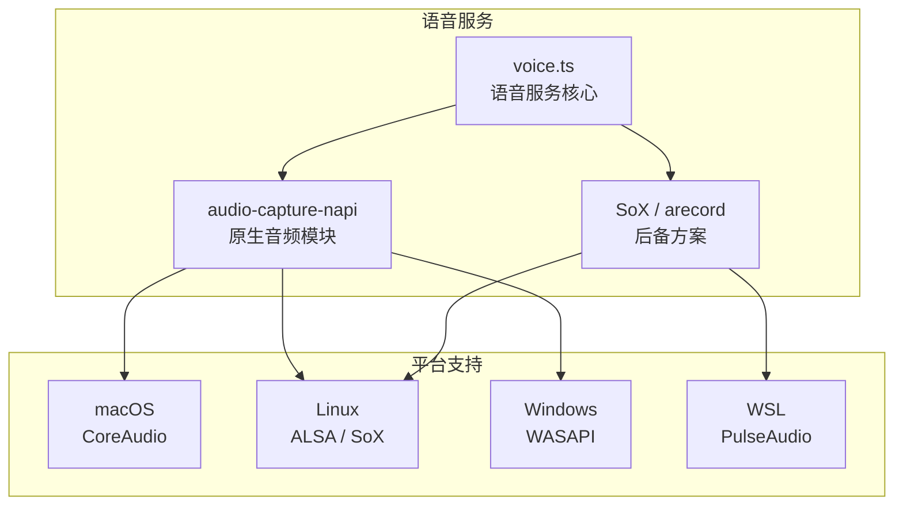
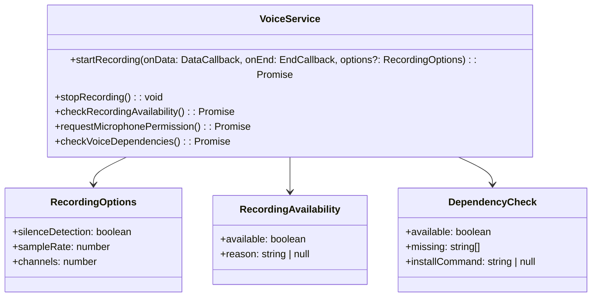
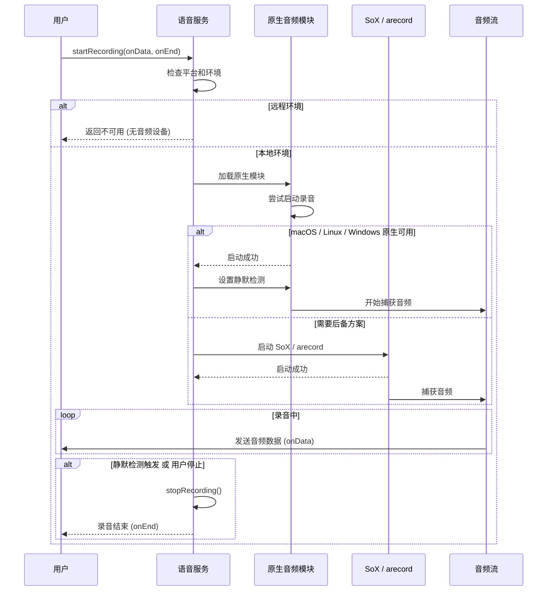
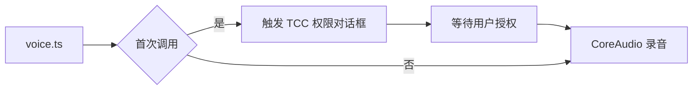
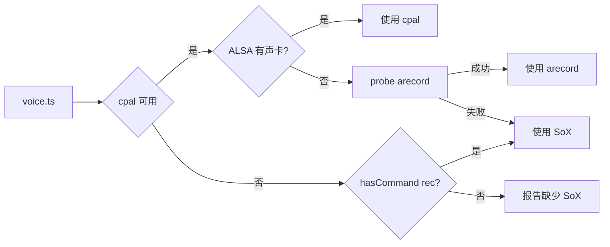
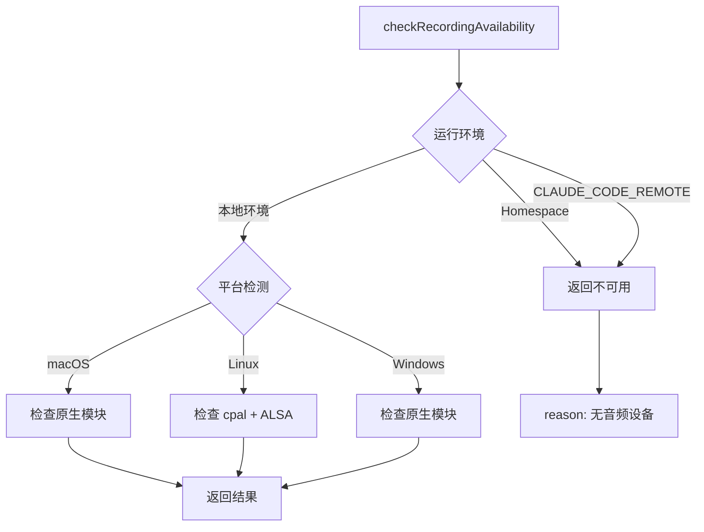

# 语音服务

## 概览

语音服务（Voice Service）是 Claude Code 的音频录制模块，提供麦克风访问和语音输入功能。该服务使 Claude Code 支持语音交互，用户可以通过语音命令与 AI 助手对话。

语音服务采用跨平台设计，支持：
- **macOS**：使用原生 CoreAudio + AudioUnit 框架
- **Linux**：使用 ALSA (cpal) 或 SoX/arecord 后备方案
- **Windows**：使用 WASAPI (cpal)
- **WSL**：支持 WSLg 音频（Windows 11）

## 架构位置



## 核心功能

| 功能 | 说明 | 相关 API |
|------|------|---------|
| 录音启动/停止 | 控制音频录制状态 | `startRecording`, `stopRecording` |
| 麦克风检测 | 检查麦克风可用性 | `checkRecordingAvailability` |
| 权限请求 | 请求麦克风访问权限 | `requestMicrophonePermission` |
| 静默检测 | 自动检测静默结束录音 | 内置于 `startRecording` |
| 依赖检查 | 检查 SoX 等依赖是否安装 | `checkVoiceDependencies` |

## 文件结构

```
services/
└── voice.ts          # 语音服务实现
```

## 核心类型



## 录音流程



## 平台特定行为

### macOS



### Linux



### Windows

| 情况 | 行为 |
|------|------|
| 原生模块可用 | 使用 WASAPI 录音 |
| 原生模块不可用 | 返回错误（无后备方案） |

### WSL

| 环境 | 行为 |
|------|------|
| WSLg (Win11) | arecord 通过 PulseAudio 成功 |
| WSL1 / Win10 | 返回"无音频设备"错误 |

## API 摘要

### VoiceService

| 方法 | 说明 | 返回类型 |
|------|------|---------|
| `startRecording` | 开始录音 | `Promise<boolean>` |
| `stopRecording` | 停止录音 | `void` |
| `checkRecordingAvailability` | 检查录音可用性 | `Promise<RecordingAvailability>` |
| `requestMicrophonePermission` | 请求麦克风权限 | `Promise<boolean>` |
| `checkVoiceDependencies` | 检查依赖项 | `Promise<DependencyCheck>` |

### 录制选项

```typescript
interface RecordingOptions {
  silenceDetection?: boolean  // 是否启用静默检测（默认 true）
}

interface RecordingAvailability {
  available: boolean           // 是否可用
  reason: string | null        // 不可用时的原因
}

interface DependencyCheck {
  available: boolean           // 依赖是否满足
  missing: string[]            // 缺失的依赖
  installCommand: string | null // 安装命令提示
}
```

### 音频格式

| 参数 | 值 | 说明 |
|------|---|------|
| 采样率 | 16000 Hz | 语音识别优化 |
| 声道数 | 1 (单声道) | 语音单声道足够 |
| 位深度 | 16 位 | 标准 CD 质量 |
| 格式 | S16_LE | 有符号小端序 |

## 使用示例

### 基本录音

```typescript
import { startRecording, stopRecording } from './services/voice'

// 开始录音
const started = await startRecording(
  (chunk: Buffer) => {
    // 处理音频数据块
    audioBuffer.push(chunk)
  },
  () => {
    // 录音结束回调
    console.log('Recording finished')
    processAudioBuffer()
  }
)

if (started) {
  console.log('Recording started...')
  // 录音进行中...

  // 停止录音
  stopRecording()
}
```

### 静默检测

```typescript
// 启用静默检测（默认）
await startRecording(
  (chunk) => { /* 处理音频 */ },
  () => { /* 静默超时后自动触发 */ },
  { silenceDetection: true }  // 静默 2 秒后自动停止
)

// 禁用静默检测（推送通话模式）
await startRecording(
  (chunk) => { /* 处理音频 */ },
  () => { /* 用户手动停止 */ },
  { silenceDetection: false }  // 持续录音直到 stopRecording()
)
```

### 检查可用性

```typescript
import { checkRecordingAvailability, checkVoiceDependencies } from './services/voice'

// 检查录音可用性
const availability = await checkRecordingAvailability()
if (!availability.available) {
  console.error('Recording not available:', availability.reason)
  return
}

// 检查依赖项
const deps = await checkVoiceDependencies()
if (!deps.available) {
  console.error('Missing dependencies:', deps.missing)
  if (deps.installCommand) {
    console.log('Install with:', deps.installCommand)
  }
}
```

### 请求麦克风权限

```typescript
import { requestMicrophonePermission } from './services/voice'

const granted = await requestMicrophonePermission()
if (granted) {
  console.log('Microphone permission granted')
} else {
  console.error('Microphone permission denied')
}
```

## 静默检测配置

### SoX 参数

```bash
# 静默检测参数
silence 1 0.1 3% 1 2.0 3%
#    │  │    │  │  │   │
#    │  │    │  │  │   └── 停止阈值 (3%)
#    │  │    │  │  └────── 停止持续时间 (2.0秒)
#    │  │    │  └───────── 开始阈值 (3%)
#    │  │    └──────────── 开始持续时间 (0.1秒)
#    │  └────────────────── 位置 (1 = 文件开始后)
#    └───────────────────── 保留参数
```

### 原生模块静默检测

```typescript
// audio-capture-napi 内部实现
napi.startNativeRecording(
  (data: Buffer) => {
    // 音频数据回调
    onData(data)
  },
  () => {
    // 静默检测触发回调
    nativeRecordingActive = false
    onEnd()
  }
)
```

## 远程环境处理



## 依赖项检测

| 平台 | 必需依赖 | 后备方案 |
|------|---------|---------|
| macOS | audio-capture-napi | 无 |
| Linux (cpal) | audio-capture-napi + ALSA | SoX / arecord |
| Linux (无 cpal) | SoX / arecord | 无 |
| Windows | audio-capture-napi | 无 |
| WSL | PulseAudio + arecord | 无 |

### 安装命令提示

```typescript
// macOS - Homebrew
'brew install sox'

// Linux - apt-get
'sudo apt-get install -y sox'

// Linux - dnf
'sudo dnf install -y sox'

// Linux - pacman
'sudo pacman -S --noconfirm sox'
```

## 最佳实践

### 推荐模式

| 场景 | 推荐做法 |
|------|---------|
| 录音启动 | 在用户明确意图后启动（按键触发） |
| 静默检测 | 大多数场景启用，配合推送通话 |
| 错误处理 | 优雅处理权限拒绝和无音频设备 |
| 资源清理 | 录音结束后及时调用 stopRecording |

### 避免事项

| 做法 | 问题 | 替代方案 |
|------|------|---------|
| 启动时预加载 | 阻塞事件循环 1-8 秒 | 首次按键时懒加载 |
| 静默检测误触发 | 短停顿时断开 | 调整 SILENCE_DURATION_SECS |
| 忽视权限拒绝 | 用户困惑 | 提供清晰的错误提示 |

## 设计决策

### 1. 懒加载原生模块

audio-capture-napi 使用 dlopen 加载，会阻塞事件循环 1-8 秒。因此只在首次语音按键时加载，而非应用启动时。

### 2. 平台后备链

| 平台 | 优先级 |
|------|-------|
| macOS | cpal > 错误 |
| Linux | cpal > arecord > SoX |
| Windows | cpal > 错误 |
| WSL | arecord > SoX > 错误 |

### 3. 探针记录机制

使用探针记录验证音频设备实际可用性，而非仅检查命令存在。

## 源码引用

- [services/voice.ts](/restored-src/src/services/voice.ts)
- [vendor/audio-capture-src/index.ts](https://github.com/anthropics/claude-code-vendor/blob/main/audio-capture-src/index.ts) - 原生音频模块

## 相关文档

- [助手服务索引](_index.md)
- [Agent 工具](../agent/agent-tool.md) - 语音命令处理
- [主页](../index.md)

---

*Generated by [Nium-Wiki v0.0.0](https://github.com/niuma996/nium-wiki) | 2026-04-02*
