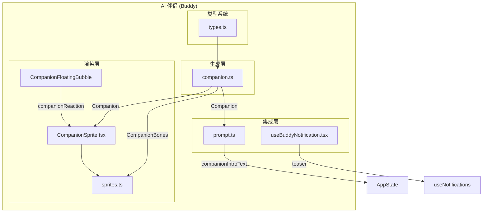
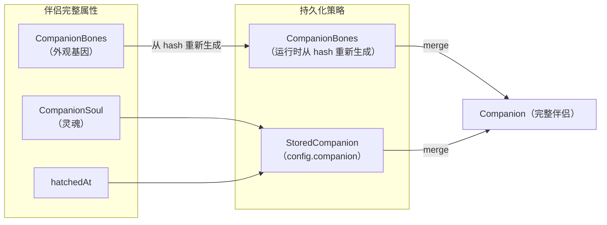
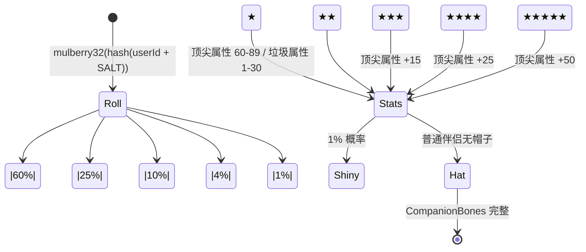
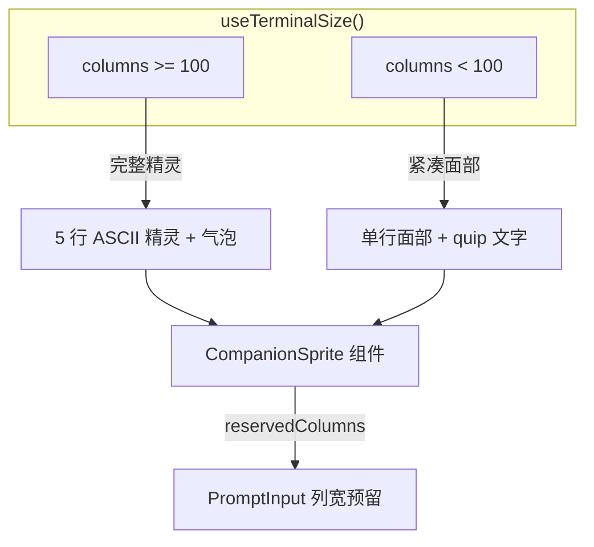

# AI 伴侣 (Buddy)

## 概览

AI 伴侣（Buddy）是 Claude Code 的一个趣味化陪伴功能，在终端界面中以 ASCII 艺术生物的形式呈现，具有随机生成的属性（物种、外观、性格）和独立的交互能力。伴侣会在对话过程中以气泡形式表达反应（reaction），用户也可以通过 `/buddy` 命令与伴侣互动。

Buddy 不是一个辅助性功能，而是一个完整的端到端子系统，包含：
- **随机生成系统**：基于用户 ID 的确定性抽卡机制（Companion Bones + Soul 模型）
- **渲染系统**：19 种 ASCII 艺术精灵，支持动画帧
- **React UI 组件**：气泡渲染、终端列宽预留、浮动气泡
- **提示词集成**：伴侣介绍文本注入系统提示词
- **公告通知**：首启动彩虹公告（限时）

## 子模块

| 模块 | 说明 | 文档 |
|------|------|------|
| [Companion 抽卡系统](companion.md) | 确定性随机生成、属性计算、缓存 | [companion.md](companion.md) |
| [Sprites 精灵渲染](sprites.md) | 19 种 ASCII 艺术、动画帧、面部渲染 | [sprites.md](sprites.md) |
| [CompanionSprite UI](companion-sprite-ui.md) | React 组件、气泡、动画计时器 | [companion-sprite-ui.md](companion-sprite-ui.md) |
| [Buddy 通知与提示](buddy-notifications.md) | 彩虹公告、/buddy 命令位置检测 | [buddy-notifications.md](buddy-notifications.md) |

## 架构位置



## 核心概念

### Bones vs. Soul 分离模型

Buddy 的持久化模型将伴侣拆分为两个独立维度：



| 维度 | 内容 | 持久化位置 | 生成方式 |
|------|------|-----------|---------|
| **Bones**（外观） | rarity, species, eye, hat, shiny, stats | **不持久化** | `hash(userId)` 确定性生成 |
| **Soul**（灵魂） | name, personality | `config.companion` | AI 模型在孵化时生成 |
| **hatchedAt** | 孵化时间戳 | `config.companion` | 首次孵化时记录 |

**关键设计**：Bones 不持久化，每次读取时从 `hash(userId)` 重新生成。这防止了：
1. 用户通过修改配置文件刷出更高稀有度
2. 当代码中物种名改变（如"duck"→"waterfowl"）时旧伴侣丢失

### 稀有度体系



| 稀有度 | 概率 | 顶级属性范围 | 垃圾属性范围 |
|--------|------|-------------|-------------|
| common | 60% | 60–89 | 1–30 |
| uncommon | 25% | 65–89 | 1–30 |
| rare | 10% | 70–89 | 1–30 |
| epic | 4% | 80–89 | 1–30 |
| legendary | 1% | 85–89 | 1–30 |

## 交互能力

### 气泡反应

伴侣会在对话过程中通过 `AppState.companionReaction` 接收反应文本，显示在 ASCII 精灵旁的气泡中：

```
    /\_/\
   ( o.o )  ← ASCII 精灵
    > ^ <
  ┌────────┐
  │ 哇！    │  ← 气泡（10 秒后淡出）
  │ 好厉害！ │
  └────────┘
```

### 用户命令

| 命令 | 效果 |
|------|------|
| `/buddy` | 显示伴侣信息（名称、稀有度、性格） |
| `/buddy pet` | 触发爱心动画（浮动 ♥ 字符 2.5 秒） |
| `/buddy rename <name>` | 重命名伴侣（修改 soul） |

### 终端宽度适配



## 发布时序

```mermaid
gantt
    dateFormat  X
    axisFormat  %m-%d

    section 功能
    /buddy 命令激活      :active, 04-01, 7d
    彩虹公告窗口          :active, 04-01, 7d
    Companion 机制激活   :04-01, 30d
```



- **4 月 1-7 日**：彩虹公告窗口（`isBuddyTeaserWindow()`），向未孵化伴侣的用户显示提示
- **4 月 1 日起**：`isBuddyLive()` 恒为 true，功能全面激活

## 源码引用

- [types.ts](/src/buddy/types.ts)
- [companion.ts](/src/buddy/companion.ts)
- [sprites.ts](/src/buddy/sprites.ts)
- [CompanionSprite.tsx](/src/buddy/CompanionSprite.tsx)
- [useBuddyNotification.tsx](/src/buddy/useBuddyNotification.tsx)
- [prompt.ts](/src/buddy/prompt.ts)

## 相关文档

- [Companion 抽卡系统](companion.md)
- [Sprites 精灵渲染](sprites.md)
- [CompanionSprite UI](companion-sprite-ui.md)
- [Buddy 通知与提示](buddy-notifications.md)
- [主页](../index.md)
- [系统架构](../architecture.md)

---

*Generated by [Nium-Wiki v0.0.0](https://github.com/niuma996/nium-wiki) | 2026-04-01*
