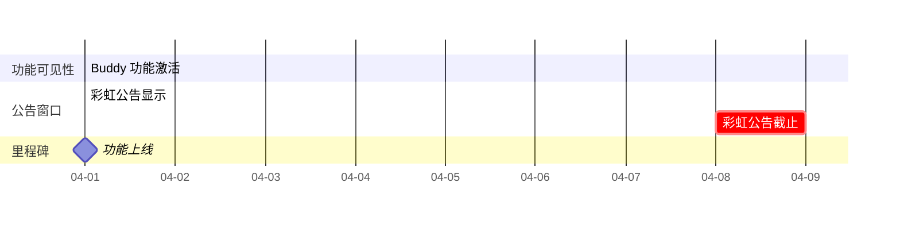
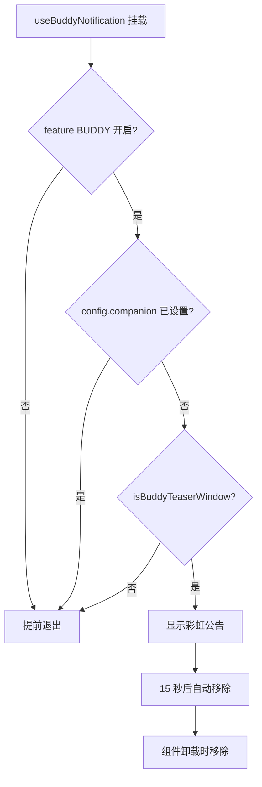
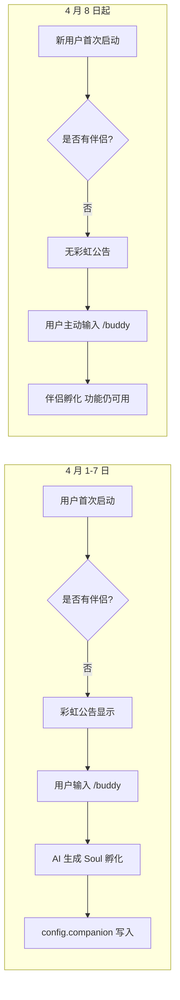

# Buddy 通知与提示

## 概览

`useBuddyNotification.tsx` 负责 Buddy 的首启动提示通知和 `/buddy` 命令触发位置检测。该模块是 Buddy 系统的发布与发现入口，通过限时彩虹公告（April 1-7, 2026）引导用户发现伴侣功能，并通过 `/buddy` 命令词位置检测使伴侣能够响应用户输入。

模块使用 Bun 的 React 编译器编译（`react/compiler-runtime`），是 Buddy 系统中唯一不涉及伴侣属性生成的纯 UI 模块。

## API 摘要

| 导出 | 说明 | 签名 |
|------|------|------|
| `isBuddyTeaserWindow()` | 判断是否在彩虹公告窗口内 | `() => boolean` |
| `isBuddyLive()` | 判断伴侣功能是否已上线 | `() => boolean` |
| `useBuddyNotification()` | React Hook：首启动彩虹公告 | `() => void` |
| `findBuddyTriggerPositions(text)` | 查找文本中 `/buddy` 触发位置 | `(text: string) => Array<{ start: number; end: number }>` |

## 时间窗口控制



### `isBuddyTeaserWindow()` — 公告窗口

```typescript
export function isBuddyTeaserWindow(): boolean {
  // ant 构建变体：始终返回 true（测试/演示用）
  if (isAntBuild()) return true

  // 生产：2026 年 4 月 1-7 日（本地时间）
  const now = new Date()
  return (
    now.getFullYear() === 2026 &&
    now.getMonth() === 3 &&       // 0-indexed: 3 = April
    now.getDate() <= 7
  )
}
```

**使用本地时间而非 UTC**：公告窗口基于用户设备时间，确保全球用户在各自时区的 4 月 1-7 日都能看到公告。

**为什么是 April 1-7？** 这对应 Buddy 功能的发布窗口（April 1 首发），公告在发布后一周内展示。

### `isBuddyLive()` — 功能上线

```typescript
export function isBuddyLive(): boolean {
  // ant 构建变体：始终 true
  if (isAntBuild()) return true

  // 生产：2026 年 4 月之后（忽略具体日期）
  const now = new Date()
  return now.getFullYear() > 2026 ||
    (now.getFullYear() === 2026 && now.getMonth() >= 3)
}
```

| 条件 | `isBuddyTeaserWindow()` | `isBuddyLive()` |
|------|------------------------|-----------------|
| 2026-04-01 ~ 04-07 | `true` | `true` |
| 2026-04-08 ~ 04-30 | `false` | `true` |
| 2026-05-01 | `false` | `true` |
| 2026-03-15 | `false` | `false` |

## 彩虹公告通知 (`useBuddyNotification`)

### 触发条件



### 公告内容

```typescript
// 使用彩虹色渲染 "/buddy" 文字
const buddyText = getRainbowColor('/buddy')  // 彩虹渐变字符

// 通知标题
const title = `🎉 你的新编程伙伴来了！`

// 通知正文
const body = `${buddyText} 召唤你的专属 AI 伴侣
一起写代码，搞清楚那个 bug 在哪`

// 类型
type = 'buddy-teaser'

// 优先级
priority = 'immediate'

// 超时
timeout = 15000  // 15 秒
```

### React Hook 实现

```typescript
export function useBuddyNotification(): void {
  const { addNotification, removeNotification } = useNotifications()

  useEffect(() => {
    // 1. 特性开关检查
    if (!feature('BUDDY')) return

    // 2. 已孵化伴侣检查（config.companion 存在则用户已看到）
    const { companion } = getGlobalConfig()
    if (companion) return

    // 3. 公告窗口检查
    if (!isBuddyTeaserWindow()) return

    // 4. 显示公告
    const id = addNotification({
      type: 'buddy-teaser',
      title: '🎉 你的新编程伙伴来了！',
      body: `${getRainbowColor('/buddy')} 召唤你的专属 AI 伴侣`,
      immediate: true,
      timeout: 15000,
    })

    // 5. 清理函数：移除通知
    return () => removeNotification(id)
  }, [])  // 空依赖数组，仅在挂载时执行一次
}
```

### 公告效果

用户首次启动 Claude Code 时（伴侣尚未孵化且在公告窗口内），会在通知区域看到一个彩虹渐变的 "/buddy" 文字提示，点击或输入 `/buddy` 命令即可孵化伴侣。

## `/buddy` 命令位置检测

```typescript
export function findBuddyTriggerPositions(
  text: string,
): Array<{ start: number; end: number }> {
  // 匹配词边界的 /buddy
  const regex = /\/buddy\b/g
  const positions: Array<{ start: number; end: number }> = []

  let match: RegExpExecArray | null
  while ((match = regex.exec(text)) !== null) {
    positions.push({
      start: match.index,
      end: match.index + match[0].length,
    })
  }

  return positions
}
```

### 使用场景

```typescript
import { findBuddyTriggerPositions } from './buddy/useBuddyNotification'

// 输入处理器检测用户是否正在输入 /buddy
function handleInput(text: string) {
  const positions = findBuddyTriggerPositions(text)

  if (positions.length > 0) {
    // 高亮 /buddy 命令词
    for (const { start, end } of positions) {
      highlightRange(start, end, 'buddy-command')
    }
  }

  // 如果用户完整输入了 /buddy（回车提交），触发伴侣孵化
  if (text.trim() === '/buddy') {
    hatchCompanion()
  }
}
```

### 匹配示例

| 输入文本 | 匹配结果 |
|---------|---------|
| `/buddy pet` | `[{ start: 0, end: 5 }]` |
| `试试 /buddy rename 小黄` | `[{ start: 3, end: 8 }]` |
| `/buddybug` | 无匹配（`\b` 要求词边界） |
| `我的/buddy朋友` | 无匹配（`\b` 要求词边界） |

## 发布时序设计



公告关闭后（Budd y Teaser Window 结束后），功能本身依然可用，只是首次启动不再有引导通知。

## 设计决策

### 为什么不直接在启动时弹窗？

使用通知系统而非弹窗，保持了 Claude Code 的 REPL 交互模式。通知在屏幕角落非阻塞展示，用户可以继续使用 CLI，不会被打断工作流。

### 为什么是 `\b` 词边界？

确保 `/buddy` 命令不会被错误高亮为 `/buddybug` 或 `/buddy_something`。词边界 `\b` 确保匹配的是独立的命令词。

### ant 构建变体的无条件返回

`isAntBuild()` 检查确保在测试/演示构建中，功能始终可用（不受日期限制），便于开发和演示。

## 源码引用

- [useBuddyNotification.tsx](/src/buddy/useBuddyNotification.tsx)
- [prompt.ts](/src/buddy/prompt.ts) — 伴侣介绍文本注入

## 相关文档

- [AI 伴侣总览](_index.md)
- [CompanionSprite UI](companion-sprite-ui.md)
- [Buddy 提示词集成](buddy-prompt.md)

---

*Generated by [Nium-Wiki v0.0.0](https://github.com/niuma996/nium-wiki) | 2026-04-01*
