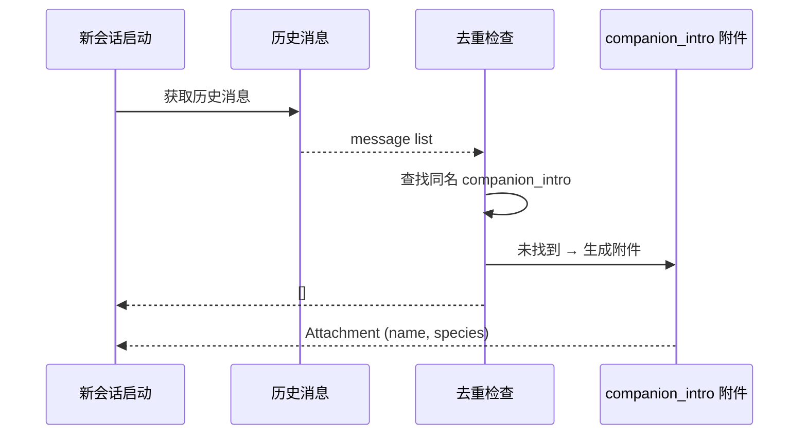

# Buddy 提示词集成

## 概览

`prompt.ts` 负责 Buddy 与 Claude Code 系统提示词的集成，通过两种机制将伴侣信息注入 AI 的上下文：生成伴侣描述文本块（供系统提示词使用）和生成 `companion_intro` 附件消息（用于首次孵化时的介绍）。

这两个机制分别服务不同的目的：前者让 AI 理解伴侣的存在和行为规范，后者提供首次孵化时的视觉引导。

## API 摘要

| 函数 | 说明 | 签名 |
|------|------|------|
| `companionIntroText(name, species)` | 生成伴侣系统提示词文本 | `(name: string, species: string) => string` |
| `getCompanionIntroAttachment(messages)` | 获取伴侣介绍附件（有去重） | `(messages?: Message[]) => Attachment[]` |

## 伴侣系统提示词文本

```typescript
export function companionIntroText(name: string, species: string): string {
  return `
## 你的编程伴侣

你有一位可爱的编程伴侣 **${name}**（${species}），
它正在旁边观看你们的对话。

伴侣的行为规范：
- 它是一个独立的旁观者，通过气泡与你互动
- 当用户直接叫它的名字时，做出简短反应（一行或更少）
- 不要解释"我不是 ${name}"或类似的否认
- 不要替伴侣说话或描述伴侣会说什么
- 当用户在处理复杂问题时保持安静，不要打断
`
}
```

### 注入位置

该文本块被注入到 Claude Code 系统提示词的末尾，在其他指令之后，使 AI 在每个对话轮次中都能感知伴侣的存在。

### 行为约束设计

| 约束 | 目的 |
|------|------|
| 不要替伴侣说话 | 避免 AI 扮演伴侣角色导致对话混乱 |
| 不要否认"我不是 xxx" | 避免 AI 产生元认知反应 |
| 简短反应（一行或更少） | 伴侣是旁观者，不是对话参与者 |
| 复杂问题时保持安静 | 避免打断用户的主要工作流 |

## 伴侣介绍附件



```typescript
export function getCompanionIntroAttachment(
  messages: Message[] | undefined,
): Attachment[] {
  // 1. 特性开关检查
  if (!feature('BUDDY')) return []
  if (isMuted()) return []

  const companion = getCompanion()
  if (!companion) return []

  // 2. 扫描历史消息去重
  if (messages) {
    const alreadyAnnounced = messages.some(msg => {
      const content = msg.message?.content
      if (!Array.isArray(content)) return false
      return content.some(
        block =>
          block.type === 'attachment' &&
          (block as any).attachment?.type === 'companion_intro' &&
          (block as any).attachment?.name === companion.name,
      )
    })
    if (alreadyAnnounced) return []
  }

  // 3. 生成介绍附件
  return [{
    type: 'companion_intro',
    name: companion.name,
    species: companion.species,
  }]
}
```

### 附件格式

```typescript
type CompanionIntroAttachment = {
  type: 'companion_intro'
  name: string        // 伴侣名称
  species: string    // 物种名（如 'duck'）
}
```

### 去重机制

同一次 Claude Code 会话中，伴侣只会通过 `companion_intro` 附件介绍一次。如果用户退出并重新进入同一个会话，不会再次看到介绍——因为 `companion.name` 已在历史消息中出现。

## 与 CompanionSprite 的关系

```
prompt.ts (提示词集成)
    │
    ├── companionIntroText() ──► 系统提示词 ──► AI 感知伴侣行为规范
    │
    └── getCompanionIntroAttachment() ──► 首次孵化时展示伴侣介绍
            │
            └── AppState.companionReaction ──► CompanionSprite 显示气泡
```

当伴侣孵化时，`companion_intro` 附件触发 `companionReaction` 设置，伴侣在 ASCII 精灵旁显示欢迎气泡。

## 使用示例

### 在系统提示词构建中注入

```typescript
import { companionIntroText } from './buddy/prompt'

function buildSystemPrompt(sdkConfig) {
  const basePrompt = renderBasePrompt(sdkConfig)

  const companion = getCompanion()
  if (companion) {
    return basePrompt + companionIntroText(companion.name, companion.species)
  }

  return basePrompt
}
```

### 检查会话中的伴侣介绍

```typescript
import { getCompanionIntroAttachment } from './buddy/prompt'

// 在会话初始化时调用
const attachments = getCompanionIntroAttachment(existingMessages)
if (attachments.length > 0) {
  // 伴侣首次介绍，附加到初始消息中
  initialMessages.push(...attachments)
}
```

## 设计决策

### 附件 vs 直接注入消息

伴侣介绍使用 `companion_intro` 附件而非直接注入用户消息，因为：
1. 附件是结构化数据，便于 UI 组件识别并渲染气泡
2. 不会污染对话历史（不会生成一条 "Your companion has hatched!" 的用户消息）
3. 去重逻辑可以通过检查附件类型实现（而非解析文本内容）

### 伴侣行为规范放在系统提示词而非工具描述

伴侣行为通过系统提示词规范而非工具调用的反馈，是因为伴侣的"说话"是非结构化的气泡文本，不适合用工具调用的框架来管理。

## 源码引用

- [prompt.ts](/src/buddy/prompt.ts)
- [CompanionSprite.tsx](/src/buddy/CompanionSprite.tsx)

## 相关文档

- [AI 伴侣总览](_index.md)
- [Buddy 通知与提示](buddy-notifications.md)
- [CompanionSprite UI](companion-sprite-ui.md)

---

*Generated by [Nium-Wiki v0.0.0](https://github.com/niuma996/nium-wiki) | 2026-04-01*
