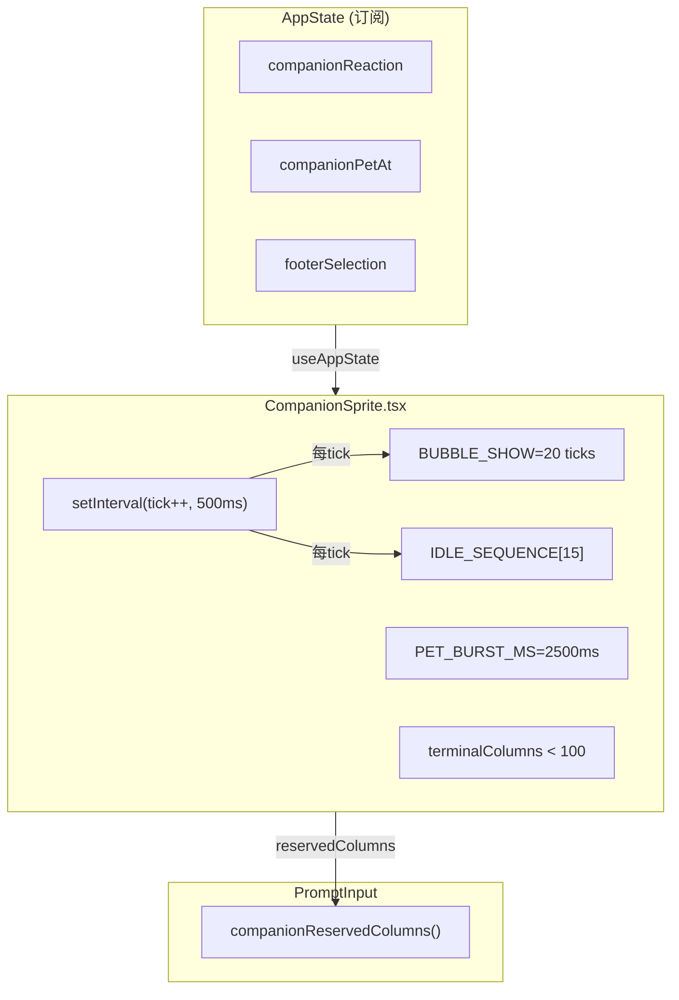
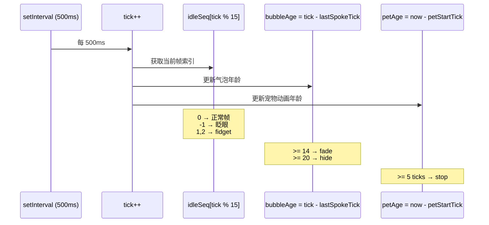
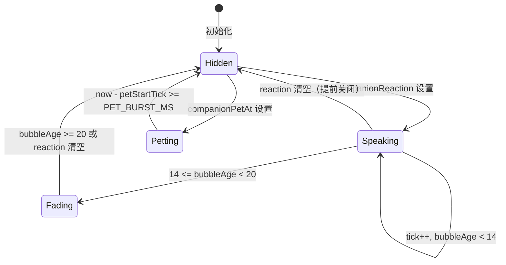
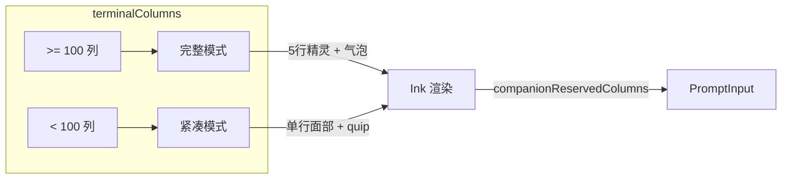
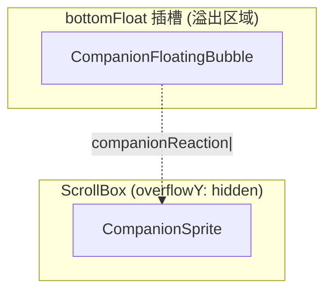

# CompanionSprite UI

## 概览

`CompanionSprite.tsx` 是 Buddy 的核心 React UI 组件，负责在终端中渲染伴侣的 ASCII 艺术精灵和对话气泡。组件处理完整的动画生命周期：待机微动（idle fidget）、眨眼、反应气泡（带淡出）、宠物动画，以及终端宽度适配（完整 5 行 vs 紧凑单行面部）。

组件由 Bun 的 React 编译器编译（`react/compiler-runtime`），通过 `setInterval` 驱动 500ms 节拍器实现所有动画状态。

## 架构位置



## API 摘要

| 导出 | 说明 | 签名 |
|------|------|------|
| `MIN_COLS_FOR_FULL_SPRITE` | 完整精灵最低列宽 | `100` |
| `companionReservedColumns()` | 计算伴侣占用的列数 | `(terminalColumns, speaking) => number` |
| `CompanionSprite` | 主精灵组件 | `() => React.ReactNode` |
| `CompanionFloatingBubble` | 全屏浮动气泡组件 | `() => React.ReactNode` |

## 动画系统

### 节拍器驱动架构

所有动画状态均派生自单调递增的 `tick` 值，无需复杂状态机：

```typescript
const TICK_MS = 500           // 节拍间隔
const BUBBLE_SHOW = 20         // 气泡显示 ticks 数（~10秒）
const FADE_WINDOW = 6          // 淡出窗口 ticks 数（~3秒）
const PET_BURST_MS = 2500      // 宠物动画持续时间

const IDLE_SEQUENCE = [
  // 0: 站立帧   1: fidget帧1   -1: 眨眼   2: fidget帧2
  0, 0, 0, 0, 1, 0, 0, 0, -1, 0, 0, 2, 0, 0, 0,
]
//              ↑         ↑         ↑
//           fidget1   眨眼     fidget2
```



### 待机动画帧映射

| `IDLE_SEQUENCE[i]` | 含义 | 眼睛处理 |
|--------------------|------|---------|
| `0` | 站立帧 | 显示实际眼睛字符 |
| `1` | 微动帧1 | 显示实际眼睛字符 |
| `-1` | 眨眼帧 | 眼睛替换为 `-` |
| `2` | 微动帧2 | 显示实际眼睛字符 |

### 气泡生命周期



- **Speaking**（0–14 ticks）：正常气泡，边框为 `success` 颜色
- **Fading**（14–20 ticks）：气泡开始淡出，边框切换为 `inactive` 颜色
- **Hidden**（> 20 ticks）：气泡隐藏，`bubbleAge` 不再更新

### 宠物动画

当用户执行 `/buddy pet` 时，`AppState.companionPetAt` 被设置为当前时间戳：

```typescript
// CompanionSprite 订阅 companionPetAt
const petStartTick = petStart.current ? tick : -1
const petAge = petStartTick >= 0 ? tick - petStartTick : -1

// petAge >= 0 时显示浮动爱心
// petAge >= 5 (2500ms) 时停止
```

爱心字符数组 `PET_HEARTS = ['♥', '❤', '🧡', '💛', '💚']` 以 500ms 间隔循环。

### 同步渲染（sync-during-render）

```typescript
// 宠物开始时间在渲染期间读取，而非 useEffect
const petStartTick = petStart.current ? tick : -1
```

**为什么这样写？** 如果宠物动画在 `useEffect` 中设置 `petStartTick = tick`，第一次渲染后的效果会将 `petAge` 设为正值，跳过第一帧宠物动画。通过在渲染期间同步读取，可以确保第一次渲染就能看到宠物动画帧。

## 终端宽度适配



### Full 模式（≥ 100 列）

```
    /\_/\          ┌────────────────────┐
   ( o.o )  ← 5行  │ 你好！需要我帮忙吗？ │  ← 气泡
    > ^ <           └────────────────────┘
   /|   |\
```

### Compact 模式（< 100 列）

```
  (✦> Quackers
```

## 气泡组件 (`SpeechBubble`)

```typescript
// 私有组件，导出在 CompanionSprite 内部
function SpeechBubble({
  text,
  fade,
  tail,
}: {
  text: string
  fade: boolean
  tail: 'right' | 'down'
}): React.ReactNode
```

| 属性 | 说明 |
|------|------|
| `text` | 气泡文本内容 |
| `fade` | 淡出状态（切换边框颜色） |
| `tail` | 气泡尾巴方向（`right`=水平，`down`=对角） |

**自动换行**：气泡文本按 30 字符自动换行（`wrap(text, 30)`）。

## 列宽预留 (`companionReservedColumns`)

```typescript
export function companionReservedColumns(
  terminalColumns: number,
  speaking: boolean,
): number {
  // 特性关闭 / 无伴侣 / 静音 / 终端太窄 → 0
  if (!feature('BUDDY')) return 0
  if (!companion) return 0
  if (isMuted) return 0
  if (terminalColumns < 60) return 0

  // 宽度计算：名字 + 精灵宽度 + 内边距 + 气泡（说话中）
  const spriteWidth = stringWidth(buddyName) + 12
  const padding = 3
  const bubble = speaking && !fullscreen ? BUBBLE_WIDTH : 0

  return spriteWidth + padding + bubble
}
```

`PromptInput` 组件调用此函数，将文本输入区域的宽度相应缩减，确保伴侣和气泡不被文本覆盖。

## 全屏浮动气泡 (`CompanionFloatingBubble`)

全屏模式下（`isFullscreenActive()`），气泡渲染在独立的 `bottomFloat` 插槽中，超出 `overflowY: hidden` 的 `ScrollBox` 区域：



这样做的好处是气泡可以延伸入下方区域而不被 `ScrollBox` 的 `overflow: hidden` 裁剪。

## 使用示例

### 渲染伴侣组件

```tsx
import { CompanionSprite } from './buddy/CompanionSprite'
import { Box } from 'ink'

// 在 REPL 界面的某处挂载
function BuddyArea() {
  return (
    <Box>
      <CompanionSprite />
    </Box>
  )
}
```

### 获取伴侣占用的宽度

```typescript
import { companionReservedColumns, MIN_COLS_FOR_FULL_SPRITE } from './buddy/CompanionSprite'
import { useTerminalSize } from './hooks/useTerminalSize'

function InputArea() {
  const { columns } = useTerminalSize()
  const { companionReaction } = useAppState()
  const speaking = !!companionReaction

  const reserved = companionReservedColumns(columns, speaking)

  return (
    <Box width={columns - reserved}>
      <TextInput />
    </Box>
  )
}
```

### 触发宠物动画

```typescript
import { useSetAppState } from './state/AppState'

function PetBuddy() {
  const setAppState = useSetAppState()
  // 用户执行 /buddy pet
  setAppState({ companionPetAt: Date.now() })
  // CompanionSprite 自动检测并显示 5 帧爱心动画
}
```

## 设计决策

### tick 值驱动 vs React 状态

所有动画状态（帧索引、气泡年龄、宠物年龄）均派生自 `tick`，而不是维护独立的状态变量。这避免了多个 `useState` 之间的同步问题（如气泡刚消失时宠物动画立即开始，不会出现中间帧）。

### Ink `Box` vs 标准 React

整个 Claude Code UI 使用 Ink（类 React 的终端 UI 库）而非标准 React DOM。Ink 的 `<Box>` 组件提供 flexbox 布局，`<Text>` 组件提供带样式的文本。

### 全屏气泡单独挂载

全屏模式下气泡需要超出父级 `ScrollBox` 的裁剪边界，通过 `bottomFloat` 插槽渲染是 Ink 框架的标准布局模式，避免使用 `z-index` 或 DOM 重排。

## 源码引用

- [CompanionSprite.tsx](/src/buddy/CompanionSprite.tsx)

## 相关文档

- [AI 伴侣总览](_index.md)
- [Companion 抽卡系统](companion.md)
- [Sprites 精灵渲染](sprites.md)
- [Buddy 通知与提示](buddy-notifications.md)

---

*Generated by [Nium-Wiki v0.0.0](https://github.com/niuma996/nium-wiki) | 2026-04-01*
