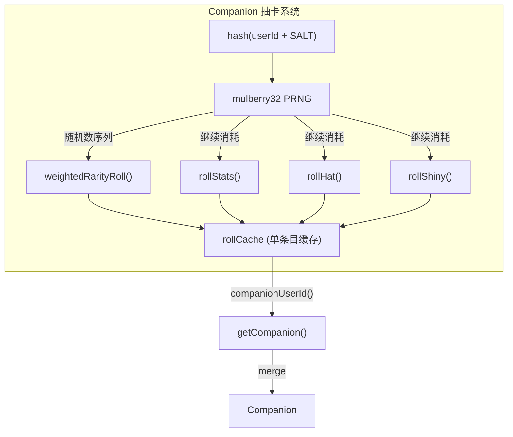

# Companion 抽卡系统

## 概览

Companion 抽卡系统是 Buddy 的核心随机生成引擎，基于用户 ID 的确定性哈希为每个用户生成独一无二的伴侣属性（Bones）。系统采用 Bones/Soul 分离架构：外观属性（Bones）由 `hash(userId)` 实时重新生成，永不持久化；灵魂属性（Soul）由 AI 模型在孵化时生成并持久化存储。

核心目标：防止用户通过修改配置文件刷稀有度，同时确保每次会话都能可靠地重建伴侣状态。

## 架构位置



## API 摘要

| 函数 | 说明 | 签名 |
|------|------|------|
| `roll(userId)` | 确定性抽卡（使用当前用户 ID） | `(userId: string) => Roll` |
| `rollWithSeed(seed)` | 确定性抽卡（使用自定义种子） | `(seed: string) => Roll` |
| `companionUserId()` | 获取当前伴侣用户的 ID | `() => string` |
| `getCompanion()` | 获取完整伴侣（Bones + Soul 合并） | `() => Companion \| undefined` |

## 数据类型

### Roll

```typescript
export type Roll = {
  bones: CompanionBones   // 抽卡生成的完整外观属性
  inspirationSeed: number // 可用于 AI 生成灵魂的随机种子
}
```

### CompanionBones（运行时生成，不持久化）

```typescript
export type CompanionBones = {
  rarity: Rarity          // 'common' | 'uncommon' | 'rare' | 'epic' | 'legendary'
  species: Species        // 'duck' | 'cat' | 'dragon' | ... (19种)
  eye: Eye               // '·' | '✦' | '×' | '◉' | '@' | '°'
  hat: Hat               // 'none' | 'crown' | 'tophat' | ...
  shiny: boolean         // 是否闪光（1% 概率）
  stats: Record<StatName, number>  // 5 维性格属性
}
```

### StoredCompanion（持久化）

```typescript
export type StoredCompanion = {
  name: string        // 伴侣名称（用户自定义或 AI 生成）
  personality: string // 伴侣性格描述（AI 生成）
  hatchedAt: number  // 孵化时间戳
}
```

## 核心算法

### 1. 哈希 + 种子 PRNG

```typescript
// Mulberry32 — 快速确定性 PRNG，32 位输出
function mulberry32(seed: number): () => number {
  return function () {
    let t = (seed += 0x6d2b79f5)
    t = Math.imul(t ^ (t >>> 15), t | 1)
    t ^= t + Math.imul(t ^ (t >>> 7), t | 61)
    return ((t ^ (t >>> 14)) >>> 0) / 4294967296
  }
}

// 字符串哈希（优先使用 Bun.hash）
function hashString(str: string): number {
  if (typeof Bun !== 'undefined' && Bun.hash) {
    return Bun.hash(str) >>> 0  // 无符号 32 位
  }
  return fnv1a(str)  // FNV-1a 降级方案
}
```

**为什么不用 `Math.random()`？** 必须确定性：相同 userId 必须产生相同伴侣，即使在不同会话、不同机器上也是如此。

### 2. 稀有度加权抽卡

```typescript
const RARITY_WEIGHTS = {
  common: 60,
  uncommon: 25,
  rare: 10,
  epic: 4,
  legendary: 1,
} as const
// 总权重：100

function weightedRarityRoll(rand: () => number): Rarity {
  const total = 100
  let r = Math.floor(rand() * total)  // [0, 99]
  for (const [rarity, weight] of Object.entries(RARITY_WEIGHTS)) {
    r -= weight
    if (r < 0) return rarity as Rarity
  }
  return 'common'  // fallback
}
```

### 3. 属性点分配

```typescript
function rollStats(rarity: Rarity, rand: () => number): Record<StatName, number> {
  const floor = STAT_FLOORS[rarity]  // common=5, legendary=50
  const topMin = 60 + STAT_BONUSES[rarity]  // common=60, epic=80, legendary=85
  const topMax = 89 + STAT_BONUSES[rarity]

  const stats = {} as Record<StatName, number>

  // 1. 随机选择一个顶尖属性
  const topIndex = Math.floor(rand() * 5)
  const topStat = STAT_NAMES[topIndex]
  stats[topStat] = topMin + Math.floor(rand() * (topMax - topMin + 1))

  // 2. 随机选择一个垃圾属性
  const dumpIndex = (topIndex + 1 + Math.floor(rand() * 4)) % 5
  const dumpStat = STAT_NAMES[dumpIndex]
  stats[dumpStat] = 1 + Math.floor(rand() * 30)  // [1, 30]

  // 3. 其余 3 个属性：基础分 + 随机扰动
  for (const stat of STAT_NAMES) {
    if (stat in stats) continue
    stats[stat] = floor + Math.floor(rand() * (50 - floor))
  }

  return stats
}
```

**示例（legendary）：**
- 顶尖属性 DEBUGGING = 85 + 0~4 = **85–89**
- 垃圾属性 PATIENCE = **1–30**
- 其他属性 WISDOM/SNARK/CHAOS = **50–99**

### 4. 帽子分配

```typescript
function rollHat(rarity: Rarity, rand: () => number): Hat {
  // common 伴侣永远不会戴帽子
  if (rarity === 'common') return 'none'

  // 其他稀有度：随机分配
  const index = Math.floor(rand() * HATS.length)
  return HATS[index]
}
```

### 5. 闪光判定

```typescript
function rollShiny(rand: () => number): boolean {
  return rand() < 0.01  // 1% 概率，与稀有度无关
}
```

## 缓存策略

```typescript
let rollCache: { key: string; value: Roll } | null = null

export function roll(userId: string): Roll {
  const key = userId + SALT

  // 单条目缓存：命中时直接返回
  if (rollCache?.key === key) return rollCache.value

  const seed = hashString(key)
  const rand = mulberry32(seed)

  // 执行抽卡逻辑...
  const bones = { rarity, species, eye, hat, shiny, stats }
  const inspirationSeed = Math.floor(rand() * 0xffffff)

  const value = { bones, inspirationSeed }
  rollCache = { key, value }  // 写入缓存

  return value
}
```

**缓存必要性**：三个热路径高频调用 `roll()`：
1. `CompanionSprite.tsx` — 500ms 动画节拍器每tick调用
2. `PromptInput` — 每次按键调用
3. 每轮对话观察者调用

没有缓存会导致每 500ms 重新生成完整的伴侣状态，产生无意义的 CPU 消耗。

**SALT 防护**：`SALT = 'friend-2026-401'` 防止彩虹表攻击——攻击者无法直接用 userId 列表查表获取伴侣属性。

## `getCompanion()` 合并逻辑

```typescript
export function getCompanion(): Companion | undefined {
  // 1. 读取持久化的 Soul
  const stored = getGlobalConfig().companion as StoredCompanion | undefined
  if (!stored) return undefined  // 伴侣尚未孵化

  // 2. 实时生成 Bones（确定性）
  const { bones } = roll(companionUserId())

  // 3. 合并（bones 覆盖 stored 中任何同名字段）
  return { ...stored, ...bones } as Companion
}
```

**为什么 `...bones` 在 `...stored` 之后？** 确保旧格式配置中任何残留的 bones 字段被当前 hash 重新生成的正确值覆盖。

## 使用示例

### 获取伴侣（基础用法）

```typescript
import { getCompanion } from './buddy/companion'

const buddy = getCompanion()
if (buddy) {
  console.log(`${buddy.name} (${buddy.rarity} ${buddy.species})`)
  // → "Quackers (rare duck)"
  console.log('Stats:', buddy.stats)
  // → { DEBUGGING: 73, PATIENCE: 12, CHAOS: 61, WISDOM: 88, SNARK: 44 }
}
```

### 查看伴侣属性

```typescript
import { getCompanion } from './buddy/companion'
import { RARITY_STARS, RARITY_COLORS } from './buddy/types'

const buddy = getCompanion()
if (buddy) {
  const stars = RARITY_STARS[buddy.rarity]
  const eye = buddy.eye
  const hat = buddy.hat === 'none' ? '' : `戴${buddy.hat}`
  const shiny = buddy.shiny ? '✨ ' : ''

  console.log(`${shiny}${stars} ${buddy.name} — ${buddy.species} ${hat}`)
  console.log(`眼睛: ${eye}`)
  console.log(`性格: ${buddy.personality}`)
}
```

### 调试抽卡（自定义种子）

```typescript
import { rollWithSeed } from './buddy/companion'

// 使用自定义种子调试
const result = rollWithSeed('test-seed-123')
console.log(result.bones.rarity)  // deterministic output
```

## 设计决策

### 为什么不用 UUID 作为伴侣标识？

UUID 无法防止用户伪造。如果 config 中存储 `companionId: uuid`，用户可以生成新 UUID 来重新抽卡。使用 `hash(userId)` 确保每个 Claude Code 账户只有一种伴侣，无法通过配置操纵。

### 为什么需要 inspirationSeed？

灵魂（name + personality）由 AI 模型生成，而不是由代码确定性生成。但为了保持可重现性和测试方便，系统在抽卡时生成一个 `inspirationSeed`，AI 可以用它作为随机种子注入创意，而不是真的调用 `Math.random()`。

### 稀有度与属性强的正相关

legendary 伴侣不仅稀有，其顶级属性下限也更高（85 vs 60）。这使得 legendary 在游戏感上真正"更强"，而不仅仅是外观上的差异。

## 源码引用

- [companion.ts](/src/buddy/companion.ts)
- [types.ts](/src/buddy/types.ts)

## 相关文档

- [AI 伴侣总览](_index.md)
- [Sprites 精灵渲染](sprites.md)
- [CompanionSprite UI](companion-sprite-ui.md)

---

*Generated by [Nium-Wiki v0.0.0](https://github.com/niuma996/nium-wiki) | 2026-04-01*
