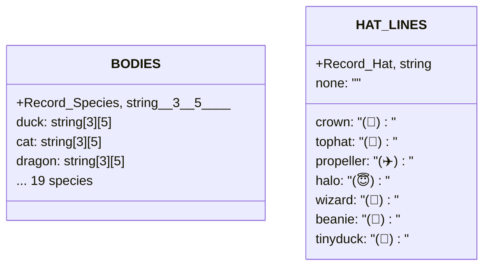

# Sprites 精灵渲染

## 概览

`sprites.ts` 是 Buddy 的 ASCII 艺术渲染引擎，负责将伴侣的外观属性（Bones）渲染为终端可显示的字符串数组。每个物种拥有 3 帧精灵，支持待机微动动画（idle fidget），通过 `{E}` 占位符模板实现眼睛字符的参数化渲染。系统还处理帽子覆盖层和紧凑终端的面部渲染。

## API 摘要

| 函数 | 说明 | 签名 |
|------|------|------|
| `renderSprite(bones, frame)` | 渲染完整精灵（5 行 ASCII） | `(bones: CompanionBones, frame?: number) => string[]` |
| `renderFace(bones)` | 渲染紧凑面部（单行，用于窄终端） | `(bones: CompanionBones) => string` |
| `spriteFrameCount(species)` | 获取物种的动画帧数 | `(species: Species) => number` |

## 精灵数据结构



## 渲染流程

### `renderSprite()` 完整流程

```mermaid
flowchart TD
    A[&quot;renderSprite(bones, frame=1)&quot;] --> B{"HAT_LINES[hat] exists?"}
    B -->|yes| C["检查 body[1][0] 是否为空"]
    B -->|none| F

    C -->|行0为空| D["叠加帽子行"]
    C -->|行0非空| E["不叠加帽子（保持原有天线/烟雾等）"]

    D --> F["substituteEyes(body, eye)"]
    E --> F

    F --> G["string[] (5 lines)"]
    G --> H{"所有帧行0都为空?"}
    H -->|yes + 当前帧行0空| I["移除精灵的帽子占位（高度稳定性）"]
    H -->|no| J["保留帽子"]
    I --> G2["最终 string[]"]
    J --> G2
```

```typescript
// 伪代码展示核心逻辑
export function renderSprite(bones: CompanionBones, frame = 0): string[] {
  // 1. 获取物种的3帧精灵（每帧5行）
  const bodyFrames = BODIES[bones.species]

  // 2. 如果帽子存在且该帧行0为空 → 叠加帽子
  const hatLine = HAT_LINES[bones.hat]
  const frameBody = bodyFrames[frame]

  // 3. 如果所有帧的行0都为空且当前帧行0为空 → 不显示帽子（防止高度抖动）
  const hasContentOnLine0 = bodyFrames.some(f => f[0].trim() !== '')
  if (!hasContentOnLine0 && frameBody[0] === '') {
    // 跳过往帽叠加，保持高度一致
  }

  // 4. 替换 {E} → 眼睛字符
  return frameBody.map(line => line.replace('{E}', bones.eye))
}
```

## 精灵帧与待机动画

所有物种都有 3 帧动画。帧通过 `IDLE_SEQUENCE` 数组控制播放顺序：

```
IDLE_SEQUENCE = [0, 0, 0, 0, 1, 0, 0, 0, -1, 0, 0, 2, 0, 0, 0]
                      ↑          ↑        ↑
                   第5帧 fidget  第8帧眨眼  第12帧 fidget2
```

`-1` 表示眨眼帧（显示帧0但将眼睛替换为 `-`）：

```typescript
// 眨眼效果实现
function getEyeForFrame(baseEye: Eye, frameIndex: number): string {
  if (frameIndex === -1) return '-'  // 眨眼
  return baseEye  // 正常眼睛
}
```

### 帧内容结构

每帧精灵固定 5 行 ASCII art，格式示例（duck）：

```
Frame 0 (站立):        Frame 1 (fidget):     Frame 2 (夸张):
    (\-.-)                  (^-.-)                (\`-' )
    /_('_)\                /_('_)\               /_('_)\
     |  |                   |  |                  |  | |
    _|  |_                 _|  |_                _|  |_|
```

所有精灵共享 `{E}` 占位符，在眼睛位置使用伴侣的 `eye` 属性替换。

## 帽子系统

### 帽子定义

| 帽子 | ASCII 叠加行 | 适用条件 |
|------|------------|---------|
| none | 无 | common 伴侣固定无帽 |
| crown | `(👑)` | 行0为空时叠加 |
| tophat | `(🎩)` | 行0为空时叠加 |
| propeller | `(✈️)` | 行0为空时叠加 |
| halo | `(😇)` | 行0为空时叠加 |
| wizard | `(🔮)` | 行0为空时叠加 |
| beanie | `(🧢)` | 行0为空时叠加 |
| tinyduck | `(🐤)` | 行0为空时叠加 |

### 高度稳定性

某些精灵帧的行0可能包含内容（烟雾、天线等装饰）。帽子叠加逻辑只在行0为空时应用，防止覆盖精灵原有装饰。如果某一帧行0非空而其他帧行0为空，为了避免精灵在动画过程中高度跳动，系统会跳过帽子叠加。

## 紧凑面部渲染

窄终端（< 100 列）无法容纳 5 行精灵，退化为单行紧凑面部：

```typescript
export function renderFace(bones: CompanionBones): string {
  // 物种特定嘴型
  // duck:     "(${eye}>"
  // cat:      "=${eye}ω${eye}="
  // turtle:   "[${eye}_${eye}]"
  // dragon:   "=${eye}>_/${eye}="
  // ghost:    " ${eye}~${eye} "
  // ...
}
```

## 使用示例

### 渲染伴侣精灵

```typescript
import { renderSprite } from './buddy/sprites'
import { getCompanion } from './buddy/companion'

const buddy = getCompanion()
if (buddy) {
  const lines = renderSprite(buddy, 0)  // 帧0（站立）
  console.log(lines.join('\n'))
}
```

输出示例（duck, eye=✦, no hat）：
```
    (\-.-)
    /_('_)\
     |  |
    _|  |_
```

### 打印完整伴侣（含稀有度）

```typescript
import { renderSprite } from './buddy/sprites'
import { RARITY_STARS } from './buddy/types'
import { getCompanion } from './buddy/companion'

const buddy = getCompanion()
if (buddy) {
  const frame = 0
  const art = renderSprite(buddy, frame)
  const stars = RARITY_STARS[buddy.rarity]
  const hat = buddy.hat === 'none' ? '' : ` + ${buddy.hat} hat`

  console.log(`${stars} ${buddy.name} the ${buddy.species}${hat}`)
  console.log(art.join('\n'))
}
```

### 动画循环

```typescript
import { renderSprite } from './buddy/sprites'
import { getCompanion } from './buddy/companion'

const buddy = getCompanion()!
const FRAMES = [0, 0, 0, 0, 1, 0, 0, 0, -1, 0, 0, 2, 0, 0, 0]

let tick = 0
setInterval(() => {
  const frameIdx = FRAMES[tick % FRAMES.length]
  const art = renderSprite(buddy, frameIdx)
  console.clear()
  console.log(art.join('\n'))
  tick++
}, 500)
```

## 物种列表（19种）

| 物种 | 特殊嘴型 | 帧描述 |
|------|---------|--------|
| duck | `(${eye}>` | 典型鸭嘴 |
| goose | `${eye}>` | 简化鸭嘴 |
| blob | `${eye}~${eye}` | 史莱姆脸 |
| cat | `${eye}ω${eye}` | 猫嘴 |
| dragon | `${eye}>_/${eye}` | 龙嘴 |
| octopus | `${eye}¤${eye}` | 章鱼 |
| owl | `${eye}◉${eye}` | 猫头鹰 |
| penguin | `${eye}へ${eye}` | 企鹅嘴 |
| turtle | `[${eye}_${eye}]` | 乌龟 |
| snail | `${eye}` | 蜗牛 |
| ghost | `${eye}~${eye}` | 鬼魂 |
| axolotl | `${eye}<${eye}` | 六角恐龙 |
| capybara | `${eye}~${eye}` | 水豚 |
| cactus | `${eye}T${eye}` | 仙人掌 |
| robot | `${eye}[ ]${eye}` | 机器人 |
| rabbit | `${eye}ε${eye}` | 兔子 |
| mushroom | `${eye}_${eye}` | 蘑菇 |
| chonk | `${eye}///${eye}` | 胖猫 |

## 设计决策

### `{E}` 占位符 vs 完整精灵数组

每个物种需要 3 帧 × 5 行 = 15 个字符串，加上 6 种眼睛 = 90 种变体。如果在代码中定义 90 个精灵会极度冗余。使用 `{E}` 占位符将每帧精灵减少到仅 5 行（无论有多少种眼睛），代码量减少 90%。

### 字符串拼接避免模板字面量

精灵定义使用字符串拼接而非模板字面量，主要是为了在编译后的 bundle 中不出现物种名字面量（配合 `types.ts` 中的 `String.fromCharCode` 反检测措施）。

## 源码引用

- [sprites.ts](/src/buddy/sprites.ts)

## 相关文档

- [AI 伴侣总览](_index.md)
- [Companion 抽卡系统](companion.md)
- [CompanionSprite UI](companion-sprite-ui.md)

---

*Generated by [Nium-Wiki v0.0.0](https://github.com/niuma996/nium-wiki) | 2026-04-01*
