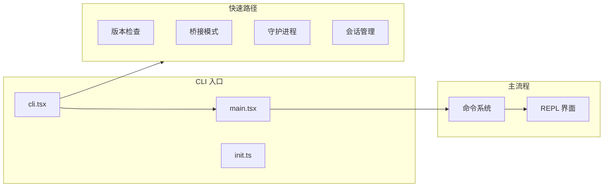
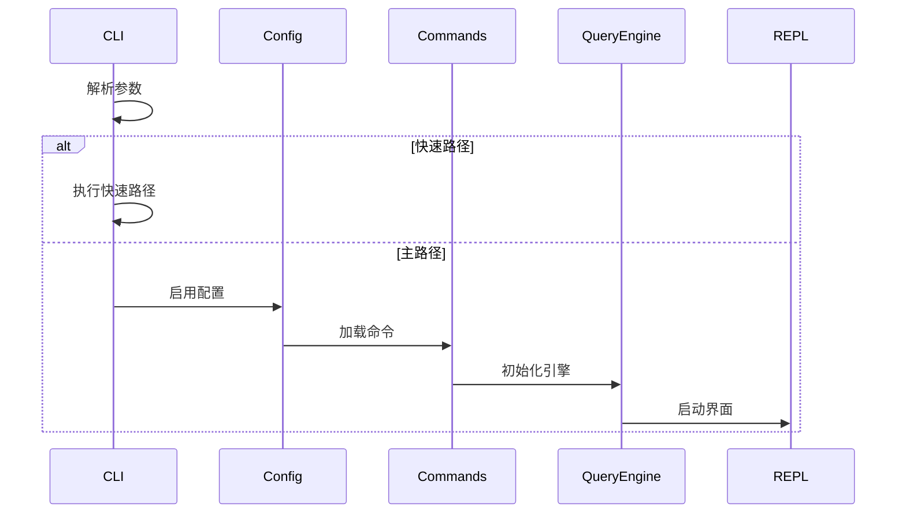

# CLI 入口

## 概述

CLI 入口模块负责处理命令行参数解析、快速路径优化和应用启动。

## 架构位置



## 入口文件

| 文件 | 描述 | 职责 |
|------|------|------|
| [cli.tsx](/restored-src/src/entrypoints/cli.tsx) | CLI 主入口 | 参数解析、快速路径分发 |
| [main.tsx](/restored-src/src/main.tsx) | 主流程 | 完整 CLI 初始化 |
| [init.ts](/restored-src/src/entrypoints/init.ts) | 初始化 | 配置加载和环境设置 |

## 快速路径优化

Claude Code 使用动态导入策略实现快速路径优化，最小化启动时的模块加载。

### 版本检查

```bash
claude --version
claude -v
```

零模块加载，直接输出内联版本号。

### 桥接模式

```bash
claude remote-control
claude rc
claude bridge
```

启动桥接服务，允许远程控制。

### 守护进程

```bash
claude daemon
```

启动长时间运行的守护进程。

### 会话管理

```bash
claude ps
claude logs <id>
claude attach <id>
claude kill <id>
```

管理后台会话。

### 模板命令

```bash
claude new <template>
claude list
claude reply
```

模板作业管理。

## 条件编译

使用 `feature()` 函数实现构建时特性开关：

| 特性 | 描述 |
|------|------|
| `BRIDGE_MODE` | 桥接模式支持 |
| `DAEMON` | 守护进程支持 |
| `BG_SESSIONS` | 后台会话支持 |
| `TEMPLATES` | 模板支持 |
| `COORDINATOR_MODE` | 协调器模式 |

## 启动流程



## 环境变量

| 变量 | 描述 | 默认值 |
|------|------|--------|
| `CLAUDE_CODE_REMOTE` | 远程环境标识 | - |
| `CLAUDE_CODE_SIMPLE` | 简单模式（无 TUI） | - |
| `NODE_OPTIONS` | Node.js 选项 | - |

## 源码引用

- [cli.tsx](/restored-src/src/entrypoints/cli.tsx)
- [main.tsx](/restored-src/src/main.tsx)
- [init.ts](/restored-src/src/entrypoints/init.ts)

## 相关文档

- [入口点详解](entrypoints.md)
- [启动流程](startup.md)
- [架构文档](../architecture.md)

---

*Generated by [Nium-Wiki v0.0.0](https://github.com/niuma996/nium-wiki) | 2026-05-12*
