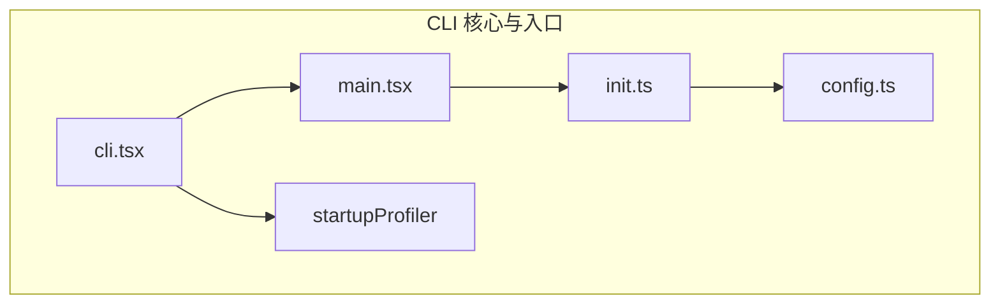

# CLI 核心与入口

## 概览

CLI 核心与入口模块是 Claude Code 的启动层，负责处理进程启动、命令行参数解析和快速路径优化。该模块采用**动态导入策略**实现零模块加载的版本检查，所有重型模块仅在需要时才加载，从而确保 `--version` 等快速路径具有极致的启动性能。

CLI 层不包含业务逻辑，其职责纯粹是**路由决策**：根据命令行参数将执行流导向正确的子系统（完整 CLI、Remote Control Bridge、Daemon 进程等）。

## 子模块

| 模块 | 说明 | 文档 |
|------|------|------|
| [CLI 入口点](entrypoints.md) | 入口文件与参数路由 | [entrypoints.md](entrypoints.md) |
| [启动流程与快速路径](startup.md) | 动态导入、profiler、性能优化 | [startup.md](startup.md) |

## 架构位置



## 核心设计原则

### 1. 动态导入（Dynamic Import）

CLI 入口文件 [cli.tsx](/restored-src/src/entrypoints/cli.tsx) 中，所有重型模块都使用 `await import()` 动态导入。这确保了 `--version` 等快速路径只加载最少数量的模块。

```typescript
// 快速路径：版本检查 — 零导入
if (args.length === 1 && (args[0] === '--version' || args[0] === '-v')) {
  console.log(`${MACRO.VERSION} (Claude Code)`)
  return
}

// 慢速路径：完整 CLI
const { main: cliMain } = await import('../main.js')
await cliMain()
```

### 2. 条件编译（Feature Flags）

使用 `feature('FEATURE_NAME')` 实现构建时特性开关，内部构建（Ant 构建）包含额外的实验性功能，外部发布版本则将这些代码通过 DCE（Dead Code Elimination）完全消除。

### 3. 启动性能分析

[startupProfiler.ts](/restored-src/src/utils/startupProfiler.ts) 在模块加载的关键节点打点记录，帮助识别性能瓶颈。通过 `profileCheckpoint()` 函数在启动过程中的每个阶段标记时间戳。

### 4. 环境自适应

CLI 层根据运行环境（本地、Remote Container、BYOC 等）调整行为，例如在 CCR 环境中设置更大的 Node.js 堆内存（16GB 容器对应 `--max-old-space-size=8192`）。

## 入口命令路由表

| 命令/参数 | 目标模块 | 说明 |
|-----------|---------|------|
| `--version` / `-v` | 直接输出 | 零导入快速路径 |
| `--dump-system-prompt` | prompts.js | 输出系统提示词后退出 |
| `remote-control` / `bridge` | bridgeMain.ts | 启动 Remote Control Bridge |
| `daemon` | daemon/main.ts | 启动 Daemon 监督进程 |
| `ps` / `logs` / `attach` / `kill` | cli/bg.js | 后台会话管理 |
| `new` / `list` / `reply` | templateJobs.js | 模板作业命令 |
| `environment-runner` | environment-runner/main.js | BYOC 运行器 |
| `--tmux --worktree` | worktree.js | Tmux 工作树快速路径 |
| 无特殊参数 | main.tsx | 完整交互式 CLI |

## 关键类型

| 类型 | 定义位置 | 说明 |
|------|---------|------|
| `profileCheckpoint` | [startupProfiler.ts](/restored-src/src/utils/startupProfiler.ts) | 启动性能打点函数 |
| `feature` | bun:bundle | 条件编译特性开关宏 |
| `enableConfigs` | [config.ts](/restored-src/src/utils/config.ts) | 启用配置读取 |

## 相关文档

- [架构总览](../architecture.md)
- [主页](../index.md)
- [CLI 入口点](entrypoints.md)
- [启动流程与快速路径](startup.md)

---

*Generated by [Nium-Wiki v0.0.0](https://github.com/niuma996/nium-wiki) | 2026-03-31*
