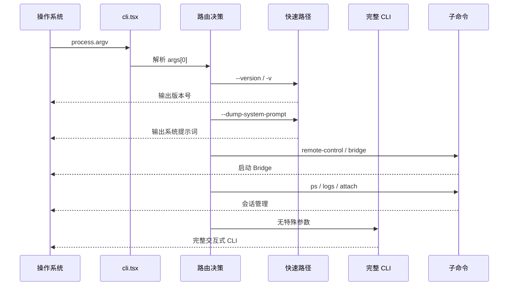

# CLI 入口点

## 概览

Claude Code 的入口点分布在三个主要文件中，分别承担不同的启动职责：[cli.tsx](/restored-src/src/entrypoints/cli.tsx) 是主入口，负责命令行参数路由；[main.tsx](/restored-src/src/main.tsx) 是完整 CLI 的初始化入口，负责加载所有功能模块；[init.ts](/restored-src/src/entrypoints/init.ts) 包含共享的初始化逻辑。

## 文件结构

```
restored-src/src/
├── main.tsx             # 完整 CLI 初始化（~803KB，主文件）
├── cli.tsx              # 引导入口：参数路由 + 快速路径
└── entrypoints/
    ├── cli.tsx         # cli.tsx 的实际路径（cli.tsx 的别名/重导出）
    ├── init.ts         # 共享初始化逻辑
    └── mcp.ts          # MCP 入口点
```

> **说明**：`main.tsx` 和 `cli.tsx` 均在 `restored-src/src/` 根目录，**不是符号链接**。两者为独立文件：`cli.tsx`（约 100 行）是引导入口，`main.tsx`（~803KB）是完整 CLI 初始化主文件。

## 入口文件详解

### cli.tsx — 参数路由核心

[cli.tsx](/restored-src/src/entrypoints/cli.tsx) 是整个 CLI 的起点。其核心设计理念是**延迟加载**：在检测到特殊参数（如 `--version`）时，直接返回而不加载任何业务模块。

#### 快速路径检测顺序

```typescript
async function main(): Promise<void> {
  const args = process.argv.slice(2)

  // 第 1 优先：版本检查 — 完全零导入
  if (args.length === 1 && (args[0] === '--version' || args[0] === '-v')) {
    console.log(`${MACRO.VERSION} (Claude Code)`)
    return
  }

  // 第 2 优先：实验性特殊模式（按内部使用频率排序）
  if (args[0] === '--dump-system-prompt') { /* ... */ }
  if (args[0] === '--claude-in-chrome-mcp') { /* ... */ }
  if (args[0] === '--chrome-native-host') { /* ... */ }
  if (args[0] === '--computer-use-mcp') { /* ... */ }
  if (args[0] === '--daemon-worker') { /* ... */ }

  // 第 3 优先：主命令路由
  if (args[0] === 'remote-control' || args[0] === 'bridge') { /* Bridge */ }
  if (args[0] === 'daemon') { /* Daemon */ }
  if (args[0] === 'ps' || args[0] === 'logs' || ...) { /* BG sessions */ }
  if (args[0] === 'new' || args[0] === 'list') { /* Templates */ }
  if (args[0] === 'environment-runner') { /* BYOC */ }
  if (args[0] === 'self-hosted-runner') { /* Self-hosted runner */ }

  // 第 4：完整 CLI
  const { main: cliMain } = await import('../main.js')
  await cliMain()
}
```

#### 特殊环境处理

```typescript
// CCR 环境：增加堆内存上限
if (process.env.CLAUDE_CODE_REMOTE === 'true') {
  process.env.NODE_OPTIONS = `${existing} --max-old-space-size=8192`
}

// ABLATION 基线：强制简化模式（内部构建专用）
if (feature('ABLATION_BASELINE') && process.env.CLAUDE_CODE_ABLATION_BASELINE) {
  for (const k of ['CLAUDE_CODE_SIMPLE', 'DISABLE_THINKING', ...]) {
    process.env[k] ??= '1'
  }
}
```

### main.tsx — 完整 CLI 初始化

[main.tsx](/restored-src/src/main.tsx) 加载完整功能集，包括 REPL 界面、Analytics、Telemtry 等。该文件本身非常庞大（500+ 行），但在 `--version` 等快速路径中完全不会执行。

#### 预加载优化

main.tsx 在模块加载时即触发三个并行预加载操作：

```typescript
// 这些在所有其他导入之前执行
profileCheckpoint('main_tsx_entry')        // 启动性能分析
startMdmRawRead()                          // MDM 配置并行读取
startKeychainPrefetch()                    // Keychain 凭据并行预取
```

- **MDM 预读取**：macOS MDM 配置通过 plutil/reg query 子进程并行读取，避免顺序读取延迟
- **Keychain 预读取**：OAuth 和 API Key 从 macOS Keychain 预先读取，避免每次使用时顺序读取

#### 条件编译模块

```typescript
// 协调器模式（内部构建）
const coordinatorModeModule = feature('COORDINATOR_MODE')
  ? require('./coordinator/coordinatorMode.js')
  : null

// 助手模式（内部构建）
const assistantModule = feature('KAIROS')
  ? require('./assistant/index.js')
  : null
```

### init.ts — 共享初始化逻辑

[init.ts](/restored-src/src/entrypoints/init.ts) 包含 Bridge 和完整 CLI 共用的初始化步骤：

- 配置加载（`enableConfigs`）
- 信任对话框验证
- Analytics Sink 初始化
- OAuth Token 检查

## 命令行参数解析架构



## CLI 快速路径性能数据

| 路径 | 加载模块数 | 典型耗时 |
|------|-----------|---------|
| `--version` | 0 | < 5ms |
| `--dump-system-prompt` | 2-3 | ~50ms |
| `remote-control` | 5-10 | ~200ms |
| 完整 CLI | 100+ | ~500-2000ms |

## 源码引用

- [cli.tsx](/restored-src/src/entrypoints/cli.tsx)
- [main.tsx](/restored-src/src/main.tsx)
- [init.ts](/restored-src/src/entrypoints/init.ts)
- [mcp.ts](/restored-src/src/entrypoints/mcp.ts)

## 相关文档

- [CLI 核心与入口](../cli/_index.md)
- [启动流程与快速路径](startup.md)

---

*Generated by [Nium-Wiki v0.0.0](https://github.com/niuma996/nium-wiki) | 2026-03-31*
