# 启动流程与快速路径

## 概览

Claude Code 的启动流程设计围绕**性能优先**原则构建。所有非必要的模块都采用延迟加载（Lazy Loading），确保 `--version` 等常用快速路径具有极致启动速度。同时，通过 `profileCheckpoint` 打点系统和预加载机制，兼顾完整 CLI 的启动性能。

## 启动性能分析系统

[startupProfiler.ts](/restored-src/src/utils/startupProfiler.ts) 提供启动性能分析能力，在模块加载的关键节点打点记录。

### 核心 API

```typescript
// 记录一个性能检查点
profileCheckpoint(name: string): void

// 输出完整的启动时间报告
profileReport(): string
```

### 检查点序列

```mermaid
gantt
    title CLI 启动时间线
    dateFormat x
    axisFormat %Lms

    section 快速路径
    cli_entry             :done, p1, 0, 1ms
    cli_version_output     :done, p2, 1, 5ms

    section 完整 CLI
    cli_entry             :done, p3, 0, 2ms
    cli_before_main_import :done, p4, 5, 50ms
    cli_after_main_import :done, p5, 55, 200ms
    main_tsx_entry        :done, p6, 200, 205ms
    cli_before_main       :done, p7, 210, 800ms
    cli_after_main        :done, p8, 810, 1500ms
```



## 快速路径优化策略

### 1. 零导入原则

`--version` 路径是最严格的快速路径：完全不导入任何模块，直接输出硬编码的 `MACRO.VERSION`。

```typescript
// 没有任何 await import() 语句
// MACRO.VERSION 在构建时通过宏内联
if (args.length === 1 && (args[0] === '--version' || args[0] === '-v')) {
  console.log(`${MACRO.VERSION} (Claude Code)`)
  return
}
```

### 2. 条件加载

每个快速路径仅加载其需要的最小模块集：

| 路径 | 加载模块 | 数量 |
|------|---------|------|
| `--dump-system-prompt` | config.js, prompts.js | 2 |
| `remote-control` | bridgeEnabled, bridgeMain, auth | 5 |
| `ps/logs/attach/kill` | config.js, bg.js | 2 |
| `environment-runner` | environment-runner/main.js | 1 |

### 3. 预加载机制

main.tsx 在模块评估阶段就并行触发耗时的 I/O 操作：

```typescript
// 并行执行：总时间 = max(plutil, keychain1, keychain2)，而非 sum
startMdmRawRead()       // ~135ms 子进程
startKeychainPrefetch() // OAuth + API Key 两个 Keychain 读取
profileCheckpoint('main_tsx_entry')
```

这确保在剩余的 ~135ms 模块导入期间，MDM 和 Keychain 读取已在后台完成。

## 条件编译与构建时优化

### feature() 函数

`feature('FEATURE_NAME')` 是构建时特性开关宏，基于 Bun 的静态求值实现 DCE：

```typescript
// cli.tsx 中
if (feature('BRIDGE_MODE') && (args[0] === 'remote-control' || ...)) {
  // 外部构建：feature('BRIDGE_MODE') = false，整个 if 块被消除
  // 内部构建：保留完整逻辑
}

if (feature('DAEMON') && args[0] === 'daemon') {
  // 同上
}
```

### 内部构建与外部构建差异

| 功能 | 内部构建 | 外部构建 |
|------|---------|---------|
| Remote Control Bridge | ✅ 保留 | ❌ 消除 |
| Daemon 进程 | ✅ 保留 | ❌ 消除 |
| BYOC Runner | ✅ 保留 | ❌ 消除 |
| 模板作业 | ✅ 保留 | ❌ 消除 |
| 系统提示词导出 | ✅ 保留 | ❌ 消除 |

## 环境自适应

### 远程容器环境

```typescript
if (process.env.CLAUDE_CODE_REMOTE === 'true') {
  // 16GB 容器环境：分配 8GB 堆内存
  process.env.NODE_OPTIONS = `--max-old-space-size=8192`
}
```

### macOS Corepack 修复

```typescript
// 防止 yarn 的 corepack 自动 pinning 污染 package.json
process.env.COREPACK_ENABLE_AUTO_PIN = '0'
```

### Ablation 基线（内部构建）

```typescript
if (feature('ABLATION_BASELINE') && process.env.CLAUDE_CODE_ABLATION_BASELINE) {
  // 强制禁用所有优化特性，测量基线性能
  for (const k of [
    'CLAUDE_CODE_SIMPLE',
    'CLAUDE_CODE_DISABLE_THINKING',
    'DISABLE_INTERLEAVED_THINKING',
    'DISABLE_COMPACT',
    'DISABLE_AUTO_COMPACT',
    'CLAUDE_CODE_DISABLE_AUTO_MEMORY',
    'CLAUDE_CODE_DISABLE_BACKGROUND_TASKS'
  ]) {
    process.env[k] = '1'
  }
}
```

## 快速路径实现模式

快速路径的核心模式是在 `main()` 函数顶部使用一系列短路条件检查：

```typescript
async function main(): Promise<void> {
  const args = process.argv.slice(2)

  // 使用 if-elseif 链，按优先级排序
  if (条件1) { return 执行路径1 }
  if (条件2) { return 执行路径2 }
  // ...
  if (条件N) { return 执行路径N }

  // 默认：完整 CLI
  return 默认路径
}
```

这种模式的优势：
1. **短路求值**：匹配条件后立即返回
2. **无循环开销**：线性检查，常用路径在最前
3. **最小化分支**：避免 switch 的额外评估开销

## 性能指标采集

启动性能数据通过以下方式采集：

1. **startupProfiler**：记录每个 `profileCheckpoint` 的时间戳
2. **Startup Profiler UI**：可通过环境变量 `CLAUDE_CODE_STARTUP_PROFILER=1` 启用
3. **内省端点**：构建时通过宏将性能数据内联到二进制

## 源码引用

- [startupProfiler.ts](/restored-src/src/utils/startupProfiler.ts)
- [cli.tsx](/restored-src/src/entrypoints/cli.tsx)
- [main.tsx](/restored-src/src/main.tsx)
- [keychainPrefetch.ts](/restored-src/src/utils/secureStorage/keychainPrefetch.js)
- [rawRead.js](/restored-src/src/utils/settings/mdm/rawRead.js)

## 相关文档

- [CLI 核心与入口](../cli/_index.md)
- [CLI 入口点](entrypoints.md)

---

*Generated by [Nium-Wiki v0.0.0](https://github.com/niuma996/nium-wiki) | 2026-03-31*
