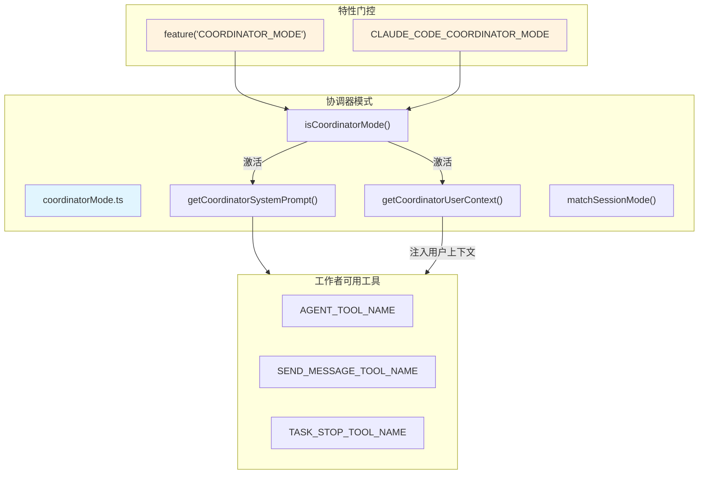
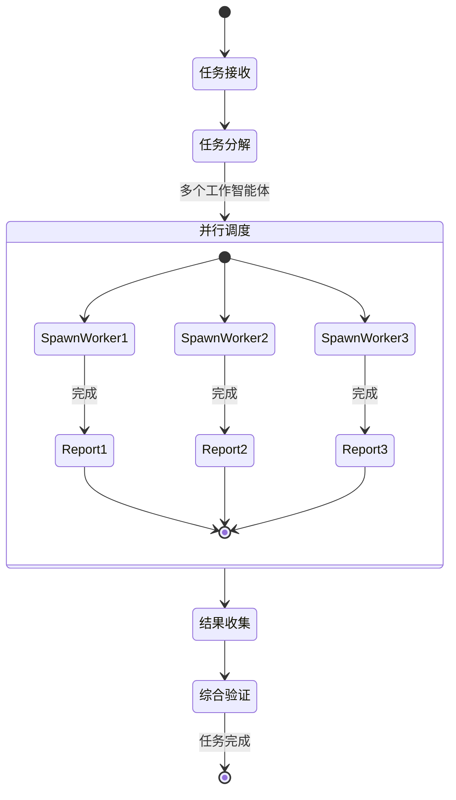

# 协调器模式 (Coordinator Mode)

## 概览

协调器模式是 Claude Code 的一种高级多智能体协作运行模式，由单个"协调者"LLM 统一编排多个并行的工作者智能体（Worker Agents）来完成复杂的多步骤任务。协调者负责任务分解、并行调度、结果综合与质量验证，而具体的研究、编码实现则委托给工作子智能体。

该模式通过 GrowthBook 特性开关 `COORDINATOR_MODE` 和环境变量 `CLAUDE_CODE_COORDINATOR_MODE` 双重门控，与 Fork Subagent 模式互斥。

## 架构位置



## 核心概念

### 协调者 vs 工作者的职责边界



| 职责 | 协调者 | 工作智能体 |
|------|--------|-----------|
| 理解任务 | ✅ | ❌（只接收合成后的指令） |
| 分解任务 | ✅ | ❌ |
| 并行调度 | ✅（AGENT_TOOL） | ❌ |
| 合并结果 | ✅ | ❌ |
| 验证质量 | ✅ | ❌ |
| 工具执行 | ❌（仅调度） | ✅ |
| 继续对话 | ✅（SEND_MESSAGE） | ❌ |
| 停止工作 | ✅（TASK_STOP） | ❌ |

### 工作流程四阶段

协调者系统提示词定义了标准的工作流程：

```
1. Research（研究）   → 收集背景信息，确定可行性
2. Synthesis（综合）  → 合并研究发现，形成统一方案
3. Implementation（实现）→ 并行委托工作智能体实现
4. Verification（验证） → 检查输出质量，必要时重试
```

## API 摘要

| 函数 | 说明 | 签名 |
|------|------|------|
| `isCoordinatorMode` | 判断协调器模式是否激活 | `() => boolean` |
| `matchSessionMode` | 恢复会话时同步模式状态 | `(sessionMode) => string \| undefined` |
| `getCoordinatorUserContext` | 注入工作者工具上下文 | `(mcpClients, scratchpadDir?) => { workerToolsContext: string }` |
| `getCoordinatorSystemPrompt` | 获取完整协调者系统提示词 | `() => string` |

## 功能详解

### 1. 双重门控机制

```typescript
export function isCoordinatorMode(): boolean {
  // 第一层：GrowthBook 构建时特性开关
  if (!feature('COORDINATOR_MODE')) return false

  // 第二层：运行时环境变量
  return isEnvTruthy(process.env.CLAUDE_CODE_COORDINATOR_MODE)
}
```

- **构建时开关**（`feature('COORDINATOR_MODE')`）：通过 `bun:bundle` 在编译时确定，可按版本/渠道控制
- **运行时开关**（环境变量）：支持在不重新构建的情况下动态启用/禁用

### 2. 会话模式同步

恢复会话时，已保存的会话元数据携带 `mode` 字段。如果与当前 `isCoordinatorMode()` 结果不一致，直接修改 `process.env` 以对齐：

```typescript
export function matchSessionMode(
  sessionMode: 'coordinator' | 'normal' | undefined,
): string | undefined {
  const currently = isCoordinatorMode()

  // 场景1：存储为协调器，实际为普通模式 → 删除环境变量
  if (sessionMode === 'coordinator' && !currently) {
    delete process.env.CLAUDE_CODE_COORDINATOR_MODE
    return '切换到协调器模式继续'
  }

  // 场景2：存储为普通，实际为协调器模式 → 设置环境变量
  if (sessionMode !== 'coordinator' && currently) {
    process.env.CLAUDE_CODE_COORDINATOR_MODE = '1'
    return '切换到普通模式继续'
  }

  return undefined  // 无需切换
}
```

触发分析事件：`tengu_coordinator_mode_switched`

### 3. 工作者工具上下文

```typescript
export function getCoordinatorUserContext(
  mcpClients: ReadonlyArray<{ name: string }>,
  scratchpadDir?: string,
): { [k: string]: string } {
  if (!isCoordinatorMode()) return {}

  // 简单模式：限制工作者仅能使用 3 个核心工具
  if (isEnvTruthy(process.env.CLAUDE_CODE_SIMPLE)) {
    return { workerToolsContext: '工具: Bash, Read, Edit' }
  }

  // 标准模式：所有异步智能体工具 - 内部工具
  const allowedTools = ASYNC_AGENT_ALLOWED_TOOLS.filter(
    t => !INTERNAL_WORKER_TOOLS.has(t),
  )

  const ctx = `工作者可使用工具: ${allowedTools.join(', ')}`

  // 附加 MCP 服务器
  if (mcpClients.length > 0) {
    ctx + `\n已连接的 MCP 服务器: ${mcpClients.map(c => c.name).join(', ')}`
  }

  // 附加 Scratchpad 目录（Statsig gate 控制）
  if (scratchpadDir && checkStatsigFeatureGate_CACHED_MAY_BE_STALE('tengu_scratch')) {
    ctx + `\nScratchpad 目录: ${scratchpadDir}`
  }

  return { workerToolsContext: ctx }
}
```

### 4. 内部工具限制（工作者不可用）

```typescript
const INTERNAL_WORKER_TOOLS = new Set([
  TEAM_CREATE_TOOL_NAME,   // 禁止工作者创建更多团队
  TEAM_DELETE_TOOL_NAME,   // 禁止工作者删除团队
  SEND_MESSAGE_TOOL_NAME, // 禁止工作者继续对话（协调者专用）
  SYNTHETIC_OUTPUT_TOOL_NAME, // 禁止工作者生成合成输出
])
```

### 5. 协调者系统提示词结构

`getCoordinatorSystemPrompt()` 返回一个约 300 行的多节系统提示词：

| 节号 | 内容 | 重要性 |
|------|------|--------|
| 1 | 角色定义：单一协调者指挥工作者 | ★★★ |
| 2 | 工具文档：AGENT_TOOL、SEND_MESSAGE、TASK_STOP | ★★★ |
| 3 | 工作结果格式：`<task-notification>` XML | ★★ |
| 4 | 工作者能力：受 CLAUDE_CODE_SIMPLE 影响 | ★★ |
| 5 | 任务工作流：Research→Synthesis→Implementation→Verification | ★★★ |
| 6 | 工作失败处理：SEND_MESSAGE 继续同一工作者 | ★★ |
| 7 | 停止工作者：TASK_STOP 重定向飞行中工作者 | ★★ |
| 8 | 编写工作者指令：最详细章节，含好坏示例 | ★★★ |

### 6. 继续 vs 启动决策

协调者需要决定是对已有工作者继续发送消息（`SEND_MESSAGE`）还是启动新工作者（`AGENT_TOOL`）：

| 场景 | 操作 | 理由 |
|------|------|------|
| 工作者意外失败 | SEND_MESSAGE（同一类型） | 复用已有上下文，继续推进 |
| 任务明显超出范围 | TASK_STOP → AGENT_TOOL（新类型） | 重新定向或替换 |
| 需要全新研究领域 | AGENT_TOOL（新类型） | 隔离关注点 |
| 收集到的信息不完整 | SEND_MESSAGE（追问） | 深化当前工作 |

## 使用示例

### 启用协调器模式

```bash
# 通过环境变量启用
export CLAUDE_CODE_COORDINATOR_MODE=1
claude

# 或在会话中切换（matchSessionMode 会自动同步）
```

### 协调者系统提示词获取

```typescript
import { getCoordinatorSystemPrompt } from './coordinator/coordinatorMode'

// 当协调器模式激活时，注入系统提示词
if (isCoordinatorMode()) {
  const sysPrompt = getCoordinatorSystemPrompt()
  // → 约 300 行，包含完整的工作者调度指南
}
```

### 注入工作者工具上下文

```typescript
import { getCoordinatorUserContext } from './coordinator/coordinatorMode'

const mcpClients = [{ name: 'filesystem' }, { name: 'git' }]
const userCtx = getCoordinatorUserContext(mcpClients, '/tmp/scratch')
// → { workerToolsContext: "工作者可使用工具: Bash, Read, Edit..." }
```

## 设计决策

### Fork 互斥

协调器模式与 Fork Subagent 互斥（`isCoordinatorMode() && isForkSubagentEnabled()` → false）。原因：两者都是并行化机制，但协调器模式依赖更复杂的调度策略，不适合通过轻量的隐式分叉实现。

### 自包含工作者提示词

协调者发给工作者的指令必须完全自包含，因为工作者看不到协调者的完整对话历史。协调者必须先综合（synthesize）所有发现，再委托任务。这是有意设计：避免工作者依赖隐式上下文，确保每个工作者都能独立完成任务。

### 模式切换的进程级影响

通过修改 `process.env` 实现模式同步，而非仅在内存中切换。优势是后续所有 `isCoordinatorMode()` 调用立即一致；风险是状态修改对同一进程内的其他模块可见。需要谨慎处理初始化顺序。

## 源码引用

- [coordinatorMode.ts](/src/coordinator/coordinatorMode.ts)

## 相关文档

- [智能体与协调](../agent/_index.md)
- [Agent 工具](../agent/agent-tool.md)
- [Fork 子智能体](../agent/fork-subagent.md)

---

*Generated by [Nium-Wiki v0.0.0](https://github.com/niuma996/nium-wiki) | 2026-04-01*
