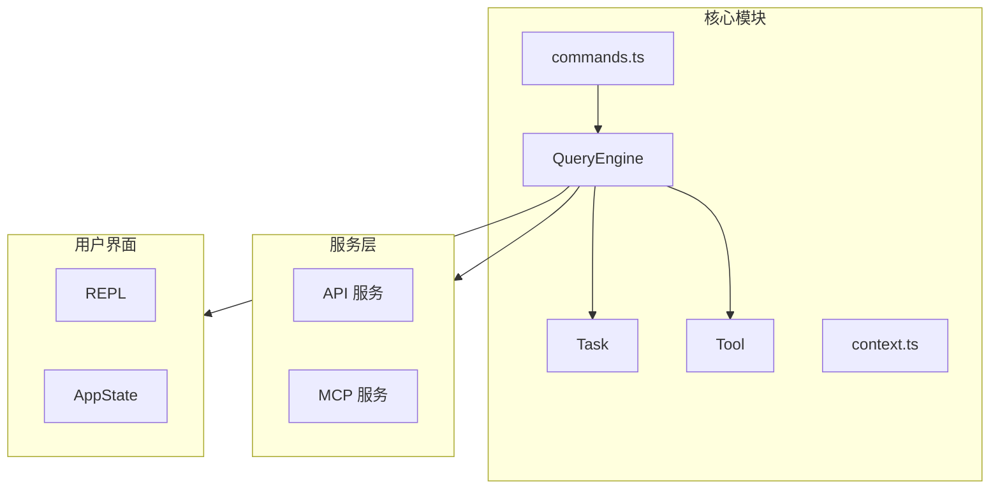

# 核心模块

## 概述

核心模块包含 Claude Code 的核心引擎组件，负责协调 AI 查询、任务管理和工具执行。

## 架构位置



## 核心组件

| 组件 | 文件 | 描述 | 关键位置 |
|------|------|------|----------|
| QueryEngine | [QueryEngine.ts](/restored-src/src/QueryEngine.ts#L184-L200) | 查询引擎，处理 AI 对话生命周期 | 类定义 L184，配置类型 L130 |
| Task | [Task.ts](/restored-src/src/Task.ts#L72-L76) | 任务管理，支持本地/远程代理和工作流 | 类型定义 L6，ID 生成 L98 |
| Tool | [Tool.ts](/restored-src/src/Tool.ts) | 工具基类，所有工具的抽象 | 基类定义，工具注册表 |
| Commands | [commands.ts](/restored-src/src/commands.ts) | 命令系统，注册和管理斜杠命令 | 命令注册和管理 |
| Context | [context.ts](/restored-src/src/context.ts) | 上下文管理 | 上下文状态维护 |

## QueryEngine

QueryEngine 是查询引擎的核心类，负责管理对话生命周期和会话状态。核心实现位于 [QueryEngine.ts](/restored-src/src/QueryEngine.ts#L184)。

### 关键功能

- **对话管理**: 管理多轮对话的消息历史
- **任务协调**: 创建和管理 Task 实例
- **工具执行**: 协调工具调用和结果处理
- **权限检查**: 处理工具使用权限和拒绝追踪
- **会话持久化**: 支持对话恢复和历史记录

### 主要方法

| 方法 | 描述 | 源码位置 |
|------|------|----------|
| `QueryEngine` | 构造函数，初始化引擎 | [L200](/restored-src/src/QueryEngine.ts#L200) |
| `submitMessage()` | 提交用户消息并返回异步生成器 | [L209](/restored-src/src/QueryEngine.ts#L209) |
| `abortController` | 中断控制器 | [L187](/restored-src/src/QueryEngine.ts#L187) |
| `permissionDenials` | 权限拒绝追踪数组 | [L188](/restored-src/src/QueryEngine.ts#L188) |

### QueryEngineConfig 配置类型

```typescript
// 源码位置: [QueryEngine.ts L130-L173](/restored-src/src/QueryEngine.ts#L130-L173)
export type QueryEngineConfig = {
  cwd: string
  tools: Tools
  commands: Command[]
  mcpClients: MCPServerConnection[]
  agents: AgentDefinition[]
  canUseTool: CanUseToolFn
  getAppState: () => AppState
  setAppState: (f: (prev: AppState) => AppState) => void
  initialMessages?: Message[]
  readFileCache: FileStateCache
  customSystemPrompt?: string
  appendSystemPrompt?: string
  userSpecifiedModel?: string
  fallbackModel?: string
  thinkingConfig?: ThinkingConfig
  maxTurns?: number
  maxBudgetUsd?: number
  taskBudget?: { total: number }
  // ... 更多配置选项
}
```

### 使用示例

[Source: QueryEngine.ts](/restored-src/src/QueryEngine.ts#L200-L237)
```typescript
const engine = new QueryEngine({
  cwd,
  tools,
  commands,
  mcpClients,
  agents,
  canUseTool,
  getAppState,
  setAppState,
  initialMessages: [],
})

for await (const message of engine.submitMessage(prompt)) {
  // 处理消息
}
```

### 权限拒绝追踪

QueryEngine 在 [L188](/restored-src/src/QueryEngine.ts#L188) 维护 `permissionDenials` 数组，用于追踪所有工具权限拒绝。在 [L244-L271](/restored-src/src/QueryEngine.ts#L244-L271) 的 `wrappedCanUseTool` 函数中记录拒绝：

```typescript
// 追踪拒绝以供 SDK 上报
if (result.behavior !== 'allow') {
  this.permissionDenials.push({
    tool_name: sdkCompatToolName(tool.name),
    tool_use_id: toolUseID,
    tool_input: input,
  })
}
```

## Task 系统

Task 系统管理 Claude Code 中的各种任务类型。核心类型定义位于 [Task.ts](/restored-src/src/Task.ts)。

### 任务类型

[Source: Task.ts L6-L13](/restored-src/src/Task.ts#L6-L13)
```typescript
export type TaskType =
  | 'local_bash'
  | 'local_agent'
  | 'remote_agent'
  | 'in_process_teammate'
  | 'local_workflow'
  | 'monitor_mcp'
  | 'dream'
```

| 类型 | 描述 | 用途 |
|------|------|------|
| `local_bash` | 本地 Bash 命令 | 执行 shell 命令 |
| `local_agent` | 本地代理 | 创建本地子代理 |
| `remote_agent` | 远程代理 | 创建远程子代理 |
| `in_process_teammate` | 进程内队友 | 内部协作任务 |
| `local_workflow` | 本地工作流 | 自动化工作流 |
| `monitor_mcp` | MCP 监控 | 监控 MCP 服务器 |
| `dream` | 梦想模式 | 自动化任务执行 |

### 任务状态

[Source: Task.ts L15-L20](/restored-src/src/Task.ts#L15-L20)
```typescript
export type TaskStatus =
  | 'pending'
  | 'running'
  | 'completed'
  | 'failed'
  | 'killed'
```

| 状态 | 描述 |
|------|------|
| `pending` | 等待执行 |
| `running` | 执行中 |
| `completed` | 已完成 |
| `failed` | 执行失败 |
| `killed` | 被终止 |

### 终端状态判断

[Source: Task.ts L27-L29](/restored-src/src/Task.ts#L27-L29)
```typescript
export function isTerminalTaskStatus(status: TaskStatus): boolean {
  return status === 'completed' || status === 'failed' || status === 'killed'
}
```

### 任务 ID 生成

[Source: Task.ts L98-L106](/restored-src/src/Task.ts#L98-L106)
任务 ID 使用 36 进制编码，前缀标识任务类型：

```typescript
const TASK_ID_PREFIXES: Record<string, string> = {
  local_bash: 'b', // Keep as 'b' for backward compatibility
  local_agent: 'a',
  remote_agent: 'r',
  in_process_teammate: 't',
  local_workflow: 'w',
  monitor_mcp: 'm',
  dream: 'd',
}

export function generateTaskId(type: TaskType): string {
  const prefix = getTaskIdPrefix(type)
  const bytes = randomBytes(8)
  let id = prefix
  for (let i = 0; i < 8; i++) {
    id += TASK_ID_ALPHABET[bytes[i]! % TASK_ID_ALPHABET.length]
  }
  return id
}
```

ID 前缀映射：
- `b` - 本地 Bash
- `a` - 本地代理
- `r` - 远程代理
- `t` - 进程内队友
- `w` - 本地工作流
- `m` - MCP 监控
- `d` - 梦想模式

### TaskStateBase 基础状态

[Source: Task.ts L45-L57](/restored-src/src/Task.ts#L45-L57)
```typescript
export type TaskStateBase = {
  id: string
  type: TaskType
  status: TaskStatus
  description: string
  toolUseId?: string
  startTime: number
  endTime?: number
  totalPausedMs?: number
  outputFile: string
  outputOffset: number
  notified: boolean
}
```

### 创建任务状态

[Source: Task.ts L108-L125](/restored-src/src/Task.ts#L108-L125)
```typescript
export function createTaskStateBase(
  id: string,
  type: TaskType,
  description: string,
  toolUseId?: string,
): TaskStateBase {
  return {
    id,
    type,
    status: 'pending',
    description,
    toolUseId,
    startTime: Date.now(),
    outputFile: getTaskOutputPath(id),
    outputOffset: 0,
    notified: false,
  }
}
```

## 文件结构

```
restored-src/src/
├── QueryEngine.ts     # 查询引擎
├── Task.ts           # 任务管理
├── Tool.ts           # 工具基类
├── commands.ts       # 命令系统
├── context.ts        # 上下文管理
├── main.tsx          # 主入口
├── query.ts          # 查询实现
├── tasks.ts          # 任务列表
├── tools.ts          # 工具注册
├── history.ts        # 历史记录
├── ink.ts           # Ink 组件
├── setup.ts         # 设置
└── ...
```

## 设计决策

### 1. 异步生成器模式

QueryEngine 使用异步生成器模式 (`async *`) 处理流式响应，允许逐步处理 API 返回的增量内容。

### 2. 条件编译

使用 `feature()` 函数实现条件编译，支持内部构建和外部发布的差异化功能：

```typescript
const getCoordinatorUserContext = feature('COORDINATOR_MODE')
  ? require('./coordinator/coordinatorMode.js').getCoordinatorUserContext
  : () => ({})
```

### 3. 权限追踪

QueryEngine 追踪所有工具权限拒绝，记录到 `permissionDenials` 数组供 SDK 上报。

## 源码引用

- [QueryEngine.ts](/restored-src/src/QueryEngine.ts#L184-L200) - 查询引擎核心实现
- [Task.ts](/restored-src/src/Task.ts#L1-L125) - 任务系统类型和函数
- [Tool.ts](/restored-src/src/Tool.ts) - 工具基类
- [commands.ts](/restored-src/src/commands.ts) - 命令系统

**关键类型定义**
- [QueryEngineConfig L130-L173](/restored-src/src/QueryEngine.ts#L130-L173)
- [TaskType L6-L13](/restored-src/src/Task.ts#L6-L13)
- [TaskStatus L15-L20](/restored-src/src/Task.ts#L15-L20)
- [TaskStateBase L45-L57](/restored-src/src/Task.ts#L45-L57)

**关键函数**
- [submitMessage L209](/restored-src/src/QueryEngine.ts#L209) - 提交消息异步生成器
- [generateTaskId L98](/restored-src/src/Task.ts#L98) - 生成任务 ID
- [isTerminalTaskStatus L27](/restored-src/src/Task.ts#L27) - 判断终端状态
- [createTaskStateBase L108](/restored-src/src/Task.ts#L108) - 创建任务状态

## 相关文档

- [查询引擎](query.md)
- [命令系统](commands.md)
- [工具系统](tools.md)
- [Hook 系统](hooks.md)
- [架构文档](../architecture.md)

---

*Generated by [Nium-Wiki v0.0.0](https://github.com/niuma996/nium-wiki) | 2026-05-15*
