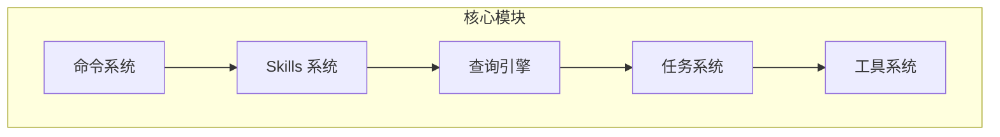

# 核心模块

## 概览

核心模块是 Claude Code 的引擎部分，负责协调 AI 模型调用、任务管理和工具执行。

## 子模块

| 模块 | 说明 | 文档 |
|------|------|------|
| [命令系统](commands.md) | 管理所有斜杠命令 | [commands.md](commands.md) |
| [工具系统](tools.md) | 工具实现和执行 | [tools.md](tools.md) |
| [Skills 系统](skills.md) | 可复用命令系统，/skill-name 调用 | [skills.md](skills.md) |
| [查询引擎](query.md) | 查询流程和模型交互 | [query.md](query.md) |

## 架构位置

## 相关文档

- [架构文档](../architecture.md)
- [主页](../index.md)

---

*Generated by [Nium-Wiki v0.0.0](https://github.com/niuma996/nium-wiki) | 2026-03-31*
