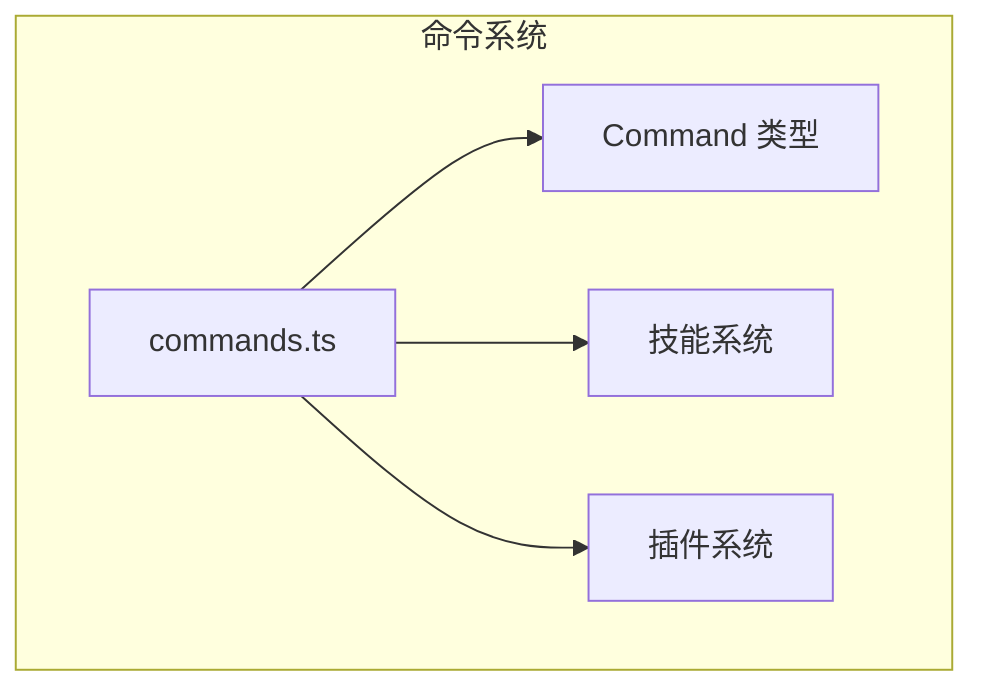
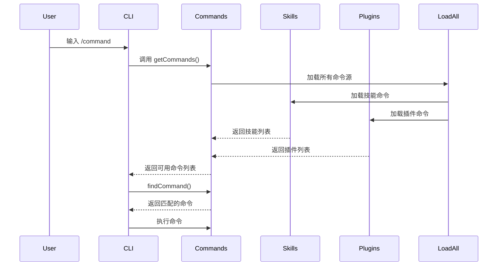

# 命令系统

## 概述

命令系统是 Claude Code 的核心模块之一，负责管理和执行所有斜杠命令。该系统支持 80+ 内置命令，并提供插件和技能扩展机制。

命令系统采用延迟加载策略，仅在需要时才加载命令模块，确保快速启动性能。核心实现在 [commands.ts](/restored-src/src/commands.ts#L1) 文件中。

**核心源码位置**
- [commands.ts](/restored-src/src/commands.ts#L1) - 命令系统主文件
- [commands/](/restored-src/src/commands/) - 命令实现目录
- [loadSkillsDir.ts](/restored-src/src/skills/loadSkillsDir.ts#L1) - 技能加载
- [types/command.ts](/restored-src/src/types/command.ts) - Command 类型定义

## 架构位置



## 功能特性

| 功能 | 说明 | 相关文件 |
|------|------|----------|
| 命令注册 | 统一注册所有内置命令 | [commands.ts](/restored-src/src/commands.ts) |
| 动态加载 | 支持技能和插件命令 | [loadSkillsDir.ts](/restored-src/src/skills/loadSkillsDir.ts) |
| 可用性检查 | 命令级可用性控制 | `meetsAvailabilityRequirement()` |
| 特性门控 | 基于 feature flag 的条件加载 | `feature()` 函数 |
| 远程模式过滤 | 过滤远程不安全的命令 | `REMOTE_SAFE_COMMANDS` |

## 文件结构

```
restored-src/src/
├── commands.ts              # 命令系统主文件
├── commands/               # 命令实现目录
│   ├── help/              # /help 命令
│   ├── config/            # /config 命令
│   ├── login/             # /login 命令
│   ├── logout/            # /logout 命令
│   ├── commit/           # /commit 命令
│   ├── review/            # /review 命令
│   ├── diff/              # /diff 命令
│   ├── tasks/             # /tasks 命令
│   ├── skills/            # /skills 命令
│   ├── mcp/               # /mcp 命令
│   ├── agents/            # /agents 命令
│   ├── context/           # /context 命令
│   ├── compact/           # /compact 命令
│   ├── resume/            # /resume 命令
│   └── ...                # 其他 70+ 个命令
```

## 核心工作流



## API 摘要

| 函数 | 说明 | 返回类型 |
|------|------|----------|
| `getCommands(cwd)` | 获取所有可用命令 | `Promise<Command[]>` |
| `findCommand(name, commands)` | 查找指定命令 | `Command \| undefined` |
| `getCommand(name, commands)` | 获取命令（不存在则抛错） | `Command` |
| `hasCommand(name, commands)` | 检查命令是否存在 | `boolean` |
| `meetsAvailabilityRequirement(cmd)` | 检查命令可用性 | `boolean` |
| `getSkillToolCommands(cwd)` | 获取技能命令列表 | `Promise<Command[]>` |
| `filterCommandsForRemoteMode(commands)` | 过滤远程安全命令 | `Command[]` |

## 命令类型

| 类型 | 说明 | 示例 |
|------|------|------|
| `prompt` | 提示类命令，扩展为文本 | `/help`, `/skills` |
| `local` | 本地命令，文本输出 | `/version`, `/compact` |
| `local-jsx` | 本地 JSX 命令，渲染 UI | `/config`, `/tasks` |
| `special` | 特殊命令 | 内部使用 |

## 命令可用性

命令支持多种可用性控制：

```typescript
type Availability = 'claude-ai' | 'console'

// 示例：仅 Claude.ai 订阅者可用
{
  name: 'voice',
  availability: ['claude-ai'],
  // ...
}
```

## 特性门控

使用 `feature()` 函数实现条件编译：

```typescript
// 仅在启用 VOICE_MODE 时加载
const voiceCommand = feature('VOICE_MODE')
  ? require('./commands/voice/index.js').default
  : null

// 仅在 KAIROS 模式下可用
const assistantCommand = feature('KAIROS')
  ? require('./commands/assistant/index.js').default
  : null
```

## 远程模式安全

远程模式下只能使用安全的命令：

```typescript
export const REMOTE_SAFE_COMMANDS: Set<Command> = new Set([
  session, exit, clear, help, theme, color,
  vim, cost, usage, copy, btw, feedback,
  plan, keybindings, statusline, stickers, mobile,
])
```

## 源码引用

**核心文件**
- [commands.ts](/restored-src/src/commands.ts#L1) - 命令系统主文件
- [types/command.ts](/restored-src/src/types/command.ts) - Command 类型定义
- [skills/loadSkillsDir.ts](/restored-src/src/skills/loadSkillsDir.ts#L1) - 技能加载

**命令实现示例**
- [commands/help/](/restored-src/src/commands/help/) - /help 命令
- [commands/config/](/restored-src/src/commands/config/) - /config 命令
- [commands/commit/](/restored-src/src/commands/commit/) - /commit 命令
- [commands/review/](/restored-src/src/commands/review/) - /review 命令
- [commands/plan/](/restored-src/src/commands/plan/) - /plan 命令
- [commands/memory/](/restored-src/src/commands/memory/) - /memory 命令
- [commands/mcp/](/restored-src/src/commands/mcp/) - /mcp 命令

**关键函数**
- [getCommands()](/restored-src/src/commands.ts) - 获取所有命令
- [findCommand()](/restored-src/src/commands.ts) - 查找命令
- [meetsAvailabilityRequirement()](/restored-src/src/commands.ts) - 可用性检查

## 相关文档

- [查询引擎](query.md)
- [工具系统](tools.md)
- [技能系统](skills.md)
- [核心模块索引](_index.md)

---

*Generated by [Nium-Wiki v0.0.0](https://github.com/niuma996/nium-wiki) | 2026-05-15*
