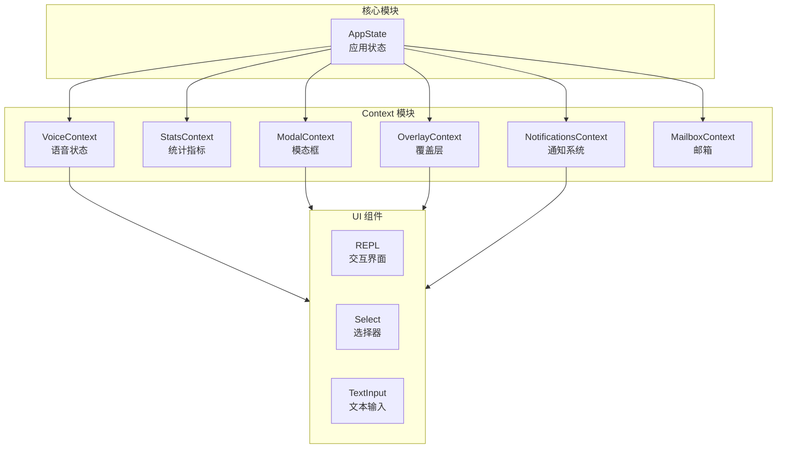
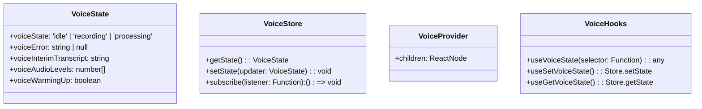
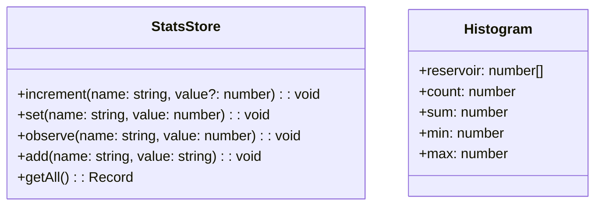
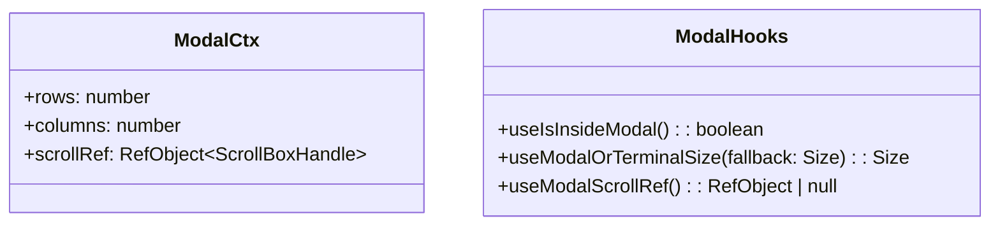
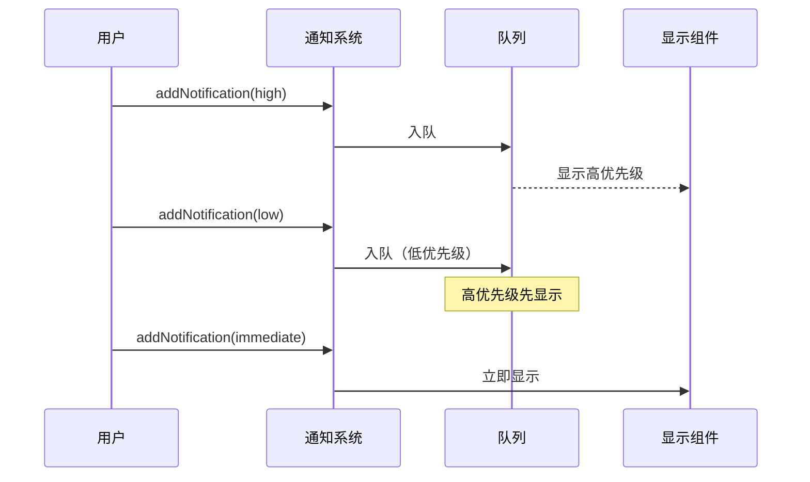
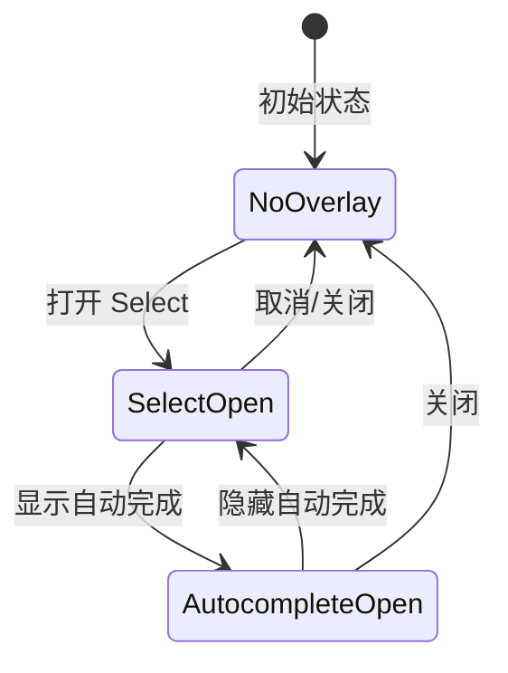

# Context 模块

Context 模块是 Claude Code 应用程序状态管理的核心组件集合，提供 React Context 来管理各种 UI 状态，包括语音输入、统计数据、模态框、通知和覆盖层等。

## 架构位置



## 文件结构

```
restored-src/src/context/
├── voice.tsx              # 语音输入状态管理
├── stats.tsx              # 统计数据收集
├── modalContext.tsx       # 模态框上下文
├── notifications.tsx       # 通知队列系统
├── overlayContext.tsx     # 覆盖层管理
├── mailbox.tsx            # 消息邮箱
├── fpsMetrics.tsx         # FPS 性能指标
├── promptOverlayContext.tsx  # 提示覆盖层
└── QueuedMessageContext.tsx  # 消息队列
```

## 核心组件

### VoiceContext - 语音状态管理

VoiceContext 管理语音输入功能的状态，使用 `useSyncExternalStore` 实现高效的响应式状态更新。



**导出 Hook:**

| Hook | 说明 |
|------|------|
| `useVoiceState(selector)` | 订阅语音状态切片，仅在所选值变化时重新渲染 |
| `useSetVoiceState()` | 获取状态 setter，同步更新状态 |
| `useGetVoiceState()` | 获取同步读取器，用于事件处理器内部读取状态 |

**使用示例:**

```typescript
import { useVoiceState, useSetVoiceState } from './context/voice'

function VoiceIndicator() {
  const voiceState = useVoiceState(s => s.voiceState)
  const setVoiceState = useSetVoiceState()

  return (
    <div>
      {voiceState === 'recording' ? '正在录音...' : '空闲'}
      <button onClick={() => setVoiceState({ voiceState: 'idle' })}>
        停止
      </button>
    </div>
  )
}
```

### StatsContext - 统计数据收集

StatsContext 提供 metrics、histograms 和 sets 三种数据收集方式，支持百分位数计算。



**导出 Hook:**

| Hook | 说明 |
|------|------|
| `useStats()` | 获取 StatsStore 实例 |
| `useCounter(name)` | 返回递增计数器函数 |
| `useGauge(name)` | 返回设置器函数 |
| `useTimer(name)` | 返回观察器函数，用于记录耗时 |
| `useSet(name)` | 返回添加函数，用于记录离散值 |

**使用示例:**

```typescript
import { useCounter, useTimer, useGauge } from './context/stats'

function MetricsComponent() {
  const increment = useCounter('user_actions')
  const recordTime = useTimer('request_duration')
  const setActive = useGauge('active_users')

  const handleAction = async () => {
    increment()
    const start = Date.now()
    await doSomething()
    recordTime(Date.now() - start)
  }

  return <button onClick={handleAction}>执行操作</button>
}
```

### ModalContext - 模态框上下文

ModalContext 用于检测组件是否在模态框内渲染，并提供模态框内的可用尺寸信息。



**使用示例:**

```typescript
import { useIsInsideModal, useModalOrTerminalSize } from './context/modalContext'

function SelectComponent({ options }) {
  const isInsideModal = useIsInsideModal()
  const { rows } = useModalOrTerminalSize({ rows: 20, columns: 80 })

  // 在模态框内时限制可见选项数量
  const visibleOptions = isInsideModal
    ? options.slice(0, rows - 5)
    : options

  return <Select options={visibleOptions} />
}
```

### NotificationsContext - 通知系统

通知系统支持优先级队列、自动超时、通知合并和失效机制。



**通知类型:**

```typescript
type TextNotification = {
  key: string
  text: string
  color?: keyof Theme
  priority: 'low' | 'medium' | 'high' | 'immediate'
  timeoutMs?: number
  invalidates?: string[]
  fold?: (acc: Notification, incoming: Notification) => Notification
}

type JSXNotification = {
  key: string
  jsx: React.ReactNode
  priority: 'low' | 'medium' | 'high' | 'immediate'
  timeoutMs?: number
}
```

**使用示例:**

```typescript
import { useNotifications } from './context/notifications'

function NotificationButton() {
  const { addNotification } = useNotifications()

  const showWarning = () => {
    addNotification({
      key: 'save-warning',
      text: '文件未保存',
      priority: 'high',
      timeoutMs: 10000,
      invalidates: ['save-success']
    })
  }

  return <button onClick={showWarning}>显示警告</button>
}
```

### OverlayContext - 覆盖层管理

OverlayContext 协调 Escape 键在覆盖层和取消请求之间的处理。



**导出 Hook:**

| Hook | 说明 |
|------|------|
| `useRegisterOverlay(id, enabled?)` | 注册覆盖层，自动管理生命周期 |
| `useIsOverlayActive()` | 检查是否有任何覆盖层处于活跃状态 |
| `useIsModalOverlayActive()` | 检查是否有模态覆盖层（非自动完成） |

**使用示例:**

```typescript
import { useRegisterOverlay, useIsOverlayActive } from './context/overlayContext'

function Select({ onCancel }) {
  useRegisterOverlay('select', !!onCancel)
  const isOverlayActive = useIsOverlayActive()

  useKeybinding('escape', () => {
    if (isOverlayActive) {
      onCancel?.()
    }
  })

  return <SelectUI />
}
```

## 最佳实践

### 1. Context 订阅优化

使用选择器函数避免不必要的重新渲染：

```typescript
// ✅ 好：只订阅需要的状态
const count = useVoiceState(s => s.voiceAudioLevels.length)

// ❌ 差：订阅整个状态，任何变化都触发重渲染
const state = useVoiceState()
```

### 2. 状态更新模式

对于同步状态更新，使用 `setState`；对于异步操作，使用 `useEffect`：

```typescript
// ✅ 好：同步更新
const setVoiceState = useSetVoiceState()
button.onClick = () => setVoiceState({ voiceState: 'idle' })

// ✅ 好：异步操作
useEffect(() => {
  if (condition) {
    addNotification({ key: 'test', text: 'Hello', priority: 'low' })
  }
}, [condition])
```

### 3. 覆盖层条件注册

根据功能可用性动态注册覆盖层：

```typescript
// ✅ 好：条件注册
useRegisterOverlay('select', !!onCancel)

// ❌ 差：始终注册
useRegisterOverlay('select', true)
```

## 设计决策

### 为什么使用 `useSyncExternalStore`？

VoiceContext 使用 `useSyncExternalStore` 而非简单的 `useContext`，原因是：

1. **外部状态同步**：VoiceState 由非 React 系统（如 Web Audio API）管理
2. **选择器优化**：通过引用相等检查避免不必要的重渲染
3. **一致性保证**：确保在并发渲染时状态一致

### 统计 Histogram 的 Reservoir Sampling

StatsContext 使用 Algorithm R 进行 reservoir sampling，保证在无限数据流中保持固定的样本量：

```typescript
if (h.reservoir.length < RESERVOIR_SIZE) {
  h.reservoir.push(value)
} else {
  const j = Math.floor(Math.random() * h.count)
  if (j < RESERVOIR_SIZE) {
    h.reservoir[j] = value
  }
}
```

## 相关文档

- [应用状态管理](/wiki/core/state.md)
- [REPL 交互界面](/wiki/ui/repl.md)
- [工具系统](/wiki/core/tools.md)

---

*Generated by Nium-Wiki | 2026-04-01*
