# Hooks 模块

Hooks 模块是 Claude Code 的事件驱动扩展系统，允许在特定生命周期事件发生时执行自定义逻辑。通过 hooks，开发者可以在工具执行、会话状态变化、配置变更等关键时刻注入自定义处理逻辑。

## 架构位置

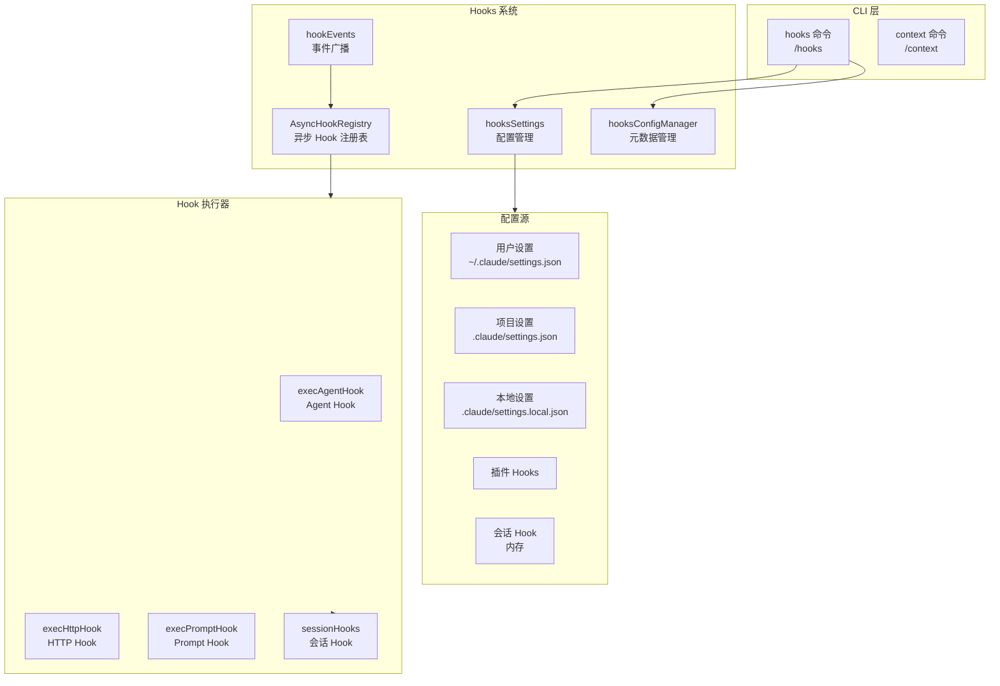

## 文件结构

```
restored-src/src/
├── commands/
│   └── hooks/
│       └── hooks.tsx              # HooksConfigMenu UI 组件（/hooks 命令）
│
├── components/hooks/
│   ├── HooksConfigMenu.tsx        # Hook 配置菜单组件
│   ├── SelectHookMode.tsx         # Hook 模式选择组件
│   └── ViewHookMode.tsx          # Hook 查看模式组件
│
├── schemas/
│   └── hooks.ts                  # Hook 相关 Zod Schema 定义
│
├── types/
│   └── hooks.ts                  # Hook 类型定义（HookResult, AggregatedHookResult 等）
│
└── utils/hooks/
    ├── AsyncHookRegistry.ts      # 异步 Hook 管理（超时、进度追踪）
    ├── hookEvents.ts             # 事件广播系统
    ├── hookHelpers.ts            # 辅助函数（结构化输出、参数替换）
    ├── hooks.ts                  # Hook 响应 Schema、HookCallback 类型
    ├── hooksSettings.ts          # 配置管理、Hook 来源解析
    ├── hooksConfigManager.ts     # Hook 配置 UI 元数据管理
    ├── hooksConfigSnapshot.ts    # 配置快照
    ├── sessionHooks.ts           # 会话级别 Hook（临时/内存 Hook）
    ├── execAgentHook.ts          # Agent Hook 执行器（LLM 验证）
    ├── execHttpHook.ts           # HTTP Hook 执行器
    ├── execPromptHook.ts         # Prompt Hook 执行器
    ├── postSamplingHooks.ts     # 采样后 Hook（内部 API）
    ├── registerFrontmatterHooks.ts  # Frontmatter Hook 注册
    ├── registerSkillHooks.ts    # Skill Hook 注册（支持 once: true）
    ├── apiQueryHookHelper.ts    # API 查询 Hook 辅助工具
    ├── ssrfGuard.ts             # HTTP Hook SSRF 防护
    └── hookEvents.ts            # Hook 事件广播
```

## 核心类型系统

### HookResult 与 AggregatedHookResult

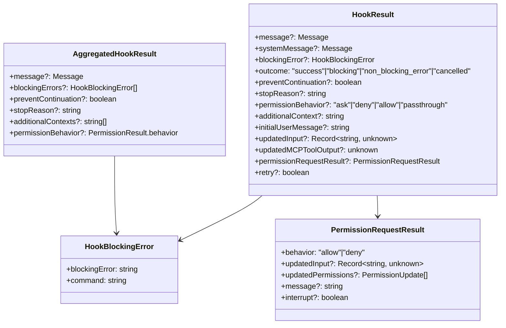

### HookCallback 回调类型

`HookCallback` 是内部 Hook（builtin/internal）的类型，通过代码注册而非配置文件，无法持久化到 `settings.json`：

```typescript
type HookCallback = {
  type: 'callback'
  callback: (
    input: HookInput,
    toolUseID: string | null,
    abort: AbortSignal | undefined,
    hookIndex?: number,      // SessionStart hooks 用于计算 CLAUDE_ENV_FILE 路径
    context?: HookCallbackContext,
  ) => Promise<HookJSONOutput>
  timeout?: number           // 超时秒数
  internal?: boolean          // 内部 Hook（如 analytics）不计入 tengu_run_hook 指标
}

type HookCallbackContext = {
  getAppState: () => AppState
  updateAttributionState: (
    updater: (prev: AttributionState) => AttributionState,
  ) => void
}
```

**内置 Callback Hook 示例**：`sessionFileAccessHooks`（会话文件访问分析）、`classifierApprovalsHook`（分类器审批）。

### FunctionHook 会话函数类型

`FunctionHook` 是另一种会话级别回调，通过 TypeScript 函数实现验证逻辑：

```typescript
type FunctionHook = {
  type: 'function'
  id?: string                // 唯一 ID，用于 removeFunctionHook
  timeout?: number
  callback: (messages: Message[], signal?: AbortSignal) => boolean | Promise<boolean>
  errorMessage: string
  statusMessage?: string
}
```

### Sync Hook 响应 Schema

```typescript
const syncHookResponseSchema = z.object({
  continue: z.boolean().optional(),        // 默认 true
  suppressOutput: z.boolean().optional(),   // 默认 false
  stopReason: z.string().optional(),
  decision: z.enum(['approve', 'block']).optional(),
  reason: z.string().optional(),
  systemMessage: z.string().optional(),
  hookSpecificOutput: z.union([...])        // 事件特定的输出字段
})
```

每个事件支持不同的 `hookSpecificOutput` 字段，例如：

| 事件 | 特有字段 |
|------|---------|
| `PreToolUse` | `permissionDecision`, `updatedInput`, `additionalContext` |
| `UserPromptSubmit` | `additionalContext` |
| `SessionStart` | `additionalContext`, `initialUserMessage`, `watchPaths` |
| `PermissionRequest` | `decision: {behavior: 'allow'|'deny', ...}` |
| `Elicitation` | `action: 'accept'|'decline'|'cancel'`, `content` |
| `CwdChanged` | `watchPaths` |
| `FileChanged` | `watchPaths` |
| `WorktreeCreate` | `worktreePath` |

## Hook 类型

### Hook 事件类型

Hooks 系统支持 26 种事件类型，覆盖工具执行、会话生命周期、配置变更等场景：

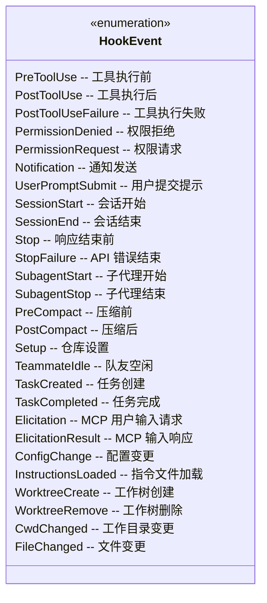

### Hook 命令类型

| 类型 | 说明 | 配置字段 |
|------|------|----------|
| `command` | 执行 shell 命令 | `command`, `shell`, `if?`, `timeout?` |
| `prompt` | 执行 prompt hook 并将输出附加到上下文 | `prompt`, `if?`, `timeout?` |
| `agent` | 使用 LLM Agent 验证条件 | `prompt`, `model?`, `if?`, `timeout?` |
| `http` | 发送 HTTP 请求 | `url`, `method?`, `headers?`, `body?` |
| `function` | 执行 TypeScript 回调（会话级别） | `callback`, `timeout?` |

## 核心组件

### AsyncHookRegistry - 异步 Hook 管理

管理异步 Hook 的注册、状态跟踪和响应收集。

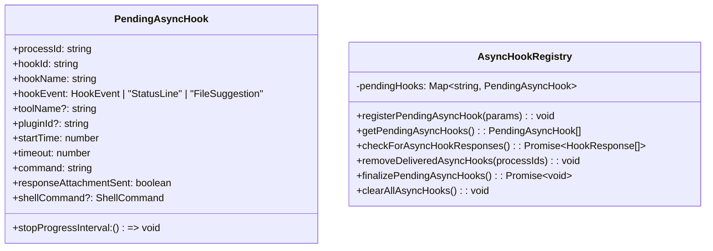

**关键功能:**

- **超时管理**：默认 15 秒超时，可通过 `asyncTimeout` 字段覆盖
- **进度追踪**：通过 `startHookProgressInterval` 定期发送 stdout 更新
- **响应收集**：解析 JSON 行输出，支持 `{"ok": true/false, "reason": "..."}` 格式
- **特殊事件类型**：支持 `StatusLine` 和 `FileSuggestion`（用于内部 UI 反馈）
- **SessionStart 完成后**：自动使会话环境缓存失效（`invalidateSessionEnvCache`）

### HookEvents - 事件广播系统

独立于主消息流的事件系统，用于广播 Hook 执行事件。

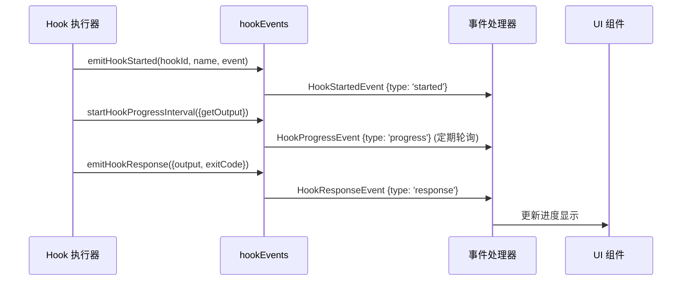

**事件类型:**

```typescript
type HookStartedEvent = {
  type: 'started'
  hookId: string
  hookName: string
  hookEvent: string
}

type HookProgressEvent = {
  type: 'progress'
  hookId: string
  hookName: string
  hookEvent: string
  stdout: string
  stderr: string
  output: string
}

type HookResponseEvent = {
  type: 'response'
  hookId: string
  hookName: string
  hookEvent: string
  output: string
  stdout: string
  stderr: string
  exitCode?: number
  outcome: 'success' | 'error' | 'cancelled'
}
```

**事件过滤机制:**

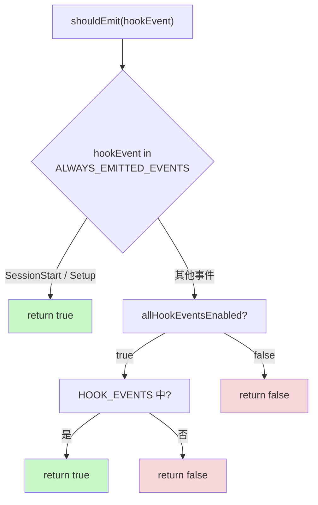

- **Always emitted**：无论 `includeHookEvents` 设置如何，`SessionStart` 和 `Setup` 始终广播
- **Conditional**：其他事件需要 `setAllHookEventsEnabled(true)` 后才会广播（SDK 的 `includeHookEvents` 选项设为 `true` 时，或在 `CLAUDE_CODE_REMOTE` 模式下自动开启）
- **Pending buffer**：未注册 handler 时，事件缓存在内存中（最多 100 条），handler 注册后一次性发送

```typescript
// 启用全部事件广播
setAllHookEventsEnabled(true)

// 注册事件处理器（用于 SDK includeHookEvents 模式）
registerHookEventHandler((event) => { /* 转为 SDK 消息等 */ })

// 清理状态（测试用）
clearHookEventState()
```

### SessionHooks - 会话级别 Hook

会话 Hook 是临时的、内存中的回调，不会持久化到配置文件。使用 `Map` 而非 `Record` 以支持 O(1) 原地修改，避免 O(N²) 的状态复制开销：

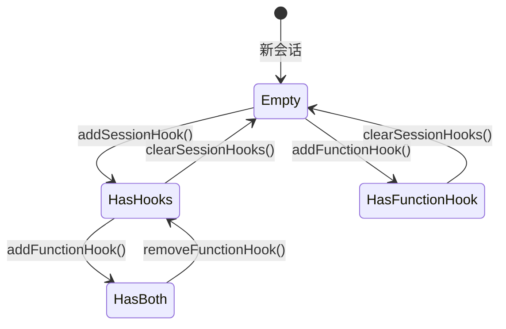

**导出函数:**

| 函数 | 说明 |
|------|------|
| `addSessionHook()` | 添加命令或 prompt hook |
| `addFunctionHook()` | 添加函数 hook，返回 hook ID |
| `removeFunctionHook()` | 通过 ID 移除函数 hook |
| `removeSessionHook()` | 移除特定 hook |
| `getSessionHooks()` | 获取所有非函数 hook（不含 callback） |
| `getSessionFunctionHooks()` | 获取所有函数 hook |
| `getSessionHookCallback()` | 获取含 callback 的完整 hook 条目 |
| `clearSessionHooks()` | 清除会话所有 hook |

**会话 Hook 存储结构：**

```typescript
type SessionStore = {
  hooks: {
    [event in HookEvent]?: SessionHookMatcher[]
  }
}

type SessionHookMatcher = {
  matcher: string
  skillRoot?: string       // Skill 范围隔离
  hooks: Array<{
    hook: HookCommand | FunctionHook
    onHookSuccess?: OnHookSuccess  // 成功后回调
  }>
}
```

**Map vs Record 优化原理：**

```typescript
// Map：O(1) 原地修改，Object.is 短路，不触发监听器
prev.sessionHooks.set(sessionId, { hooks: newHooks })
return prev  // 引用未变，所有监听器不触发

// Record：每次 O(N) 拷贝，O(N²) 总复杂度
prev.sessionHooks[sessionId] = { hooks: newHooks }
return { ...prev }  // 触发所有 ~30 个监听器
```

这对高并发 `parallel()` 多 Agent 场景尤为重要——N 个 Agent 并发注册 hook 时，Record 方式会导致 O(N²) 复杂度。

### registerFrontmatterHooks - Frontmatter Hook 注册

从 Agent 或 Skill 的 frontmatter 中注册 Hook，将其转换为会话级别的 session hook：

```typescript
registerFrontmatterHooks(
  setAppState,
  sessionId,     // Agent ID（用于 Agent 范围隔离）
  hooks,         // frontmatter 中的 hooks 配置
  sourceName,    // 用于日志的人类可读名称
  isAgent = false
)
```

**Agent 特殊处理**：Agent 的 `Stop` Hook 会被自动转换为 `SubagentStop`，因为 subagent 结束时触发的是 `SubagentStop` 而非 `Stop`：

```typescript
if (isAgent && event === 'Stop') {
  targetEvent = 'SubagentStop'
}
```

### registerSkillHooks - Skill Hook 注册

从 Skill frontmatter 注册 Hook，支持 `once: true` 一次性 Hook：

```typescript
registerSkillHooks(
  setAppState,
  sessionId,
  hooks,
  skillName,
  skillRoot   // CLAUDE_PLUGIN_ROOT 环境变量
)
```

**一次性 Hook**：`once: true` 的 Hook 在首次成功执行后自动移除：

```typescript
const onHookSuccess = hook.once
  ? () => removeSessionHook(setAppState, sessionId, eventName, hook)
  : undefined
```

### postSamplingHooks - 采样后 Hook（内部 API）

`postSamplingHooks` 是**不对外暴露**的内部机制，用于在模型采样完成后注入自定义逻辑：

```typescript
type PostSamplingHook = (context: REPLHookContext) => Promise<void> | void

type REPLHookContext = {
  messages: Message[]        // 完整消息历史（含 assistant 响应）
  systemPrompt: SystemPrompt
  userContext: { [k: string]: string }
  systemContext: { [k: string]: string }
  toolUseContext: ToolUseContext
  querySource?: QuerySource
}

// 注册
registerPostSamplingHook(hook)

// 执行（采样完成后调用）
await executePostSamplingHooks(messages, systemPrompt, userContext, ...)
```

**用途示例**：`apiQueryHookHelper.ts` 基于此实现了 `ApiQueryHook`，支持在 API 查询前后注入自定义逻辑（消息构建、响应解析等）。

### hookHelpers - 辅助函数

提供 Hook 响应模式化和结构化输出工具创建。

```typescript
// Hook 响应 Schema（用于 agent/prompt hook）
const hookResponseSchema = z.object({
  ok: z.boolean().describe('条件是否满足'),
  reason: z.string().describe('如果不满足，说明原因').optional(),
})

// 创建结构化输出工具（强制 Hook 使用 JSON 格式响应）
const tool = createStructuredOutputTool()

// 注册结构化输出强制执行（确保 Agent 调用 SyntheticOutputTool）
registerStructuredOutputEnforcement(setAppState, sessionId)

// 参数替换：支持 $ARGUMENTS、$ARGUMENTS[0]、$0 等形式
addArgumentsToPrompt(prompt, jsonInput)
```

**Structured Output Enforcement** 在 `ask.tsx`、`execAgentHook.ts` 和后台验证中均有使用，确保 LLM 输出严格符合 `hookResponseSchema`。

### hooksConfigManager - 配置元数据管理

为 `/hooks` 命令的 UI 提供每种事件的描述、Matcher 候选值等信息：

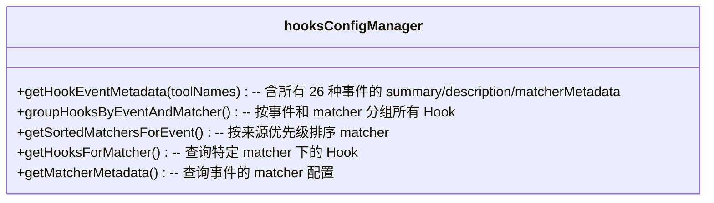

**事件描述示例**（部分）：

| 事件 | 摘要 | Matcher 字段 |
|------|------|------------|
| `PreToolUse` | 工具执行前 | `tool_name` |
| `PostToolUse` | 工具执行后 | `tool_name` |
| `PermissionRequest` | 权限对话框显示时 | `tool_name` |
| `Elicitation` | MCP 请求用户输入 | `mcp_server_name` |
| `CwdChanged` | 工作目录变更后 | — |
| `FileChanged` | 监控文件变更 | 文件名 glob |
| `InstructionsLoaded` | 指令文件加载 | `load_reason` |

**Matcher 优先级**：Local Settings > Project Settings > User Settings > Plugin Hooks（最低）

## Hook 执行流程

### Agent Hook 执行流程

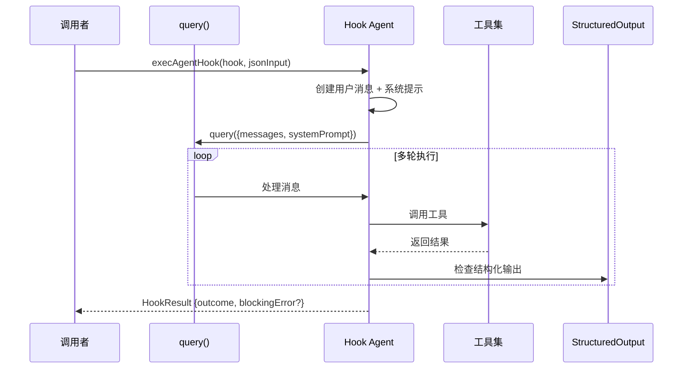

**Agent Hook 特点:**

- 默认超时 60 秒
- 最多 50 轮对话
- 自动注入 `SyntheticOutputTool` 工具
- 过滤禁用工具（子代理、计划模式等）
- 直接创建用户消息（不经过 `processUserInput`），避免触发 `UserPromptSubmit` 循环

### Elicitation 协议（MCP 用户输入请求）

Elicitation 是 MCP 服务器向用户请求输入的协议，通过两个 Hook 事件控制：

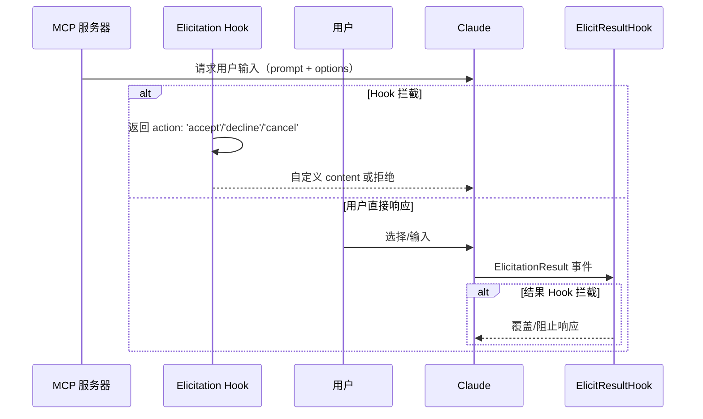

**Elicitation Hook 输入 Schema：**

```typescript
type PromptRequest = {
  prompt: string       // 请求 ID（用于关联响应）
  message: string      // 显示给用户的消息
  options: Array<{
    key: string
    label: string
    description?: string
  }>
}
```

**Hook 响应示例：**

```json
{
  "hookSpecificOutput": {
    "hookEventName": "Elicitation",
    "action": "accept",
    "content": { "selectedKey": "option-1" }
  }
}
```

**Notification 事件**中 `elicitation_dialog`、`elicitation_complete`、`elicitation_response` 子类型对应 UI 侧的显示控制。

### HTTP Hook 执行

HTTP Hook 支持与外部服务集成，支持沙箱网络代理和 SSRF 防护：

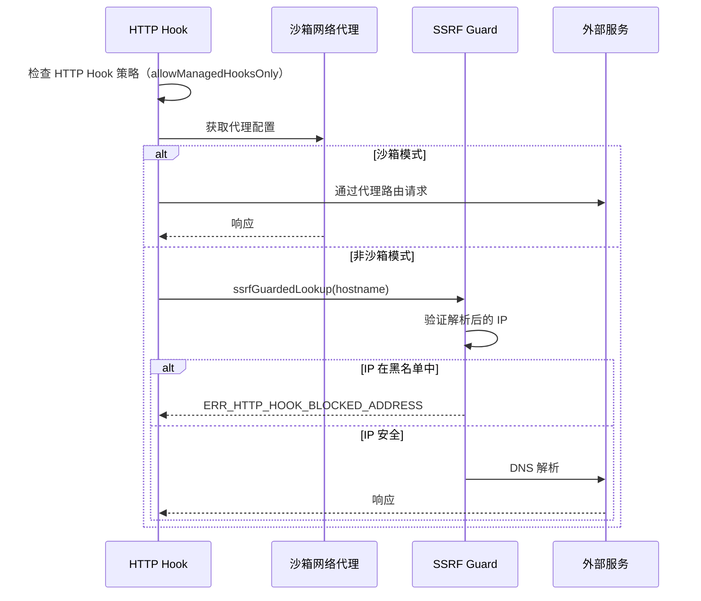

**SSRF 防护黑名单（ssrfGuard.ts）：**

| 地址范围 | 示例 | 说明 |
|---------|------|------|
| 0.0.0.0/8 | 0.0.0.0 | 本网络 |
| 10.0.0.0/8 | 10.x.x.x | 私有 |
| 100.64.0.0/10 | 100.64.x.x | CGNAT（阿里云元数据 100.100.100.200） |
| 169.254.0.0/16 | 169.254.x.x | 链路本地（云元数据） |
| 172.16.0.0/12 | 172.16.x.x | 私有 |
| 192.168.0.0/16 | 192.168.x.x | 私有 |
| IPv6 fc00::/7 | — | 唯一本地 |
| IPv6 fe80::/10 | — | 链路本地 |

**例外**：127.0.0.0/8 和 ::1（loopback）始终允许，用于本地开发。

**返回结果：**

```typescript
type HttpHookResult = {
  hookSpecificOutput?: {
    watchPaths?: string[]  // 动态更新文件监控
  }
}
```

## 配置管理

### 配置源优先级

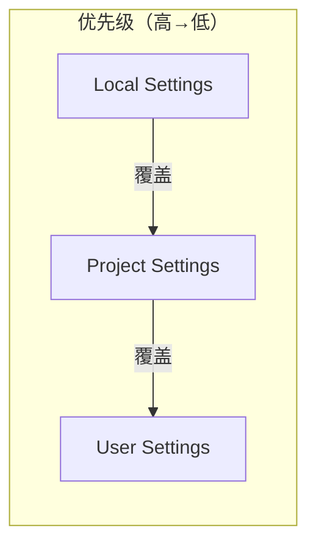

### Hook 注册表

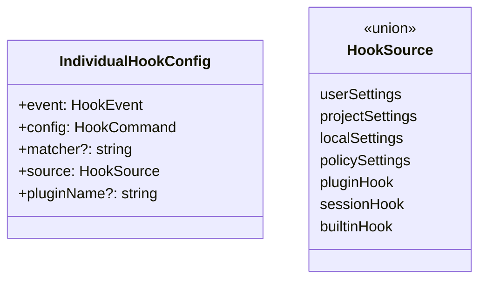

## 使用示例

### 基本命令 Hook

```json
{
  "hooks": {
    "PreToolUse": [
      {
        "matcher": "Bash",
        "hooks": [
          {
            "type": "command",
            "command": "echo 'Tool: {tool_name}'",
            "shell": "bash"
          }
        ]
      }
    ]
  }
}
```

### Agent Hook 验证

```json
{
  "hooks": {
    "Stop": [
      {
        "matcher": "",
        "hooks": [
          {
            "type": "agent",
            "prompt": "验证代码是否满足以下条件: {argument}",
            "timeout": 30
          }
        ]
      }
    ]
  }
}
```

### 一次性 Hook（once: true）

```json
{
  "hooks": {
    "SessionStart": [
      {
        "matcher": "",
        "hooks": [
          {
            "type": "command",
            "command": "setup-env.sh",
            "once": true
          }
        ]
      }
    ]
  }
}
```

### Skill Frontmatter 中注册 Hook

```yaml
# skill.md
---
hooks:
  PreToolUse:
    - matcher: "Bash"
      hooks:
        - type: command
          command: echo "Running skill task"
          if: "Bash(git *)"
  SubagentStop:
    - matcher: ""
      hooks:
        - type: prompt
          prompt: "Summarize: {argument}"
---
```

```typescript
// 在 Agent/Skill 加载时注册
import { registerFrontmatterHooks } from './utils/hooks/registerFrontmatterHooks'

registerFrontmatterHooks(setAppState, agentId, hooksConfig, 'my-agent', true)
```

### 会话 Hook（代码集成）

```typescript
import { addFunctionHook } from './utils/hooks/sessionHooks'

// 添加验证 hook
const hookId = addFunctionHook(
  setAppState,
  sessionId,
  'UserPromptSubmit',
  '',
  async (messages) => {
    const lastMessage = messages[messages.length - 1]
    const content = lastMessage.content[0]?.text ?? ''
    return content.length <= 1000
  },
  '提示内容必须少于 1000 字符'
)

// 移除 hook
removeFunctionHook(setAppState, sessionId, 'UserPromptSubmit', hookId)
```

## CLI 命令

### /hooks 命令

查看当前会话的 Hook 配置：

```bash
/claude hooks
```

显示内容：
- 按事件分组的所有 Hook
- Hook 来源（用户/项目/本地/插件/会话）
- Matcher 配置
- Hook 类型和命令

### /context 命令

可视化当前上下文使用情况：

```bash
/claude context
```

显示内容：
- 消息数量统计
- Token 使用量
- 上下文压缩信息
- 按工具使用分布

## 最佳实践

### 1. Hook 超时设置

```json
{
  "type": "command",
  "command": "long-running-script.sh",
  "timeout": 300
}
```

建议：
- 快速检查：`timeout: 5-10`
- 中等操作：`timeout: 30-60`
- 长时间任务：`timeout: 300+`

### 2. 条件执行

使用 `if` 字段限制 Hook 触发条件：

```json
{
  "type": "command",
  "command": "check-format.sh",
  "if": "Bash(git *)"
}
```

### 3. 异步响应处理

对于需要长时间处理的 Hook，返回结构化 JSON：

```bash
#!/bin/bash
# 返回成功
echo '{"ok": true}'
# 返回失败并说明原因
echo '{"ok": false, "reason": "代码格式不符合规范"}'
```

### 4. 错误处理

Exit code 含义：
- `0`：成功，stdout 显示给模型或用户
- `2`：阻塞错误，stderr 显示给模型并阻止操作
- 其他：非阻塞错误，stderr 仅显示给用户

## 设计决策

### 为什么使用 Map 而非 Record？

SessionHooks 使用 `Map<string, SessionStore>` 而非 `Record<string, SessionStore>`：

```typescript
// Map：O(1) 插入，不改变容器引用
prev.sessionHooks.set(sessionId, { hooks: newHooks })
return prev  // 引用不变，Object.is 短路

// Record：每次 O(N) 拷贝，O(N²) 总复杂度
prev.sessionHooks[sessionId] = { hooks: newHooks }
return { ...prev }  // 触发所有监听器
```

### 为什么区分同步和异步 Hook？

- **同步 Hook**：命令立即返回，通过 exit code 和 stdout 判断结果
- **异步 Hook**：命令可能长时间运行，通过定期轮询 stdout 收集 JSON 响应

### Structured Output Tool 设计

Hook 系统强制使用 `SyntheticOutputTool` 返回结构化结果：
- 保证 Hook 响应格式一致
- 避免解析自然语言输出
- 支持复杂验证逻辑

## 相关文档

- [工具系统](/wiki/core/tools.md)
- [查询引擎](/wiki/core/query.md)
- [配置系统](/wiki/core/commands.md)
- [权限系统](/wiki/core/permissions.md)

---

**Source references**
- [types/hooks.ts](/restored-src/src/types/hooks.ts)
- [utils/hooks.ts](/restored-src/src/utils/hooks.ts)
- [utils/hooks/AsyncHookRegistry.ts](/restored-src/src/utils/hooks/AsyncHookRegistry.ts)
- [utils/hooks/hookEvents.ts](/restored-src/src/utils/hooks/hookEvents.ts)
- [utils/hooks/sessionHooks.ts](/restored-src/src/utils/hooks/sessionHooks.ts)
- [utils/hooks/hooksSettings.ts](/restored-src/src/utils/hooks/hooksSettings.ts)
- [utils/hooks/hooksConfigManager.ts](/restored-src/src/utils/hooks/hooksConfigManager.ts)
- [utils/hooks/hookHelpers.ts](/restored-src/src/utils/hooks/hookHelpers.ts)
- [utils/hooks/execAgentHook.ts](/restored-src/src/utils/hooks/execAgentHook.ts)
- [utils/hooks/execPromptHook.ts](/restored-src/src/utils/hooks/execPromptHook.ts)
- [utils/hooks/execHttpHook.ts](/restored-src/src/utils/hooks/execHttpHook.ts)
- [utils/hooks/ssrfGuard.ts](/restored-src/src/utils/hooks/ssrfGuard.ts)
- [utils/hooks/postSamplingHooks.ts](/restored-src/src/utils/hooks/postSamplingHooks.ts)
- [utils/hooks/registerFrontmatterHooks.ts](/restored-src/src/utils/hooks/registerFrontmatterHooks.ts)
- [utils/hooks/registerSkillHooks.ts](/restored-src/src/utils/hooks/registerSkillHooks.ts)
- [utils/hooks/apiQueryHookHelper.ts](/restored-src/src/utils/hooks/apiQueryHookHelper.ts)
- [commands/hooks/hooks.tsx](/restored-src/src/commands/hooks/hooks.tsx)

*Generated by Nium-Wiki | 2026-04-08*
