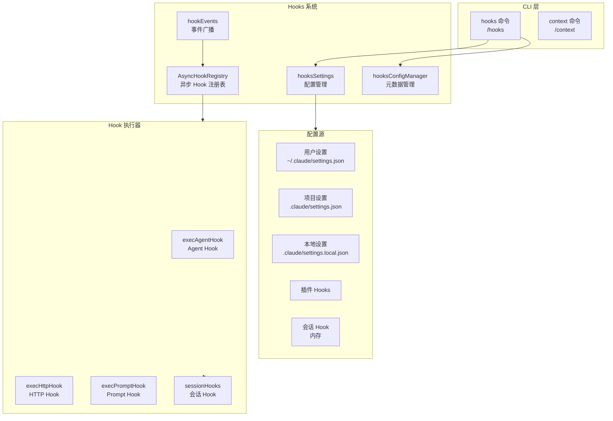
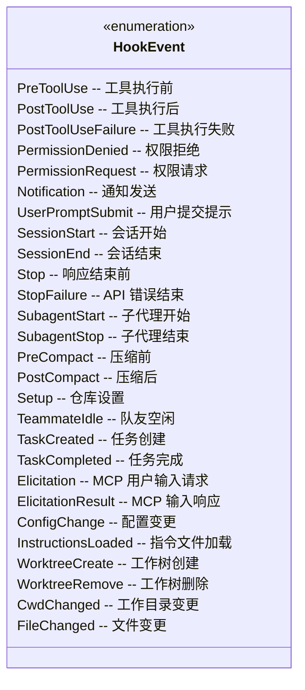
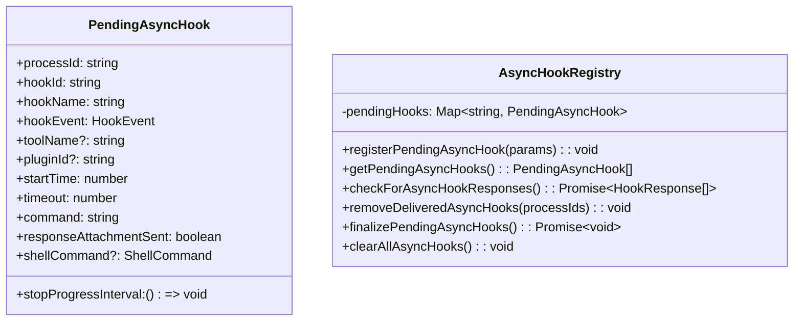
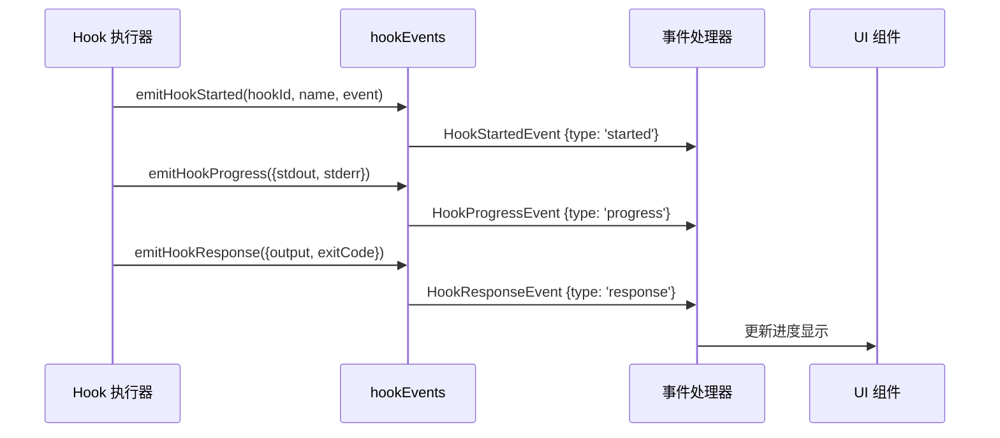
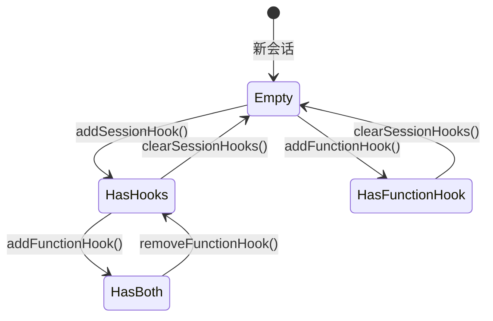
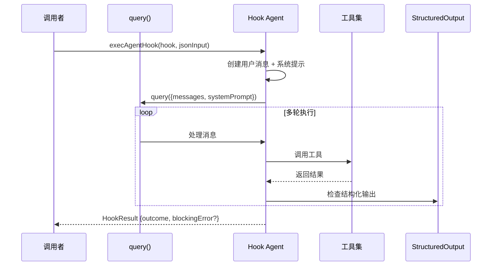
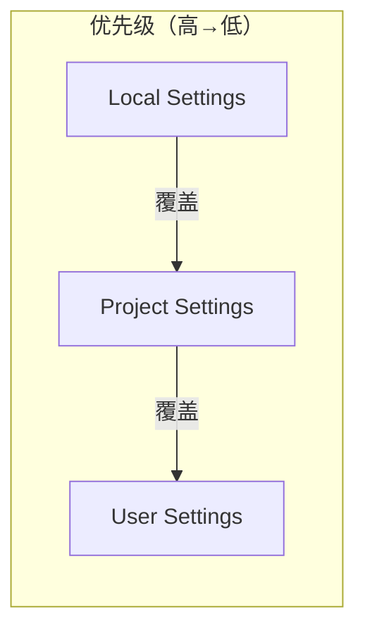
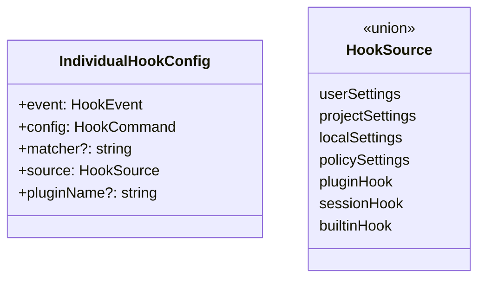

# Hooks 模块

Hooks 模块是 Claude Code 的事件驱动扩展系统，允许在特定生命周期事件发生时执行自定义逻辑。通过 hooks，开发者可以在工具执行、会话状态变化、配置变更等关键时刻注入自定义处理逻辑。

## 架构位置



## 文件结构

```
restored-src/src/
├── commands/
│   ├── hooks/
│   │   ├── index.ts           # hooks 命令入口
│   │   └── hooks.tsx          # HooksConfigMenu UI 组件
│   └── context/
│       ├── index.ts           # context 命令入口
│       ├── context.tsx        # ContextVisualization 可视化
│       └── context-noninteractive.ts
│
└── utils/
    └── hooks/
        ├── AsyncHookRegistry.ts    # 异步 Hook 管理
        ├── hookEvents.ts           # 事件系统
        ├── hookHelpers.ts          # 辅助函数
        ├── hooksSettings.ts        # 设置管理
        ├── hooksConfigManager.ts   # 配置管理器
        ├── hooksConfigSnapshot.ts  # 配置快照
        ├── sessionHooks.ts        # 会话 Hook
        ├── execAgentHook.ts       # Agent Hook 执行
        ├── execHttpHook.ts        # HTTP Hook 执行
        ├── execPromptHook.ts      # Prompt Hook 执行
        ├── execPromptHook.ts
        ├── fileChangedWatcher.ts   # 文件监控
        ├── registerFrontmatterHooks.ts
        ├── registerSkillHooks.ts
        ├── skillImprovement.ts
        ├── postSamplingHooks.ts
        ├── ssrfGuard.ts
        └── apiQueryHookHelper.ts
```

## Hook 类型

### Hook 事件类型

Hooks 系统支持 26 种事件类型，覆盖工具执行、会话生命周期、配置变更等场景：



### Hook 命令类型

| 类型 | 说明 | 配置字段 |
|------|------|----------|
| `command` | 执行 shell 命令 | `command`, `shell`, `if?`, `timeout?` |
| `prompt` | 执行 prompt hook 并将输出附加到上下文 | `prompt`, `if?`, `timeout?` |
| `agent` | 使用 LLM Agent 验证条件 | `prompt`, `model?`, `if?`, `timeout?` |
| `http` | 发送 HTTP 请求 | `url`, `method?`, `headers?`, `body?` |
| `function` | 执行 TypeScript 回调（会话级别） | `callback`, `timeout?` |

## 核心组件

### AsyncHookRegistry - 异步 Hook 管理

管理异步 Hook 的注册、状态跟踪和响应收集。



**关键功能:**

- **超时管理**：默认 15 秒超时，可配置
- **进度追踪**：通过 `startHookProgressInterval` 定期发送 stdout 更新
- **响应收集**：解析 JSON 行输出，支持 `{"ok": true/false, "reason": "..."}` 格式

### HookEvents - 事件广播系统

独立于主消息流的事件系统，用于广播 Hook 执行事件。



**事件类型:**

```typescript
type HookStartedEvent = {
  type: 'started'
  hookId: string
  hookName: string
  hookEvent: string
}

type HookProgressEvent = {
  type: 'progress'
  hookId: string
  hookName: string
  hookEvent: string
  stdout: string
  stderr: string
  output: string
}

type HookResponseEvent = {
  type: 'response'
  hookId: string
  hookName: string
  hookEvent: string
  output: string
  stdout: string
  stderr: string
  exitCode?: number
  outcome: 'success' | 'error' | 'cancelled'
}
```

### SessionHooks - 会话级别 Hook

会话 Hook 是临时的、内存中的回调，不会持久化到配置文件。



**导出函数:**

| 函数 | 说明 |
|------|------|
| `addSessionHook()` | 添加命令或 prompt hook |
| `addFunctionHook()` | 添加函数 hook，返回 hook ID |
| `removeFunctionHook()` | 通过 ID 移除函数 hook |
| `removeSessionHook()` | 移除特定 hook |
| `getSessionHooks()` | 获取会话所有 hook |
| `getSessionFunctionHooks()` | 获取函数 hook |
| `clearSessionHooks()` | 清除会话所有 hook |

**函数 Hook 回调:**

```typescript
type FunctionHookCallback = (
  messages: Message[],
  signal?: AbortSignal
) => boolean | Promise<boolean>
```

### HookHelpers - 辅助函数

提供 Hook 响应模式化和结构化输出工具创建。

```typescript
// Hook 响应 Schema
const hookResponseSchema = z.object({
  ok: z.boolean().describe('条件是否满足'),
  reason: z.string().describe('如果不满足，说明原因').optional(),
})

// 创建结构化输出工具
const tool = createStructuredOutputTool()

// 注册结构化输出强制执行
registerStructuredOutputEnforcement(setAppState, sessionId)
```

## Hook 执行流程

### Agent Hook 执行流程



**Agent Hook 特点:**

- 默认超时 60 秒
- 最多 50 轮对话
- 自动注入 `SyntheticOutputTool` 工具
- 过滤禁用工具（子代理、计划模式等）

### HTTP Hook 执行

HTTP Hook 支持与外部服务集成，返回 JSON 格式的响应：

```typescript
type HttpHookResult = {
  hookSpecificOutput?: {
    watchPaths?: string[]  // 动态更新文件监控
  }
}
```

## 配置管理

### 配置源优先级



### Hook 注册表



## 使用示例

### 基本命令 Hook

```json
{
  "hooks": {
    "PreToolUse": [
      {
        "matcher": "Bash",
        "hooks": [
          {
            "type": "command",
            "command": "echo 'Tool: {tool_name}'",
            "shell": "bash"
          }
        ]
      }
    ]
  }
}
```

### Agent Hook 验证

```json
{
  "hooks": {
    "Stop": [
      {
        "matcher": "",
        "hooks": [
          {
            "type": "agent",
            "prompt": "验证代码是否满足以下条件: {argument}",
            "timeout": 30
          }
        ]
      }
    ]
  }
}
```

### 会话 Hook（代码集成）

```typescript
import { addFunctionHook } from './utils/hooks/sessionHooks'

// 添加验证 hook
const hookId = addFunctionHook(
  setAppState,
  sessionId,
  'UserPromptSubmit',
  '',
  async (messages) => {
    const lastMessage = messages[messages.length - 1]
    const content = lastMessage.content[0]?.text ?? ''
    return content.length <= 1000
  },
  '提示内容必须少于 1000 字符'
)

// 移除 hook
removeFunctionHook(setAppState, sessionId, 'UserPromptSubmit', hookId)
```

## CLI 命令

### /hooks 命令

查看当前会话的 Hook 配置：

```bash
/claude hooks
```

显示内容：
- 按事件分组的所有 Hook
- Hook 来源（用户/项目/本地/插件/会话）
- Matcher 配置
- Hook 类型和命令

### /context 命令

可视化当前上下文使用情况：

```bash
/claude context
```

显示内容：
- 消息数量统计
- Token 使用量
- 上下文压缩信息
- 按工具使用分布

## 最佳实践

### 1. Hook 超时设置

```json
{
  "type": "command",
  "command": "long-running-script.sh",
  "timeout": 300
}
```

建议：
- 快速检查：`timeout: 5-10`
- 中等操作：`timeout: 30-60`
- 长时间任务：`timeout: 300+`

### 2. 条件执行

使用 `if` 字段限制 Hook 触发条件：

```json
{
  "type": "command",
  "command": "check-format.sh",
  "if": "Bash(git *)"
}
```

### 3. 异步响应处理

对于需要长时间处理的 Hook，返回结构化 JSON：

```bash
#!/bin/bash
# 返回成功
echo '{"ok": true}'
# 返回失败并说明原因
echo '{"ok": false, "reason": "代码格式不符合规范"}'
```

### 4. 错误处理

Exit code 含义：
- `0`：成功，stdout 显示给模型或用户
- `2`：阻塞错误，stderr 显示给模型并阻止操作
- 其他：非阻塞错误，stderr 仅显示给用户

## 设计决策

### 为什么使用 Map 而非 Record？

SessionHooks 使用 `Map<string, SessionStore>` 而非 `Record<string, SessionStore>`：

```typescript
// Map：O(1) 插入，不改变容器引用
prev.sessionHooks.set(sessionId, { hooks: newHooks })
return prev  // 引用不变，Object.is 短路

// Record：每次 O(N) 拷贝，O(N²) 总复杂度
prev.sessionHooks[sessionId] = { hooks: newHooks }
return { ...prev }  // 触发所有监听器
```

### 为什么区分同步和异步 Hook？

- **同步 Hook**：命令立即返回，通过 exit code 和 stdout 判断结果
- **异步 Hook**：命令可能长时间运行，通过定期轮询 stdout 收集 JSON 响应

### Structured Output Tool 设计

Hook 系统强制使用 `SyntheticOutputTool` 返回结构化结果：
- 保证 Hook 响应格式一致
- 避免解析自然语言输出
- 支持复杂验证逻辑

## 相关文档

- [工具系统](/wiki/core/tools.md)
- [查询引擎](/wiki/core/query.md)
- [配置系统](/wiki/core/commands.md)

---

*Generated by Nium-Wiki | 2026-04-01*
