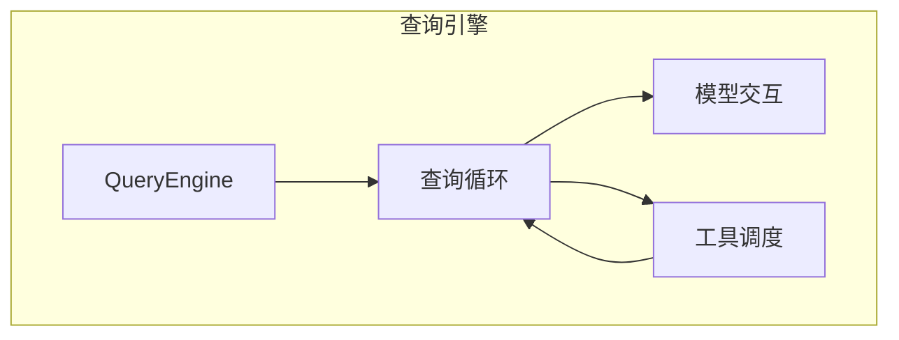
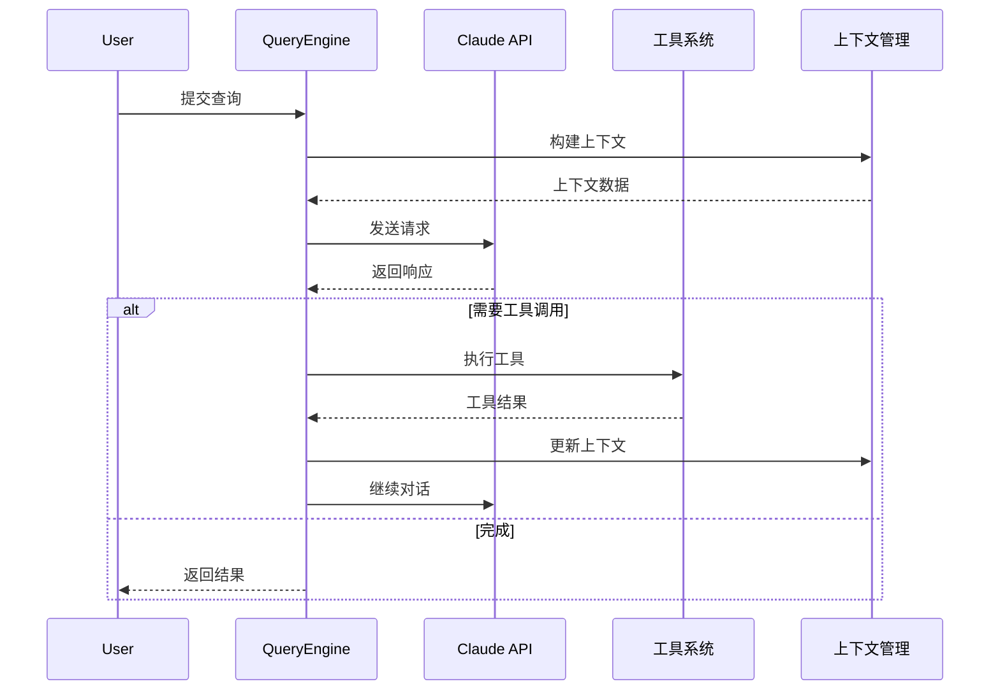
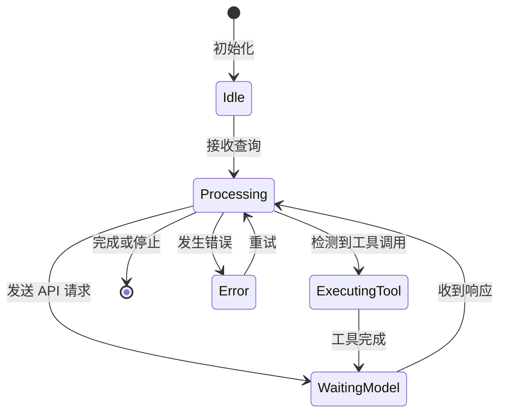
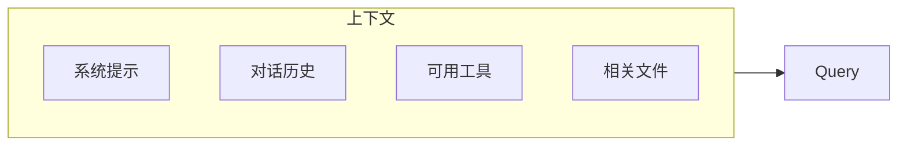

# 查询引擎

## 概述

查询引擎是 Claude Code 的大脑，负责协调用户查询、AI 模型调用和工具执行。引擎通过循环迭代的方式与 Claude 模型交互，直到任务完成或达到最大迭代次数。

核心实现在 [QueryEngine.ts](/restored-src/src/QueryEngine.ts) 文件中。

## 架构位置



## 功能特性

| 功能 | 说明 | 相关文件 |
|------|------|----------|
| 查询循环 | 主循环处理用户输入和模型响应 | [QueryEngine.ts](/restored-src/src/QueryEngine.ts) |
| 上下文管理 | 维护对话上下文和历史 | [context.ts](/restored-src/src/context.ts) |
| 令牌预算 | 管理上下文窗口和令牌使用 | [query/tokenBudget.ts](/restored-src/src/query/tokenBudget.ts) |
| 停止钩子 | 支持自定义停止条件 | [query/stopHooks.ts](/restored-src/src/query/stopHooks.ts) |

## 核心工作流



## 查询循环状态



## API 摘要

| 方法 | 说明 | 参数 |
|------|------|------|
| `query(input)` | 执行查询 | `QueryInput` |
| `stream(input)` | 流式查询 | `QueryInput` |
| `stop()` | 停止当前查询 | 无 |
| `pause()` | 暂停查询 | 无 |
| `resume()` | 恢复查询 | 无 |

## 查询输入

```typescript
interface QueryInput {
  message: string                    // 用户消息
  attachments?: Attachment[]         // 附件
  context?: QueryContext             // 额外上下文
  options?: QueryOptions             // 查询选项
}

interface QueryOptions {
  model?: string                     // 指定模型
  maxTokens?: number                // 最大令牌数
  temperature?: number               // 温度参数
  stopSequences?: string[]          // 停止序列
}
```

## 上下文管理

上下文管理是查询引擎的关键部分：



## 令牌预算

令牌预算管理确保上下文不会超出模型限制：

```typescript
interface TokenBudget {
  maxTokens: number          // 最大令牌数
  systemPrompt: number       // 系统提示占用
  history: number            // 历史占用
  tools: number             // 工具定义占用
  remaining: number          // 剩余可用
}
```

## 停止条件

支持多种停止条件：

| 条件 | 说明 | 优先级 |
|------|------|--------|
| 显式停止 | 用户或命令触发 | 高 |
| 令牌耗尽 | 达到最大令牌数 | 高 |
| 停止序列 | 匹配指定序列 | 中 |
| 自定义钩子 | `stopHooks` 配置 | 低 |

## 错误处理

| 错误类型 | 处理策略 |
|----------|----------|
| API 错误 | 重试（指数退避） |
| 速率限制 | 等待后重试 |
| 超时 | 增加超时或分段处理 |
| 上下文过长 | 自动压缩或分段 |

## 配置选项

| 选项 | 类型 | 默认值 | 说明 |
|------|------|--------|------|
| `model` | string | claude-opus-4-5 | 使用的模型 |
| `maxTokens` | number | 8192 | 响应最大令牌 |
| `temperature` | number | 1 | 生成温度 |
| `topP` | number | - | Top-p 采样 |
| `stopSequences` | string[] | [] | 停止序列 |

## 源码引用

- [QueryEngine.ts](/restored-src/src/QueryEngine.ts)
- [context.ts](/restored-src/src/context.ts)
- [query/tokenBudget.ts](/restored-src/src/query/tokenBudget.ts)
- [query/stopHooks.ts](/restored-src/src/query/stopHooks.ts)

## 相关文档

- [工具系统](tools.md)
- [命令系统](commands.md)
- [API 服务](../../services/api.md)

---

*Generated by [Nium-Wiki v0.0.0](https://github.com/niuma996/nium-wiki) | 2026-03-31*
