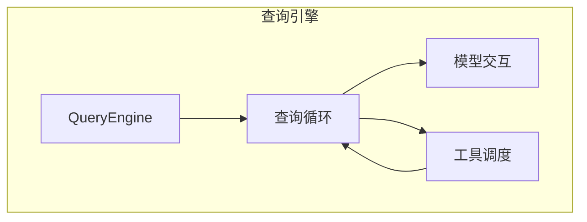
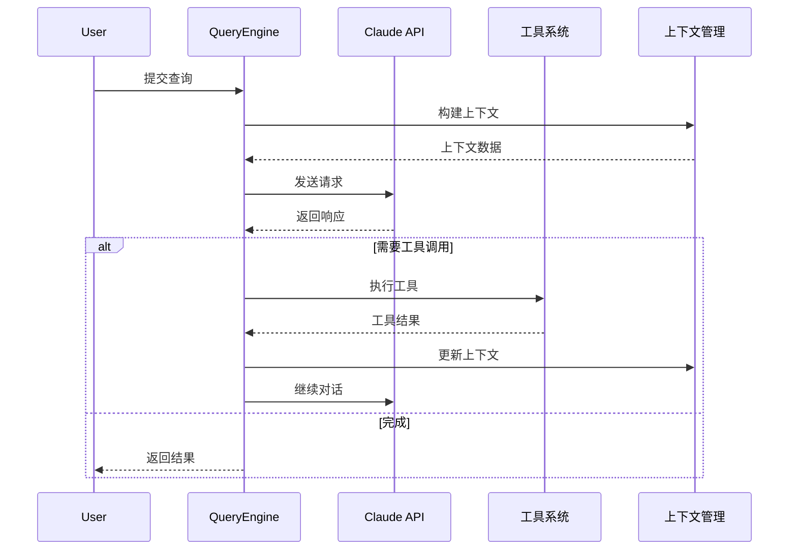
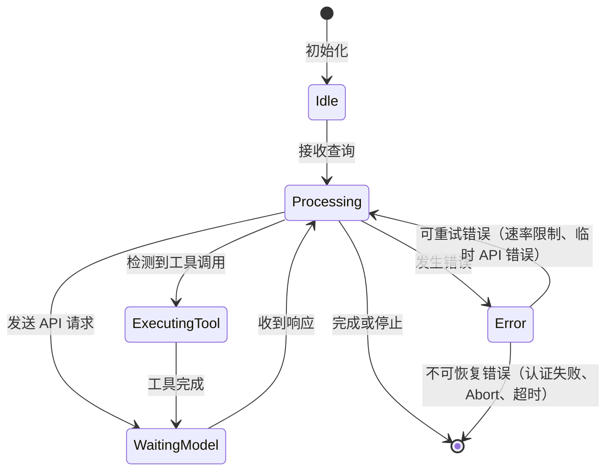
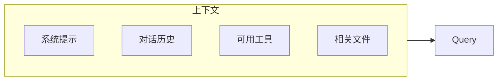

# 查询引擎

## 概述

查询引擎是 Claude Code 的大脑，负责协调用户查询、AI 模型调用和工具执行。引擎通过循环迭代的方式与 Claude 模型交互，直到任务完成或达到最大迭代次数。

核心实现在 [QueryEngine.ts](/restored-src/src/QueryEngine.ts#L184) 文件中，主要包含：
- [QueryEngine 类定义 L184](/restored-src/src/QueryEngine.ts#L184)
- [QueryEngineConfig 配置类型 L130](/restored-src/src/QueryEngine.ts#L130)
- [submitMessage 主方法 L209](/restored-src/src/QueryEngine.ts#L209)

## 架构位置



**核心源码文件**
- [QueryEngine.ts](/restored-src/src/QueryEngine.ts#L184) - 主引擎类
- [query.ts](/restored-src/src/query.ts) - 查询循环生成器
- [context.ts](/restored-src/src/context.ts) - 上下文管理
- [query/tokenBudget.ts](/restored-src/src/query/tokenBudget.ts) - 令牌预算
- [query/stopHooks.ts](/restored-src/src/query/stopHooks.ts) - 停止钩子

## 功能特性

| 功能 | 说明 | 相关文件 | 关键位置 |
|------|------|----------|----------|
| 查询循环 | 主循环处理用户输入和模型响应 | [QueryEngine.ts](/restored-src/src/QueryEngine.ts#L184) | submitMessage L209 |
| 上下文管理 | 维护对话上下文和历史 | [context.ts](/restored-src/src/context.ts) | 上下文状态管理 |
| 令牌预算 | 管理上下文窗口和令牌使用 | [query/tokenBudget.ts](/restored-src/src/query/tokenBudget.ts) | TokenBudget 类 |
| 停止钩子 | 支持自定义停止条件 | [query/stopHooks.ts](/restored-src/src/query/stopHooks.ts) | stopHooks 配置 |

## 核心工作流



## 查询循环状态



## API 摘要

### QueryEngine 类（核心）

| 方法 | 说明 | 签名 | 源码位置 |
|------|------|------|----------|
| `QueryEngine` | 构造函数 | `constructor(config: QueryEngineConfig)` | [L200](/restored-src/src/QueryEngine.ts#L200) |
| `submitMessage(prompt, opts?)` | 主入口：异步生成器，处理用户消息并 yield 流式事件 | `async *submitMessage(prompt, options?)` | [L209](/restored-src/src/QueryEngine.ts#L209) |
| `config` | 配置对象 | 私有属性 | [L185](/restored-src/src/QueryEngine.ts#L185) |
| `mutableMessages` | 可变消息数组 | 私有属性 | [L186](/restored-src/src/QueryEngine.ts#L186) |
| `abortController` | 中断控制器 | 私有属性 | [L187](/restored-src/src/QueryEngine.ts#L187) |
| `permissionDenials` | 权限拒绝追踪 | 私有属性 | [L188](/restored-src/src/QueryEngine.ts#L188) |
| `totalUsage` | 总使用量 | 私有属性 | [L189](/restored-src/src/QueryEngine.ts#L189) |

### query() 函数（查询循环生成器）

| 方法 | 说明 | 签名 | 源码位置 |
|------|------|------|----------|
| `query(params)` | 低级异步生成器，封装查询循环逻辑 | `async *query(params: QueryParams)` | [query.ts](/restored-src/src/query.ts) |

> **注意**：`QueryEngine` 没有 `stop()` / `pause()` / `resume()` 公开方法。停止通过 `AbortController` 实现（传入 `config.abortController`）；暂停通过 `stopHookActive` 内部状态控制。

### 关键私有属性详解

#### mutableMessages [L186](/restored-src/src/QueryEngine.ts#L186)
维护对话历史消息数组，在轮次间持久化：
```typescript
private mutableMessages: Message[]
```

#### abortController [L187](/restored-src/src/QueryEngine.ts#L187)
用于中断查询的 AbortController 实例：
```typescript
private abortController: AbortController
```

#### permissionDenials [L188](/restored-src/src/QueryEngine.ts#L188)
追踪所有工具权限拒绝，供 SDK 上报：
```typescript
private permissionDenials: SDKPermissionDenial[]
```

#### totalUsage [L189](/restored-src/src/QueryEngine.ts#L189)
累积 API 使用量统计：
```typescript
private totalUsage: NonNullableUsage
```

## 查询输入

实际类型为 `QueryParams`（定义于 [query.ts](/restored-src/src/query.ts)）：

```typescript
export type QueryParams = {
  messages: Message[]                        // 对话历史
  systemPrompt: SystemPrompt                 // 系统提示
  userContext: { [k: string]: string }     // 用户上下文（键值对）
  systemContext: { [k: string]: string }    // 系统上下文（键值对）
  canUseTool: CanUseToolFn                  // 工具权限检查函数
  toolUseContext: ToolUseContext             // 工具执行上下文
  fallbackModel?: string                     // 后备模型
  querySource: QuerySource                   // 查询来源标识
  maxOutputTokensOverride?: number           // 最大输出令牌覆盖
  maxTurns?: number                         // 最大轮次
  skipCacheWrite?: boolean                   // 跳过缓存写入
  taskBudget?: { total: number }            // API task_budget（beta feature）
  deps?: QueryDeps                          // 查询依赖
}
```

> **注意**：`message` / `attachments` / `options` / `temperature` / `topP` / `stopSequences` 等字段**不存在**于 `QueryParams` 中。模型参数通过 `getMainLoopModel()` / `parseUserSpecifiedModel()` 等函数处理。

## 上下文管理

上下文管理是查询引擎的关键部分：



## 任务预算

`QueryParams.taskBudget` 是 API 层的 `output_config.task_budget`（beta），用于限制整个 agentic turn 的总输出令牌数：

```typescript
taskBudget?: { total: number }  // API task_budget beta feature
```

> **注意**：Wiki 中描述的 `TokenBudget` 接口（`maxTokens` / `systemPrompt` / `history` / `tools` / `remaining`）在源码中**不存在**。

## 停止条件

支持多种停止条件：

| 条件 | 说明 | 优先级 |
|------|------|--------|
| 显式停止 | 用户或命令触发 | 高 |
| 令牌耗尽 | 达到最大令牌数 | 高 |
| 停止序列 | 匹配指定序列 | 中 |
| 自定义钩子 | `stopHooks` 配置 | 低 |

## 错误处理

| 错误类型 | 处理策略 |
|----------|----------|
| API 错误 | 重试（指数退避） |
| 速率限制 | 等待后重试 |
| 超时 | 增加超时或分段处理 |
| 上下文过长 | 自动压缩或分段 |

## 模型与参数配置

模型选择和参数不通过 `QueryParams` 直接传递，而是通过专用函数处理：

| 配置项 | 处理方式 |
|--------|---------|
| 模型选择 | `getMainLoopModel()` / `parseUserSpecifiedModel()` / `getDefaultSubagentModel()` |
| 最大令牌 | `maxOutputTokensOverride`（在 `QueryParams` 中）|
| 任务预算 | `taskBudget: { total: number }`（在 `QueryParams` 中）|
| 温度/topP | 通过 `getModelParams()` 在 API 层处理，不在 `QueryParams` 中 |
| 停止序列 | 通过 `stopHooks` 配置处理（在查询循环内部）|

## 源码引用

**核心文件**
- [QueryEngine.ts](/restored-src/src/QueryEngine.ts#L184) - 主引擎类 (L184)
- [QueryEngineConfig 类型](/restored-src/src/QueryEngine.ts#L130) - 配置类型 (L130-L173)
- [query.ts](/restored-src/src/query.ts) - 查询循环生成器
- [context.ts](/restored-src/src/context.ts) - 上下文管理

**配置和工具**
- [query/tokenBudget.ts](/restored-src/src/query/tokenBudget.ts) - 令牌预算管理
- [query/stopHooks.ts](/restored-src/src/query/stopHooks.ts) - 停止钩子配置

**关键类型和函数**
- [submitMessage L209](/restored-src/src/QueryEngine.ts#L209) - 主入口方法
- [QueryEngine 构造函数 L200](/restored-src/src/QueryEngine.ts#L200) - 初始化
- [wrappedCanUseTool L244-L271](/restored-src/src/QueryEngine.ts#L244-L271) - 权限检查包装

**私有属性**
- [config L185](/restored-src/src/QueryEngine.ts#L185) - 配置对象
- [mutableMessages L186](/restored-src/src/QueryEngine.ts#L186) - 消息历史
- [abortController L187](/restored-src/src/QueryEngine.ts#L187) - 中断控制器
- [permissionDenials L188](/restored-src/src/QueryEngine.ts#L188) - 权限拒绝追踪
- [totalUsage L189](/restored-src/src/QueryEngine.ts#L189) - 使用量统计

## 相关文档

- [工具系统](tools.md)
- [命令系统](commands.md)
- [API 服务](../../services/api.md)
- [核心模块索引](_index.md)

---

*Generated by [Nium-Wiki v0.0.0](https://github.com/niuma996/nium-wiki) | 2026-05-15*
