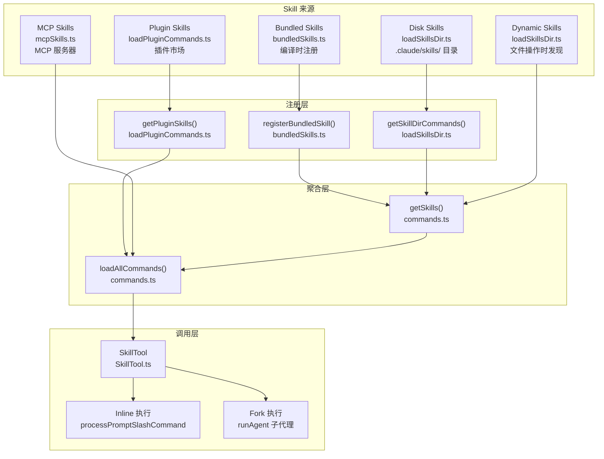
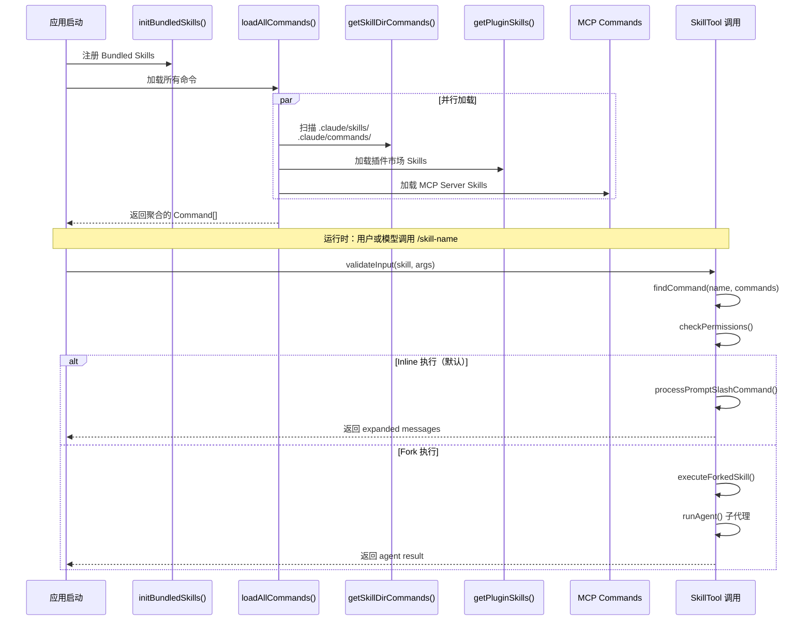
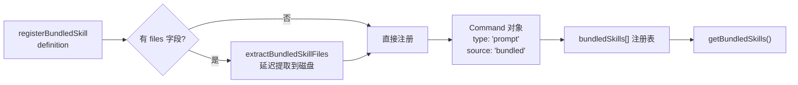
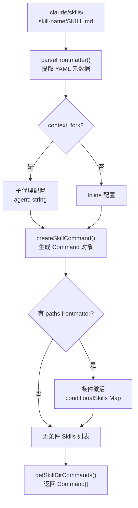
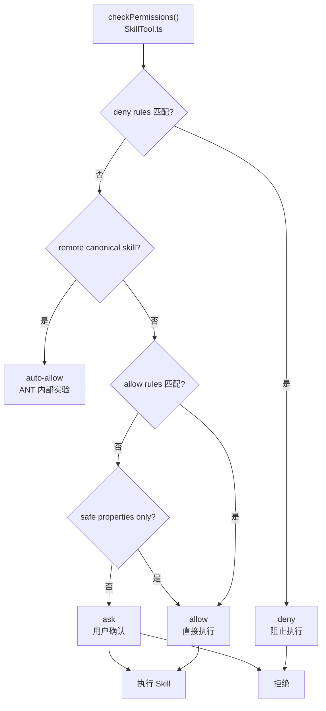
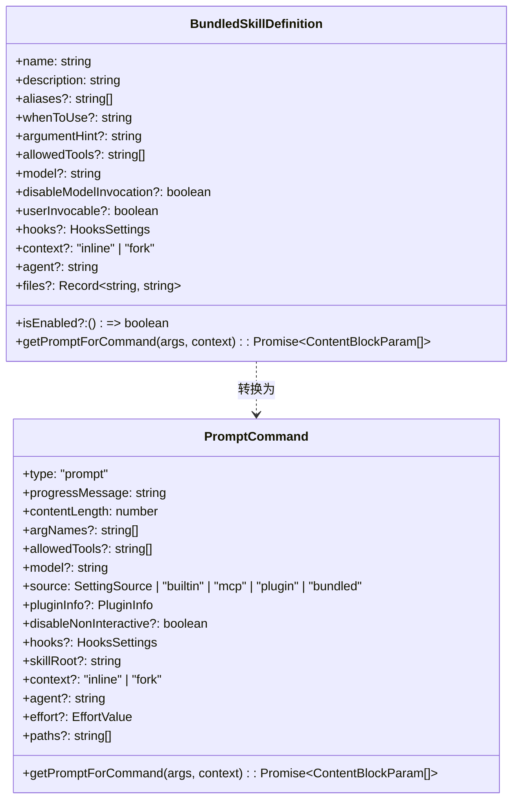
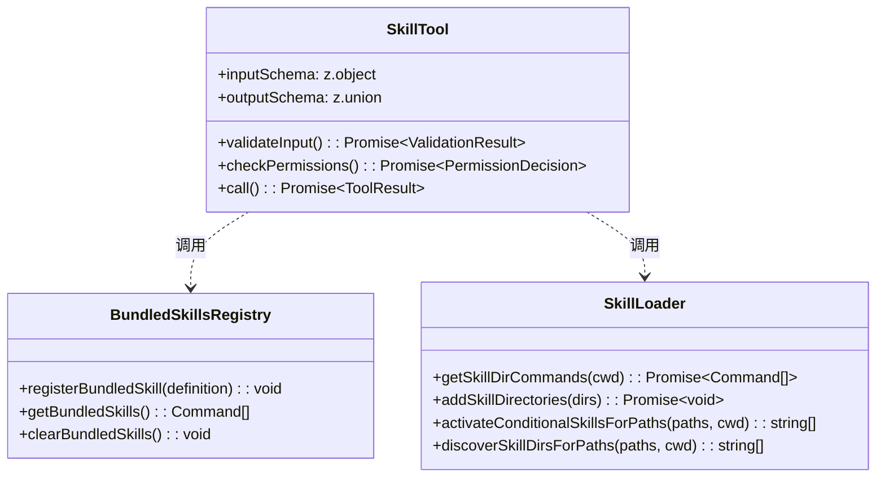

# Skills 模块

## 概览

Skills（技能）模块是 Claude Code 的可复用命令系统，允许用户和 AI 模型通过 `/skill-name` 语法调用预定义的 prompt 模板。与普通斜杠命令不同，Skills 专注于提供**领域化能力**——每个 Skill 封装了特定任务（如代码审查、提交生成、配置更新）的完整指令上下文，使 AI 能够提供一致、专业的结果。

Skills 的核心价值在于**解耦与复用**：提示词逻辑与工具系统分离，Skill 可以携带自己的工具白名单（`allowed-tools`）、模型配置（`model`）、执行上下文（`inline`/`fork`）以及生命周期钩子（`hooks`），无需修改核心代码即可扩展 CLI 能力。

## 架构位置



## 功能特性

| 特性 | 说明 | 相关文件 |
|------|------|---------|
| **多源加载** | 支持 Bundled、Disk、Plugin、MCP、Dynamic 五种来源 | [commands.ts](/restored-src/src/commands.ts#L353-L398) |
| **SKILL.md 格式** | 磁盘 Skills 使用 `skill-name/SKILL.md` 目录格式 | [loadSkillsDir.ts](/restored-src/src/skills/loadSkillsDir.ts#L406-L480) |
| **Frontmatter 配置** | 支持 description、allowed-tools、model、hooks 等元数据 | [loadSkillsDir.ts](/restored-src/src/skills/loadSkillsDir.ts#L185-L265) |
| **Inline 执行** | Skill 内容展开到当前对话上下文（默认） | [SkillTool.ts](/restored-src/src/tools/SkillTool/SkillTool.ts#L634-L841) |
| **Fork 执行** | Skill 在独立子代理中运行，拥有独立 token 预算 | [SkillTool.ts](/restored-src/src/tools/SkillTool/SkillTool.ts#L122-L289) |
| **权限控制** | Skill 触发权限提示，基于 allowed-tools 和 safe-properties 白名单 | [SkillTool.ts](/restored-src/src/tools/SkillTool/SkillTool.ts#L432-L578) |
| **条件激活** | `paths` frontmatter 控制 Skill 在匹配文件被操作时激活 | [loadSkillsDir.ts](/restored-src/src/skills/loadSkillsDir.ts#L997-L1058) |
| **动态发现** | 文件操作时从嵌套 `.claude/skills/` 目录动态加载 | [loadSkillsDir.ts](/restored-src/src/skills/loadSkillsDir.ts#L861-L915) |
| **生命周期钩子** | Skill 可注册 PreToolUse、PostToolUse 等钩子 | [loadSkillsDir.ts](/restored-src/src/skills/loadSkillsDir.ts#L136-L153) |
| **工具预算** | Skill 列表占上下文窗口的 1%（~8000 字符） | [prompt.ts](/restored-src/src/tools/SkillTool/prompt.ts#L21-L41) |

## 文件结构

```
restored-src/src/
├── skills/
│   ├── bundled/                      # 内置 Skills（编译时注册）
│   │   ├── index.ts                  # initBundledSkills() 初始化入口
│   │   ├── updateConfig.ts           # /update-config 技能
│   │   ├── verify.ts                 # /verify 技能
│   │   ├── debug.ts                  # /debug 技能
│   │   ├── simplify.ts              # /simplify 技能
│   │   ├── batch.ts                 # /batch 技能
│   │   ├── stuck.ts                 # /stuck 技能
│   │   ├── remember.ts              # /remember 技能
│   │   ├── skillify.ts              # /skillify 技能
│   │   ├── keybindings.ts           # /keybindings 技能
│   │   ├── loop.ts                  # /loop 技能（AGENT_TRIGGERS）
│   │   ├── scheduleRemoteAgents.ts  # /schedule-remote-agents（AGENT_TRIGGERS_REMOTE）
│   │   ├── claudeApi.ts             # /claude-api（BUILDING_CLAUDE_APPS）
│   │   └── ...
│   ├── bundledSkills.ts              # BundledSkillDefinition 类型定义和注册函数
│   ├── loadSkillsDir.ts             # 磁盘 Skills 加载（SKILL.md 解析、动态发现、条件激活）
│   └── mcpSkillBuilders.ts          # MCP Skill 构建器注册
│
├── tools/SkillTool/
│   ├── SkillTool.ts                 # SkillTool 核心实现（验证、权限、调用）
│   ├── constants.ts                 # 工具名称、上下文预算、格式化逻辑
│   └── prompt.ts                    # SkillTool 系统提示词
│
├── commands.ts                      # 命令注册表、getCommands()、findCommand()
├── types/
│   └── command.ts                   # Command、PromptCommand 类型定义
│
└── plugins/
    └── builtinPlugins.ts            # 内置插件（Bundled Skills 变体）
```

## 核心工作流

### Skill 加载序列



### Bundled Skill 注册流程



### 磁盘 Skill 解析流程



## Frontmatter 规范

磁盘 Skills 使用 YAML frontmatter 定义元数据，位于 `SKILL.md` 文件顶部：

```yaml
---
# Skill 显示名称（可选，默认使用目录名）
name: skill-name

# 简短描述（必填）
description: Generate high-quality commit messages

# 详细使用场景（用于 SkillTool 提示词匹配）
when_to_use: When user wants to create a commit message

# 参数提示（如 "/commit -m 'Fix bug'" 中的 '-m'）
argument-hint: -m '<message>'

# 允许的工具白名单（空 = 无限制）
allowed-tools:
  - Read
  - Bash
  - Write

# 模型覆盖（可选，默认继承父模型）
model: sonnet

# 用户是否可直接调用（默认 true）
user-invocable: true

# 执行上下文：inline（默认）或 fork（子代理）
context: inline

# Fork 执行时使用的代理类型
agent: general-purpose

# 努力级别：low, medium, high, max 或整数
effort: medium

# 条件激活：仅当操作匹配路径时显示
paths:
  - src/**/*.ts

# 生命周期钩子
hooks:
  PreToolUse:
    - matcher:
        tool-name: Bash
      hook: echo "Running bash: $TOOL_NAME"

# Shell 类型：bash（默认）或 powershell
shell: bash
---
```

## 权限模型



**Safe Properties 白名单**：`type`、`progressMessage`、`contentLength`、`argNames`、`model`、`effort`、`source`、`pluginInfo`、`disableNonInteractive`、`skillRoot`、`context`、`agent`、`name`、`description`、`hasUserSpecifiedDescription`、`isEnabled`、`isHidden`、`aliases`、`isMcp`、`argumentHint`、`whenToUse`、`paths`、`version`、`disableModelInvocation`、`userInvocable`、`loadedFrom`、`immediate`、`userFacingName`、`getPromptForCommand`、`frontmatterKeys`。若 Skill 包含白名单之外的属性且有实际值，则触发权限询问。

## 内置 Bundled Skills

| Skill | 文件 | 说明 |
|-------|------|------|
| `/update-config` | [updateConfig.ts](/restored-src/src/skills/bundled/updateConfig.ts) | 通过 `settings.json` 配置 Claude Code |
| `/verify` | [verify.ts](/restored-src/src/skills/bundled/verify.ts) | 验证变更并生成测试计划 |
| `/debug` | [debug.ts](/restored-src/src/skills/bundled/debug.ts) | 分析错误并提供修复建议 |
| `/simplify` | [simplify.ts](/restored-src/src/skills/bundled/simplify.ts) | 审查变更代码的可复用性、质量和效率 |
| `/batch` | [batch.ts](/restored-src/src/skills/bundled/batch.ts) | 周期性运行 prompt 或斜杠命令 |
| `/stuck` | [stuck.ts](/restored-src/src/skills/bundled/stuck.ts) | 当模型卡住时提供帮助 |
| `/remember` | [remember.ts](/restored-src/src/skills/bundled/remember.ts) | 将信息保存到持久化记忆系统 |
| `/skillify` | [skillify.ts](/restored-src/src/skills/bundled/skillify.ts) | 将现有变更转换为可复用 Skill |
| `/keybindings` | [keybindings.ts](/restored-src/src/skills/bundled/keybindings.ts) | 配置键盘快捷键 |
| `/loop` | [loop.ts](/restored-src/src/skills/bundled/loop.ts) | 定时运行任务（AGENT_TRIGGERS） |
| `/claude-api` | [claudeApi.ts](/restored-src/src/skills/bundled/claudeApi.ts) | 构建 Claude API/Agent SDK 应用 |
| `/claude-in-chrome` | [claudeInChrome.ts](/restored-src/src/skills/bundled/claudeInChrome.ts) | Claude in Chrome 扩展集成 |

## 使用示例

### 快速开始：创建磁盘 Skill

项目结构：
```
.claude/
└── skills/
    └── my-skill/
        └── SKILL.md
```

`SKILL.md` 内容：
```yaml
---
name: my-skill
description: A custom skill for specialized tasks
when_to_use: When user asks about topic X
allowed-tools:
  - Read
  - Grep
---

# My Skill

当用户询问关于 X 的问题时，执行以下步骤：

1. 读取相关文件
2. 分析内容
3. 提供建议
```

用户调用：`/my-skill`

### 调用带参数的 Skill

```typescript
// 用户输入：/commit -m "Fix authentication bug"
// SkillTool 输入
const input = {
  skill: "commit",
  args: "-m 'Fix authentication bug'"
}
```

### Fork 执行（子代理）

当 Skill 的 frontmatter 设置 `context: fork` 时，内容通过 `runAgent()` 在独立子代理中执行：

```yaml
---
context: fork
agent: general-purpose
model: sonnet
effort: high
---

# Code Review Skill

作为高级代码审查员，审查变更并提供详细反馈...
```

## 最佳实践

**推荐：**
- 为每个 Skill 创建独立目录（`skill-name/SKILL.md`），而非单文件格式
- 使用 `when_to_use` 提供详细场景描述，帮助模型正确匹配
- 显式声明 `allowed-tools`，减少权限询问
- 长时间或复杂任务使用 `context: fork` 隔离执行

**避免：**
- 不要在 `paths` 中使用 `**`（match-all），这等同于无 paths 配置
- 不要省略 `description`，否则系统从 markdown 首行自动推断（质量不可控）
- Bundled Skills 中的文件提取（`files` 字段）仅用于 Skill 自身参考文件，不用于传递 prompt 逻辑

## 设计决策

### 1. 目录格式优先于单文件格式

`loadSkillsDir.ts` 只支持 `.claude/skills/skill-name/SKILL.md` 目录格式，单 `.md` 文件仅在遗留的 `/commands/` 目录中支持。

**原因**：目录格式支持在 Skill 目录内放置额外资源文件（脚本、schema、示例数据），使 Skill 自包含；单文件格式被标记为 `commands_DEPRECATED`。

### 2. Fork 执行采用独立 Token 预算

当 `context: fork` 时，Skill 运行在通过 `runAgent()` 启动的子代理中，拥有独立的 token 窗口和上下文。

**原因**：复杂 Skill 可能需要大量推理token，Inline 执行会消耗主会话的上下文预算；Fork 隔离防止 Skill 的长推理影响主对话节奏。

### 3. 安全属性白名单而非黑名单

权限系统通过 `SAFE_SKILL_PROPERTIES` 白名单判断 Skill 是否需要用户授权。新增的 Command 属性默认需要授权，直至明确加入白名单。

**原因**：黑名单模式会因遗漏新属性引入安全风险；白名单确保新增属性默认安全，审慎方可放行。

## 源码索引

### 关键类型



### 核心函数签名



## 相关文档

- [命令系统](commands.md) — 所有斜杠命令的统一管理
- [工具系统](tools.md) — SkillTool 等工具的实现细节
- [Hooks 模块](hooks.md) — Skill 生命周期钩子
- [插件系统](../plugins/) — Plugin Skills 加载机制
- [架构文档](../architecture.md)

---

*Generated by [Nium-Wiki v0.0.0](https://github.com/niuma996/nium-wiki) | 2026-04-08*
