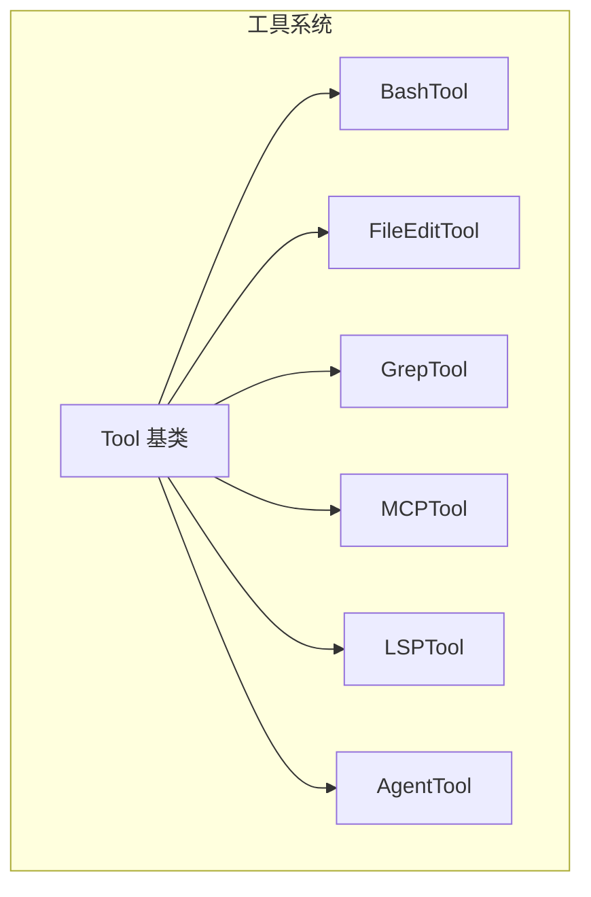
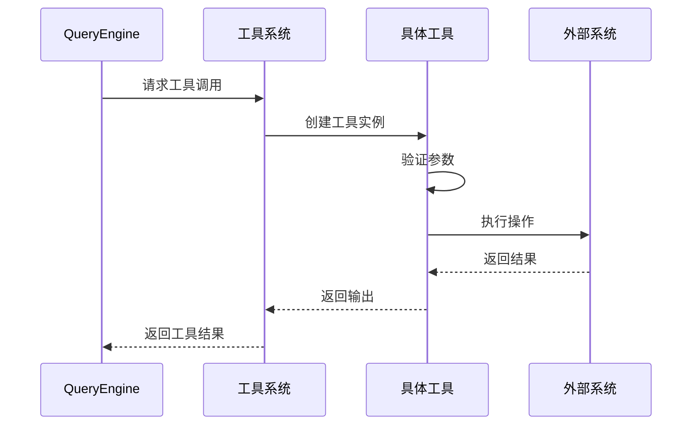
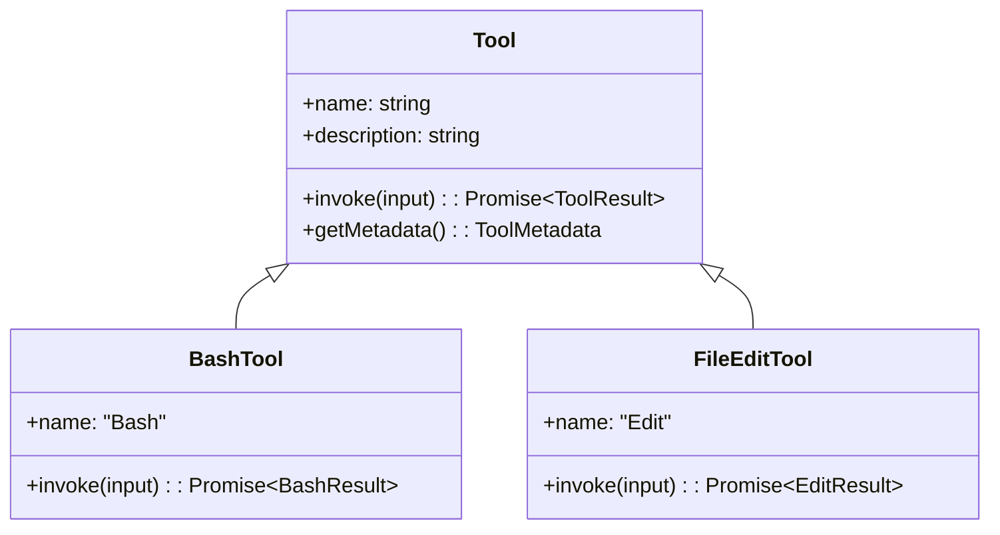

# 工具系统

## 概述

工具系统是 Claude Code 的执行单元，允许 AI 代理通过工具与外部世界交互。系统支持多种工具类型，包括 Bash 执行、文件编辑、搜索、MCP 集成等。

工具系统采用统一的接口设计，每个工具都实现 `Tool` 基类定义的接口。核心实现在 [Tool.ts](/restored-src/src/Tool.ts) 文件中。

## 架构位置



## 功能特性

| 功能 | 说明 | 相关文件 |
|------|------|----------|
| Bash 执行 | 在终端执行命令 | [BashTool/](/restored-src/src/tools/BashTool/) |
| 文件编辑 | 读取、写入、编辑文件 | [FileEditTool/](/restored-src/src/tools/FileEditTool/) |
| 文件搜索 | 模式匹配搜索文件 | [GlobTool/](/restored-src/src/tools/GlobTool/) |
| 代码搜索 | Grep 模式搜索 | [GrepTool/](/restored-src/src/tools/GrepTool/) |
| MCP 工具 | MCP 服务器提供的工具 | [MCPTool/](/restored-src/src/tools/MCPTool/) |
| LSP 工具 | Language Server Protocol | [LSPTool/](/restored-src/src/tools/LSPTool/) |
| Agent 工具 | 子代理执行 | [AgentTool/](/restored-src/src/tools/AgentTool/) |

## 文件结构

```
restored-src/src/
├── Tool.ts                 # 工具基类
├── tools/                  # 工具实现目录
│   ├── BashTool/          # Bash 执行工具
│   │   ├── UI.tsx        # Bash 工具 UI
│   │   ├── prompt.ts     # 提示词模板
│   │   └── utils.ts      # 工具函数
│   ├── FileEditTool/     # 文件编辑工具
│   ├── FileReadTool/     # 文件读取工具
│   ├── GlobTool/         # 文件搜索工具
│   ├── GrepTool/         # 代码搜索工具
│   ├── MCPTool/          # MCP 工具
│   ├── LSPTool/          # LSP 工具
│   ├── AgentTool/        # Agent 工具
│   ├── WebFetchTool/     # Web 获取工具
│   ├── TaskStopTool/     # 任务停止工具
│   ├── SleepTool/        # 睡眠工具
│   ├── ConfigTool/       # 配置工具
│   ├── SkillTool/        # 技能工具
│   └── BriefTool/        # 简要工具
```

## 核心工作流



## 工具基类接口



## API 摘要

| 工具 | 说明 | 主要方法 |
|------|------|----------|
| BashTool | 执行 shell 命令 | `invoke(input: BashInput)` |
| FileEditTool | 编辑文件内容 | `invoke(input: EditInput)` |
| FileReadTool | 读取文件内容 | `invoke(input: ReadInput)` |
| GlobTool | 模式匹配文件 | `invoke(input: GlobInput)` |
| GrepTool | 代码搜索 | `invoke(input: GrepInput)` |
| MCPTool | MCP 工具调用 | `invoke(input: MCPInput)` |
| LSPTool | LSP 操作 | `invoke(input: LSPInput)` |
| AgentTool | 子代理执行 | `invoke(input: AgentInput)` |

## BashTool 详细说明

BashTool 是最常用的工具，允许执行 shell 命令：

```typescript
interface BashInput {
  command: string        // 要执行的命令
  context?: {
    cwd?: string        // 工作目录
    env?: Record<string, string>
    timeout?: number    // 超时时间（毫秒）
  }
}

interface BashResult {
  stdout: string         // 标准输出
  stderr: string         // 标准错误
  exitCode: number       // 退出码
  duration: number       // 执行时长（毫秒）
}
```

## 文件编辑工具

文件编辑工具支持多种操作：

| 操作 | 说明 | 参数 |
|------|------|------|
| `create` | 创建新文件 | `file_path`, `content` |
| `edit` | 编辑文件内容 | `file_path`, `old_string`, `new_string` |
| `delete` | 删除文件 | `file_path` |
| `rename` | 重命名文件 | `old_path`, `new_path` |

## MCP 工具集成

MCP 工具通过 [MCPTool](/restored-src/src/tools/MCPTool/) 集成：

```typescript
interface MCPInput {
  server: string           // MCP 服务器名称
  tool: string             // 工具名称
  arguments: Record<string, unknown>  // 工具参数
}
```

## 最佳实践

### 工具调用原则

| 原则 | 说明 |
|------|------|
| 参数验证 | 在 `invoke` 前验证所有参数 |
| 错误处理 | 捕获并适当处理执行错误 |
| 超时控制 | 为长时间操作设置超时 |
| 结果缓存 | 缓存可重用的结果 |

### 避免的问题

| 问题 | 解决方案 |
|------|----------|
| 命令注入 | 使用参数化命令，避免字符串拼接 |
| 路径遍历 | 规范化并验证文件路径 |
| 超时失控 | 设置合理的默认超时并允许配置 |
| 资源泄露 | 确保子进程和文件句柄正确关闭 |

## 源码引用

- [Tool.ts](/restored-src/src/Tool.ts)
- [tools/BashTool/](/restored-src/src/tools/BashTool/)
- [tools/FileEditTool/](/restored-src/src/tools/FileEditTool/)
- [tools/GrepTool/](/restored-src/src/tools/GrepTool/)

## 相关文档

- [查询引擎](query.md)
- [MCP 服务](../../services/mcp.md)
- [命令系统](commands.md)

---

*Generated by [Nium-Wiki v0.0.0](https://github.com/niuma996/nium-wiki) | 2026-03-31*
