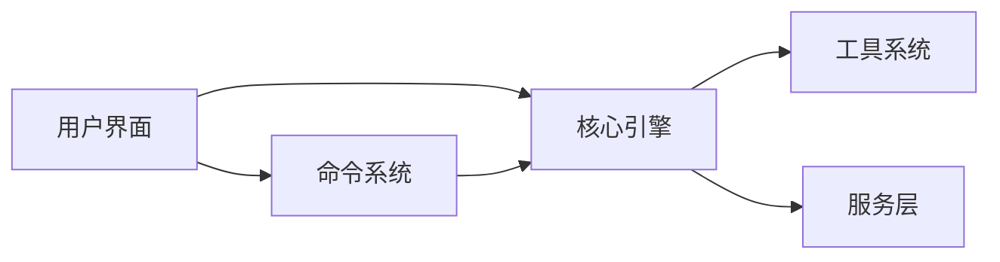

# 文档地图

## 文档结构

```
wiki/
├── index.md              # 项目主页
├── architecture.md       # 系统架构
├── getting-started.md    # 快速开始
├── doc-map.md           # 文档索引（本文档）
│
├── cli/                 # CLI 核心与入口
│   ├── _index.md       # CLI 模块概览
│   ├── entrypoints.md   # CLI 入口点
│   └── startup.md       # 启动流程与快速路径
│
├── agent/               # 智能体与协调
│   ├── _index.md       # 智能体模块概览
│   ├── agent-tool.md    # Agent 工具
│   ├── fork-subagent.md # Fork 子智能体
│   ├── session-history.md # 会话历史
│   └── built-in/        # 内置智能体
│       ├── _index.md           # 内置智能体概览
│       ├── explore-agent.md     # Explore Agent
│       ├── plan-agent.md       # Plan Agent
│       ├── verification-agent.md # Verification Agent
│       ├── claude-code-guide-agent.md # Claude Code Guide
│       ├── general-purpose-agent.md # General Purpose Agent
│       └── statusline-setup-agent.md # Statusline Setup Agent
│
├── remote/              # 远程与服务扩展
│   ├── _index.md       # 远程扩展概览
│   ├── bridge.md       # Remote Control Bridge
│   └── mcp.md          # MCP 客户端
│
├── plugins/             # 插件与技能系统
│   ├── _index.md       # 插件系统概览
│   ├── builtin.md      # 内置插件
│   ├── bundled-skills.md # 打包技能
│   └── companion.md    # 伴侣系统
│
├── core/                # 核心模块
│   ├── _index.md       # 核心模块概览
│   ├── commands.md     # 命令系统
│   ├── tools.md        # 工具系统
│   ├── query.md        # 查询引擎
│   ├── context.md      # Context 状态管理
│   └── hooks.md        # Hooks 事件系统
│
├── services/            # 服务层
│   ├── _index.md       # 服务层概览
│   ├── api.md          # API 服务
│   ├── mcp.md          # MCP 服务
│   └── oauth.md        # OAuth 认证
│
├── ui/                  # 用户界面
│   ├── _index.md       # UI 层概览
│   ├── repl.md         # REPL 界面
│   └── ink.md          # Ink 渲染引擎
│
└── reference/           # 参考文档
    ├── _index.md       # 参考文档概览
    ├── api.md          # API 参考
    └── types.md        # 类型定义
```

## 模块依赖关系



## 文档清单

| 文档 | 说明 | 优先级 |
|------|------|--------|
| [index.md](index.md) | 项目主页 | 高 |
| [architecture.md](architecture.md) | 系统架构总览 | 高 |
| [getting-started.md](getting-started.md) | 快速开始指南 | 高 |
| [doc-map.md](doc-map.md) | 文档索引 | 高 |
| [cli/_index.md](cli/_index.md) | CLI 核心与入口概览 | 高 |
| [cli/entrypoints.md](cli/entrypoints.md) | CLI 入口点 | 高 |
| [cli/startup.md](cli/startup.md) | 启动流程与快速路径 | 高 |
| [agent/_index.md](agent/_index.md) | 智能体与协调概览 | 高 |
| [agent/agent-tool.md](agent/agent-tool.md) | Agent 工具 | 高 |
| [agent/fork-subagent.md](agent/fork-subagent.md) | Fork 子智能体 | 高 |
| [agent/built-in/_index.md](agent/built-in/_index.md) | 内置智能体概览 | 高 |
| [agent/built-in/explore-agent.md](agent/built-in/explore-agent.md) | Explore Agent | 高 |
| [agent/built-in/plan-agent.md](agent/built-in/plan-agent.md) | Plan Agent | 高 |
| [agent/built-in/verification-agent.md](agent/built-in/verification-agent.md) | Verification Agent | 高 |
| [agent/built-in/claude-code-guide-agent.md](agent/built-in/claude-code-guide-agent.md) | Claude Code Guide Agent | 高 |
| [agent/built-in/general-purpose-agent.md](agent/built-in/general-purpose-agent.md) | General Purpose Agent | 高 |
| [agent/built-in/statusline-setup-agent.md](agent/built-in/statusline-setup-agent.md) | Statusline Setup Agent | 高 |
| [remote/_index.md](remote/_index.md) | 远程与服务扩展概览 | 高 |
| [remote/bridge.md](remote/bridge.md) | Remote Control Bridge | 高 |
| [remote/mcp.md](remote/mcp.md) | MCP 客户端 | 高 |
| [plugins/_index.md](plugins/_index.md) | 插件与技能系统概览 | 高 |
| [plugins/builtin.md](plugins/builtin.md) | 内置插件 | 高 |
| [plugins/bundled-skills.md](plugins/bundled-skills.md) | 打包技能 | 高 |
| [plugins/companion.md](plugins/companion.md) | 伴侣系统 | 中 |
| [core/commands.md](core/commands.md) | 命令系统 | 中 |
| [core/tools.md](core/tools.md) | 工具系统 | 中 |
| [core/query.md](core/query.md) | 查询引擎 | 中 |
| [core/context.md](core/context.md) | Context 状态管理 | 高 |
| [core/hooks.md](core/hooks.md) | Hooks 事件系统 | 高 |
| [services/api.md](services/api.md) | API 服务 | 中 |
| [services/mcp.md](services/mcp.md) | MCP 服务 | 中 |
| [services/oauth.md](services/oauth.md) | OAuth 认证 | 中 |
| [ui/repl.md](ui/repl.md) | REPL 界面 | 中 |
| [ui/ink.md](ui/ink.md) | Ink 渲染引擎 | 低 |
| [reference/types.md](reference/types.md) | 类型定义 | 低 |

---

*Generated by [Nium-Wiki v0.0.0](https://github.com/niuma996/nium-wiki) | 2026-03-31*
