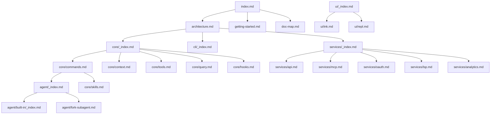

# 文档地图

本文档提供 Claude Code 源码项目所有文档的索引和关系说明。

## 文档结构

```
.nium-wiki/wiki/
├── index.md                  # 项目主页
├── architecture.md           # 系统架构
├── getting-started.md        # 快速开始
├── doc-map.md               # 本文档
│
├── core/                    # 核心模块
│   ├── _index.md           # 核心模块概览
│   ├── commands.md         # 命令系统
│   ├── context.md          # 上下文管理
│   ├── hooks.md           # Hook 系统
│   ├── query.md           # 查询引擎
│   ├── skills.md          # 技能系统
│   └── tools.md           # 工具系统
│
├── cli/                     # CLI 入口
│   ├── _index.md          # CLI 概览
│   ├── entrypoints.md     # 入口点
│   └── startup.md         # 启动流程
│
├── agent/                   # Agent 系统
│   ├── _index.md          # Agent 概览
│   ├── agent-tool.md      # Agent 工具
│   ├── fork-subagent.md   # 子代理
│   ├── session-history.md # 会话历史
│   └── built-in/          # 内置代理
│       ├── _index.md
│       ├── general-purpose-agent.md
│       ├── explore-agent.md
│       ├── plan-agent.md
│       ├── verification-agent.md
│       └── ...
│
├── services/               # 服务层
│   ├── _index.md          # 服务概览
│   ├── api.md             # API 服务
│   ├── mcp.md             # MCP 服务
│   ├── oauth.md           # OAuth 服务
│   ├── lsp.md             # LSP 服务
│   ├── analytics.md       # 分析服务
│   ├── memory.md          # 内存服务
│   ├── voice.md           # 语音服务
│   └── ...
│
├── plugins/                # 插件系统
│   ├── _index.md          # 插件概览
│   ├── builtin.md         # 内置插件
│   ├── bundled-skills.md  # 打包技能
│   └── ...
│
├── remote/                 # 远程系统
│   ├── _index.md          # 远程概览
│   └── bridge.md          # 桥接模式
│
├── ui/                     # 用户界面
│   ├── _index.md          # UI 概览
│   ├── ink.md             # Ink 组件
│   └── repl.md            # REPL 界面
│
├── buddy/                  # Companion 系统
│   ├── _index.md          # Buddy 概览
│   ├── companion.md       # Companion
│   ├── buddy-prompt.md   # Buddy 提示
│   └── sprites.md         # 精灵图
│
└── coordinator/           # 协调器
    └── coordinator.md     # 任务协调
```

## 文档依赖关系



## 模块文档映射

| 模块路径 | 文档位置 | 描述 |
|---------|---------|------|
| `src/main.tsx` | [core/_index.md](core/_index.md) | 主入口 |
| `src/QueryEngine.ts` | [core/query.md](core/query.md) | 查询引擎 |
| `src/Task.ts` | [core/_index.md](core/_index.md) | 任务管理 |
| `src/Tool.ts` | [core/tools.md](core/tools.md) | 工具基类 |
| `src/commands.ts` | [core/commands.md](core/commands.md) | 命令注册 |
| `src/entrypoints/cli.tsx` | [cli/entrypoints.md](cli/entrypoints.md) | CLI 入口 |
| `src/services/api/` | [services/api.md](services/api.md) | API 服务 |
| `src/services/mcp/` | [services/mcp.md](services/mcp.md) | MCP 服务 |
| `src/services/oauth/` | [services/oauth.md](services/oauth.md) | OAuth 服务 |
| `src/services/lsp/` | [services/lsp.md](services/lsp.md) | LSP 服务 |
| `src/screens/REPL.tsx` | [ui/repl.md](ui/repl.md) | REPL 界面 |
| `src/ink/` | [ui/ink.md](ui/ink.md) | Ink 组件 |
| `src/plugins/` | [plugins/_index.md](plugins/_index.md) | 插件系统 |
| `src/bridge/` | [remote/bridge.md](remote/bridge.md) | 桥接模式 |

## 源码路径映射

| 源码文件 | Wiki 文档 | 说明 |
|---------|----------|------|
| `/restored-src/src/main.tsx` | [index.md](index.md) | 项目主页 |
| `/restored-src/src/entrypoints/cli.tsx` | [cli/entrypoints.md](cli/entrypoints.md) | CLI 入口点 |
| `/restored-src/src/QueryEngine.ts` | [core/query.md](core/query.md) | 查询引擎（1177 行） |
| `/restored-src/src/Task.ts` | [core/_index.md](core/_index.md) | 任务系统（125 行） |
| `/restored-src/src/Tool.ts` | [core/tools.md](core/tools.md) | 工具系统（792 行） |
| `/restored-src/src/commands.ts` | [core/commands.md](core/commands.md) | 命令系统 |

## 阅读路线

### 开发者入门
1. [主页](index.md) - 项目概览
2. [快速开始](getting-started.md) - 安装和配置
3. [系统架构](architecture.md) - 架构理解
4. [CLI 入口](cli/entrypoints.md) - 入口点详解

### 核心开发
1. [命令系统](core/commands.md) - 命令实现
2. [查询引擎](core/query.md) - 查询处理
3. [工具系统](core/tools.md) - 工具实现
4. [Hook 系统](core/hooks.md) - 扩展机制

### 服务集成
1. [API 服务](services/api.md) - API 客户端
2. [MCP 服务](services/mcp.md) - MCP 协议
3. [OAuth 服务](services/oauth.md) - 认证
4. [LSP 服务](services/lsp.md) - 语言服务器

### UI 开发
1. [REPL 界面](ui/repl.md) - 交互界面
2. [Ink 组件](ui/ink.md) - 终端 UI 组件
3. [Companion](buddy/companion.md) - 伴侣系统

## 核心源码文件索引

| 文件 | 行数 | 功能 | 文档 |
|------|------|------|------|
| [QueryEngine.ts](/restored-src/src/QueryEngine.ts) | 1177 | 查询引擎核心 | [query.md](core/query.md) |
| [Tool.ts](/restored-src/src/Tool.ts) | 792 | 工具抽象基类 | [tools.md](core/tools.md) |
| [query.ts](/restored-src/src/query.ts) | 600+ | 查询循环实现 | [query.md](core/query.md) |
| [Task.ts](/restored-src/src/Task.ts) | 125 | 任务类型管理 | [core/_index.md](core/_index.md) |
| [commands.ts](/restored-src/src/commands.ts) | 300+ | 命令注册 | [commands.md](core/commands.md) |

## 相关文档

- [主页](index.md)
- [架构文档](architecture.md)
- [快速开始](getting-started.md)

---

*Generated by [Nium-Wiki v0.0.0](https://github.com/niuma996/nium-wiki) | 2026-05-12*
