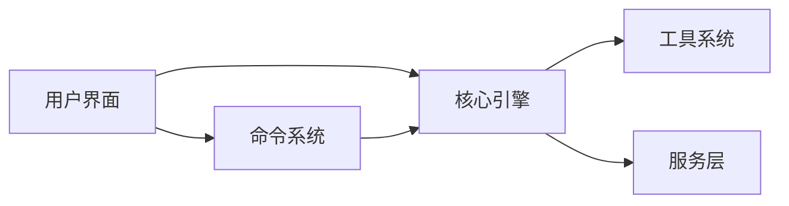

# 文档地图

## 文档结构

```
wiki/
├── index.md              # 项目主页
├── architecture.md       # 系统架构
├── getting-started.md    # 快速开始
├── doc-map.md           # 文档索引（本文档）
│
├── core/                # 核心模块
│   ├── _index.md       # 核心模块概览
│   ├── commands.md     # 命令系统
│   ├── tools.md        # 工具系统
│   └── query.md        # 查询引擎
│
├── services/            # 服务层
│   ├── _index.md       # 服务层概览
│   ├── api.md          # API 服务
│   ├── mcp.md          # MCP 服务
│   └── oauth.md        # OAuth 认证
│
├── ui/                  # 用户界面
│   ├── _index.md       # UI 层概览
│   ├── repl.md         # REPL 界面
│   └── ink.md          # Ink 渲染引擎
│
└── reference/           # 参考文档
    ├── _index.md       # 参考文档概览
    ├── api.md          # API 参考
    └── types.md        # 类型定义
```

## 模块依赖关系



## 文档清单

| 文档 | 说明 | 优先级 |
|------|------|--------|
| [index.md](index.md) | 项目主页 | 高 |
| [architecture.md](architecture.md) | 系统架构总览 | 高 |
| [getting-started.md](getting-started.md) | 快速开始指南 | 高 |
| [doc-map.md](doc-map.md) | 文档索引 | 高 |
| [core/commands.md](core/commands.md) | 命令系统 | 高 |
| [core/tools.md](core/tools.md) | 工具系统 | 高 |
| [core/query.md](core/query.md) | 查询引擎 | 中 |
| [services/api.md](services/api.md) | API 服务 | 中 |
| [services/mcp.md](services/mcp.md) | MCP 服务 | 中 |
| [services/oauth.md](services/oauth.md) | OAuth 认证 | 中 |
| [ui/repl.md](ui/repl.md) | REPL 界面 | 中 |
| [ui/ink.md](ui/ink.md) | Ink 渲染引擎 | 低 |
| [reference/types.md](reference/types.md) | 类型定义 | 低 |

---

*Generated by [Nium-Wiki v0.0.0](https://github.com/niuma996/nium-wiki) | 2026-03-31*
