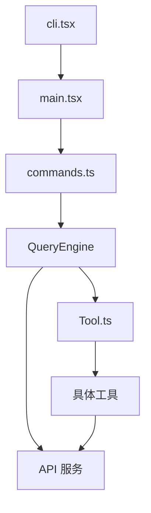

# 快速开始

本文档介绍如何快速上手 Claude Code 源码研究项目。

## 关于本项目

本项目是通过 npm 发布包（`@anthropic-ai/claude-code`）内附带的 source map 还原的 TypeScript 源码，版本为 **2.1.88**。此源码仅供研究使用，不代表官方原始内部开发仓库结构。

## 项目结构

```
claude-code-sourcemap/
├── restored-src/          # 还原的 TypeScript 源码
│   ├── src/             # 主要源码目录
│   │   ├── main.tsx     # CLI 主入口
│   │   ├── QueryEngine.ts  # 查询引擎
│   │   ├── Task.ts      # 任务管理
│   │   ├── Tool.ts      # 工具基类
│   │   ├── commands/    # 80+ 斜杠命令
│   │   ├── tools/       # 工具实现
│   │   ├── services/    # 服务层
│   │   ├── components/  # React 组件
│   │   ├── ink/         # Ink 渲染引擎
│   │   └── ...
│   └── package/         # npm 包配置
│
├── .nium-wiki/          # 文档目录
│   └── wiki/           # 中文文档
│
└── README.md            # 项目说明
```

## 核心模块概览

### 1. CLI 入口层

CLI 入口是应用启动的起点，负责参数解析和快速路径优化。

| 文件 | 功能 |
|------|------|
| [entrypoints/cli.tsx](/restored-src/src/entrypoints/cli.tsx) | CLI 快速路径、参数解析 |
| [main.tsx](/restored-src/src/main.tsx) | 主入口、模块加载 |
| [init.ts](/restored-src/src/entrypoints/init.ts) | 初始化逻辑 |

### 2. 命令系统

命令系统管理 80+ 斜杠命令，提供丰富的交互能力。

| 文件 | 功能 |
|------|------|
| [commands.ts](/restored-src/src/commands.ts) | 命令注册、查找 |
| [commands/help/](/restored-src/src/commands/help/) | /help 命令 |
| [commands/config/](/restored-src/src/commands/config/) | /config 命令 |
| [commands/commit/](/restored-src/src/commands/commit/) | /commit 命令 |

### 3. 核心引擎

核心引擎协调 AI 模型调用、任务管理和工具执行。

| 文件 | 功能 | 行数 |
|------|------|------|
| [QueryEngine.ts](/restored-src/src/QueryEngine.ts) | 查询引擎、对话管理 | 1177 |
| [Task.ts](/restored-src/src/Task.ts) | 任务类型、状态管理 | 125 |
| [Tool.ts](/restored-src/src/Tool.ts) | 工具抽象基类 | 792 |
| [query.ts](/restored-src/src/query.ts) | 查询循环实现 | 600+ |

### 4. 工具系统

工具系统为 AI 代理提供执行能力。

| 工具 | 功能 |
|------|------|
| BashTool | 执行 shell 命令 |
| FileEditTool | 编辑文件 |
| GrepTool | 代码搜索 |
| GlobTool | 文件模式匹配 |
| MCPTool | MCP 协议工具 |
| AgentTool | 子代理创建 |

### 5. 服务层

| 服务 | 功能 |
|------|------|
| API | Claude API 调用封装 |
| MCP | Model Context Protocol 客户端 |
| OAuth | 认证授权 |
| LSP | Language Server Protocol 支持 |
| Analytics | 遥测分析 |

### 6. 用户界面

| 组件 | 功能 |
|------|------|
| REPL | 交互式终端界面 |
| Ink | 终端 UI 渲染引擎 |
| Components | React 组件库 |

## 研究路线图

### 路线 1：系统架构理解

1. 阅读 [架构文档](architecture.md) 了解整体架构
2. 阅读 [index.md](index.md) 了解项目概览
3. 查看核心模块源码

### 路线 2：命令系统研究

1. 阅读 [commands.ts](/restored-src/src/commands.ts) 了解命令注册机制
2. 查看 [commands/](/restored-src/src/commands/) 目录下的具体命令实现
3. 学习斜杠命令的工作原理

### 路线 3：工具系统研究

1. 阅读 [Tool.ts](/restored-src/src/Tool.ts) 了解工具抽象
2. 查看 [tools/](/restored-src/src/tools/) 目录下的具体工具实现
3. 学习工具注册和执行流程

### 路线 4：查询流程研究

1. 阅读 [QueryEngine.ts](/restored-src/src/QueryEngine.ts) 了解查询管理
2. 阅读 [query.ts](/restored-src/src/query.ts) 了解查询循环
3. 学习 AI 模型调用和响应处理

## 关键源码文件

| 优先级 | 文件 | 说明 |
|--------|------|------|
| 高 | [QueryEngine.ts](/restored-src/src/QueryEngine.ts) | 查询引擎核心 |
| 高 | [query.ts](/restored-src/src/query.ts) | 查询循环 |
| 高 | [Task.ts](/restored-src/src/Task.ts) | 任务管理 |
| 高 | [Tool.ts](/restored-src/src/Tool.ts) | 工具基类 |
| 中 | [commands.ts](/restored-src/src/commands.ts) | 命令系统 |
| 中 | [services/api/claude.ts](/restored-src/src/services/api/claude.ts) | API 客户端 |
| 中 | [services/mcp/client.ts](/restored-src/src/services/mcp/client.ts) | MCP 客户端 |
| 低 | [ink/renderer.ts](/restored-src/src/ink/renderer.ts) | UI 渲染 |

## 依赖关系



## 相关文档

- [架构文档](architecture.md) - 系统架构详解
- [文档地图](doc-map.md) - 文档索引和关系

---

*Generated by [Nium-Wiki v0.0.0](https://github.com/niuma996/nium-wiki) | 2026-05-12*
