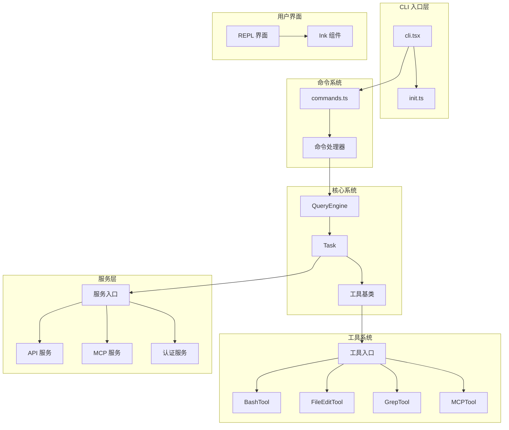

# Claude Code

> Anthropic AI 终端助手 — 直接在命令行中使用 Claude

Claude Code 是一个强大的命令行工具，让开发者能够直接在终端中使用 Anthropic 的 AI 助手 Claude。Claude 可以理解代码库、编辑文件、执行终端命令，并处理各种复杂的工作流程。

本仓库是通过 npm 发布包（`@anthropic-ai/claude-code`）内附带的 source map 还原的 TypeScript 源码，版本为 2.1.88。此源码仅供研究使用，不代表官方原始内部开发仓库结构。

## 架构预览



## 文档导航

| 文档 | 描述 | 受众 |
|------|------|------|
| [架构文档](architecture.md) | 系统架构、模块依赖、设计模式 | 开发者、贡献者 |
| [快速开始](getting-started.md) | 安装、配置、基础使用 | 所有用户 |
| [文档地图](doc-map.md) | 所有文档的索引和关系 | 贡献者 |

## 核心功能

| 功能 | 描述 | 模块 |
|------|------|------|
| 命令系统 | 支持 80+ 斜杠命令（/help, /commit, /review 等） | [commands.ts](/restored-src/src/commands.ts) |
| 工具执行 | AI 代理可以使用的工具（Bash、文件编辑、Grep 等） | [tools/](/restored-src/src/tools/) |
| MCP 集成 | Model Context Protocol 支持 | [services/mcp/](/restored-src/src/services/mcp/) |
| REPL 界面 | 交互式终端用户界面 | [screens/REPL.tsx](/restored-src/src/screens/REPL.tsx) |
| 认证系统 | OAuth 和 API Key 认证 | [services/oauth/](/restored-src/src/services/oauth/) |
| 插件系统 | 扩展功能和自定义技能 | [plugins/](/restored-src/src/plugins/) |

## 快速开始

```bash
# 安装 Claude Code
npm install -g @anthropic-ai/claude-code

# 启动交互式会话
claude

# 查看帮助
claude --help
```

**预期输出:**

```
Claude Code 2.1.88
使用 Claude 来处理你的代码库。

用法:
  claude [选项] [命令]

可用命令:
  help     显示帮助信息
  config   配置设置
  login    登录 Claude
  logout   退出登录
  ...
```

## 项目统计

| 指标 | 值 |
|------|-----|
| 还原版本 | 2.1.88 |
| 源代码文件 | 1884 个 .ts/.tsx 文件 |
| 总文件数 | 1905 个 |
| 主要模块 | 2 个（package, restored-src） |
| 技术栈 | TypeScript, Node.js, Ink (React) |

---

*Generated by [Nium-Wiki v0.0.0](https://github.com/niuma996/nium-wiki) | 2026-03-31*
