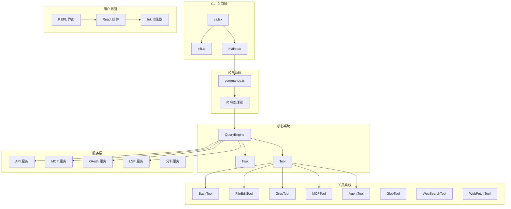

# Claude Code Sourcemap

> Anthropic AI 终端助手源码映射项目

本项目是通过 npm 发布包（`@anthropic-ai/claude-code`）内附带的 source map 还原的 TypeScript 源码，版本为 **2.1.88**。此源码仅供研究使用，不代表官方原始内部开发仓库结构。

## 项目概述

Claude Code 是一个强大的命令行工具，让开发者能够直接在终端中使用 Anthropic 的 AI 助手 Claude。Claude 可以理解代码库、编辑文件、执行终端命令，并处理各种复杂的工作流程。

本仓库包含经过还原的完整 TypeScript 源码，涵盖了 CLI 入口、命令系统、查询引擎、工具系统、服务层和用户界面的所有组件。

## 架构预览



## 文档导航

| 文档 | 描述 | 受众 |
|------|------|------|
| [架构文档](architecture.md) | 系统架构、模块依赖、设计模式 | 开发者、贡献者 |
| [快速开始](getting-started.md) | 安装、配置、基础使用 | 所有用户 |
| [文档地图](doc-map.md) | 所有文档的索引和关系 | 贡献者 |

## 核心功能

| 功能 | 描述 | 源码位置 |
|------|------|----------|
| 命令系统 | 支持 80+ 斜杠命令（/help, /commit, /review 等） | [commands.ts](/restored-src/src/commands.ts) |
| 工具执行 | AI 代理可以使用的工具（Bash、文件编辑、Grep 等） | [tools/](/restored-src/src/tools/) |
| MCP 集成 | Model Context Protocol 支持 | [services/mcp/](/restored-src/src/services/mcp/) |
| REPL 界面 | 交互式终端用户界面 | [screens/REPL.tsx](/restored-src/src/screens/REPL.tsx) |
| 认证系统 | OAuth 和 API Key 认证 | [services/oauth/](/restored-src/src/services/oauth/) |
| 插件系统 | 扩展功能和自定义技能 | [plugins/](/restored-src/src/plugins/) |
| 桥接模式 | 远程控制 Claude Code | [bridge/](/restored-src/src/bridge/) |
| 分析服务 | 遥测和指标收集 | [services/analytics/](/restored-src/src/services/analytics/) |

## 核心模块

| 模块 | 描述 | 源码位置 |
|------|------|----------|
| CLI 入口 | 命令行入口和快速路径 | [entrypoints/cli.tsx](/restored-src/src/entrypoints/cli.tsx) |
| 命令系统 | 斜杠命令管理 | [commands/](/restored-src/src/commands/) |
| 查询引擎 | AI 查询处理 | [QueryEngine.ts](/restored-src/src/QueryEngine.ts) |
| 任务系统 | 任务管理和执行 | [Task.ts](/restored-src/src/Task.ts) |
| 工具基类 | 工具抽象和执行 | [Tool.ts](/restored-src/src/Tool.ts) |
| 状态管理 | React 状态和应用状态 | [state/](/restored-src/src/state/) |

## 目录结构

```
restored-src/
├── src/
│   ├── main.tsx                    # CLI 主入口
│   ├── QueryEngine.ts              # 查询引擎（1177 行）
│   ├── Task.ts                     # 任务管理（125 行）
│   ├── Tool.ts                     # 工具基类（792 行）
│   ├── commands.ts                 # 命令注册
│   ├── query.ts                    # 查询循环
│   │
│   ├── entrypoints/                # 入口点
│   │   ├── cli.tsx                # CLI 快速路径
│   │   ├── init.ts                # 初始化逻辑
│   │   └── mcp.ts                 # MCP 入口
│   │
│   ├── commands/                   # 命令实现（80+ 个命令）
│   │
│   ├── tools/                      # 工具实现
│   │   ├── BashTool/
│   │   ├── FileEditTool/
│   │   ├── GrepTool/
│   │   ├── GlobTool/
│   │   ├── MCPTool/
│   │   ├── AgentTool/
│   │   └── ...
│   │
│   ├── services/                   # 服务层
│   │   ├── api/
│   │   ├── mcp/
│   │   ├── oauth/
│   │   ├── lsp/
│   │   └── analytics/
│   │
│   ├── components/                 # React 组件
│   ├── hooks/                      # React Hooks
│   ├── context/                    # React Context
│   ├── state/                      # 状态管理
│   ├── constants/                  # 常量定义
│   ├── types/                      # 类型定义
│   ├── utils/                      # 工具函数
│   ├── query/                      # 查询配置
│   ├── memdir/                     # 内存目录
│   ├── screens/                    # 屏幕组件
│   ├── bridge/                     # 桥接模式
│   └── ink/                        # Ink 渲染引擎
│
└── package/                        # npm 包配置
```

## 项目统计

| 指标 | 值 |
|------|-----|
| 还原版本 | 2.1.88 |
| 源代码文件 | 1901 个 TypeScript/TSX 文件 |
| 总文件数 | 1905+ 个 |
| 主要模块 | 核心系统、命令系统、工具系统、服务层、UI 层 |
| 技术栈 | TypeScript, Node.js, Ink (React) |

## 源码引用

- [main.tsx](/restored-src/src/main.tsx) - CLI 主入口
- [QueryEngine.ts](/restored-src/src/QueryEngine.ts) - 查询引擎
- [Task.ts](/restored-src/src/Task.ts) - 任务系统
- [Tool.ts](/restored-src/src/Tool.ts) - 工具基类

---

*Generated by [Nium-Wiki v0.0.0](https://github.com/niuma996/nium-wiki) | 2026-05-12*
