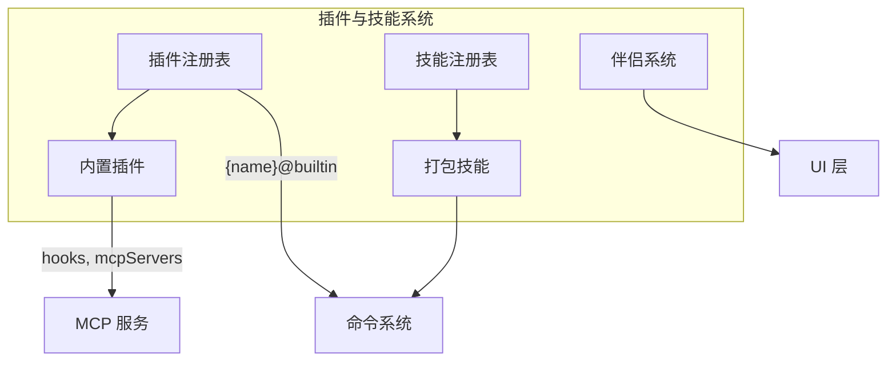

# 插件与技能系统

## 概览

插件与技能系统是 Claude Code 的可扩展性框架，允许用户和社区通过插件（Plugin）和技能（Skill）扩展 CLI 的功能。该模块支持三种扩展机制：

1. **内置插件（Built-in Plugin）**：随 CLI 内置的插件，可通过 UI 启用/禁用
2. **打包技能（Bundled Skill）**：编译到 CLI 二进制中的技能，无需额外安装
3. **伴侣（Companion）**：随机化的吉祥物角色，为 CLI 增加趣味性

## 子模块

| 模块 | 说明 | 文档 |
|------|------|------|
| [内置插件](builtin.md) | 内置插件注册与启用管理 | [builtin.md](builtin.md) |
| [打包技能](bundled-skills.md) | 编译时打包的技能系统 | [bundled-skills.md](bundled-skills.md) |
| [伴侣系统](companion.md) | 随机吉祥物角色 | [companion.md](companion.md) |

## 架构位置



## 插件 vs 技能：核心区别

| 维度 | 插件（Plugin） | 技能（Skill） |
|------|-------------|-------------|
| 来源 | 可来自市场、用户、项目 | 编译时打包到 CLI |
| UI 入口 | `/plugin` 命令 | `/skill` 命令 |
| 启用方式 | UI 中一键切换 | 始终可用 |
| 可包含内容 | 技能、Hook、MCP 服务器 | 仅技能 |
| 配置位置 | 用户设置 | 源代码 |
| 更新方式 | 从市场拉取 | CLI 版本更新 |

## 技能定义结构

所有技能（内置、打包、自定义）最终都转换为统一的 `Command` 对象：

```typescript
type Command = {
  type: 'prompt' | 'info' | 'agent'
  name: string                    // 技能名称（斜杠命令）
  description: string             // 描述（用于 /help 显示）
  hasUserSpecifiedDescription: boolean
  argumentHint?: string          // 参数提示
  whenToUse?: string             // 使用场景
  allowedTools?: string[]        // 允许的工具列表
  model?: string                 // 指定模型
  disableModelInvocation?: boolean
  hooks?: HooksSettings          // 钩子配置
  source: 'bundled' | 'plugin' | 'user' | 'project'
  loadedFrom: string
  getPromptForCommand?: (args, context) => Promise<ContentBlockParam[]>
  progressMessage?: string
}
```

## 插件类型系统

```typescript
type BuiltinPluginDefinition = {
  name: string
  description: string
  version: string
  defaultEnabled?: boolean        // 默认启用状态
  isAvailable?: () => boolean     // 可用性检查
  skills?: BundledSkillDefinition[]    // 提供的技能
  hooks?: HooksSettings          // 注册的钩子
  mcpServers?: McpServerConfig[] // 提供的 MCP 服务器
}

type LoadedPlugin = {
  name: string
  manifest: { name, description, version }
  path: string
  source: string                  // 格式：{name}@{marketplace}
  repository: string
  enabled: boolean
  isBuiltin: boolean
  hooksConfig?: HooksSettings
  mcpServers?: McpServerConfig[]
}
```

## 源码引用

- [builtinPlugins.ts](/restored-src/src/plugins/builtinPlugins.ts)
- [bundledSkills.ts](/restored-src/src/skills/bundledSkills.ts)
- [companion.ts](/restored-src/src/buddy/companion.ts)
- [types/plugin.ts](/restored-src/src/types/plugin.ts)
- [commands.ts](/restored-src/src/commands.ts)

## 相关文档

- [架构总览](../architecture.md)
- [主页](../index.md)
- [内置插件](builtin.md)
- [打包技能](bundled-skills.md)
- [伴侣系统](companion.md)

---

*Generated by [Nium-Wiki v0.0.0](https://github.com/niuma996/nium-wiki) | 2026-03-31*
